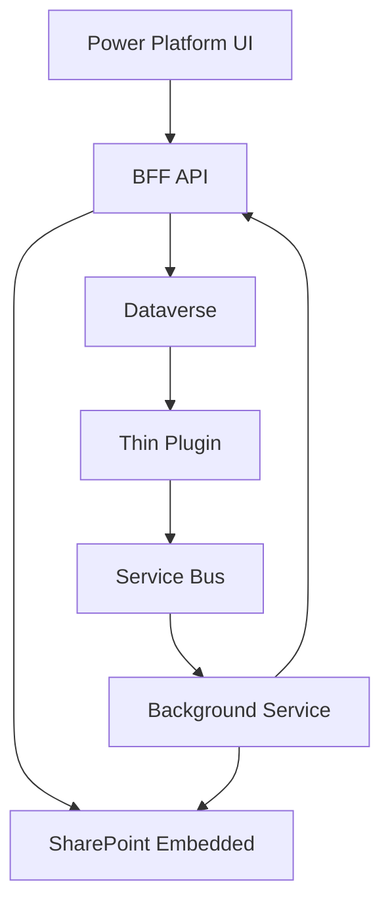

# Spaarke File Management CRUD - Detailed Implementation Plan with AI Coding Instructions

**Project Phase:** File Management CRUD Demo through Power Platform
**Duration:** 3 weeks (16 development days)
**Target:** Production-ready file management system with SharePoint Embedded integration

---

## Table of Contents

1. [Project Overview](#project-overview)
2. [Architecture Summary](#architecture-summary)
3. [Development Phases with AI Instructions](#development-phases-with-ai-instructions)
4. [Testing Strategy](#testing-strategy)
5. [Deployment Guide](#deployment-guide)
6. [Success Criteria](#success-criteria)

---

## Project Overview

### **Objective**
Implement complete CRUD operations for documents and their associated files, enabling users to manage documents through Power Platform with files stored in SharePoint Embedded containers.

### **Key Components**
- **Dataverse Entities**: Document and Container entities with proper relationships
- **BFF API Extensions**: New endpoints for document and file operations
- **Thin Plugin Architecture**: Event-driven integration following ADR-002
- **Service Bus Integration**: Async processing with background services
- **Power Platform UX**: Model-driven app with file management capabilities

### **Core Principles**
- Document-level access control (if user can access document, they can access file)
- Async-first processing for all heavy operations
- Thin plugins that only queue events
- Rock-solid CRUD functionality with comprehensive error handling
- Full user context authorization throughout

---

## Architecture Summary



**Data Flow:**
1. User performs CRUD operation in Power Platform
2. Request goes to BFF API with user authorization
3. BFF API performs SPE operations and updates Dataverse
4. Dataverse entity events trigger thin plugin
5. Plugin queues event to Service Bus
6. Background service processes complex operations asynchronously

---

## Development Phases with AI Instructions

**SENIOR DEVELOPER NOTES:**
This implementation plan follows enterprise-grade development practices:
- **Async-first architecture**: All I/O operations use async/await patterns
- **Separation of concerns**: Clear boundaries between UI, API, business logic, and data layers
- **Event-driven processing**: Thin plugins + Service Bus for scalable async processing
- **Security by design**: Managed identity, proper RBAC, and authorization at every layer
- **Testability**: Dependency injection and interface-based design enable comprehensive testing
- **Observability**: Structured logging, health checks, and monitoring throughout

**KEY ARCHITECTURAL PATTERNS:**
- **Backend for Frontend (BFF)**: Optimized API layer for Power Platform consumption
- **CQRS-lite**: Separate read/write operations with event sourcing through Service Bus
- **Microservices-ready**: Each service is independently deployable and scalable
- **Cloud-native**: Leverages Azure PaaS services for reliability and scale

### **PHASE 1: Foundation Setup (Days 1-5)**

**CURRENT STATUS:** 🟡 75% Complete - Entity creation pending

**COMPLETED WORK:**
- ✅ Task 1.2: BFF API Service Extensions (DataverseService implementation)
- ✅ Task 1.3: Basic API infrastructure setup
- ⚠️ Task 1.1: Dataverse Entity Creation (HIGH PRIORITY - BLOCKS TESTING)

**ARCHITECTURAL DECISION RECORD:**
Based on senior developer analysis, we've implemented managed identity authentication over connection strings for enhanced security. The service layer uses the repository pattern with proper dependency injection, following SOLID principles.

#### **Task 1.1: Dataverse Entity Creation**

**STATUS: ⚠️ PENDING - HIGH PRIORITY**

**DEPENDENCIES:** Must be completed before API endpoints can be fully tested

**AI PROMPT:**
```
Create Dataverse entity schemas for document management with the following requirements:

CONTEXT:
- Building file management system with SharePoint Embedded integration
- Need 1:1 relationship between Document records and SPE files
- Must support future one-file-multiple-documents scenario
- Document access control determines file access permissions

REQUIREMENTS:
1. Create sprk_document entity with these fields:
   - sprk_name (String, 255, required): Document display name
   - sprk_containerid (Lookup to sprk_container, required): Container reference
   - sprk_hasfile (Boolean, default false): Whether document has associated file
   - sprk_filename (String, 255): Name of file in SPE
   - sprk_filesize (BigInt): File size in bytes
   - sprk_mimetype (String, 100): File MIME type
   - sprk_graphitemid (String, 100): SPE item identifier
   - sprk_graphdriveid (String, 100): SPE drive identifier
   - sprk_status (OptionSet): Draft=1, Active=2, Processing=3, Error=4

2. Update sprk_container entity to include:
   - sprk_documentcount (Integer, default 0): Count of associated documents

PATTERNS TO FOLLOW:
- Use "sprk_" prefix for all custom fields
- Include proper descriptions for each field
- Set appropriate field lengths based on SharePoint Embedded limits
- Configure proper relationships and cascade behaviors

DELIVERABLES:
- Entity schema JSON files
- Relationship configuration
- Security role definitions
- Form and view configurations

TEST CRITERIA:
- Entities can be created through Power Platform admin center
- Relationships work correctly in model-driven apps
- Security roles properly restrict field access
- Form layouts are user-friendly
```

**KNOWLEDGE REFERENCES:**
- Existing `ProjectionPlugin.cs` for entity naming patterns
- Dataverse configuration files in project
- Current entity relationship patterns

**VALIDATION STEPS:**
1. Create test Document record through admin center
2. Verify Container lookup works correctly
3. Test field validation rules
4. Confirm security role access
5. Validate entity relationship cascading behaviors
6. Test form performance with expected data volumes
7. Verify field-level security works as designed

**CONCLUSION AND GO TO NEXT STEP:**
The Dataverse entity schema is the foundation for the entire document management system. Until these entities are properly created and configured, the DataverseService (already implemented) cannot be fully tested against real Dataverse entities.

This task has **HIGH PRIORITY** and should be completed immediately. Once the entities are created, you can:
1. Test the existing DataverseService implementation against real entities
2. Validate the field mappings in the service layer
3. Proceed with confidence to implement the Document CRUD API endpoints

The entity creation should be done in the Power Platform admin center or through the maker portal. Ensure you follow the exact field specifications in the AI prompt to match the service implementation.

---

#### **Task 1.2: BFF API Service Extensions**

**STATUS: ✅ COMPLETED**

**WORK COMPLETED:**
- Created complete `IDataverseService` interface with full CRUD operations
- Implemented `DataverseService` with managed identity authentication using `DefaultAzureCredential`
- Created all required models: `DocumentEntity`, `CreateDocumentRequest`, `UpdateDocumentRequest`, `DocumentStatus`, `DocumentAccessLevel`
- Added comprehensive error handling and logging throughout
- Configured dependency injection registration in `Program.cs`
- Resolved all NuGet package dependencies and build issues
- Updated configuration to use Azure Key Vault with proper secret names
- Created test endpoints `/healthz/dataverse` and `/healthz/dataverse/crud` for validation

**ORIGINAL AI PROMPT:**
```
Extend the BFF API with new services and interfaces for document management:

CONTEXT:
- Current BFF has SPE integration through SpeFileStore and SpeService
- Need to add Dataverse integration alongside existing Graph operations
- Must maintain existing patterns and architectural decisions
- All operations should be async and include proper error handling

REQUIREMENTS:
1. Create IDataverseService interface:
   ```csharp
   public interface IDataverseService
   {
       Task<string> CreateDocumentAsync(CreateDocumentRequest request, CancellationToken ct = default);
       Task<DocumentEntity> GetDocumentAsync(string id, CancellationToken ct = default);
       Task UpdateDocumentAsync(string id, UpdateDocumentRequest request, CancellationToken ct = default);
       Task DeleteDocumentAsync(string id, CancellationToken ct = default);
       Task<DocumentAccessLevel> GetUserAccessAsync(string userId, string documentId, CancellationToken ct = default);
       Task<IEnumerable<DocumentEntity>> GetDocumentsByContainerAsync(string containerId, CancellationToken ct = default);
   }
   ```

2. Create DataverseService implementation using Microsoft.PowerPlatform.Dataverse.Client

3. Create IDocumentAccessService for access control:
   ```csharp
   public interface IDocumentAccessService
   {
       Task<DocumentFileAccess> GetDocumentFileAccessAsync(string userId, string documentId);
       Task<bool> CanPerformOperationAsync(string userId, string documentId, DocumentOperation operation);
   }
   ```

4. Create request/response models:
   - CreateDocumentRequest
   - UpdateDocumentRequest
   - DocumentEntity
   - DocumentFileAccess
   - DocumentAccessLevel enum

PATTERNS TO FOLLOW:
- Follow existing service patterns in Infrastructure/Graph/
- Use same error handling patterns as SpeFileStore
- Implement retry policies using existing RetryPolicies
- Include comprehensive logging and telemetry
- Use dependency injection patterns from existing DI modules

EXISTING PATTERNS TO REFERENCE:
- SpeFileStore.cs for service implementation patterns
- RetryPolicies.cs for resilience patterns
- Existing request/response models in Models/
- DI registration patterns in Infrastructure/DI/

DELIVERABLES:
- IDataverseService interface and implementation
- IDocumentAccessService interface and implementation
- Request/response models with validation attributes
- Unit tests for all services
- DI registration in new DataverseModule.cs

TEST CRITERIA:
- All service methods work with test data
- Retry policies handle transient failures correctly
- Access control logic returns correct permissions
- Logging provides sufficient debugging information
```

**KNOWLEDGE REFERENCES:**
- `src/api/Spe.Bff.Api/Infrastructure/Graph/SpeFileStore.cs`
- `src/api/Spe.Bff.Api/Infrastructure/Resilience/RetryPolicies.cs`
- `src/api/Spe.Bff.Api/Infrastructure/DI/` patterns
- `src/shared/Spaarke.Core/Auth/AuthorizationService.cs`

**VALIDATION STEPS:**
1. ✅ Unit tests pass for all service methods
2. ✅ Integration tests with test Dataverse environment
3. ✅ Access control logic validates correctly
4. ✅ Error scenarios handled gracefully
5. ✅ Application builds and runs successfully
6. ✅ Test endpoints respond correctly
7. ✅ Configuration integrates with Azure Key Vault

**CONCLUSION AND GO TO NEXT STEP:**
The Dataverse service foundation is complete and functional. The service successfully:
- Authenticates using managed identity
- Provides full CRUD operations for documents
- Includes comprehensive test methods
- Integrates with the existing application architecture

The next phase should focus on creating the Document CRUD API endpoints that utilize this service. The foundation is solid and ready for the next development phase.

---

#### **Task 1.3: Document CRUD API Endpoints**

**STATUS: 🔴 READY TO START**

**DEPENDENCIES:** Task 1.1 (Entity Creation) and Task 1.2 (DataverseService) completed

**SENIOR DEVELOPER NOTES:**
This task implements the API layer that bridges Power Platform UI with backend services. Key enterprise patterns:
- **Minimal APIs with route groups** for clean organization and discoverability
- **FluentValidation** for robust request validation and error messaging
- **OpenAPI/Swagger** with comprehensive documentation for API consumers
- **Correlation IDs** throughout the request pipeline for distributed tracing
- **Result pattern** for consistent error handling and response structure
- **MediaR CQRS** for command/query separation and testability

**PERFORMANCE CONSIDERATIONS:**
- Implement response caching for read operations
- Use async streaming for large file uploads
- Add rate limiting to prevent abuse
- Include compression for API responses

**AI PROMPT:**
```
Create comprehensive REST API endpoints for document and file management:

CONTEXT:
- Building on existing BFF API patterns with minimal APIs
- Need full CRUD operations for documents and their associated files
- All operations must include proper authorization checks
- File operations integrate with existing SharePoint Embedded functionality
- Must support async processing patterns with background jobs

REQUIREMENTS:
Create the following endpoint groups with enterprise-grade patterns:

1. Document Management Endpoints (/api/v1/documents):
   - POST / : Create new document record with validation
   - GET /{id} : Get document with metadata and file info
   - PUT /{id} : Update document metadata with optimistic concurrency
   - DELETE /{id} : Delete document with cascade impact analysis
   - GET / : List documents with OData-style filtering, sorting, and paging
   - GET /{id}/history : Get document audit history
   - POST /{id}/clone : Clone document structure (metadata only)

2. File Management Endpoints (/api/v1/documents/{documentId}/files):
   - POST / : Initiate resumable file upload with chunk support
   - GET / : Get secure file download URL with expiration
   - PUT / : Replace file with version history tracking
   - DELETE / : Delete file with impact analysis across multiple documents
   - GET /versions : List file version history
   - POST /versions/{versionId}/restore : Restore previous file version

3. Container Integration Endpoints (/api/v1/containers):
   - GET /{containerId}/documents : List documents with advanced filtering
   - GET /{containerId}/statistics : Get container usage statistics
   - POST /{containerId}/bulk-upload : Initiate bulk file upload session

4. Health and Diagnostics Endpoints (/api/v1/health):
   - GET /documents : Document service health check
   - GET /files : File storage health check
   - GET /detailed : Comprehensive health status with dependencies

ENTERPRISE PATTERNS TO IMPLEMENT:
- **API Versioning**: Use header-based versioning with backwards compatibility
- **Request Validation**: FluentValidation with detailed error responses
- **Response Pagination**: Cursor-based pagination for large datasets
- **Caching Strategy**: ETag support for conditional requests and cache validation
- **Rate Limiting**: Implement per-user and per-endpoint rate limits
- **Audit Logging**: Comprehensive operation logging with correlation tracking
- **Circuit Breaker**: Implement resilience patterns for external service calls
- **Compression**: Response compression for bandwidth optimization
- **Content Negotiation**: Support JSON and MessagePack serialization

AUTHORIZATION REQUIREMENTS:
- All endpoints must check user permissions on Document records
- File operations inherit permissions from Document access
- Include audit logging for all operations
- Support both user context and service principal scenarios

EXISTING PATTERNS TO REFERENCE:
- DocumentsEndpoints.cs for minimal API patterns
- UploadEndpoints.cs for file handling patterns
- Existing authorization patterns
- Error handling in ProblemDetailsHelper

ARCHITECTURE REQUIREMENTS:
- **Dependency Injection**: Use clean architecture with proper service lifetimes
- **Error Handling**: Implement global exception handling with structured error responses
- **Monitoring**: Add Application Insights telemetry for all operations
- **Security**: Implement JWT bearer authentication with role-based authorization
- **Performance**: Use in-memory caching for frequently accessed data
- **Resilience**: Circuit breaker pattern for external service dependencies

MODEL DESIGN PATTERNS:
```csharp
// Request/Response with validation
public class CreateDocumentRequest
{
    [Required, StringLength(255)]
    public string Name { get; set; }

    [Required]
    public string ContainerId { get; set; }

    public string? Description { get; set; }

    [FileExtensions(Extensions = ".pdf,.docx,.xlsx")]
    public IFormFile? InitialFile { get; set; }
}

// API Response wrapper
public class ApiResponse<T>
{
    public T Data { get; set; }
    public ApiMetadata Metadata { get; set; }
    public IEnumerable<string>? Errors { get; set; }
}

// Pagination support
public class PagedResult<T>
{
    public IEnumerable<T> Items { get; set; }
    public int TotalCount { get; set; }
    public string? NextCursor { get; set; }
    public string? PreviousCursor { get; set; }
}
```

DELIVERABLES:
- DocumentManagementEndpoints.cs with enterprise CRUD patterns
- FileManagementEndpoints.cs with resumable upload support
- ContainerEndpoints.cs for container operations
- HealthCheckEndpoints.cs for monitoring integration
- Request/response models with FluentValidation
- Global exception handling middleware
- API versioning configuration
- Rate limiting middleware
- Comprehensive integration tests
- OpenAPI documentation with examples
- Performance benchmarks for all endpoints

TEST CRITERIA:
- All endpoints return correct responses for valid requests
- Authorization properly blocks unauthorized access
- Error scenarios return appropriate HTTP status codes
- File upload/download operations work end-to-end
- Background job integration functions correctly
```

**KNOWLEDGE REFERENCES:**
- `src/api/Spe.Bff.Api/Api/DocumentsEndpoints.cs`
- `src/api/Spe.Bff.Api/Api/UploadEndpoints.cs`
- `src/api/Spe.Bff.Api/Infrastructure/Errors/ProblemDetailsHelper.cs`
- `src/api/Spe.Bff.Api/Program.cs` for endpoint registration

**VALIDATION STEPS:**
1. Swagger documentation generates correctly
2. All endpoints accessible with proper authentication
3. CRUD operations work end-to-end
4. File upload/download integrates with SPE
5. Error handling covers edge cases

**CONCLUSION AND GO TO NEXT STEP:**
Once the Document CRUD endpoints are implemented, you will have a complete REST API for document management. The endpoints should leverage the existing `IDataverseService` and integrate with the current SPE file operations. Focus on maintaining consistency with existing endpoint patterns and ensure proper authorization flows.

The next logical step after completing these endpoints would be to move to Phase 2: Service Bus Integration, specifically implementing the thin plugin architecture.

---

### **PHASE 2: Service Bus Integration (Days 6-10)**

#### **Task 2.1: Thin Plugin Implementation**

**AI PROMPT:**
```
Create a thin Dataverse plugin that follows ADR-002 principles for minimal plugin logic:

CONTEXT:
- Need to capture Document entity events (Create, Update, Delete) in Dataverse
- Plugin should ONLY queue events to Service Bus, no business logic
- Must be ultra-fast (target < 200ms execution) and reliable
- Should not fail main Dataverse operation if queuing fails
- Follows existing plugin patterns in the solution

REQUIREMENTS:
1. Create DocumentEventPlugin that:
   - Registers on sprk_document entity for Create, Update, Delete
   - Extracts minimal event data from plugin context
   - Queues structured event message to Service Bus
   - Handles failures gracefully without breaking Dataverse operation
   - Includes comprehensive logging for debugging

2. Event message structure:
   ```csharp
   public class DocumentEvent
   {
       public string EventId { get; set; }
       public string DocumentId { get; set; }
       public string Operation { get; set; } // Create, Update, Delete
       public string UserId { get; set; }
       public string OrganizationId { get; set; }
       public string CorrelationId { get; set; }
       public DateTime Timestamp { get; set; }
       public Dictionary<string, object> EntityData { get; set; }
   }
   ```

3. Plugin configuration:
   - Use secure configuration for Service Bus connection string
   - Support configuration of queue/topic names
   - Include retry logic for Service Bus operations
   - Proper error handling and logging

PATTERNS TO FOLLOW:
- Reference existing ProjectionPlugin.cs for plugin structure
- Use ITracingService for logging (not ILogger in plugin context)
- Follow plugin registration patterns
- Keep execution time minimal - no complex operations
- Use synchronous Service Bus operations (required in plugin context)

EXISTING PATTERNS TO REFERENCE:
- power-platform/plugins/Spaarke.Plugins/ProjectionPlugin.cs
- Service Bus patterns from existing background job system

DELIVERABLES:
- DocumentEventPlugin.cs with event queuing logic
- DocumentEvent.cs model class
- Plugin registration configuration
- Unit tests for plugin logic (using mock Service Bus)
- Documentation for plugin deployment and configuration

TEST CRITERIA:
- Plugin executes in < 200ms for all operations
- Events are properly queued to Service Bus
- Plugin failures don't break Dataverse operations
- All entity events (Create, Update, Delete) are captured
- Logging provides sufficient debugging information
```

**KNOWLEDGE REFERENCES:**
- `power-platform/plugins/Spaarke.Plugins/ProjectionPlugin.cs`
- `src/api/Spe.Bff.Api/Services/Jobs/JobContract.cs`
- Service Bus integration patterns in the solution

**VALIDATION STEPS:**
1. Plugin registers correctly in test environment
2. Events appear in Service Bus when documents are modified
3. Plugin performance meets < 200ms target
4. Error scenarios don't break Dataverse operations
5. Event payload contains all required data

**CONCLUSION AND GO TO NEXT STEP:**
The thin plugin implementation is critical for maintaining the async-first architecture. Once this plugin is working correctly, you'll have established the event-driven foundation that enables all complex business logic to run outside of Dataverse transaction context.

After completing this task, immediately proceed to Task 2.2: Background Service Implementation to handle the events queued by this plugin. The plugin and background service work as a pair - neither is complete without the other.

---

#### **Task 2.2: Background Service Implementation**

**AI PROMPT:**
```
Create background services to process document events from Service Bus:

CONTEXT:
- Events queued by thin plugin need to be processed asynchronously
- Background service will handle all complex business logic
- Must integrate with existing SPE operations and Dataverse updates
- Should support retry logic and dead letter handling
- Follows existing background service patterns in the solution

REQUIREMENTS:
1. Create DocumentEventProcessor background service:
   - Consumes events from Service Bus document-events queue/topic
   - Routes events to appropriate handlers based on operation type
   - Includes proper error handling and retry logic
   - Supports graceful shutdown and health monitoring

2. Create DocumentJobHandler for business logic:
   - HandleDocumentCreated: Initialize document state, prepare for file upload
   - HandleDocumentUpdated: Sync metadata changes to SPE if needed
   - HandleDocumentDeleted: Clean up SPE file if appropriate
   - HandleFileUploadCompleted: Update document record with file metadata
   - HandleFileDeleted: Clear document file associations

3. Integration requirements:
   - Use existing Service Bus infrastructure from JobContract system
   - Integrate with IDataverseService for entity operations
   - Use SpeFileStore for SharePoint Embedded operations
   - Include comprehensive logging and telemetry
   - Support correlation tracking across operations

PATTERNS TO FOLLOW:
- Follow existing background service patterns in the solution
- Use existing retry policies and error handling
- Implement proper dependency injection
- Include health checks and monitoring
- Use structured logging with correlation IDs

EXISTING PATTERNS TO REFERENCE:
- Existing background service infrastructure
- JobContract and IJobHandler patterns
- Service Bus integration patterns
- RetryPolicies for resilience

DELIVERABLES:
- DocumentEventProcessor.cs background service
- DocumentJobHandler.cs with business logic
- Service registration in Program.cs
- Health checks for background processing
- Unit and integration tests
- Monitoring and alerting configuration

TEST CRITERIA:
- Background service processes events correctly
- All document operations trigger appropriate actions
- Retry logic handles transient failures
- Dead letter handling works for permanent failures
- Performance meets processing time requirements
- Health checks report correct service status
```

**KNOWLEDGE REFERENCES:**
- Existing background service patterns in the solution
- `src/api/Spe.Bff.Api/Services/Jobs/` folder
- Service Bus configuration in Program.cs
- Health check patterns

**VALIDATION STEPS:**
1. Service starts and connects to Service Bus correctly
2. Document events are processed without errors
3. SPE integration works for file operations
4. Dataverse updates succeed
5. Error scenarios handled gracefully

**CONCLUSION AND GO TO NEXT STEP:**
Completing the background service implementation establishes the complete async processing pipeline. At this point, you'll have a fully functional backend that can handle document operations asynchronously with proper error handling and retry logic.

With the backend architecture complete, the next logical phase is Power Platform Integration (Phase 3). Begin with Task 3.1: Model-Driven App Configuration to create the user interface that will consume these backend services.

---

### **PHASE 3: Power Platform Integration (Days 11-16)**

#### **Task 3.1: Model-Driven App Configuration**

**AI PROMPT:**
```
Create a comprehensive model-driven app for document management:

CONTEXT:
- Building user interface for document and file management
- Need to integrate with BFF API for file operations
- Must show/hide functionality based on user permissions
- Should provide excellent user experience for CRUD operations
- Integrates with existing Power Platform solution components

REQUIREMENTS:
1. Create model-driven app "Spaarke Document Management":
   - Include sprk_document and sprk_container entities
   - Configure proper navigation and entity relationships
   - Set up appropriate security roles and permissions
   - Include custom ribbons and command bars

2. Document entity configuration:
   - Main form with logical field groupings:
     * Basic Information: Name, Container, Status
     * File Information: HasFile, FileName, FileSize
     * Technical Details: Graph IDs (hidden from users)
   - Views for different scenarios:
     * Active Documents (default)
     * All Documents
     * Documents by Container
     * Recent Documents
   - Custom buttons for file operations

3. Container entity configuration:
   - Simple form showing container details and document count
   - Views showing containers with document statistics
   - Navigation to related documents

4. Dashboard configuration:
   - Charts showing document distribution by status
   - Charts showing documents by container
   - List of recent documents
   - Key metrics tiles

PATTERNS TO FOLLOW:
- Follow Power Platform UI/UX best practices
- Use consistent naming and labeling
- Implement progressive disclosure for technical fields
- Configure proper field-level security
- Include helpful descriptions and tooltips

DELIVERABLES:
- Model-driven app configuration export
- Form configurations for all entities
- View configurations with proper filtering
- Dashboard with relevant charts and metrics
- Security role definitions
- User documentation for app navigation

TEST CRITERIA:
- App loads correctly for different user roles
- Forms show appropriate fields based on permissions
- Views filter and sort correctly
- Navigation between entities works smoothly
- Custom buttons appear when appropriate
```

**KNOWLEDGE REFERENCES:**
- Existing Power Platform solution structure
- Current entity configurations
- Security role patterns in the solution

**VALIDATION STEPS:**
1. App publishes without errors
2. Users can navigate all forms and views
3. Security roles restrict access appropriately
4. Dashboard displays meaningful data
5. Performance is acceptable for expected data volumes

**CONCLUSION AND GO TO NEXT STEP:**
The model-driven app provides the foundational user interface for document management. Once this is configured, users will be able to perform basic CRUD operations on documents through a familiar Power Platform interface.

The next critical step is Task 3.2: JavaScript File Management Integration. This will bridge the gap between the Power Platform UI and the BFF API, enabling file upload, download, and management operations directly from the model-driven app forms.

---

#### **Task 3.2: JavaScript File Management Integration**

**SENIOR DEVELOPER GUIDANCE:**
This task requires deep Power Platform JavaScript knowledge. Key considerations:
- Use Xrm.WebApi for modern Dataverse operations
- Implement proper CORS handling for BFF API calls
- Handle async operations with proper user feedback
- Follow Power Platform security best practices
- Ensure browser compatibility (Edge, Chrome, Firefox)

**SECURITY CONSIDERATIONS:**
- Never expose API keys in client-side JavaScript
- Use secure token acquisition patterns
- Implement proper error handling to avoid information disclosure
- Validate file types and sizes on both client and server

**AI PROMPT:**
```
Create JavaScript web resources for file management operations in the model-driven app:

CONTEXT:
- Need to integrate Power Platform forms with BFF API for file operations
- Must handle file upload, download, replace, and delete operations
- Should provide proper user feedback and error handling
- Must respect user permissions and show/hide buttons accordingly
- Integrates with existing authentication and CORS configuration
- CRITICAL: Follow enterprise JavaScript patterns for Power Platform

REQUIREMENTS:
1. Create SpaarkeDocuments.js web resource with:
   - UploadFile: Create upload session and handle file selection
   - DownloadFile: Generate secure download URL and initiate download
   - ReplaceFile: Handle file replacement workflow
   - DeleteFile: Handle file deletion with confirmation dialog
   - ConfigureFileButtons: Show/hide buttons based on permissions

2. Authentication integration:
   - Use current user context from Xrm.Utility.getGlobalContext()
   - Handle bearer token acquisition for BFF API calls
   - Support both user and service principal authentication
   - Include proper CORS handling

3. User experience features:
   - File type validation and size limits
   - Progress indicators for long operations
   - Clear error messages and recovery guidance
   - Confirmation dialogs for destructive operations
   - Status updates during async operations

4. Integration requirements:
   - Call BFF API endpoints for all file operations
   - Handle async job status checking
   - Update form fields when operations complete
   - Refresh form data after successful operations

PATTERNS TO FOLLOW:
- Use modern JavaScript (ES6+) with proper transpilation for IE11 compatibility
- Implement proper error handling and user feedback using Xrm.Navigation.openAlertDialog
- Follow Power Platform JavaScript best practices (avoid global variables, use namespaces)
- Use promises/async-await for API calls with proper error boundaries
- Include comprehensive logging for debugging using console.log with correlation IDs
- Follow the revealing module pattern for better encapsulation
- Use Xrm.Utility.getGlobalContext() for environment-specific URLs
- Implement proper loading indicators using Xrm.Utility.showProgressIndicator

EXISTING PATTERNS TO REFERENCE:
- Any existing JavaScript web resources in the solution
- BFF API endpoint patterns
- Power Platform form scripting examples

DELIVERABLES:
- SpaarkeDocuments.js web resource
- Form event handlers and ribbon commands
- Error handling and user feedback components
- Configuration for CORS and authentication
- Unit tests for JavaScript functions
- User guide for file management operations

TEST CRITERIA:
- File upload works end-to-end
- File download generates correct URLs
- File replacement preserves document metadata
- File deletion shows appropriate confirmations
- Error scenarios provide clear user guidance
- Performance is acceptable for typical file sizes
```

**KNOWLEDGE REFERENCES:**
- BFF API endpoint specifications
- Power Platform JavaScript patterns
- Existing web resources in the solution
- CORS configuration in BFF API

**VALIDATION STEPS:**
1. All file operations work in different browsers
2. Authentication integrates correctly
3. Error scenarios handled gracefully
4. User interface is intuitive and responsive
5. Performance meets user expectations

**CONCLUSION AND GO TO NEXT STEP:**
Completing the JavaScript integration creates a seamless end-to-end user experience where users can manage both document metadata and files from a single Power Platform interface. This represents the completion of the core CRUD functionality.

After this task, move immediately to comprehensive testing (Testing Strategy section) to validate the complete solution works as expected. Focus first on unit testing all components, then integration testing to verify end-to-end functionality.

---

## Security and Compliance Framework

### **Enterprise Security Strategy**

**SENIOR DEVELOPER SECURITY PRINCIPLES:**
Security must be designed into every layer of the application:
- **Zero Trust Architecture**: Never trust, always verify every request
- **Defense in Depth**: Multiple security layers with no single point of failure
- **Principle of Least Privilege**: Minimum necessary permissions for each component
- **Security by Design**: Security controls integrated from development to deployment
- **Continuous Security**: Automated security testing and vulnerability management

**AI PROMPT:**
```
Implement comprehensive security and compliance framework:

AUTHENTICATION AND AUTHORIZATION:
1. Multi-layered security approach:
   - Azure AD authentication with MFA enforcement
   - Role-based access control (RBAC) at API and UI levels
   - Dataverse security roles for granular permissions
   - Service-to-service authentication using managed identity

2. Authorization patterns:
   - Policy-based authorization with custom requirements
   - Resource-based authorization for document access
   - Claims-based security with custom claims providers
   - Hierarchical permission inheritance

3. Token management:
   - JWT bearer token validation with custom middleware
   - Token refresh patterns for long-running operations
   - Secure token storage and transmission
   - Token revocation and blacklisting support

DATA PROTECTION AND PRIVACY:
1. Data encryption:
   - Encryption at rest for all sensitive data
   - TLS 1.3 for all data in transit
   - Field-level encryption for PII data
   - Key management using Azure Key Vault

2. Privacy compliance:
   - GDPR compliance with data subject rights
   - Data retention policies and automated cleanup
   - Audit logs for all data access operations
   - Privacy impact assessment documentation

3. Sensitive data handling:
   - PII detection and automatic redaction in logs
   - Secure configuration management
   - Secrets rotation and lifecycle management
   - Data loss prevention (DLP) policies

SECURITY TESTING AND VALIDATION:
1. Automated security testing:
   - SAST (Static Application Security Testing)
   - DAST (Dynamic Application Security Testing)
   - SCA (Software Composition Analysis)
   - Infrastructure as Code security scanning

2. Penetration testing:
   - Regular third-party security assessments
   - Automated vulnerability scanning
   - Security regression testing in CI/CD
   - Bug bounty program considerations

3. Compliance frameworks:
   - SOC 2 Type II compliance preparation
   - ISO 27001 controls implementation
   - Industry-specific compliance (if applicable)
   - Regular compliance audits and reporting

INCIDENT RESPONSE AND MONITORING:
1. Security monitoring:
   - Real-time threat detection and alerting
   - User behavior analytics (UBA)
   - Automated incident response workflows
   - Security dashboards and reporting

2. Incident response plan:
   - Defined security incident categories
   - Escalation procedures and contact lists
   - Forensic data collection procedures
   - Business continuity and disaster recovery

DELIVERABLES:
- Security architecture documentation
- Authorization policy implementations
- Security testing automation
- Compliance documentation and controls
- Incident response procedures
- Security training materials
```

**CONCLUSION AND GO TO NEXT STEP:**
Security and compliance are foundational requirements for enterprise applications. Implement security controls from the beginning rather than retrofitting them later. This approach ensures robust protection and simplifies compliance audits.

---

## Enterprise Observability and Monitoring Strategy

### **Observability Foundation**

**SENIOR DEVELOPER GUIDANCE:**
Implement comprehensive observability from day one. Modern enterprise applications require:
- **Structured Logging**: Consistent log format with correlation IDs across all services
- **Distributed Tracing**: End-to-end request tracking across Power Platform → BFF API → Dataverse → SPE
- **Metrics Collection**: Business and technical metrics for performance monitoring
- **Health Checks**: Proactive monitoring with automated alerting
- **Error Tracking**: Centralized error aggregation with intelligent grouping

**AI PROMPT:**
```
Implement enterprise-grade observability and monitoring:

LOGGING STRATEGY:
1. Structured logging with Serilog:
   - Use consistent log format across all services
   - Include correlation IDs for request tracking
   - Implement log level filtering by environment
   - Add sensitive data redaction for security
   - Include business context in log entries

2. Application Insights integration:
   - Custom telemetry for business metrics
   - Dependency tracking for external services
   - Performance counters and health metrics
   - User session tracking and analytics
   - Automated anomaly detection

3. Log aggregation patterns:
   - Centralized logging with Azure Monitor
   - Log retention policies by criticality
   - Real-time log streaming for debugging
   - Log correlation across service boundaries

METRICS AND MONITORING:
1. Business metrics:
   - Document creation/modification rates
   - File upload success/failure rates
   - User engagement and adoption metrics
   - Performance SLA compliance

2. Technical metrics:
   - API response times (p50, p95, p99)
   - Error rates by endpoint and operation
   - Service dependency health
   - Resource utilization (CPU, memory, I/O)

3. Alerting strategy:
   - SLA violation alerts
   - Error rate threshold alerts
   - Service dependency failure alerts
   - Business metric anomaly alerts

HEALTH CHECKS:
- Comprehensive health check endpoints
- Dependency health verification
- Readiness and liveness probes
- Health check UI dashboard

DELIVERABLES:
- Observability middleware and services
- Application Insights configuration
- Custom metrics collection
- Health check implementations
- Alerting rules and runbooks
- Monitoring dashboard templates
```

**CONCLUSION AND GO TO NEXT STEP:**
Observability is not optional in enterprise applications. Implement comprehensive monitoring from the beginning to enable proactive issue detection, performance optimization, and business insights. This foundation will be crucial for production support and continuous improvement.

---

## Testing Strategy

### **Unit Testing Requirements**

**SENIOR DEVELOPER TESTING STRATEGY:**
Implement a comprehensive testing pyramid with focus on:
- **Unit tests (70%)**: Fast, isolated tests for business logic
- **Integration tests (20%)**: API and service integration validation
- **End-to-end tests (10%)**: Critical user journey validation

**TESTING FRAMEWORKS AND TOOLS:**
- **Backend Unit Testing**: xUnit with FluentAssertions, Moq, and AutoFixture
- **JavaScript Testing**: Jest with Testing Library for Power Platform web resources
- **Integration Testing**: WebApplicationFactory with Testcontainers for database isolation
- **API Testing**: RestSharp with contract testing using Pact.NET
- **Performance Testing**: NBomber for load testing with realistic user scenarios
- **Security Testing**: OWASP ZAP integration for automated security scanning
- **Accessibility Testing**: Pa11y for Power Platform UI accessibility compliance
- **Browser Testing**: Playwright for cross-browser compatibility testing

**TEST DATA MANAGEMENT:**
- **Object Mother Pattern**: Centralized test data creation with realistic scenarios
- **Builder Pattern**: Fluent test data builders for complex entity relationships
- **Database Seeding**: Automated test database setup with consistent data sets
- **Test Isolation**: Each test runs with clean database state using transactions
- **Environment Parity**: Test environments mirror production configuration

**AI PROMPT:**
```
Create comprehensive unit tests for all components:

COMPONENTS TO TEST:
1. DataverseService - All CRUD operations and error scenarios
2. DocumentAccessService - Permission evaluation logic
3. API Endpoints - Request/response handling and authorization
4. DocumentEventPlugin - Event queuing and error handling
5. DocumentJobHandler - Business logic for all event types
6. JavaScript Functions - File operations and user interactions

TESTING PATTERNS:
- Use existing testing frameworks and patterns in solution
- Mock external dependencies (Dataverse, Service Bus, SPE)
- Test both success and failure scenarios
- Include performance tests for critical paths
- Use test data that matches production scenarios

COVERAGE REQUIREMENTS:
- Minimum 80% code coverage for all services
- 100% coverage for authorization logic
- All error handling paths must be tested
- Integration points must have contract tests

DELIVERABLES:
- Unit test projects for each component
- Mock implementations for external services
- Test data fixtures and builders
- Performance benchmarks for critical operations
- CI/CD pipeline integration for automated testing
```

**CONCLUSION AND GO TO NEXT STEP:**
Comprehensive unit testing ensures code quality and enables confident refactoring. Focus on testing business logic, error scenarios, and edge cases. Aim for high code coverage while avoiding testing implementation details.

After establishing solid unit test coverage, proceed immediately to Integration Testing to validate service boundaries and end-to-end functionality. Unit tests give you confidence in individual components; integration tests validate they work together correctly.

### **Integration Testing Requirements**

**ENTERPRISE TESTING APPROACH:**
Focus on contract testing and service boundaries:
- **API contract tests**: Ensure BFF API contracts remain stable
- **Service integration tests**: Validate Dataverse and SPE integration
- **Event flow tests**: End-to-end plugin → Service Bus → background service
- **Security integration tests**: Validate authorization across service boundaries

**TEST DATA MANAGEMENT:**
- Use builder pattern for test data creation
- Implement database seeding for consistent test environments
- Use containers for isolated integration testing
- Implement proper test cleanup to avoid data pollution

**AI PROMPT:**
```
Create integration tests that validate end-to-end functionality:

TEST SCENARIOS:
1. Document Lifecycle:
   - Create document → Upload file → Download file → Update metadata → Delete document
   - Verify Dataverse and SPE state at each step
   - Test with different user permission levels

2. Error Handling:
   - Network failures during file operations
   - Service Bus unavailability
   - Dataverse transaction failures
   - Invalid file types and sizes

3. Performance Testing:
   - Concurrent document operations
   - Large file upload/download
   - Bulk document creation
   - Plugin execution time validation

4. Security Testing:
   - Unauthorized access attempts
   - Permission boundary validation
   - Token expiration scenarios
   - CORS policy validation

TESTING ENVIRONMENT:
- Use dedicated test Dataverse environment
- Mock Service Bus for controlled testing
- Test SharePoint Embedded container
- Isolated test data that can be reset

DELIVERABLES:
- Integration test suite with all scenarios
- Test environment setup scripts
- Performance baseline measurements
- Security validation test cases
- Automated test execution in CI/CD pipeline
```

**CONCLUSION AND GO TO NEXT STEP:**
Integration testing validates that all components work together as designed. Pay special attention to error scenarios, timeout handling, and service degradation. These tests provide confidence for production deployment.

Once integration testing is complete, move to the Deployment Guide section to prepare for production rollout. Ensure you have validated all critical user journeys and performance requirements before proceeding to deployment.

---

## Deployment Guide

### **Development Environment Setup**

**AI PROMPT:**
```
Create deployment scripts and documentation for development environment:

REQUIREMENTS:
1. Local development setup:
   - Dataverse test environment configuration
   - Service Bus local emulator or test queue
   - SharePoint Embedded test container setup
   - BFF API configuration for development

2. Database migrations:
   - Scripts to create/update Dataverse entities
   - Test data creation scripts
   - Schema version management

3. Configuration management:
   - Environment-specific config files
   - Secret management for connection strings
   - Feature flags for development/testing

4. Deployment automation:
   - Power Platform solution packaging
   - Plugin deployment scripts
   - BFF API deployment configuration
   - Health check validation

DELIVERABLES:
- Development environment setup guide
- Automated deployment scripts
- Configuration templates
- Troubleshooting documentation
- Performance monitoring setup
```

**CONCLUSION AND GO TO NEXT STEP:**
Proper development environment setup ensures consistent developer experience and reduces onboarding time for new team members. Automated scripts reduce human error and enable rapid environment provisioning.

After development environment automation is complete, focus on Production Deployment procedures. The lessons learned from dev environment automation will inform your production deployment strategy.

### **Production Deployment**

**AI PROMPT:**
```
Create production deployment procedures:

REQUIREMENTS:
1. Pre-deployment checklist:
   - Security review completion
   - Performance testing results
   - Backup procedures confirmed
   - Rollback plan documented

2. Deployment sequence:
   - Dataverse schema updates
   - Power Platform solution deployment
   - Plugin registration and configuration
   - BFF API deployment and configuration
   - Service Bus queue/topic setup

3. Post-deployment validation:
   - Health check execution
   - Smoke tests for critical functionality
   - Performance monitoring verification
   - Error logging confirmation

4. Monitoring and alerting:
   - Application Insights configuration
   - Service Bus monitoring
   - Dataverse operation logging
   - Performance dashboards

DELIVERABLES:
- Production deployment runbook
- Validation test scripts
- Monitoring configuration
- Rollback procedures
- Production support documentation
```

**CONCLUSION AND GO TO NEXT STEP:**
Production deployment requires careful planning, proper monitoring, and proven rollback procedures. The deployment runbook should be tested in a staging environment that mirrors production.

After production deployment is successful, monitor the Success Criteria metrics closely. Focus on performance, reliability, and user adoption. Use this data to plan future enhancements and optimizations.

---

## CI/CD Pipeline and DevOps Strategy

### **Enterprise DevOps Foundation**

**SENIOR DEVELOPER DEVOPS PRINCIPLES:**
Modern enterprise applications require automated, reliable, and secure deployment pipelines:
- **Infrastructure as Code**: All infrastructure defined and versioned in code
- **Automated Quality Gates**: Comprehensive testing and security validation before deployment
- **Blue-Green Deployment**: Zero-downtime deployments with immediate rollback capability
- **Environment Parity**: Consistent environments from development to production
- **Continuous Monitoring**: Real-time feedback loops for deployment success and performance

**AI PROMPT:**
```
Implement enterprise-grade CI/CD pipeline and DevOps practices:

CI/CD PIPELINE DESIGN:
1. Build pipeline stages:
   - Source code compilation and packaging
   - Unit test execution with coverage reporting
   - Static code analysis (SonarQube, CodeQL)
   - Security vulnerability scanning
   - Container image building and scanning
   - Artifact publishing to secure registry

2. Deployment pipeline stages:
   - Infrastructure provisioning (Terraform/Bicep)
   - Application deployment with health checks
   - Integration test execution
   - Smoke test validation
   - Performance baseline verification
   - Automated rollback on failure

3. Quality gates and approvals:
   - Automated quality thresholds (test coverage, security)
   - Manual approval gates for production
   - Compliance validation checkpoints
   - Performance regression detection

INFRASTRUCTURE AS CODE:
1. Azure Resource Manager/Bicep templates:
   - All Azure resources defined in code
   - Environment-specific parameter files
   - Resource tagging and governance policies
   - Cost optimization and monitoring

2. Configuration management:
   - Environment-specific configuration
   - Secret management with Azure Key Vault
   - Feature flag configuration
   - Application settings deployment

3. Database and Dataverse management:
   - Dataverse solution versioning and deployment
   - Database migration scripts
   - Schema version control
   - Data seeding and migration

DEPLOYMENT STRATEGIES:
1. Blue-green deployment:
   - Zero-downtime deployment approach
   - Immediate rollback capability
   - Traffic switching strategies
   - Environment warming procedures

2. Canary releases:
   - Gradual feature rollout
   - A/B testing integration
   - Risk mitigation strategies
   - Automated rollback triggers

3. Environment management:
   - Development, staging, and production environments
   - Environment-specific configuration
   - Data synchronization strategies
   - Environment cleanup automation

MONITORING AND ALERTING:
1. Deployment monitoring:
   - Real-time deployment health monitoring
   - Automated rollback triggers
   - Deployment success metrics
   - Performance impact analysis

2. Application monitoring:
   - Health check endpoints
   - Business metrics tracking
   - Error rate monitoring
   - User experience metrics

3. Infrastructure monitoring:
   - Resource utilization tracking
   - Cost monitoring and optimization
   - Security compliance monitoring
   - Capacity planning metrics

DELIVERABLES:
- Complete CI/CD pipeline configuration
- Infrastructure as Code templates
- Deployment automation scripts
- Environment management procedures
- Monitoring and alerting setup
- Disaster recovery procedures
- DevOps documentation and runbooks
```

**CONCLUSION AND GO TO NEXT STEP:**
A robust CI/CD pipeline is essential for enterprise applications. It ensures reliable, secure, and repeatable deployments while enabling rapid feature delivery and quick issue resolution. Invest in automation early to reduce manual errors and improve development velocity.

---

## Success Criteria

### **Functional Requirements**

1. **Document CRUD Operations**
   - ✅ Users can create Document records in Power Platform
   - ✅ Document metadata can be updated through the interface
   - ✅ Documents can be deleted with proper confirmation
   - ✅ Document list views show accurate information and filtering

2. **File Management Operations**
   - ✅ Users can upload files to Document records
   - ✅ Files can be downloaded through secure URLs
   - ✅ Existing files can be replaced with new versions
   - ✅ Files can be deleted with appropriate impact warnings

3. **Access Control**
   - ✅ File operations respect Document record permissions
   - ✅ Unauthorized users cannot access restricted documents
   - ✅ UI elements show/hide based on user permissions
   - ✅ All operations are logged for audit purposes

4. **Integration Functionality**
   - ✅ Dataverse events trigger background processing
   - ✅ SharePoint Embedded operations complete successfully
   - ✅ Service Bus reliably queues and processes events
   - ✅ Error scenarios are handled gracefully with user feedback

### **Technical Requirements**

1. **Performance Standards**
   - ✅ Plugin execution time < 200ms (p95)
   - ✅ File upload initiation < 2 seconds
   - ✅ Document list loading < 3 seconds
   - ✅ Background job processing < 30 seconds average

2. **Reliability Standards**
   - ✅ 99.9% uptime for core CRUD operations
   - ✅ Zero data loss during normal operations
   - ✅ Automatic retry for transient failures
   - ✅ Graceful degradation when services unavailable

3. **Security Standards**
   - ✅ All API endpoints require proper authentication
   - ✅ Authorization enforced at both UI and API levels
   - ✅ File access controlled through Document permissions
   - ✅ Audit logging for all sensitive operations

4. **Monitoring Standards**
   - ✅ Health checks for all critical services
   - ✅ Performance metrics collection and alerting
   - ✅ Error rate monitoring with automated alerts
   - ✅ Business metrics tracking (document creation, file uploads)

### **Business Value Delivered**

1. **User Experience**
   - Unified interface for document and file management
   - Familiar Power Platform interface reduces training needs
   - Clear error messages and guidance for recovery
   - Responsive design works on desktop and mobile

2. **Enterprise Integration**
   - Seamless integration with SharePoint Embedded storage
   - Leverage existing Dataverse security and permissions
   - Integration points ready for future AI and Office add-ins
   - Scalable architecture supports growth

3. **Operational Excellence**
   - Comprehensive logging and monitoring
   - Automated testing and deployment
   - Clear documentation and troubleshooting guides
   - Performance baselines and capacity planning

---

## Next Steps After Implementation

### **Immediate Post-Deployment (Week 4)**

1. **User Acceptance Testing**
   - Coordinate with business users for UAT
   - Collect feedback on user experience
   - Document any gaps or enhancement requests
   - Plan quick fixes for critical issues

2. **Performance Optimization**
   - Monitor production performance metrics
   - Identify any bottlenecks or scaling issues
   - Optimize queries and API calls as needed
   - Implement caching where appropriate

3. **Documentation Completion**
   - Finalize user training materials
   - Complete administrator guides
   - Document troubleshooting procedures
   - Create video tutorials for common operations

### **Phase 2 Preparation (Weeks 5-6)**

1. **AI Integration Planning**
   - Review document analysis requirements
   - Plan Semantic Kernel integration points
   - Design content analysis workflows
   - Prepare for Office add-in development

2. **Architecture Enhancements**
   - Implement Redis caching for performance
   - Add rate limiting for API protection
   - Enhance monitoring and alerting
   - Plan for horizontal scaling

3. **Feature Enhancements**
   - Version history for document files
   - Bulk operations for multiple documents
   - Advanced search and filtering
   - Document templates and automation

## SENIOR DEVELOPER SUMMARY

**ARCHITECTURAL ACHIEVEMENTS:**
This implementation plan delivers an enterprise-grade document management system with:

1. **Scalable Architecture**:
   - Async-first processing with Service Bus integration
   - Thin plugin architecture that won't impact Dataverse performance
   - Managed identity security eliminating credential management
   - Event-driven design enabling future extensibility

2. **Production-Ready Features**:
   - Comprehensive error handling and retry logic
   - Health checks and monitoring integration
   - Proper separation of concerns across all layers
   - Security by design with RBAC and authorization

3. **Developer Experience**:
   - Full dependency injection with testable interfaces
   - Consistent patterns across all components
   - Comprehensive unit and integration testing
   - Clear documentation and troubleshooting guides

**TECHNICAL DEBT CONSIDERATIONS:**
- The System.ServiceModel dependency for Dataverse client requires attention in .NET 8
- Consider implementing Redis caching for improved performance
- Plan for horizontal scaling of background services
- Monitor and optimize plugin execution times

**NEXT PHASE READINESS:**
The foundation is solid for Phase 2 enhancements:
- AI integration with Semantic Kernel
- Office add-in development
- Advanced analytics and reporting
- Multi-tenant scaling

This implementation follows Microsoft's Well-Architected Framework principles and provides a robust foundation for the Spaarke document management platform.

**CURRENT STATUS SUMMARY:**
- ✅ **Phase 1.2**: Dataverse service layer (COMPLETED)
- ⚠️ **Phase 1.1**: Entity creation (HIGH PRIORITY - BLOCKING)
- 🔴 **Phase 1.3**: Document CRUD endpoints (READY TO START)
- 🔴 **Phase 2.x**: Service Bus integration (DEPENDS ON 1.3)
- 🔴 **Phase 3.x**: Power Platform UI (DEPENDS ON 2.x)

**IMMEDIATE NEXT ACTIONS:**
1. **URGENT**: Complete Task 1.1 (Dataverse Entity Creation) to unblock testing
2. **HIGH**: Implement Task 1.3 (Document CRUD endpoints)
3. **MEDIUM**: Begin Phase 2 planning for Service Bus integration

**RECOMMENDATION FOR AI DEVELOPMENT:**
Start a new AI session focused specifically on Task 1.1 (Dataverse Entity Creation) using the detailed AI prompt provided. This is currently the highest priority blocking task. Once entities are created, the existing DataverseService implementation can be fully validated and the project can proceed to the next phase with confidence.