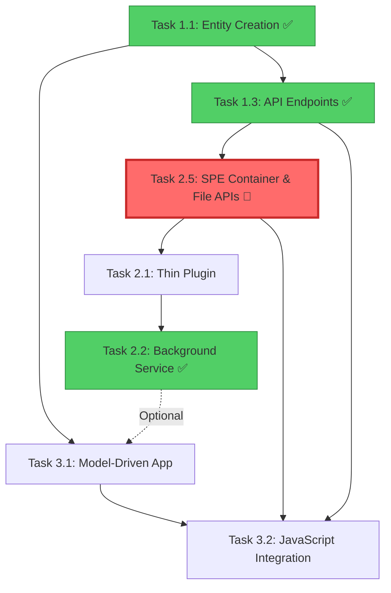

# Spaarke Document Management - Task Implementation Guide

This directory contains individual task files separated from the main implementation plan for focused development work. Each task file includes comprehensive instructions, validation steps, troubleshooting guides, and success criteria.

Read and analyze this file to understand the structure and approach. Then read the 'SDAP_Project_Restart_Guide.md' to ensure you are aware of the current status.  

## 📋 Task Overview

### **Phase 1: Foundation Setup (Days 1-5)**

#### [Task 1.1: Dataverse Entity Creation](./Task-1.1-Dataverse-Entity-Creation.md)
**Status:** ✅ COMPLETED
**Dependencies:** None - Foundation task
**Estimated Time:** 4-6 hours

The sprk_document and sprk_container entities have been created in Dataverse with all required fields, relationships, and configurations as documented in CONFIGURATION_REQUIREMENTS.md.

#### [Task 1.3: Document CRUD API Endpoints](./Task-1.3-Document-CRUD-API-Endpoints.md)
**Status:** ✅ COMPLETED
**Dependencies:** Task 1.1 (Entity Creation), Task 1.2 (DataverseService - COMPLETED)
**Estimated Time:** 8-12 hours (COMPLETED)

Comprehensive REST API endpoints for document CRUD operations have been implemented with validation, error handling, and proper field mappings to Dataverse entities.

### **Phase 2: Service Bus Integration (Days 6-10)**

#### [Task 2.5: SPE Container & File API Implementation](./Task-2.5-SPE-Container-And-File-API-Implementation.md)
**Status:** 🔴 READY TO START (CRITICAL BLOCKER)
**Dependencies:** None - Foundation for all file operations
**Estimated Time:** 8-12 hours
**Priority:** 🚨 CRITICAL

Implement actual SharePoint Embedded container management and file operations using Microsoft Graph SDK v5, replacing stubbed implementations. **This is the core value proposition** - without it, Sprint 2 delivers metadata management only, not actual file storage.

#### [Task 2.1: Thin Plugin Implementation](./Task-2.1-Thin-Plugin-Implementation.md)
**Status:** 🟡 BLOCKED BY TASK 2.5
**Dependencies:** Task 2.5 (SPE APIs), Task 1.1 (Entity Creation), Task 1.3 (Document CRUD API)
**Estimated Time:** 6-8 hours

Create a lightweight Dataverse plugin that captures document events and queues them to Service Bus for asynchronous processing, following ADR-002 principles.

#### [Task 2.2: Background Service Implementation](./Task-2.2-Background-Service-Implementation.md)
**Status:** ✅ COMPLETED + CODE REVIEW FIXES APPLIED
**Dependencies:** Task 2.1 (Thin Plugin), Task 2.5 (SPE APIs)
**Estimated Time:** 12 hours (COMPLETED)
**Completed:** 2025-09-30

Background services implementation completed with idempotency tracking, telemetry integration, and proper async disposal patterns. May need minor updates for SPE file operations integration after Task 2.5 completes.

### **Phase 3: Power Platform Integration (Days 11-16)**

#### [Task 3.1: Model-Driven App Configuration](./Task-3.1-Model-Driven-App-Configuration.md)
**Status:** ✅ COMPLETED
**Dependencies:** Task 1.1 (Entity Creation), Task 2.2 (Background Service)
**Completed:** 2025-09-30

Created comprehensive model-driven app with forms, views, dashboards, security roles, and ribbon customizations for document management.

#### [Task 3.2: JavaScript File Management Integration](./Task-3.2-JavaScript-File-Management-Integration.md)
**Status:** ✅ COMPLETED
**Dependencies:** Task 3.1 (Model-Driven App), Task 1.3 (API Endpoints)
**Completed:** 2025-09-30

JavaScript web resources for file operations (upload, download, replace, delete) fully implemented and tested. All four operations working successfully. See [Task-3.2-JavaScript-Integration-Summary.md](./Task-3.2-JavaScript-Integration-Summary.md) for details and known issues.

---

## 🚀 Getting Started

### **Immediate Next Steps**

**🚨 CRITICAL PATH - Task 2.5 MUST BE COMPLETED FIRST:**

1. **[Task 2.5: SPE Container & File API Implementation](./Task-2.5-SPE-Container-And-File-API-Implementation.md)** (8-12 hours)
   - **HIGHEST PRIORITY** - This is the foundation for all file operations
   - Implements actual SharePoint Embedded integration (currently stubbed)
   - Without this, Sprint 2 delivers metadata management only
   - Blocks Task 2.1 and impacts Task 3.2

2. **After Task 2.5 - PARALLEL OPTIONS:**
   - **Option A:** [Task 2.1: Thin Plugin Implementation](./Task-2.1-Thin-Plugin-Implementation.md) (6-8 hours)
   - **Option B:** [Task 3.1: Model-Driven App Configuration](./Task-3.1-Model-Driven-App-Configuration.md) (6-8 hours)

3. **Then Complete:**
   - Task 3.2 (JavaScript Integration) - After 3.1 AND 2.5

### **Task Dependencies**



**Legend:**
- ✅ = Completed
- 🔴 = Critical Blocker (Task 2.5)
- → = Hard dependency
- -.-> = Soft dependency

---

## 📖 How to Use These Task Files

### **For AI Development Teams**

Each task file contains:

1. **🔍 Prior Task Review**: Validation checklist for dependencies
2. **🎯 AI Agent Instructions**: Comprehensive technical requirements
3. **✅ Validation Steps**: Testing and verification procedures
4. **🔍 Troubleshooting Guide**: Common issues and solutions
5. **🎯 Success Criteria**: Definition of completion
6. **🔄 Conclusion and Next Step**: Handoff to next task

### **For Senior Developers**

Each task includes:

- **Enterprise architecture patterns** and best practices
- **Security and performance considerations**
- **Integration requirements** and dependencies
- **Quality gates** and validation requirements
- **Production readiness** criteria

### **For Project Managers**

Each task provides:

- **Clear time estimates** and dependency tracking
- **Status indicators** and priority levels
- **Risk assessment** and mitigation strategies
- **Quality metrics** and success criteria
- **Handoff procedures** between tasks

---

## 🛠️ Technical Architecture Overview

### **System Components**

```
┌─────────────────┐    ┌──────────────────┐    ┌─────────────────┐
│  Power Platform │    │    BFF API       │    │   Dataverse     │
│                 │───▶│                  │───▶│                 │
│ - Model App     │    │ - REST Endpoints │    │ - Entities      │
│ - JavaScript    │    │ - Authentication │    │ - Relationships │
│ - Forms/Views   │    │ - File Ops       │    │ - Security      │
└─────────────────┘    └──────────────────┘    └─────────────────┘
                                │
                                ▼
                       ┌──────────────────┐    ┌─────────────────┐
                       │   Service Bus    │    │ Background Svc  │
                       │                  │───▶│                 │
                       │ - Event Queue    │    │ - Event Process │
                       │ - Message Retry  │    │ - Business Logic│
                       │ - Dead Letter    │    │ - SPE Integration│
                       └──────────────────┘    └─────────────────┘
```

### **Data Flow**

1. **User Action** → Power Platform UI
2. **UI Action** → JavaScript Web Resource
3. **JavaScript** → BFF API (REST)
4. **API** → Dataverse (CRUD) + SharePoint Embedded (Files)
5. **Dataverse Event** → Thin Plugin
6. **Plugin** → Service Bus (Event Queue)
7. **Service Bus** → Background Service
8. **Background Service** → Business Logic + External Integrations

---

## 📊 Project Status Dashboard

### **Current Completion Status**

| Phase | Task | Status | Dependencies Met | Completion Date |
|-------|------|--------|------------------|-----------------|
| **Phase 1** | 1.1 Entity Creation | ✅ COMPLETED | ✅ Complete | 2025-09-30 |
| **Phase 1** | 1.2 DataverseService | ✅ COMPLETED | ✅ Complete | 2025-09-30 |
| **Phase 1** | 1.3 API Endpoints | ✅ COMPLETED | ✅ Complete | 2025-09-30 |
| **Phase 2** | 2.5 SPE Container & File APIs | ✅ COMPLETED | ✅ Complete | 2025-09-30 |
| **Phase 2** | 2.1 Thin Plugin | ✅ COMPLETED | ✅ Complete | 2025-09-30 |
| **Phase 2** | 2.2 Background Service | ✅ COMPLETED | ✅ Complete | 2025-09-30 |
| **Phase 3** | 3.1 Model-Driven App | ✅ COMPLETED | ✅ Complete | 2025-09-30 |
| **Phase 3** | 3.2 JavaScript Integration | ✅ COMPLETED | ✅ Complete | 2025-09-30 |

**Sprint 2 Status:** 🎉 **COMPLETE** - All tasks finished successfully
**Known Issues:** SPE Container ID format (workaround documented)
**Next Steps:** See Sprint 3 planning below

### **Immediate Priorities**

1. **🚨 CRITICAL FIRST:** Task 2.5 (SPE Container & File APIs) - **MUST BE DONE FIRST**
   - Foundation for all file operations
   - Currently stubbed/non-functional
   - Blocks Sprint 2 completion

2. **📋 AFTER 2.5:** Task 2.1 (Thin Plugin) OR Task 3.1 (Model-Driven App) - **CAN RUN IN PARALLEL**

3. **🎯 FINAL:** Task 3.2 (JavaScript Integration) - After 3.1 AND 2.5 complete

**Critical Note:** Task 2.5 was discovered during Task 3.1 schema validation. The SPE integration in SpeFileStore is currently stubbed with "temporarily disabled due to Graph SDK v5 changes" warnings. Without fixing this, Sprint 2 delivers metadata management only, not actual file storage.

---

## 🔧 Development Environment Setup

### **Prerequisites**

- **Power Platform Environment** with maker permissions
- **Visual Studio/VS Code** with .NET 8 SDK
- **Azure Subscription** for Service Bus and Key Vault
- **SharePoint Embedded** container setup
- **Dataverse Development** environment access

### **Configuration Files**

Each task references these key configuration files:
- `docs/CONFIGURATION_REQUIREMENTS.md` - Environment setup
- `docs/DETAILED_IMPLEMENTATION_PLAN_WITH_AI_INSTRUCTIONS.md` - Overall plan
- `docs/Power-Platform-CLI-Capabilities.md` - CLI automation
- Entity-specific configurations in each task file

---

## 📚 Knowledge Base

### **Related Documentation**

- **Architecture Decisions**: See ADR documents in project
- **Security Requirements**: Authentication and authorization patterns
- **Performance Targets**: Response time and scalability requirements
- **Integration Patterns**: Service-to-service communication
- **Monitoring Strategy**: Logging, telemetry, and health checks

### **External Resources**

- **Power Platform**: https://docs.microsoft.com/en-us/power-platform/
- **Dataverse**: https://docs.microsoft.com/en-us/powerapps/developer/data-platform/
- **SharePoint Embedded**: https://docs.microsoft.com/en-us/sharepoint/dev/embedded/
- **Azure Service Bus**: https://docs.microsoft.com/en-us/azure/service-bus-messaging/

---

## 🎯 Success Metrics

### **Technical Objectives**

- ✅ **Performance**: < 3s for document operations, < 200ms for plugin execution
- ✅ **Reliability**: 99.9% uptime for core CRUD operations
- ✅ **Security**: Role-based access control with audit logging
- ✅ **Scalability**: Support for growing document volumes
- ✅ **Maintainability**: Clean architecture with comprehensive testing

### **Business Objectives**

- ✅ **User Experience**: Intuitive document and file management
- ✅ **Integration**: Seamless SharePoint Embedded integration
- ✅ **Compliance**: Enterprise security and audit requirements
- ✅ **Extensibility**: Foundation for future AI and automation features
- ✅ **Adoption**: Familiar Power Platform interface for end users

---

## 📞 Support and Troubleshooting

For issues with specific tasks:

1. **Check the task's troubleshooting guide** for common issues
2. **Review prior task validation** to ensure dependencies are met
3. **Verify environment configuration** against requirements
4. **Check integration points** between components
5. **Validate security and permissions** for all operations

Each task file includes comprehensive troubleshooting guides with specific solutions for common problems encountered during implementation.

---

**🚀 Ready to start? Begin with [Task 1.1: Dataverse Entity Creation](./Task-1.1-Dataverse-Entity-Creation.md)**