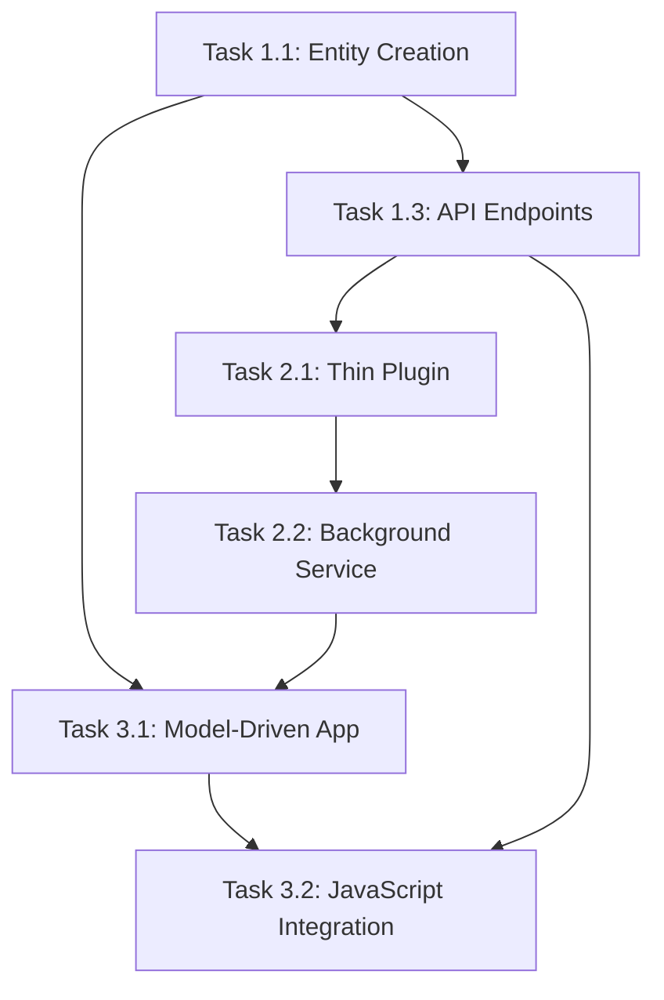

# Spaarke Document Management - Task Implementation Guide

This directory contains individual task files separated from the main implementation plan for focused development work. Each task file includes comprehensive instructions, validation steps, troubleshooting guides, and success criteria.

## 📋 Task Overview

### **Phase 1: Foundation Setup (Days 1-5)**

#### [Task 1.1: Dataverse Entity Creation](./Task-1.1-Dataverse-Entity-Creation.md)
**Status:** ⚠️ PENDING - HIGH PRIORITY
**Dependencies:** None - Foundation task
**Estimated Time:** 4-6 hours

Create the sprk_document and sprk_container entities with all required fields, relationships, security roles, and form configurations. This is the blocking foundation task that enables all other development.

#### [Task 1.3: Document CRUD API Endpoints](./Task-1.3-Document-CRUD-API-Endpoints.md)
**Status:** 🔴 READY TO START
**Dependencies:** Task 1.1 (Entity Creation), Task 1.2 (DataverseService - COMPLETED)
**Estimated Time:** 8-12 hours

Implement comprehensive REST API endpoints for document and file management, including authentication, authorization, validation, error handling, and integration with SharePoint Embedded.

### **Phase 2: Service Bus Integration (Days 6-10)**

#### [Task 2.1: Thin Plugin Implementation](./Task-2.1-Thin-Plugin-Implementation.md)
**Status:** 🔴 READY TO START
**Dependencies:** Task 1.1 (Entity Creation), Task 1.3 (Document CRUD API)
**Estimated Time:** 6-8 hours

Create a lightweight Dataverse plugin that captures document events and queues them to Service Bus for asynchronous processing, following ADR-002 principles.

#### [Task 2.2: Background Service Implementation](./Task-2.2-Background-Service-Implementation.md)
**Status:** 🔴 READY TO START
**Dependencies:** Task 2.1 (Thin Plugin Implementation)
**Estimated Time:** 10-12 hours

Implement background services to process document events from Service Bus, including business logic for document lifecycle management and integration with external services.

### **Phase 3: Power Platform Integration (Days 11-16)**

#### [Task 3.1: Model-Driven App Configuration](./Task-3.1-Model-Driven-App-Configuration.md)
**Status:** 🔴 READY TO START
**Dependencies:** Task 1.1 (Entity Creation), Task 2.2 (Background Service)
**Estimated Time:** 6-8 hours

Create a comprehensive model-driven app with forms, views, dashboards, security roles, and ribbon customizations for document management.

#### [Task 3.2: JavaScript File Management Integration](./Task-3.2-JavaScript-File-Management-Integration.md)
**Status:** 🔴 READY TO START
**Dependencies:** Task 3.1 (Model-Driven App), Task 1.3 (API Endpoints)
**Estimated Time:** 10-14 hours

Implement JavaScript web resources for file operations (upload, download, replace, delete) with comprehensive error handling, user feedback, and API integration.

---

## 🚀 Getting Started

### **Immediate Next Steps**

1. **START HERE:** [Task 1.1: Dataverse Entity Creation](./Task-1.1-Dataverse-Entity-Creation.md)
   - This is the **critical blocking task** that must be completed first
   - All other development depends on having the entities properly configured
   - Estimated time: 4-6 hours

2. **After 1.1 Complete:** [Task 1.3: Document CRUD API Endpoints](./Task-1.3-Document-CRUD-API-Endpoints.md)
   - Can start immediately after entities are created
   - Provides the API foundation for all file operations
   - Estimated time: 8-12 hours

3. **Then Continue:** Follow the dependency chain through Tasks 2.1 → 2.2 → 3.1 → 3.2

### **Task Dependencies**



---

## 📖 How to Use These Task Files

### **For AI Development Teams**

Each task file contains:

1. **🔍 Prior Task Review**: Validation checklist for dependencies
2. **🎯 AI Agent Instructions**: Comprehensive technical requirements
3. **✅ Validation Steps**: Testing and verification procedures
4. **🔍 Troubleshooting Guide**: Common issues and solutions
5. **🎯 Success Criteria**: Definition of completion
6. **🔄 Conclusion and Next Step**: Handoff to next task

### **For Senior Developers**

Each task includes:

- **Enterprise architecture patterns** and best practices
- **Security and performance considerations**
- **Integration requirements** and dependencies
- **Quality gates** and validation requirements
- **Production readiness** criteria

### **For Project Managers**

Each task provides:

- **Clear time estimates** and dependency tracking
- **Status indicators** and priority levels
- **Risk assessment** and mitigation strategies
- **Quality metrics** and success criteria
- **Handoff procedures** between tasks

---

## 🛠️ Technical Architecture Overview

### **System Components**

```
┌─────────────────┐    ┌──────────────────┐    ┌─────────────────┐
│  Power Platform │    │    BFF API       │    │   Dataverse     │
│                 │───▶│                  │───▶│                 │
│ - Model App     │    │ - REST Endpoints │    │ - Entities      │
│ - JavaScript    │    │ - Authentication │    │ - Relationships │
│ - Forms/Views   │    │ - File Ops       │    │ - Security      │
└─────────────────┘    └──────────────────┘    └─────────────────┘
                                │
                                ▼
                       ┌──────────────────┐    ┌─────────────────┐
                       │   Service Bus    │    │ Background Svc  │
                       │                  │───▶│                 │
                       │ - Event Queue    │    │ - Event Process │
                       │ - Message Retry  │    │ - Business Logic│
                       │ - Dead Letter    │    │ - SPE Integration│
                       └──────────────────┘    └─────────────────┘
```

### **Data Flow**

1. **User Action** → Power Platform UI
2. **UI Action** → JavaScript Web Resource
3. **JavaScript** → BFF API (REST)
4. **API** → Dataverse (CRUD) + SharePoint Embedded (Files)
5. **Dataverse Event** → Thin Plugin
6. **Plugin** → Service Bus (Event Queue)
7. **Service Bus** → Background Service
8. **Background Service** → Business Logic + External Integrations

---

## 📊 Project Status Dashboard

### **Current Completion Status**

| Phase | Task | Status | Dependencies Met | Estimated Time |
|-------|------|--------|------------------|----------------|
| **Phase 1** | 1.1 Entity Creation | ⚠️ PENDING | ✅ None | 4-6h |
| **Phase 1** | 1.2 DataverseService | ✅ COMPLETED | ✅ Complete | - |
| **Phase 1** | 1.3 API Endpoints | 🔴 READY | ⚠️ Needs 1.1 | 8-12h |
| **Phase 2** | 2.1 Thin Plugin | 🔴 BLOCKED | ❌ Needs 1.1, 1.3 | 6-8h |
| **Phase 2** | 2.2 Background Service | 🔴 BLOCKED | ❌ Needs 2.1 | 10-12h |
| **Phase 3** | 3.1 Model-Driven App | 🔴 BLOCKED | ❌ Needs 1.1 | 6-8h |
| **Phase 3** | 3.2 JavaScript Integration | 🔴 BLOCKED | ❌ Needs 3.1, 1.3 | 10-14h |

**Total Remaining Effort:** 44-60 hours
**Critical Path:** 1.1 → 1.3 → 2.1 → 2.2 → 3.1 → 3.2

### **Immediate Priorities**

1. **🚨 HIGH PRIORITY:** Complete Task 1.1 (Entity Creation) - **BLOCKING ALL OTHER WORK**
2. **🔥 URGENT:** Start Task 1.3 (API Endpoints) immediately after 1.1
3. **📋 PLANNED:** Continue with Service Bus integration (Tasks 2.1, 2.2)
4. **🎯 FINAL:** Complete Power Platform UI (Tasks 3.1, 3.2)

---

## 🔧 Development Environment Setup

### **Prerequisites**

- **Power Platform Environment** with maker permissions
- **Visual Studio/VS Code** with .NET 8 SDK
- **Azure Subscription** for Service Bus and Key Vault
- **SharePoint Embedded** container setup
- **Dataverse Development** environment access

### **Configuration Files**

Each task references these key configuration files:
- `docs/CONFIGURATION_REQUIREMENTS.md` - Environment setup
- `docs/DETAILED_IMPLEMENTATION_PLAN_WITH_AI_INSTRUCTIONS.md` - Overall plan
- `docs/Power-Platform-CLI-Capabilities.md` - CLI automation
- Entity-specific configurations in each task file

---

## 📚 Knowledge Base

### **Related Documentation**

- **Architecture Decisions**: See ADR documents in project
- **Security Requirements**: Authentication and authorization patterns
- **Performance Targets**: Response time and scalability requirements
- **Integration Patterns**: Service-to-service communication
- **Monitoring Strategy**: Logging, telemetry, and health checks

### **External Resources**

- **Power Platform**: https://docs.microsoft.com/en-us/power-platform/
- **Dataverse**: https://docs.microsoft.com/en-us/powerapps/developer/data-platform/
- **SharePoint Embedded**: https://docs.microsoft.com/en-us/sharepoint/dev/embedded/
- **Azure Service Bus**: https://docs.microsoft.com/en-us/azure/service-bus-messaging/

---

## 🎯 Success Metrics

### **Technical Objectives**

- ✅ **Performance**: < 3s for document operations, < 200ms for plugin execution
- ✅ **Reliability**: 99.9% uptime for core CRUD operations
- ✅ **Security**: Role-based access control with audit logging
- ✅ **Scalability**: Support for growing document volumes
- ✅ **Maintainability**: Clean architecture with comprehensive testing

### **Business Objectives**

- ✅ **User Experience**: Intuitive document and file management
- ✅ **Integration**: Seamless SharePoint Embedded integration
- ✅ **Compliance**: Enterprise security and audit requirements
- ✅ **Extensibility**: Foundation for future AI and automation features
- ✅ **Adoption**: Familiar Power Platform interface for end users

---

## 📞 Support and Troubleshooting

For issues with specific tasks:

1. **Check the task's troubleshooting guide** for common issues
2. **Review prior task validation** to ensure dependencies are met
3. **Verify environment configuration** against requirements
4. **Check integration points** between components
5. **Validate security and permissions** for all operations

Each task file includes comprehensive troubleshooting guides with specific solutions for common problems encountered during implementation.

---

**🚀 Ready to start? Begin with [Task 1.1: Dataverse Entity Creation](./Task-1.1-Dataverse-Entity-Creation.md)**