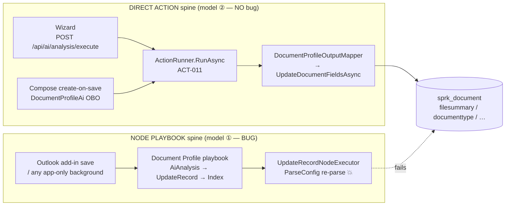
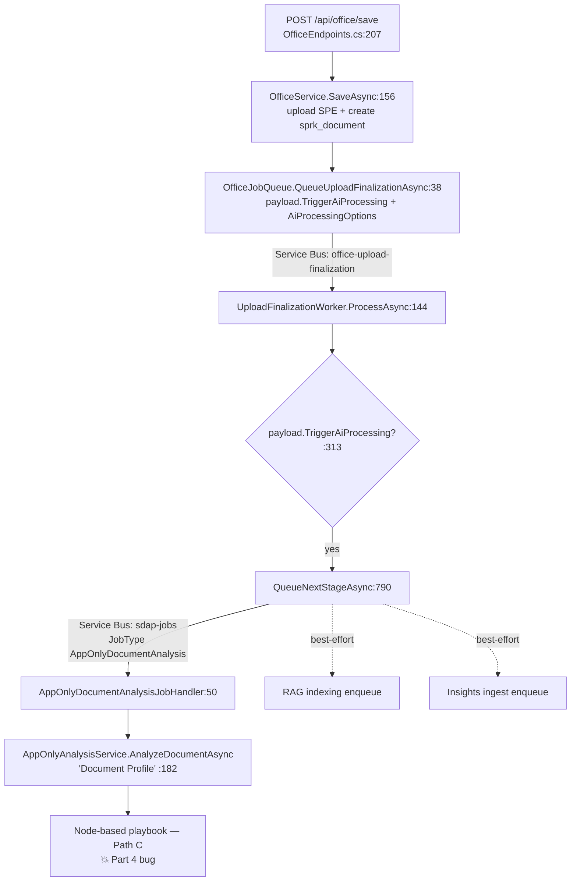
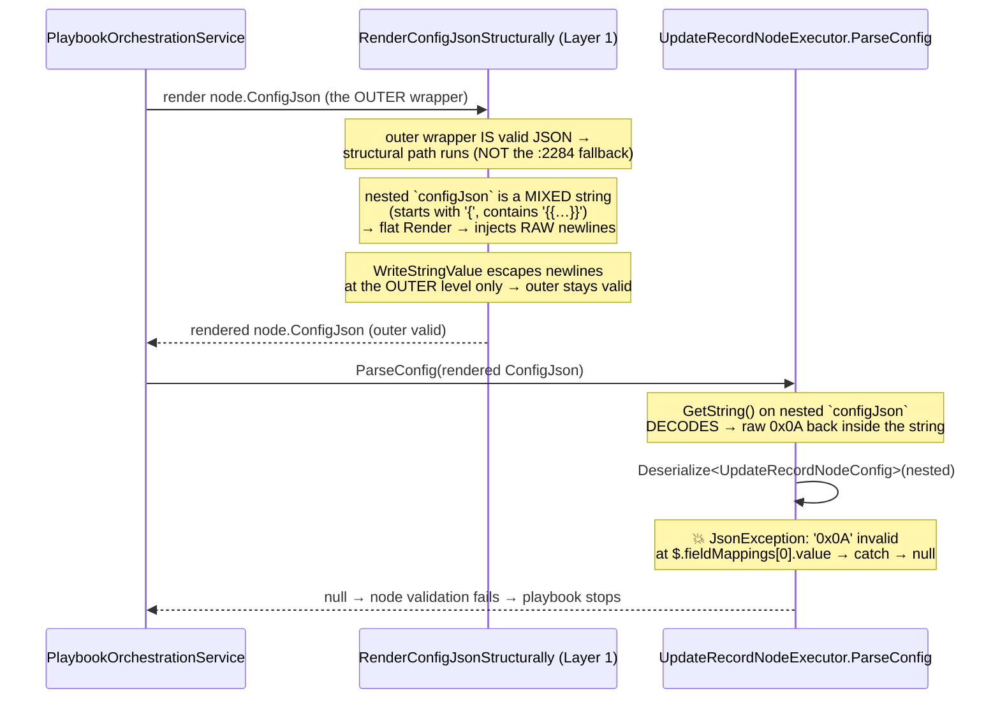

# Document Profiling & the Three AI Execution Models

> **Created**: 2026-09-01 by `email-communication-intelligence-r2` (Fable-level investigation of the "document profile never completes" UAT bug).
> **Purpose**: The single authoritative reference for **how a saved `sprk_document` gets AI-profiled** and, more broadly, **how the BFF runs AI at all**. Read this before changing anything in the file/Document create → profile → index pipeline. It exists so the failure mode documented in Part 4 never has to be re-discovered.
> **Status**: The root cause in Part 4 is **empirically confirmed** (live Dataverse config + App Insights). The fix is **not yet applied** — Part 4 ends with fix options for the owner to choose (per root `CLAUDE.md` §6.5).
> **Owning area**: AI orchestration (`Services/Ai/**`). The bug is NOT in the Office save path — but the Office save path is its most visible victim, which is why this doc lives at the intersection.

---

## TL;DR (read this first)

1. **The BFF runs AI three different ways.** (a) **Node-based playbooks** — a multi-node graph (`sprk_playbook` + `sprk_playbooknode`) run by `PlaybookOrchestrationService`; (b) **Direct Actions / Linear Consumers** — a single `sprk_analysisaction` (e.g. ACT-011) run by `ActionRunner` on the ADR-043 completion engine, **no graph**; (c) **Legacy sequential-tool** — deprecated, for node-less playbooks.

2. **"Document profiling" exists in BOTH form (a) and form (b), using the SAME underlying Action (ACT-011 "Document Profiler").** Whether a given entry point uses the playbook or the direct Action is an accident of which code path it happens to call — and that is the whole reason the same feature "works here, fails there."

3. **The three entry points that profile a document diverge:**
   | Entry point | Execution model | Bug-exposed? |
   |---|---|---|
   | Interactive wizard (`POST /api/ai/analysis/execute`) | **Direct Action** (linear) | ✅ No |
   | Compose create-on-save (OBO) | **Direct Action** (linear) | ✅ No |
   | **Outlook add-in / any app-only background save** | **Node-based playbook** | 🔴 **Yes** |

4. **The bug** (Part 4): the "Document Profile" **playbook** ends with an **Update Record** node whose config is stored in the Playbook-Builder **wrapper format** (`configJson`-nested-as-a-string). The Layer-1 template renderer escapes newlines at the *outer* level but treats the nested config as an opaque string, so the multi-line AI summary lands **un-escaped inside the nested JSON**. When `UpdateRecordNodeExecutor.ParseConfig` **re-parses** that nested string, it throws `JsonException: '0x0A' is invalid within a JSON string. Path: $.fieldMappings[0].value`, the node fails, the playbook stops, and every saved document ends at `sprk_filesummarystatus = Failed`.

5. **The direct-Action paths are immune** because they never serialize AI output back into a JSON config and never re-parse it — `ActionRunner` makes one LLM call and maps the result straight onto `sprk_document` fields.

6. **Strategic takeaway**: converging the app-only/Outlook path onto the same **direct-Action** spine the wizard and Compose already use would delete this entire class of bug. Part 4 lays out both the targeted fix and the convergence fix.

---

## Part 1 — The three AI execution models

All three ultimately talk to the same Azure OpenAI deployments through `IOpenAiClient`, and Actions render prompts through the same `PromptSchemaRenderer`. What differs is the **control-flow shell** around that call.

```mermaid
flowchart TD
    subgraph M1["① Node-based Playbook  (sprk_playbook + sprk_playbooknode)"]
        P1[PlaybookOrchestrationService<br/>ExecuteAsync / ExecuteAppOnlyAsync] --> P2[ExecutionGraph<br/>topological batches, parallel≤3]
        P2 --> P3[ExecuteNodeAsync per node]
        P3 --> P4[ApplyConfigJsonTemplates<br/>Layer-1 render of ConfigJson]
        P4 --> P5[INodeExecutor.ExecuteAsync<br/>via NodeExecutorRegistry]
    end
    subgraph M2["② Direct Action / Linear Consumer  (sprk_analysisaction, ADR-043)"]
        A1[ActionRunner.RunAsync] --> A2[PromptSchemaRenderer<br/>render ONE prompt]
        A2 --> A3[IOpenAiClient<br/>GetStructuredCompletionRawAsync]
        A3 --> A4[consumer maps JsonElement<br/>→ target record]
    end
    subgraph M3["③ Legacy sequential-tool  (DEPRECATED)"]
        L1[AnalysisOrchestrationService<br/>ExecutePlaybookAsync] --> L2[sequential IAnalysisToolHandler loop]
    end
```



### ① Node-based Playbook

- **What it is**: a **dependency graph** of nodes. Each `sprk_playbooknode` row has an `sprk_executortype` (Choice), a `sprk_configjson` (its typed config), `sprk_dependsonjson`, and an `sprk_outputvariable`. Nodes reference upstream nodes' outputs via Handlebars templates (`{{output_aiAnalysis.output.sprk_filesummary}}`).
- **Engine**: [`Services/Ai/PlaybookOrchestrationService.cs`](../../src/server/api/Sprk.Bff.Api/Services/Ai/PlaybookOrchestrationService.cs) — `ExecuteAsync` (:84) / `ExecuteAppOnlyAsync` (:132) build a `PlaybookRunContext`, load nodes, build an `ExecutionGraph`, topologically batch them, run each batch with parallelism throttled to 3, and dispatch each node to an `INodeExecutor` keyed on `sprk_executortype`.
- **Config rendering**: before each executor runs, `ApplyConfigJsonTemplates` (:2250, called from `ExecuteNodeAsync` ~:1239) substitutes `{{…}}` in the node's `ConfigJson` against the run context (prior node outputs, parameters, document/run metadata). **This is Layer 1 of the two-layer output pattern** ([`SPAARKE-PLAYBOOK-LLM-OUTPUT-PATTERN.md`](SPAARKE-PLAYBOOK-LLM-OUTPUT-PATTERN.md)). **This is where the bug lives — see Part 4.**
- **Node dispatch** is single-hop (R7 FR-07): the executor is chosen directly from `node.SprkExecutortype`; there is no `actionid → actiontypeid → executor` fallback ladder anymore.
- **When used**: multi-step flows where structural nodes (Condition, Deliver, Index, Update Record, Create Task/Notification) matter, or where an author composed a graph on the Playbook Builder canvas. **Document profiling in the app-only/background path still uses this** (Path C below).

### ② Direct Action / Linear Consumer (ADR-043)

- **What it is**: a **single** `sprk_analysisaction` — a prompt + output schema + model tier — executed with **no graph, no registry, no template engine over a config**. This is the modern "AI capability execution spine."
- **Engine**: [`Services/Ai/LinearConsumers/ActionRunner.cs`](../../src/server/api/Sprk.Bff.Api/Services/Ai/LinearConsumers/ActionRunner.cs) `RunAsync` (:108). It renders the Action's `SystemPrompt` + `OutputSchemaJson` through `PromptSchemaRenderer`, makes **one** `IOpenAiClient.GetStructuredCompletionRawAsync` call, and returns a raw `JsonElement`. The consumer maps that JSON onto its target.
- **Resolution**: `IActionResolver.ResolveAsync(ConsumerTypes.X)` reads the `sprk_playbookconsumer` **Binding table** to find the Action for a well-known consumer type. No hardcoded GUIDs.
- **When used**: the canonical path for narrative/structured single-shot outputs — document profiling (wizard + Compose), Daily Briefing narrate, etc. **This path is structurally immune to the Part 4 bug**: it never serializes AI output into a JSON config, so there is nothing to re-parse.
- **Reference**: [`docs/architecture/SPAARKE-LINEAR-AI-CONSUMER-ARCHITECTURE.md`](SPAARKE-LINEAR-AI-CONSUMER-ARCHITECTURE.md), ADR-043.

### ③ Legacy sequential-tool (deprecated)

- `AnalysisOrchestrationService.ExecutePlaybookAsync` runs a sequential `IAnalysisToolHandler` loop for **node-less** playbooks. It logs a deprecation warning and is only reached when a playbook has zero nodes. New playbooks always have nodes; new capabilities use model ②. Documented here only so you recognize it.

### The node executor catalogue (model ①)

Registry: [`NodeExecutorRegistry.cs`](../../src/server/api/Sprk.Bff.Api/Services/Ai/Nodes/NodeExecutorRegistry.cs) indexes every `INodeExecutor` by its `ExecutorType`. The ones that matter for document/record writes:

| Executor | ExecutorType | Role | Reads upstream? |
|---|---|---|---|
| `AiAnalysisNodeExecutor` | AI Analysis (0) | Document-grounded structured analysis (the actual profiling LLM call) | Needs Document + Action |
| `AiCompletionNodeExecutor` | AI Completion (1) | Raw LLM completion from a prompt template | Action; inputs optional |
| **`UpdateRecordNodeExecutor`** | **Update Record (22)** | **Writes upstream AI output back onto a Dataverse record via PATCH** | **Yes — the bug node** |
| `DeliverToIndexNodeExecutor` | Deliver To Index (41) | Queues the document for RAG indexing | Needs doc metadata |
| `CreateTaskNodeExecutor` | Create Task (20) | Creates a Dataverse task | Self-contained config |
| `CreateNotificationNodeExecutor` | Create Notification (50) | Creates an in-app notification | Self-contained config |
| `SendEmailNodeExecutor` | Send Email (21) | Sends email via Graph | Self-contained config |
| `ConditionNodeExecutor` | Condition (30) | Branch gate (emits `selectedBranch`) | Yes |
| `DeliverComposite` / `DeliverOutput` | 42 / 40 | Compose/deliver final section output | Yes |

> **Important**: `UpdateRecordNodeExecutor`, `CreateTaskNodeExecutor`, `CreateNotificationNodeExecutor`, and `SendEmailNodeExecutor` **all accept the same Playbook-Builder wrapper config format** and therefore share the Part 4 exposure whenever an upstream **multi-line or quote-bearing** value is templated into their config. Update Record is simply the one profiling hits first.

---

## Part 2 — The document-profile capability (ACT-011) and its entry points

**One Action, two execution shells.** The profiling logic — "read the document text, produce summary / TL;DR / keywords / people / org / document-type" — is the **ACT-011 "Document Profiler"** Action. It is invoked two different ways:

- as a **direct Action** (model ②) by the interactive and OBO paths, and
- as the terminal write-back of the **"Document Profile" playbook** (model ①) by the app-only/background path.

Both target the same `sprk_document` fields via the same output field names, so **the output mapping does not drift** — only the control-flow around it differs.

### Routing (single source of truth = the Binding table)

The well-known consumer type **`document-profile`** routes to ACT-011 through the `sprk_playbookconsumer` Binding table (seed: `infra/dataverse/sprk_playbookconsumer-rows.json`, `consumerType:"document-profile"`, `playbookName:"Document Profile"`, `actionCode:"ACT-011"`). A missing Binding row is a hard failure — there are no hardcoded GUIDs.

### The three entry points



**Path A — Interactive wizard (Direct Action):** [`AnalysisEndpoints.cs`](../../src/server/api/Sprk.Bff.Api/Api/Ai/AnalysisEndpoints.cs) `ExecuteAnalysis` (:256) detects the DocumentProfile playbook id and routes to `ExecuteDocumentProfilePipelineAsync` (:858): resolve Action → extract text → `ActionRunner.RunAsync` (:936) → `BuildDocumentProfileFields` (:965) → `UpdateDocumentFieldsAsync` (:976). One LLM call, direct field write. **No node engine.**

**Path B — Compose create-on-save (Direct Action, OBO):** [`Services/Ai/PublicContracts/DocumentProfileAi.cs`](../../src/server/api/Sprk.Bff.Api/Services/Ai/PublicContracts/DocumentProfileAi.cs) `ProfileDocumentAsUserAsync` (:87) — the same resolve → extract → `ActionRunner` → `DocumentProfileOutputMapper.BuildFields` → `UpdateDocumentFieldsAsync` chain, under the caller's OBO token. Best-effort (never throws). **No node engine.**

**Path C — Outlook add-in / app-only background (Node Playbook — the bug path):** the save pipeline (Part 3) enqueues an app-only analysis job → [`AppOnlyAnalysisService.cs`](../../src/server/api/Sprk.Bff.Api/Services/Ai/AppOnlyAnalysisService.cs) `AnalyzeDocumentAsync(documentId, "Document Profile")` (:182) → `ExecutePlaybookAnalysisAsync` (:468) → the playbook **has nodes**, so `ExecuteNodeBasedAnalysisAsync` (:691) → `PlaybookOrchestrationService.ExecuteAppOnlyAsync` (:730). **This runs the node graph, and the graph's Update Record node is what fails.**

### The "Document Profile" playbook graph (live, `18cf3cc8-02ec-f011-8406-7c1e520aa4df`)

| Order | Node | ExecutorType | Output var | Result |
|---|---|---|---|---|
| 1 | **Profile Document** | AI Analysis (0) | `output_aiAnalysis` | ✅ succeeds — produces the summary/tldr/etc. |
| 3 | **Update Record** | Update Record (22) | `output_updateRecord` | 🔴 **fails** — re-parse of rendered config throws |
| 4 | **Index Document** | Deliver To Index (41) | `index_result` | ⛔ never reached (playbook stops on node failure) |

The AI analysis **works**. The write-back is what dies — which is exactly why the file lands in SPE, gets its record created, but shows `filesummarystatus = Failed` with no summary and no document type.

### `sprk_filesummarystatus` option-set (set by `AppOnlyAnalysisService`)

| Constant | Value | When |
|---|---|---|
| Pending | 100000001 | before processing |
| Completed | 100000002 | on success |
| **Failed** | **100000004** | **any failure — this is what the bug produces** |
| NotSupported | 100000005 | no SPE file / unsupported type |

---

## Part 3 — The file/Document create → profile trigger pipeline (Outlook path)

This is the chain that leads into Path C. Every hop is where a change could break profiling, so it is documented end to end.



- **Create**: `OfficeService.SaveAsync` uploads to SPE and creates the `sprk_document` **synchronously**, then always queues finalization.
- **Trigger**: `OfficeJobQueue.QueueUploadFinalizationAsync` sets `TriggerAiProcessing` and `AiProcessingOptions{ProfileSummary, RagIndex, DeepAnalysis}` on the payload.
- **Hand-off**: `UploadFinalizationWorker.QueueNextStageAsync` (gated on `TriggerAiProcessing`, :313) enqueues an `AppOnlyDocumentAnalysis` job to `sdap-jobs` with idempotency key `analysis-{documentId}-documentprofile`. It does **not** run AI inline.
- **Profile**: `AppOnlyDocumentAnalysisJobHandler` → `AppOnlyAnalysisService.AnalyzeDocumentAsync(documentId, "Document Profile")` → node-based playbook (Path C).

> **Design note**: this path chose the **node playbook** for profiling while the interactive paths chose the **direct Action**. That divergence is the root architectural smell behind Part 4. There is no functional reason the app-only path could not also use the direct Action (see Fix Option 3).

---

## Part 4 — The failure mode (empirically confirmed)

> **This is the section to read before touching the profile playbook, the Update Record node, or the Layer-1 config renderer.**

### Symptom

Every document saved through the Outlook add-in (or any app-only background save) lands in SPE, gets its `sprk_document` record, is correctly associated — but shows **`sprk_filesummarystatus = Failed` (100000004)** with no summary, no TL;DR, no AI document type. Interactive-wizard and Compose profiling of the *same* document type work fine.

### The stored config (live, node `0fa4e8db-b216-f111-8343-7c1e520aa4df`)

The Update Record node's `sprk_configjson` is the **Playbook-Builder wrapper format** — an outer object whose `configJson` property is the **real config, encoded as a JSON string**:

```jsonc
{
  "__canvasNodeId": "node_1772509260018_8qwhl3xe0",
  "__actionType": 22,
  "isConfigured": true,
  "validationErrors": [],
  "configJson": "{\"entityLogicalName\":\"sprk_document\",\"recordId\":\"{{document.id}}\",\"fieldMappings\":[{\"field\":\"sprk_filesummary\",\"type\":\"string\",\"value\":\"{{output_aiAnalysis.output.sprk_filesummary}}\"}, … ]}"
}
```

`fieldMappings[0]` is **`sprk_filesummary`** — the long, multi-line summary. That is not a coincidence; it is precisely why the observed error path is `$.fieldMappings[0].value`.

### The exact mechanism (why it breaks)

There are **two nesting levels** and **two rendering passes**, and they interact badly:



Step by step:

1. **Layer 1** ([`PlaybookOrchestrationService.ApplyConfigJsonTemplates`](../../src/server/api/Sprk.Bff.Api/Services/Ai/PlaybookOrchestrationService.cs) :2250) calls `RenderConfigJsonStructurally` (:2299). The **outer wrapper is valid JSON**, so `JsonDocument.Parse` succeeds and the structural walker runs. **The `:2284` flat-substitution fallback does NOT fire** — the earlier checkpoint note's hypothesis was wrong.
2. The walker descends and reaches the `configJson` **string** property. That string starts with `{` and contains `{{…}}`, so `IsPureTemplate` returns **false** → it is treated as a **mixed string** and rendered by the flat engine (:2371): `{{output_aiAnalysis.output.sprk_filesummary}}` is replaced by the multi-line summary with **raw `0x0A` newlines**.
3. `Utf8JsonWriter.WriteStringValue` escapes those newlines so the **outer** wrapper stays valid JSON (`\n`). **But the logical *content* of the nested string still contains raw newlines** — the walker never descended *into* the nested JSON, so it never escaped at the nested level.
4. **The executor re-parses.** [`UpdateRecordNodeExecutor.ParseConfig`](../../src/server/api/Sprk.Bff.Api/Services/Ai/Nodes/UpdateRecordNodeExecutor.cs) :325 first tries a direct deserialize (:333) — the outer wrapper has no top-level `entityLogicalName`, so it falls through to the nested branch (:339-346): `nested.GetString()` **decodes** the outer escaping back to a raw `0x0A`, then `JsonSerializer.Deserialize<UpdateRecordNodeConfig>(nestedJson)` **re-parses a JSON string that now contains a raw newline inside a value** → `JsonException: '0x0A' is invalid within a JSON string. Path: $.fieldMappings[0].value`.
5. `ParseConfig`'s `catch { return null; }` (:352) swallows it and returns `null` → `Validate` adds *"Failed to parse update record configuration"* → the node returns `ValidationFailed` → the playbook stops in batch 2 → `AppOnlyAnalysisService` stamps `filesummarystatus = Failed`.

### Why the direct-Action paths are immune

`ActionRunner` makes one LLM call and hands the raw `JsonElement` to `DocumentProfileOutputMapper`, which writes fields straight onto `sprk_document`. **AI output is never serialized into a JSON config and never re-parsed** — there is no second parse to choke on a newline. This is the structural reason models ② and ① differ in robustness, and the strongest argument for convergence.

### Why it was masked / mis-diagnosed

- The **stored** `sprk_configjson` is a valid template (`{{…}}`), so a unit test over the stored config parses fine ([`UpdateRecordParseConfigReproTests`](../../tests/unit/Sprk.Bff.Api.Tests/Services/Ai/Nodes/UpdateRecordParseConfigReproTests.cs) is green). Only the **rendered** config — after a multi-line value is substituted — is invalid.
- The `catch { return null; }` in `ParseConfig` hides the underlying `JsonException`; only the generic *"Failed to parse update record configuration"* surfaces. The precise `0x0A` path was recovered last session with temporary instrumentation (since removed).
- The prior checkpoint note attributed the failure to the **Layer-1 `:2284` flat fallback**. That is **incorrect**: the outer wrapper parses, so the structural path runs. The real defect is the **nested-string blind spot** in the structural walker. This distinction matters — a fix aimed only at the `:2284` fallback would not touch the actual failing code path.

### Blast radius

Any node whose config uses the **wrapper format** AND into which an upstream **multi-line or quote-bearing** value is templated: **Update Record, Create Task, Create Notification, Send Email**. Any playbook that writes AI narrative back to a record (profiling, and potentially Insights / Daily-Briefing variants that use nodes) is exposed. The direct-Action consumers are not.

### Fix options (owner to choose — not yet applied)

| # | Fix | Scope | Trade-off |
|---|---|---|---|
| **1 (targeted, recommended)** | Make Layer 1 **wrapper-aware**: in `WriteJsonElementWithTemplateExpansion`, when a string value is itself parseable JSON *and* contains `{{`, recurse (`RenderConfigJsonStructurally` on the nested string, write the escaped result back as a string). Then the nested config's newlines are escaped at the **nested** level, so `ParseConfig`'s re-parse succeeds. | One method in `PlaybookOrchestrationService`; fixes **all** wrapper-format executors at once. | Small heuristic ("string that is JSON containing a template"); low false-positive surface. |
| **2 (defer substitution)** | Have Layer 1 **not** expand templates inside a nested `configJson` string and let the executor render values itself (it already does, at `UpdateRecordNodeExecutor.cs:222`, into a plain string with no re-parse). | Layer 1 must recognize the wrapper — leaks executor knowledge into the generic renderer. | Cleaner data flow but more special-casing. |
| **3 (strategic convergence)** | Route the **app-only/Outlook** profiling path through the **direct-Action** spine (`IActionResolver → IDocumentTextSource(app-only) → IActionRunner → DocumentProfileOutputMapper`) that the wizard and Compose already use, retiring the node-based "Document Profile" playbook for this consumer. | Larger; needs an app-only text-source variant. | Deletes the entire bug class and unifies all three entry points on one spine (aligns with ADR-043 direction). |

**Recommendation**: apply **Fix 1** now (small, shared, unblocks profiling for every wrapper-format node), and track **Fix 3** as the durable architectural convergence. Whichever is chosen, add a **rendered-config** regression test (multi-line + embedded-quote value through the wrapper format), not just the stored-config test that exists today.

---

## Part 5 — Change-safety checklist (before you touch the Document-create / profile pipeline)

- [ ] **Know which spine you're on.** A change in `OfficeService`/`UploadFinalizationWorker`/`AppOnlyAnalysisService` runs the **node playbook** (Path C). A change in `AnalysisEndpoints` profile pipeline or `DocumentProfileAi` runs the **direct Action**. They are not the same code and do not fail the same way.
- [ ] **If you add a field to the profile write-back**, add it to **both** the node playbook's Update Record `fieldMappings` (Dataverse config) **and** `DocumentProfileOutputMapper` / `DocumentProfileFieldMapper` (direct-Action path), or the two spines will drift.
- [ ] **If an upstream value can be multi-line or contain quotes** and it flows into a node config (Update Record, Create Task, Create Notification, Send Email), you are in Part 4 territory until Fix 1/3 lands. Verify the **rendered** config, not just the stored template.
- [ ] **Never trust a green stored-config test as proof profiling works.** The bug only appears in the *rendered* config. Test the render, or test end-to-end (save → query `sprk_document.sprk_filesummarystatus != Failed`).
- [ ] **Verify after any change**: fresh add-in save → `SELECT TOP 4 sprk_documentname, sprk_filesummarystatus, sprk_documenttype FROM sprk_document ORDER BY createdon DESC` → expect `filesummarystatus = Completed (100000002)` and an AI-set `sprk_documenttype`. App Insights cross-check: `traces | where message contains 'Failed to parse update record'` should be empty.
- [ ] **Respect the AI facade** (ADR-013): Office/Communication code reaches AI only via `Services/Ai/PublicContracts/`. Do not inject node executors or `IOpenAiClient` into the save pipeline.

---

## Code map (fast reference)

| Concern | File |
|---|---|
| Node engine / Layer-1 render / **the bug site** | [`Services/Ai/PlaybookOrchestrationService.cs`](../../src/server/api/Sprk.Bff.Api/Services/Ai/PlaybookOrchestrationService.cs) — `ApplyConfigJsonTemplates` :2250, `RenderConfigJsonStructurally` :2299, mixed-string branch :2371 |
| Update Record node / **re-parse throw** | [`Services/Ai/Nodes/UpdateRecordNodeExecutor.cs`](../../src/server/api/Sprk.Bff.Api/Services/Ai/Nodes/UpdateRecordNodeExecutor.cs) — `ParseConfig` :325, nested branch :339-346 |
| App-only playbook profiling (Path C) | [`Services/Ai/AppOnlyAnalysisService.cs`](../../src/server/api/Sprk.Bff.Api/Services/Ai/AppOnlyAnalysisService.cs) — `AnalyzeDocumentAsync` :182, status enum :40-43 |
| Direct-Action wizard profiling (Path A) | [`Api/Ai/AnalysisEndpoints.cs`](../../src/server/api/Sprk.Bff.Api/Api/Ai/AnalysisEndpoints.cs) — `ExecuteDocumentProfilePipelineAsync` :858 |
| Direct-Action Compose profiling (Path B) | [`Services/Ai/PublicContracts/DocumentProfileAi.cs`](../../src/server/api/Sprk.Bff.Api/Services/Ai/PublicContracts/DocumentProfileAi.cs) — `ProfileDocumentAsUserAsync` :87 |
| Linear engine | [`Services/Ai/LinearConsumers/ActionRunner.cs`](../../src/server/api/Sprk.Bff.Api/Services/Ai/LinearConsumers/ActionRunner.cs) — `RunAsync` :108 |
| Output field mapping (shared) | [`Services/Ai/DocumentProfileOutputMapper.cs`](../../src/server/api/Sprk.Bff.Api/Services/Ai/DocumentProfileOutputMapper.cs), [`Services/Ai/DocumentProfileFieldMapper.cs`](../../src/server/api/Sprk.Bff.Api/Services/Ai/DocumentProfileFieldMapper.cs) |
| Office save pipeline | [`Api/Office/OfficeEndpoints.cs`](../../src/server/api/Sprk.Bff.Api/Api/Office/OfficeEndpoints.cs) :207, [`Services/Office/OfficeService.cs`](../../src/server/api/Sprk.Bff.Api/Services/Office/OfficeService.cs) :156, [`Services/Office/OfficeJobQueue.cs`](../../src/server/api/Sprk.Bff.Api/Services/Office/OfficeJobQueue.cs) :38, [`Workers/Office/UploadFinalizationWorker.cs`](../../src/server/api/Sprk.Bff.Api/Workers/Office/UploadFinalizationWorker.cs) `QueueNextStageAsync` :790 |
| Two-layer output pattern (governing) | [`SPAARKE-PLAYBOOK-LLM-OUTPUT-PATTERN.md`](SPAARKE-PLAYBOOK-LLM-OUTPUT-PATTERN.md) |
| Linear consumer architecture (governing) | [`SPAARKE-LINEAR-AI-CONSUMER-ARCHITECTURE.md`](SPAARKE-LINEAR-AI-CONSUMER-ARCHITECTURE.md), ADR-043 |

---

*Investigation basis: two parallel code-map sweeps of `Services/Ai/**` + `Services/Office/**`, direct reads of the Layer-1 renderer and `ParseConfig`, live Dataverse pull of node `0fa4e8db-…` config and the full "Document Profile" playbook graph, and the App-Insights-captured `0x0A` error path from the prior session. GitHub issue #919.*
