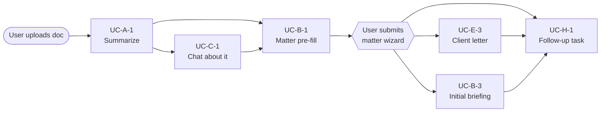
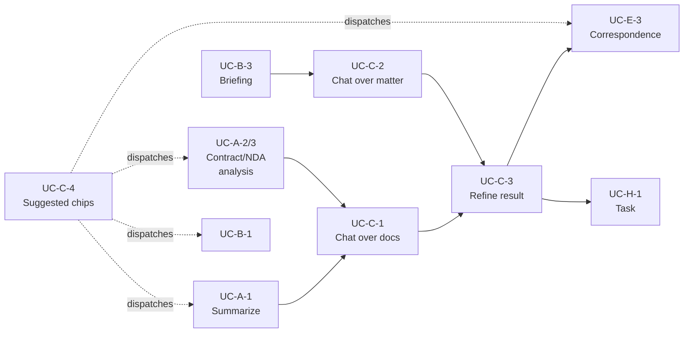
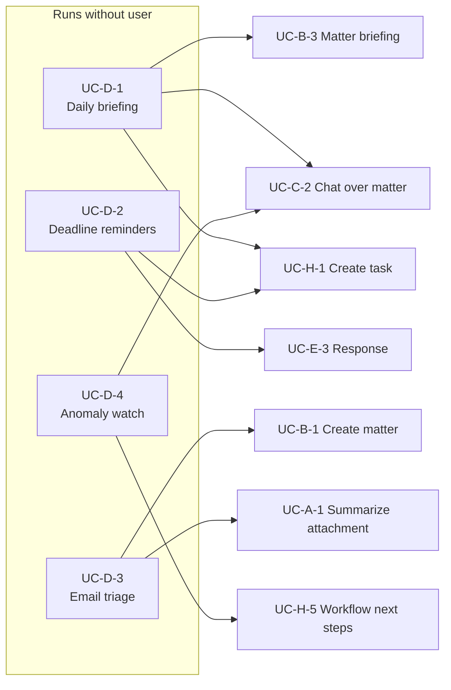
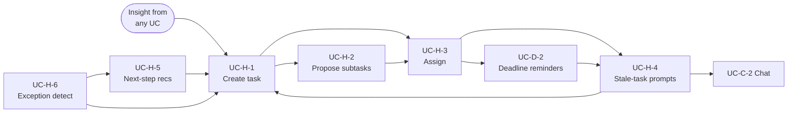

# Spaarke AI — Architecture and Component Design (Canonical)

> **Status**: **v0.4 — CONVERGED TARGET** (operator-ratified decisions,
> 2026-07-05). §4-7 define the target architecture: three entry paths
> (Event / Click / Text) with the bounded agent turn as the only probabilistic
> decider; session ledger; prompted + coded execution (engine frozen per
> OQ-2); Action + Binding manifest (no new tables); one confirmation gate.
> All open questions resolved (OQ-1..OQ-4); ratified decision register at
> §7.7; overlay exceptions E-1..E-5 ruled. Every §5 component carries its
> **Fulfilled by** mapping to audited code. Companions in
> `projects/spaarke-ai-code-audit-r1/`: `GREENFIELD-CONCEPTUAL-DESIGN.md`
> (clean-sheet rationale + review Q&A), `OVERLAY-MATRIX.md` (per-component
> verdicts), `ADR-REVIEW-VS-GREENFIELD.md` (approved; ADR-037 amendment
> applied), `SPAARKE-AI-MIGRATION-MAP.md` (sequencing; §8 summarizes).
> §0-3 unchanged from v0.2.6.
>
> **Last updated**: 2026-07-05 (see §9 revision log for full history).
>
> **Purpose**: single canonical reference for the Spaarke AI platform's target
> architecture and component design, anchored in real use cases. Consolidates
> and replaces scattered prior work (see §0.4 Prior work below).
>
> **Owner**: Spaarke Engineering
>
> **Audience**: architecture reviewers, feature-team leads, platform engineers,
> AI-Ops. Not intended as an implementation guide or a deployment runbook —
> those live in `docs/guides/`.
>
> **Contract**: this document defines WHAT the AI platform must do (use cases +
> capability contracts) and the HOW-shaped design of components + interactions.
> It does NOT define per-tenant configuration, per-consumer implementation
> details, or platform-specific deployment steps.

---

## 0. Introduction

### 0.1 What Spaarke AI is

Spaarke is an **enterprise AI-directed legal operations intelligence platform**
embedded in Power Apps + Dataverse and SharePoint Embedded, with a .NET 8 BFF
mediating between clients (PCF controls, Code Pages, ribbons, custom pages)
and backend services (Azure OpenAI, Azure AI Search, Document Intelligence,
Dataverse, Cosmos DB, Redis).

**Spaarke AI** is the AI capability layer of that platform. It is not "a
summarize tool" or "a chat product" — it is a **portfolio of AI capabilities**
that can be invoked from any Spaarke surface (matter form, workspace, chat,
scheduled job, external integration) against any input (uploaded file,
Dataverse record, matter context, form field, another AI capability's output)
with results delivered to any destination (chat text, workspace widget, form
field write-back, email draft, dataverse record, notification) — and,
critically, where each capability composes cleanly with prior and subsequent
capabilities in the same user session, so that an AI-directed workflow feels
like a single flowing conversation rather than a menu of isolated tools.

### 0.2 What it is NOT

- ❌ Not a legal-research product (that market — case law, statutes, secondary
  sources — is served by Thomson Reuters CoCounsel, Casetext, Lexis, Vincent AI).
- ❌ Not a general-purpose chat assistant (that space — Claude, ChatGPT,
  Copilot — is served by frontier-model vendors directly).
- ❌ Not a standalone SaaS product; it lives inside the customer's Power
  Platform tenant and inherits Power Platform's identity, permission, and
  data-residency posture.

### 0.3 What this document does

1. Enumerates the **core use cases** the platform must support (§3), grouped by
   scenario category, **framed as connected nodes in a session graph** (see
   §3.0), and each identified with a stable `UC-*` ID.
2. Provides **product context** relative to the broader legal-tech landscape
   (§1, §2) so architectural decisions can be evaluated against real competitive
   pressure.
3. Defines the **target architecture** across intent, capability, execution,
   and output-routing layers (§4 — deferred to v0.3 pending §3 review).
4. Catalogs **components** — Dataverse tables, BFF services, shared client
   libraries, widgets — with their contracts and interactions (§5 — deferred).
5. Defines the **configuration model** (Capability manifest, Action, Persona,
   Skill, Trigger, Output binding) — the vocabulary makers use to add or modify
   AI behavior without a code deploy (§6 — deferred).
6. Anchors the **intent and dispatch** design (§7 — deferred) — the layer that
   decides which capability runs when the user does or says something,
   informed by session context and prior-capability outputs, not just current
   words.
7. Sequences the **roadmap** (§8 — deferred) to migrate the current
   half-refactored implementation onto the target design.

### 0.4 Prior work this consolidates

Spaarke previously had NO canonical use-case document. Use-case thinking existed
scattered across four architecture references and embedded implicitly in the R4
through R7 project specs. This document adopts what was useful from each and
supersedes them for use-case purposes:

| Source | What it provided | This document's treatment |
|---|---|---|
| `docs/guides/SPAARKE-AI-STRATEGY-AND-ROADMAP.md` | 10 pre-built playbook concepts (NDA Review, Full Contract Analysis, Lease Review, Invoice Validation, etc.) | ✅ absorbed as UC-A-* (document intelligence) with formal IDs |
| `docs/architecture/AI-ARCHITECTURE.md` §Playbook-Driven LLM Output Pattern | Narrative-consumer scenarios (Daily Briefing, Insight Engine matter summaries, work assignment briefings) | ✅ absorbed as UC-D-* (proactive/scheduled) and UC-B-* (matter workflow) |
| `docs/architecture/SPAARKEAI-DASHBOARD-AND-WIDGET-MODEL.md` §6 | Three hypothetical widget scenarios (Risk Dashboard, PDF Viewer, Matter Snapshot) | ✅ preserved as illustrative user surfaces; use cases live in §3 |
| `projects/spaarke-ai-platform-chat-routing-redesign-r1/spec.md` §Phase 5R | Canonical chat user flow: upload → NL intent → playbook match → workspace → refinement | ✅ absorbed as UC-C-1 (chat-driven document workflow) — the flow shape is a use case; the specific mechanism is a design detail |
| `projects/spaarke-ai-platform-unification-r7/spec.md` + Waves 9-12 | Concrete scenarios: Daily Briefing 6-entity, Matter pre-fill, Project pre-fill, Assistant↔Workspace | ✅ absorbed as UC-B-* and UC-D-* |
| `projects/spaarke-ai-platform-unification-r7/notes/summarize-flow-2026-07-03.md` | Detailed component trace of the summarize flow after Wave 12.3 fixes | ✅ preserved as a diagnostic artifact; superseded architecturally by §4-7 once drafted |

None of these established a stable UC-ID vocabulary. None modeled use cases as
connected nodes in a session graph. This document does both.

### 0.5 Living document contract

- Section IDs (UC-\*, §-numbering) are stable and **must not be renumbered** —
  external references will accumulate.
- New use cases append at the next available `UC-{category}-{n}` slot.
- Architecture and component sections (§4-8) will be added in subsequent
  revisions after this v0.2 (intro + sequence-framed use cases) is reviewed.
- Every substantive edit records the reviewer + date in §9 (revision log).

---

## 1. Product context

### 1.1 Where Spaarke AI fits in the customer's world

Spaarke targets the **corporate legal operations** function — in-house teams
managing matters, contracts, budgets, external counsel, and compliance across
the organization. This differs from three adjacent markets:

- **Law firm practice management** (Clio, MyCase, PracticePanther) — served by
  bespoke SaaS; Spaarke is not competing.
- **Legal research** (Thomson Reuters CoCounsel, LexisNexis+ AI, Vincent AI,
  Casetext) — case law, statutes, secondary sources; Spaarke may retrieve from
  these but does not replace them.
- **Ediscovery and litigation review** (CS Disco, Everlaw, Relativity aiR) —
  large-corpus classification for litigation; Spaarke shares underlying
  document-AI technology but is not positioned for that workload today.

Spaarke AI's **primary user** is a corporate legal operations professional:
in-house counsel, contract manager, compliance officer, paralegal, matter
coordinator. Their day is spent on matter creation, contract negotiation
oversight, obligation tracking, budgeting, external-counsel coordination, and
reporting to executives. The AI capabilities in this document are all in
service of shortening or automating steps in that day.

### 1.2 Constraints that shape the architecture

- **Tenant boundary is authoritative** — every AI call is scoped to a Power
  Platform tenant. No cross-tenant retrieval, no shared vector indices, no
  cross-tenant model fine-tuning. ADR-014 Redis + AI Search tenant-partitioning
  is binding.
- **Dataverse security applies to AI** — a user who cannot read a Dataverse
  record via the CRM permission model cannot read it through an AI capability
  either. The AI is not an authorization side-channel.
- **Human-in-the-loop for write-back** — no AI capability that writes to
  Dataverse, sends email, or otherwise leaves side-effects on the customer's
  data executes without an explicit user confirmation gesture (spec FR-11 in
  earlier R6 project; retained here as an architectural constraint).
- **AI cost is a first-class operational metric** — every capability has a
  budget (tokens per invocation, invocations per user per day). The platform
  must surface these to admins and enforce them.
- **Prompts and models are configurable, not code** — the platform's business
  value is that a legal ops admin can adjust the prompt for "NDA Review"
  without a code deploy. Every use case in §3 must be reachable through the
  configuration model (§6) — code changes are for capability *shape* (input
  type, output type), never capability *behavior*.

### 1.3 Non-goals

- Fine-tuning custom models per customer. Spaarke uses hosted foundation
  models (Azure OpenAI) with prompt engineering + RAG grounding. No fine-tuning
  pipeline is in scope through 2027.
- Multi-modal (image, audio, video) generation. Text and structured-JSON
  output only through 2026.
- Real-time collaborative co-authoring (Word.ai style). Content generation is
  request/response, not real-time synchronization.

---

## 2. Competitive landscape (quick reference)

This section exists so architecture decisions can be checked against real
customer alternatives. It is NOT a competitive strategy document.

| Product | Primary market | What they do well | Where Spaarke competes |
|---|---|---|---|
| **Harvey AI** | Law firms + in-house | Broad legal work-assistant chat; doc review; drafting | Contract review, drafting, doc summarize — but embedded in customer's Power Platform, not standalone SaaS |
| **Thomson Reuters CoCounsel** | Firms + in-house | Research, drafting, summarize, contract analysis, review | Doc summarize + extract + review; but tightly integrated with matter workflow, not a Q&A pane |
| **Wordsmith AI** | Corporate legal (in-house, direct market overlap) | Purpose-built for in-house counsel — matter intake, contract review, task-assist embedded in Slack / Teams / email; conversational front-end | Direct market overlap. Spaarke differentiates through **Power Platform embedding** (Dataverse-native records + write-back, not chat-only), **matter-centric orchestration** (their model is chat/task-centric), and multi-capability composition (UC-G-*) beyond isolated chat responses. |
| **Spellbook** | Contract-heavy roles | Contract redlining + drafting, negotiation | Contract drafting via LLM + template; but positioned as end-to-end matter workflow, not just drafting |
| **Kira Systems / DFin AI** | M&A due diligence, contract analysis | Extract clauses from large contract sets | Contract-clause extraction; but as one of many capabilities, not a single-purpose tool |
| **Litera / DraftWise / iManage Insight+** | Document-heavy practice management | Document intelligence, knowledge management | Document intelligence layer of Spaarke; differentiated by matter-centricity |
| **Peppermint Technology** | Corporate legal + law firms (case management) | Power-Apps / Dynamics-native legal case management: matter, document, task management on Microsoft stack | **Architectural sibling, not model competitor** — same platform, similar surfaces. Spaarke's differentiation is the **AI capability layer** (Peppermint is not AI-native) + broader legal-operations scope (obligations, budgets, portfolio analytics, cross-matter reporting) beyond case-management primitives. If a customer already runs Peppermint, Spaarke's story is "AI-native legal operations that lives alongside and augments what you have on Dataverse". |
| **CS Disco / Everlaw / Relativity aiR** | Ediscovery / litigation review | Massive corpus review, privilege detection | Similar underlying tech; Spaarke does not currently target this workload |
| **ChatGPT / Claude / Copilot** | General | Frontier chat + reasoning | Spaarke uses these models via Azure OpenAI — not a competitor at the model layer |

**Implications for architecture**:
- Spaarke MUST be embeddable in customer workflows (Power Platform surfaces).
- Spaarke MUST support matter-scoped context (a summarize on Contract A should
  not leak into Contract B).
- Spaarke SHOULD support write-back to Dataverse (unlike most competitors that
  return output for the human to re-enter manually).
- Spaarke NEED NOT compete on frontier reasoning quality — it uses the same
  models as CoCounsel etc.
- Spaarke's **AI capability layer + write-back-first pattern + multi-capability
  composition** differentiates against chat-only AI competitors (Wordsmith,
  Harvey chat mode) AND against non-AI-native Power Platform legal apps
  (Peppermint). Composition (UC-G-*) and the sequence framing (§3.0) are the
  primary architectural bets.

---

## 3. Core use cases

### 3.0 Sequence framing: use cases as connected nodes, not isolated leaves

**Users do not invoke a single AI capability in isolation.** A real session
looks like this:

> User uploads a contract → **UC-A-1** summarize → reads TL;DR → asks
> **UC-C-1** chat "what does the termination clause say?" → satisfied →
> clicks a "create matter from this contract" affordance → **UC-B-1**
> pre-fills the Matter Creation wizard using the summary + extracted entities
> → user confirms matter → clicks a "draft client reporting letter" affordance
> → **UC-E-3** drafts email with the new matter as reference → user reviews +
> sends → back in Assistant, clicks "create follow-up task" → **UC-H-1**
> creates a Dataverse task tied to the matter. Done.

Each capability MUST be designed as a **node in a session graph**, not a
self-contained tool. Four design consequences follow:

1. **Session state persists across capabilities.** Documents uploaded to a
   session are available to every subsequent capability without re-upload. AI
   outputs (summaries, extractions, drafts) become available as inputs to the
   next capability. Chat conversation history is one dimension of session
   state, but not the only one — Workspace widget contents, structured
   extractions, form-wizard drafts, and intermediate metadata are all
   first-class session state.

2. **Every UC declares its typical prior context and typical next steps.**
   These are not exhaustive lists — they are the design contract that says
   "this capability will be reached from context X and should smoothly hand
   off to capability Y". Every "typical next step" is a UI affordance the
   user needs to actually see and click without leaving the session.

3. **The dispatch layer (§7) must route by session context, not just user
   words.** "Summarize this" after just uploading a file dispatches
   differently than "Summarize this" while looking at a matter record with no
   file in session. The dispatch mechanism reads session state and prior-turn
   outputs, not only the current utterance. This is the primary reason the
   current four-mechanism drift (regex + CapabilityRouter + agent tool loop +
   SoftSlashRouter) is architecturally broken — none of them read session
   context.

4. **Handoff patterns are the primary architectural boundary between
   capabilities.** §4 will define "output-as-input" plumbing (structured
   output of capability N ↔ input schema of capability N+1). §5 will define
   the widget contracts that both consume and produce session state. §6 will
   define how a maker configures multi-capability flows without code (the
   Capability Manifest models transitions as first-class objects, not
   implied).

The UC-G-* (composition) use cases in §3.G are the most-common canonical
session journeys and warrant special attention in §4-8. But **every** UC has
session-flow context — G-* is just where multi-capability chains dominate the
intent.

**Read every UC in §3.A-H below with this frame in mind. The "Typical prior
context" and "Typical next steps" fields are as important as the Behavior
field — they define the architecture requirements for composition.**

---

Each use case has:
- **ID**: stable `UC-{category}-{n}`.
- **Actor**: who invokes it.
- **Trigger**: how it's invoked (menu, slash, NL, form action, schedule,
  external event).
- **Input**: what the capability consumes.
- **Behavior**: what the LLM (or deterministic step) does.
- **Output binding**: where the result goes.
- **Typical prior context**: what the user has likely already done in this
  session (informs input plumbing + dispatch — §7).
- **Typical next steps**: what the user is most likely to do next (informs UI
  affordances + output plumbing — §4, §5).
- **Status**: `working`, `partial`, `planned`, `aspirational`.
- **Notes**: source, dependencies, references.

Categories:

- **A. Document intelligence** (UC-A-*): applying an AI operation to one or a
  few documents.
- **B. Matter workflow** (UC-B-*): AI accelerating specific steps in the
  matter lifecycle (intake, review, close-out).
- **C. Interactive Q&A** (UC-C-*): chat-style investigation over documents,
  records, and prior conversation.
- **D. Proactive and scheduled** (UC-D-*): AI capabilities that run without a
  user click — briefings, alerts, watchers.
- **E. Content generation** (UC-E-*): drafting, redlining, correspondence.
- **F. Data enrichment** (UC-F-*): auto-fill, categorization, tagging that
  runs against structured Dataverse data.
- **G. Cross-capability composition** (UC-G-*): canonical multi-turn session
  journeys where multiple capabilities chain into an end-to-end user
  objective. These are illustrative sequences, not the only allowed
  compositions — every UC contributes to session flow via its Typical prior /
  next fields.
- **H. Task and workflow orchestration** (UC-H-*): AI supporting task
  creation, assignment, follow-up, and process orchestration alongside the
  matter workflow.

### 3.A Document intelligence

#### UC-A-1 · Document summarization

- **Actor**: legal ops user with a document to review.
- **Trigger**: (a) uploads a document in the Assistant chat pane; types
  "summarize this document" or `/summarize`. (b) selects "Summarize" from a
  document ribbon on the record form.
- **Input**: one or more session-uploaded files (PDF, DOCX, TXT, MD), or a
  Dataverse `sprk_document` record whose SPE file has been already indexed.
- **Behavior**: LLM produces a strict-schema structured output: `tldr` (3 bullet
  points), `summary` (multi-sentence narrative), `keywords` (comma-separated
  terms), `entities` (organizations, people, amounts, dates, references).
- **Output binding**: Workspace pane "Summary" tab, rendered by
  `StructuredOutputStreamWidget` with per-field sections.
- **Typical prior context**: user just uploaded document(s) via Assistant OR
  is on a document form and wants a quick synopsis. Often the *first* AI
  capability in a session.
- **Typical next steps**: UC-A-2 or UC-A-3 (deeper analysis on the same
  doc), UC-A-5 (targeted clause Q&A), UC-A-6 (compare to prior version or
  template), UC-B-1 (matter intake from this doc), UC-E-3 (draft
  client-reporting letter about the doc), UC-C-1 (chat about the doc),
  UC-H-1 (create a follow-up task about it).
- **Status**: **working** as of R7 Wave 12.3 Phase 12.3a (2026-07-03) —
  end-to-end verified via curl + browser UAT.
- **Notes**: acts as reference implementation for the Linear-consumer +
  workspace-widget pattern. See `notes/summarize-flow-2026-07-03.md` for the
  detailed component trace.

#### UC-A-2 · Contract analysis (full review)

- **Actor**: contract manager or in-house counsel reviewing an inbound contract.
- **Trigger**: user selects "Full Contract Review" from a menu on a document
  record OR from the Assistant pane OR is offered it as a next step from
  UC-A-1.
- **Input**: one contract document.
- **Behavior**: structured extraction across: parties, term (start/end),
  payment terms, termination clauses, IP assignment, indemnity, warranty
  disclaimers, non-compete, non-solicit, choice of law, dispute resolution,
  assignment, change of control, and a risk-flag summary.
- **Output binding**: Workspace pane multi-section widget (one section per
  clause type) with links back to the original text.
- **Typical prior context**: user completed UC-A-1 summarize and wants
  deeper analysis; OR direct entry after uploading a known contract.
- **Typical next steps**: UC-B-4 (extract obligations from the analyzed
  contract), UC-E-2 (redline based on findings), UC-E-3 (cover memo /
  negotiation email to counterparty), UC-A-6 (compare to firm playbook),
  UC-H-1 (create tasks for each risk flag).
- **Status**: aspirational (referenced in `SPAARKE-AI-STRATEGY-AND-ROADMAP.md`
  as "Full Contract Analysis" playbook).

#### UC-A-3 · NDA review (fast targeted subset of UC-A-2)

- **Actor**: user reviewing a Non-Disclosure Agreement.
- **Trigger**: same as UC-A-2 but selects "NDA Review".
- **Input**: one NDA document.
- **Behavior**: extract: disclosing party, recipient, permitted use, term of
  confidentiality, return-of-materials clause, jurisdiction, plus a
  risk-classification for common problem clauses (unlimited term, mutual vs
  one-way asymmetry, injunctive relief).
- **Output binding**: Workspace pane NDA-specific widget.
- **Typical prior context**: user uploaded an NDA; possibly ran UC-A-1
  summarize first as an initial pass.
- **Typical next steps**: UC-E-2 (redline problem clauses), UC-E-3 (return
  email with proposed edits), UC-B-1 (create matter if this is a new
  counterparty engagement), UC-H-1 (schedule a follow-up review task).
- **Status**: aspirational.

#### UC-A-4 · Invoice validation

- **Actor**: matter coordinator or billing admin.
- **Trigger**: (a) user uploads an outside-counsel invoice; (b) inbound
  invoice email routes through processing pipeline (UC-D-3 → UC-A-4 chain).
- **Input**: invoice document.
- **Behavior**: extract line items, categorize by matter, validate against
  matter budget and outside-counsel guidelines, flag anomalies.
- **Output binding**: (a) chat: line-item table + flags for user review;
  (b) form write-back: creates `sprk_invoice_line_item` records under
  requires-user-Proceed gate.
- **Typical prior context**: outside-counsel invoice arrives (uploaded or via
  UC-D-3 email routing).
- **Typical next steps**: UC-C-1 (chat about specific flagged line items),
  UC-E-3 (approval or query email to counsel), UC-H-1 (create task to
  investigate anomalies), form action to approve/reject.
- **Status**: aspirational.

#### UC-A-5 · Clause extraction (targeted, single question)

- **Actor**: user with a specific clause type in mind.
- **Trigger**: user types NL question like "what are the payment terms?" in
  chat with a document attached OR selects it as a next-step from UC-A-1.
- **Input**: one document.
- **Behavior**: LLM extracts the specific clause text + surrounding context.
- **Output binding**: chat text response with a citation.
- **Typical prior context**: user has a document in session; either ran
  UC-A-1 first and is now investigating specifics, or is doing targeted Q&A
  from the outset.
- **Typical next steps**: UC-E-2 (redline the extracted clause), UC-C-1
  (further clarifying questions), UC-C-3 (refine the answer with more
  context), UC-E-3 (draft correspondence about the clause).
- **Status**: **partial** — currently works as generic LLM Q&A via
  SprkChatAgent tool loop. Not yet a distinct capability.

#### UC-A-6 · Multi-document comparison

- **Actor**: user comparing two versions of a contract or an inbound draft to
  a template.
- **Trigger**: user uploads two documents and asks "compare these" or
  selects a menu action OR is offered it as a next step after UC-A-1 on the
  second doc.
- **Input**: two documents.
- **Behavior**: LLM identifies material differences by clause, categorizes
  each change (favorable, neutral, unfavorable), summarizes the diff.
- **Output binding**: Workspace pane comparison widget (two-column diff with
  categorized deltas).
- **Typical prior context**: user has two versions or an inbound draft + a
  template; often after UC-A-1 or UC-A-2 established what the "reference"
  document looks like.
- **Typical next steps**: UC-E-2 (redline based on the compare), UC-E-3
  (summary email to counterparty explaining changes), UC-C-3 (drill into a
  specific difference), UC-H-1 (task to reconcile each unfavorable delta).
- **Status**: planned (not yet implemented; referenced obliquely in earlier
  strategy docs).

#### UC-A-7 · Document classification (type / practice area)

- **Actor**: matter coordinator uploading unknown documents.
- **Trigger**: (a) on upload, auto-run; (b) explicit "classify this" action.
- **Input**: one document.
- **Behavior**: LLM classifies document type (NDA, MSA, SOW, invoice, order
  form, employment agreement, ...) and practice area (commercial, employment,
  IP, corporate governance, ...) with confidence scores.
- **Output binding**: Dataverse field write-back to `sprk_document.sprk_type`
  under requires-user-Proceed gate. Also chat surfaces the classification and
  proposes an appropriate next capability.
- **Typical prior context**: user just uploaded document(s); may be batch.
  Often the *implicit* first step of any document workflow — Spaarke should
  quietly classify to know what to offer next.
- **Typical next steps**: **dispatched by class** — route to appropriate
  downstream capability: UC-A-2 for contracts, UC-A-3 for NDAs, UC-A-4 for
  invoices, UC-B-1 if the class implies matter creation, UC-B-4 if it's a
  finalized obligation-bearing document. Classification is the primary
  *dispatch input* for document-driven session flows.
- **Status**: planned. Related to
  `chat-routing-redesign-r1` file-classification service (task 067).

### 3.B Matter workflow

#### UC-B-1 · Matter intake pre-fill

- **Actor**: user creating a new matter, having uploaded documents.
- **Trigger**: user launches Matter Creation wizard AND has document(s) in
  session context. Also frequently triggered as a next-step affordance after
  UC-A-1, UC-A-3, or UC-A-7 surfaces a document that implies matter creation.
- **Input**: session-uploaded document(s) + any prior UC outputs
  (classification, summary, extracted entities).
- **Behavior**: LLM proposes values for matter fields — parties, matter type,
  practice area, external counsel, description, key dates — based on
  document contents and prior AI outputs in session.
- **Output binding**: form field pre-population in the Matter Creation wizard
  (client-side; not committed until user submits the form).
- **Typical prior context**: UC-A-1 summarize + UC-A-7 classification often
  precede — pre-fill benefits from the structured extraction. Also viable as
  a first-step when the user drops a document directly into the "create
  matter" wizard.
- **Typical next steps**: user submits wizard → matter exists → UC-B-4
  (obligation extraction on any contracts), UC-B-3 (initial matter briefing),
  UC-E-3 (welcome email to matter team), UC-H-2 (propose initial subtasks).
- **Status**: **partial** — R7 Wave 12.1 targets. Consumer key
  `matter-pre-fill` exists in the routing table; Action definition exists in
  Dataverse; end-to-end wiring incomplete.

#### UC-B-2 · Project setup pre-fill

- **Actor**: user creating a new project within a matter.
- **Trigger**: user launches Project Creation wizard.
- **Input**: parent matter context + optionally session-uploaded document(s)
  + prior UC outputs (matter briefing, obligations).
- **Behavior**: proposes project name, description, key milestones, resource
  assignments derived from matter + docs.
- **Output binding**: form field pre-population.
- **Typical prior context**: user has a matter open (may have just created it
  via UC-B-1) and is spinning up a project within it; often after UC-B-3
  briefing surfaced a work area needing dedicated project structure.
- **Typical next steps**: UC-B-3 (project-scoped briefing after creation),
  UC-H-2 (propose project subtasks), UC-H-3 (assign owners), UC-E-3 (kickoff
  email).
- **Status**: **partial** — R7 Wave 12.2; consumer key `project-pre-fill`.

#### UC-B-3 · Matter briefing on demand

- **Actor**: legal ops user needing to prepare for a matter meeting.
- **Trigger**: user opens a matter form and clicks "Prepare briefing" (or
  similar). Also runs automatically nightly (see UC-D-1).
- **Input**: matter record + recent activity (child records: documents added,
  emails, notes, tasks, obligations, deadlines).
- **Behavior**: narrative briefing: what's new since last review, upcoming
  deadlines, open questions, recommended next actions.
- **Output binding**: Workspace pane "Briefing" tab OR daily-briefing email
  (see UC-D-1).
- **Typical prior context**: user just opened the matter and needs quick
  situational awareness; or has completed UC-B-1 matter creation and wants
  an initial "state of matter" narrative.
- **Typical next steps**: UC-C-2 (chat about specific items surfaced),
  UC-H-1 (create follow-up tasks from the briefing's recommendations),
  UC-D-2 (schedule deadline reminders for items called out), UC-E-3 (draft
  a status email to matter team based on the briefing).
- **Status**: partial — the on-demand path is planned; the scheduled variant
  is the current R7 Wave 12.0 target.

#### UC-B-4 · Contract obligation extraction and tracking

- **Actor**: contract manager after finalizing a contract.
- **Trigger**: user selects "Extract obligations" on a finalized contract; or
  offered as a next-step after UC-A-2 contract analysis.
- **Input**: contract document + optionally prior UC-A-2 extraction output.
- **Behavior**: LLM extracts recurring and one-time obligations (payment
  deadlines, renewal windows, notice periods, deliverables) with due dates.
- **Output binding**: Dataverse writes to `sprk_obligation` under user-Proceed
  gate. Populates the matter's obligation tracker; triggers notification
  cadence.
- **Typical prior context**: contract finalized; typically after UC-A-2
  contract analysis has surfaced the obligation-bearing sections.
- **Typical next steps**: UC-D-2 (schedule obligation reminders), UC-H-1
  (create obligation-tracking tasks per obligation type), UC-B-3 (updated
  matter briefing including the new obligations), UC-H-3 (assign obligation
  owners).
- **Status**: aspirational.

#### UC-B-5 · Matter close-out summary

- **Actor**: matter owner or partner reviewing a matter for archive.
- **Trigger**: user selects "Generate close-out summary" or matter state
  transitions to "Closed".
- **Input**: matter record + all child activity (documents, tasks, notes,
  emails, financials).
- **Behavior**: narrative summary suitable for archive / audit / handoff:
  what the matter was, what happened, outcome, financial summary, lessons
  learned, key documents.
- **Output binding**: creates `sprk_document` record on the matter of type
  "Close-out Report"; also renders in a Workspace tab for user edit.
- **Typical prior context**: matter reaching end-of-lifecycle; usually preceded
  by UC-B-3 briefings and UC-D-4 anomaly checks that surface the outcome
  arc.
- **Typical next steps**: UC-E-3 (email close-out to client / stakeholders),
  UC-D-4 (portfolio-level anomaly check picks up the outcome for pattern
  learning), UC-F-1 (retro-tag the closed matter for future retrieval).
- **Status**: aspirational.

### 3.C Interactive Q&A

#### UC-C-1 · Chat over uploaded documents

- **Actor**: user reviewing one or more documents interactively.
- **Trigger**: user has one or more documents in the Assistant chat session
  and asks natural-language questions. Very often begins as a next-step from
  UC-A-1 ("summarize the doc" then "tell me more about X").
- **Input**: session-uploaded documents (via ExtractedText inline or RAG chunks
  when the question requires retrieval across a corpus).
- **Behavior**: LLM answers with grounded citations to the source document(s).
- **Output binding**: chat text response with inline citation markers linking
  to source passages.
- **Typical prior context**: user uploaded documents and either explicitly
  ran an initial capability (UC-A-1 summarize, UC-A-2/3 analysis, UC-A-7
  classification) or dropped straight into chat.
- **Typical next steps**: UC-A-5 (extract specific clause into structured
  output), UC-C-3 (refine the answer), UC-E-3 (turn the answer into a
  memo / letter / email), UC-A-6 (compare related docs surfaced by the
  conversation), UC-H-1 (create a task about the finding).
- **Status**: **working** — SprkChatAgent path; the ordinary chat conversation
  loop.

#### UC-C-2 · Chat over matter (records, not files)

- **Actor**: user asking about a matter's state without a specific document
  in mind.
- **Trigger**: chat opened on a matter form context; user asks "what obligations
  are coming due in the next 30 days" or "who's assigned to this matter" etc.
- **Input**: matter record + related records (Dataverse queries via tools).
- **Behavior**: LLM invokes tools to retrieve the requested data and answers
  in chat with links back to the records.
- **Output binding**: chat text with inline record links.
- **Typical prior context**: user opened matter form; used chat to investigate
  state. Often after UC-B-3 briefing or UC-D-1 daily briefing surfaced
  something worth digging into.
- **Typical next steps**: UC-B-3 (deep formal briefing), UC-H-1 (create tasks
  from what was surfaced), UC-C-3 (drill deeper into a specific record), UC-E-3
  (draft correspondence about a finding).
- **Status**: **partial** — SprkChatAgent has the tool infrastructure; specific
  record-retrieval tools exist but not exhaustively.

#### UC-C-3 · Refinement of previous AI output

- **Actor**: user reviewing a previous AI capability's result.
- **Trigger**: user selects text in a Workspace widget result and asks a
  clarifying / refining question in chat.
- **Input**: the selected text + surrounding widget context + full session
  history.
- **Behavior**: LLM answers relative to the selected passage; can propose an
  edit that gets applied back to the widget.
- **Output binding**: chat text + optional widget-content edit via a
  "field_write" back to the widget.
- **Typical prior context**: user has a prior AI output on screen (from
  UC-A-1, UC-A-2, UC-B-3, UC-E-* etc.) and is iterating.
- **Typical next steps**: typically stays in the widget with edits; but can
  hand off to UC-E-3 (turn refined content into an email/memo) or UC-H-1
  (create task from a specific refinement).
- **Status**: **partial** — the highlight-and-refine flow exists in SprkChat
  (`SprkChatHighlightRefine`); the widget-write-back path is scaffolded but
  not universally supported across widgets.

#### UC-C-4 · Suggested follow-ups

- **Actor**: user who just received an AI answer.
- **Trigger**: automatic after any AI response.
- **Input**: the conversation up to that point + session state (documents,
  matters, prior widgets).
- **Behavior**: LLM proposes 1-3 relevant follow-up actions — critically,
  these should map to the "Typical next steps" declared by whatever UC just
  ran, not be generic follow-up chat prompts.
- **Output binding**: chat "Suggestions" chip strip. Each chip is a
  next-capability dispatcher, not just a pre-filled question.
- **Typical prior context**: any AI response just delivered.
- **Typical next steps**: any of the "Typical next steps" of the prior UC —
  the mechanism by which the platform surfaces composition affordances to
  the user without requiring them to know what to type.
- **Status**: **working** — SprkChat suggestion feature; needs enhancement to
  wire chips to next-capability dispatch instead of just NL prompts.

### 3.D Proactive and scheduled

#### UC-D-1 · Daily briefing email

- **Actor**: legal ops user subscribed to daily briefings.
- **Trigger**: scheduled job runs daily at a per-user time.
- **Input**: user's matters + recent activity across 6 entity types
  (documents, emails, tasks, notes, deadlines, obligations).
- **Behavior**: narrative briefing summarizing what changed overnight, what
  needs attention today, and what's coming up.
- **Output binding**: email delivery via Communication Service +
  Dashboard tile on next login.
- **Typical prior context**: scheduled — user is not present at trigger time.
- **Typical next steps**: on user's next login: UC-B-3 (deep dive into a
  specific matter mentioned), UC-C-2 (chat about a surfaced item), UC-H-1
  (create tasks for the "needs attention" items). Each briefing item should
  be a next-capability affordance, not just prose.
- **Status**: **partial** — R7 Wave 12.0 targets this; narrative playbook
  pattern (Wave 11 POC) validated. 6-entity aggregation service being built.

#### UC-D-2 · Deadline / obligation reminders

- **Actor**: matter owner and assignees.
- **Trigger**: scheduled job runs periodically (daily / hourly).
- **Input**: Dataverse `sprk_obligation` and `sprk_deadline` records due within
  a configurable window.
- **Behavior**: LLM personalizes reminder text based on obligation type,
  matter context, and recipient role.
- **Output binding**: email, Teams notification, Dataverse notification record.
- **Typical prior context**: scheduled; obligation/deadline created in UC-B-4
  extraction or manually.
- **Typical next steps**: on user response: UC-H-1 (create acknowledgment
  task), UC-E-3 (draft response letter/email), UC-C-2 (chat to investigate
  status), or defer / dismiss.
- **Status**: aspirational; the deterministic reminder path (no LLM
  personalization) is built.

#### UC-D-3 · Inbound email triage and matter routing

- **Actor**: shared "legal" inbox monitored by the platform.
- **Trigger**: new email arrives.
- **Input**: email content + attachments.
- **Behavior**: LLM classifies email (new matter inquiry, existing matter
  correspondence, invoice, junk), extracts matter reference or party names,
  routes to correct matter and assignee.
- **Output binding**: Dataverse writes creating `sprk_email` record under
  correct matter, notifications to assignee, optionally auto-creates matter
  record for new inquiries.
- **Typical prior context**: email arrives.
- **Typical next steps** (for the assignee on next login): UC-B-1 (create
  matter if new inquiry), UC-A-1 (summarize if attached doc), UC-A-4 (invoice
  validate if flagged as invoice), UC-H-1 (assign task).
- **Status**: **partial** — Communication Service exists; routing rules exist;
  LLM classification integration is next.

#### UC-D-4 · Anomaly / risk watch

- **Actor**: legal ops leadership.
- **Trigger**: scheduled scans across matter portfolio.
- **Input**: portfolio-level state (budgets, deadlines, workload,
  external-counsel spend, matter status).
- **Behavior**: LLM identifies anomalies (matter runs 40% over budget, deadline
  cluster next Friday, one attorney assigned to 30% of open matters) and
  proposes actions.
- **Output binding**: Executive dashboard tile + weekly briefing email to
  leaders.
- **Typical prior context**: portfolio scan.
- **Typical next steps** (for leader): UC-C-2 (drill into flagged matter),
  UC-H-1 (assign remediation tasks), UC-H-5 (workflow next-step
  recommendations for underperforming matters), UC-E-3 (executive summary
  email).
- **Status**: aspirational.

### 3.E Content generation

#### UC-E-1 · Draft a document from a template + instructions

- **Actor**: attorney or contract manager drafting.
- **Trigger**: user selects "Draft ..." action on a matter or from Assistant;
  or offered as a next-step after UC-B-1 matter creation or UC-A-6 compare.
- **Input**: template document (from Dataverse `sprk_template`) + user's
  instructions + matter context (parties, subject) + prior UC outputs.
- **Behavior**: LLM fills the template's variable regions using matter
  context; flags places where more input is required.
- **Output binding**: new draft document uploaded to SPE + record in Dataverse.
- **Typical prior context**: user has matter context + wants a document
  produced; often after UC-B-1 established the matter or UC-A-* analyzed a
  reference doc.
- **Typical next steps**: UC-C-3 (refine draft in-place), UC-E-2 (self-redline
  for review), UC-E-3 (transmittal email), user finalize + save.
- **Status**: aspirational.

#### UC-E-2 · Redline / revise an existing document

- **Actor**: attorney reviewing a counterparty draft.
- **Trigger**: user selects "Redline based on ..." on a document; or offered
  as a next-step after UC-A-2/3 or UC-A-6.
- **Input**: current document + firm's playbook / preferred positions + prior
  UC outputs identifying the redline targets.
- **Behavior**: LLM proposes tracked-change edits, categorizes each change
  (must-have, nice-to-have, negotiable), with rationale.
- **Output binding**: new document version in SPE with tracked changes; diff
  summary in chat.
- **Typical prior context**: user has a counterparty draft + firm playbook;
  often after UC-A-2 identified problem clauses or UC-A-6 flagged differences.
- **Typical next steps**: UC-E-3 (transmittal letter accompanying the
  redline), UC-C-3 (refine specific edits), UC-H-1 (create tasks for
  must-have items that need internal approval), user save + send.
- **Status**: aspirational.

#### UC-E-3 · Draft correspondence (email, memo, letter)

- **Actor**: user needing to send a piece of correspondence.
- **Trigger**: user selects "Draft email to ..." or types NL intent; also
  frequently the *final* step in many session journeys — the user has done
  the analysis and needs to communicate the result.
- **Input**: recipient, subject, key points, matter context, prior UC outputs
  (summary, analysis, obligations, redline diff, briefing).
- **Behavior**: LLM drafts correspondence in requested tone and format,
  incorporating specific details from prior UC outputs by reference (not
  just paraphrase).
- **Output binding**: draft email in Outlook (via Graph); draft memo document
  in Word; chat-visible preview.
- **Typical prior context**: user has context (matter, doc, prior AI output)
  and needs to communicate about it. The most common "terminal" capability
  in a session — many sequences end at UC-E-3.
- **Typical next steps**: user reviews + sends (via Outlook Graph). May chain
  into UC-H-1 (create follow-up task for the send). Or the response
  eventually loops back via UC-D-3 (email triage).
- **Status**: aspirational; overlaps with existing Office Add-in scope.

### 3.F Data enrichment

#### UC-F-1 · Auto-tag / auto-categorize records

- **Actor**: legal ops admin managing metadata quality.
- **Trigger**: (a) scheduled sweep; (b) on-save trigger for new records.
- **Input**: record content (document text, note body, task description).
- **Behavior**: LLM proposes tags / categories / practice-area assignments
  from a configurable taxonomy.
- **Output binding**: Dataverse field write-back under batch-approval gate.
- **Typical prior context**: scheduled or on-save trigger. Not user-visible
  as a discrete session.
- **Typical next steps**: admin batch-approves; downstream capabilities
  benefit from cleaner metadata for retrieval (better UC-C-1/C-2 grounding).
- **Status**: aspirational.

#### UC-F-2 · Party / entity de-duplication

- **Actor**: legal ops admin.
- **Trigger**: (a) scheduled; (b) on-save when a new party is created.
- **Input**: party records + string similarity + LLM canonicalization.
- **Behavior**: LLM identifies likely duplicate parties across matters
  (Company A LLC vs Company A, LLC vs Company A Limited Liability Company),
  proposes canonical form.
- **Output binding**: Dataverse merge action (deterministic once approved).
- **Typical prior context**: scheduled or on-save.
- **Typical next steps**: admin approves merge; matter records update;
  downstream retrieval (UC-C-2) benefits from canonical party names.
- **Status**: aspirational.

### 3.G Cross-capability composition (canonical session journeys)

The UC-G-* use cases are **the most-common canonical session sequences** —
the ones the platform should specifically design UI affordances, session
state plumbing, and dispatch pathways to serve. They are illustrative, not
exhaustive: composition is a first-class property of every UC via the
Typical prior / next fields.

#### UC-G-1 · Matter intake pipeline (compound)

- **Actor**: user creating a new matter with source documents.
- **Trigger**: user drops documents into "New matter" wizard.
- **Sequence**:
  1. **UC-A-7** classify each document (implicit; used for dispatch)
  2. **UC-A-1** summarize each document
  3. **UC-B-1** propose matter fields from summaries + classifications
  4. **UC-A-4** or **UC-B-4** extract invoice line items OR obligations if a
     contract is present
  5. **UC-D-3** route related email if any
  6. User confirms + submits → matter exists → **UC-B-3** initial briefing
     → **UC-H-2** propose initial subtasks
- **Handoff requirements**: classification output routes step 4; step 3
  input includes step 2's structured summary + step 1's classification; step
  6 uses the freshly-created matter as scope.
- **Output binding**: matter created with all associated records populated;
  user confirms and submits at each gate; final state is a fully-populated
  matter ready for team activity.
- **Status**: aspirational as an integrated flow; individual capabilities
  partial-to-working per §3.A + §3.B. **This is the flagship UC for §4-8
  architecture design.**

#### UC-G-2 · Contract negotiation cycle (compound)

- **Actor**: attorney managing an outbound negotiation.
- **Trigger**: user receives counterparty draft (via UC-D-3 or direct
  upload).
- **Sequence** (iterative loop):
  1. **UC-A-6** compare inbound vs prior version (or vs firm template)
  2. **UC-A-1** summarize what changed
  3. **UC-A-2** or **UC-A-3** deeper analysis on the current draft
  4. **UC-E-2** draft counter-proposal / redline
  5. **UC-C-3** refine with user
  6. **UC-E-3** transmittal letter to counterparty
  7. Loop back to step 1 when the next inbound arrives
- **Handoff requirements**: each iteration retains prior iteration's summary,
  redline diff, and correspondence trail as session state (the negotiation
  history is architecturally first-class, not derived).
- **Output binding**: version history in SPE, negotiation state on the matter,
  full correspondence trail linked.
- **Status**: aspirational.

#### UC-G-3 · Document-to-matter-to-communication (compound)

- **Actor**: user reviewing a new inbound document (contract, NDA,
  engagement letter, or other).
- **Trigger**: user drops document into Assistant, says "summarize" or the
  document is uploaded through chat.
- **Sequence**:
  1. **UC-A-1** summarize the document
  2. User optionally **UC-C-1** chats about the summary to build
     understanding
  3. User clicks "create matter from this" (surfaced as a typical-next-step
     affordance in the summary result)
  4. **UC-B-1** pre-fills the Matter Creation wizard using the summary +
     extracted entities from step 1
  5. User confirms matter → matter record created
  6. User clicks "draft client reporting letter" (typical next step from the
     new matter)
  7. **UC-E-3** drafts email referencing the new matter and incorporating
     the summary as context
  8. User reviews + sends
  9. (Optional) **UC-H-1** create follow-up task tied to the matter
- **Handoff requirements**: step 4 input includes step 1's structured
  summary + entities; step 7 references both step 1's summary AND step 5's
  matter record; the session log preserves the entire chain for audit and
  refinement.
- **Output binding**: matter record created, email sent, session log
  preserves the chain, all outputs cross-referenced.
- **Status**: aspirational as an integrated flow; step 1 works today, later
  steps partial-to-planned.
- **Notes**: **this is the canonical "AI-directed workflow" the operator
  described 2026-07-04.** The pattern architecture must be designed around
  this sequence — if §4-7 do not make this flow feel like one flowing
  conversation with three visible affordances at each pause, the design has
  failed its primary use case.

#### UC-G-4 · Briefing-to-action (compound, chat/dashboard-initiated)

- **Actor**: legal ops user starting their day from Dashboard or arriving at
  a matter from a daily briefing.
- **Trigger**: user's daily briefing email (UC-D-1) surfaced a matter needing
  attention.
- **Sequence**:
  1. User clicks matter link in **UC-D-1** briefing
  2. **UC-B-3** on-demand briefing gives full context on the matter
  3. **UC-C-2** chat to investigate a specific concern surfaced by the
     briefing
  4. **UC-H-1** create tasks for identified follow-ups (each task also
     triggers **UC-H-3** assignment recommendation)
  5. **UC-E-3** draft status update to matter team
- **Handoff requirements**: briefing content flows into chat context; chat
  findings become task descriptions; tasks feed the assignment recommender.
- **Output binding**: tasks created, correspondence sent, matter fully-tended
  in one continuous session.
- **Status**: aspirational; each individual capability partial-to-working.

### 3.H Task and workflow orchestration

#### UC-H-1 · Draft or refine a task description

- **Actor**: user creating a task within a matter or project.
- **Trigger**: user types a rough task goal in a task-creation form OR asks
  Assistant "create a task to ..." OR is offered task-creation as a
  next-step affordance from many other UCs.
- **Input**: rough user text + matter/project context + optionally prior UC
  outputs (e.g., the briefing item, obligation, or analysis finding that
  motivated the task).
- **Behavior**: LLM produces a well-formed task description with title,
  description, suggested owner (based on workload + role), suggested
  deadline, priority classification.
- **Output binding**: Dataverse `sprk_task` record under user-Proceed gate.
- **Typical prior context**: user is on a matter/project surface OR in the
  Assistant after a prior AI output surfaced a concrete follow-up. UC-H-1
  is the platform's primary "turn insight into action" affordance.
- **Typical next steps**: UC-H-3 (assignee notification), UC-D-2 (deadline
  reminder schedule), UC-H-4 (follow-up prompts). Also, task completion may
  feed UC-B-3 briefings that update matter status.
- **Status**: aspirational.

#### UC-H-2 · Propose subtasks from a high-level goal

- **Actor**: matter owner planning a large piece of work.
- **Trigger**: user types "break this down" on a top-level task OR selects
  "propose subtasks" action.
- **Input**: parent task + matter context + optional prior UC output that
  informed the parent task.
- **Behavior**: LLM proposes 3-8 subtasks with dependencies and suggested
  owners.
- **Output binding**: Dataverse subtask records under user-Proceed gate.
- **Typical prior context**: UC-H-1 (parent task created); often surfaces
  after UC-B-1 matter creation ("what tasks does this new matter need?").
- **Typical next steps**: UC-H-3 (batch assignment), UC-H-4 (follow-up
  prompts across the subtasks), UC-D-2 (schedule reminders).
- **Status**: aspirational.

#### UC-H-3 · AI-assisted task assignment

- **Actor**: matter owner distributing work.
- **Trigger**: automatic on task creation with no owner OR user asks "who
  should do this".
- **Input**: task + current workload of candidates + role-appropriate skill
  mapping + matter familiarity history.
- **Behavior**: LLM recommends 1-3 assignees with rationale (workload, skill
  match, matter familiarity).
- **Output binding**: task owner field pre-populated; notification sent on
  user confirm.
- **Typical prior context**: UC-H-1 or UC-H-2 just produced a task needing
  assignment.
- **Typical next steps**: user confirm → automatic notification (email/Teams);
  optionally UC-E-3 draft a task-briefing email to the assignee.
- **Status**: aspirational.

#### UC-H-4 · Task follow-up prompts

- **Actor**: matter owner or task assignee.
- **Trigger**: scheduled check on stale tasks (no update in N days).
- **Input**: task + last activity.
- **Behavior**: LLM composes a status-check message tailored to the task
  and recipient's role.
- **Output binding**: email/Teams message + task record with follow-up log.
- **Typical prior context**: UC-H-1 or UC-H-2 (task exists and time has
  passed without update).
- **Typical next steps**: assignee response → possibly UC-C-2 (chat to
  investigate) → possibly UC-H-1 (revise task description) → possibly UC-H-3
  (reassign).
- **Status**: aspirational.

#### UC-H-5 · Workflow next-step recommendations

- **Actor**: matter owner navigating a matter through its lifecycle.
- **Trigger**: matter state transition OR user asks "what should I do next"
  OR surfaced automatically after UC-B-3 briefing.
- **Input**: matter current state + activity history + applicable playbook /
  process definition.
- **Behavior**: LLM recommends next actions with rationale; can offer to
  auto-create tasks for each recommendation.
- **Output binding**: chat text + optional task creations via UC-H-1.
- **Typical prior context**: user just completed a matter phase / recorded
  major activity; or UC-B-3 briefing surfaced a "what now?" question.
- **Typical next steps**: UC-H-1 (create tasks for accepted recommendations),
  UC-B-3 (updated briefing reflecting new plan), UC-E-3 (kickoff
  correspondence for the next phase).
- **Status**: aspirational.

#### UC-H-6 · Workflow-exception detection

- **Actor**: matter owner (proactive) or system (scheduled).
- **Trigger**: scheduled scan for matters stuck in a state longer than
  expected.
- **Input**: matter state history + expected process cadence + peer-matter
  reference.
- **Behavior**: LLM identifies stalled workflows and proposes remediation
  actions.
- **Output binding**: Dashboard tile + email to matter owner.
- **Typical prior context**: scheduled portfolio scan.
- **Typical next steps**: UC-C-2 (drill into the specific stalled matter),
  UC-H-1 (create remediation tasks), UC-H-5 (get workflow next-step
  recommendations for the stalled matter), UC-E-3 (escalation email).
- **Status**: aspirational.

### 3.9 Relationship map and overlap analysis

This section derives directly from the **Typical prior context** and **Typical
next steps** fields declared on every UC in §3.A-H. It exposes the graph
those declarations imply — how UCs flow into each other — and surfaces
overlap points that should drive component consolidation in §5 and manifest
generalization in §6.

#### 3.9.1 Universal hubs: three write-shapes, not specific UCs

The right architectural claim is not "UC-E-3 and UC-H-1 are hubs" (though
they do have the highest inbound-reference counts in today's UC catalog).
That framing over-fits the current catalog and misleads §5-7 design.
**The real hubs are three universal write shapes** that nearly every
capability terminates into:

| Write shape | What it does | Current UCs that instantiate it | Underlying Tool primitive |
|---|---|---|---|
| **Edit file** | Mutate / annotate / redline an SPE document; produce a new draft version | UC-E-1 (draft from template), UC-E-2 (redline), UC-A-6 (compare-then-produce diff), future document-mutating UCs | `document.write`, `document.annotate` |
| **Create record** | Create a Dataverse record of any type | UC-B-1 (matter), UC-B-2 (project), UC-B-4 (obligation), UC-H-1 (task/event), UC-A-4 (invoice lines), UC-B-5 (close-out doc), UC-A-7 write-back | `dataverse.create` (+ `dataverse.update` for edits) |
| **Send communication** | Draft/send email; send notification; trigger routing | UC-E-3 (correspondence), UC-D-2 (personalized reminders), UC-D-3 (email triage output), UC-D-4 (executive alerts) | `email.draft`, `notification.send` |

**Everything above these three write shapes is either a read+reason step
(summarize, analyze, extract, query, briefing) or a compound of the three
+ some reasoning.** This is the shape §3.10.7's Tool catalog design
already gestured at: the write-side of the tool catalog IS these three
primitives.

**Architectural implication for §5**:
- The Tool catalog's write-side has these three primitives + their
  variants; all curated Consumers that produce side effects delegate to
  them at the write step.
- The M4 confirmation gate fires at the moment a Consumer or Tool loop
  invokes one of these three (with per-shape gating logic — a Dataverse
  create is different from an outbound email).
- Widgets that render write-oriented Consumer outputs need a consistent
  "capture as input to next write" affordance so composition into a
  downstream write-shape is one click.

**Note on the earlier E-3 / H-1 hub framing**: those specific UCs remain
the most-frequently-referenced in today's catalog, but their prominence
is because they instantiate two of the three write shapes (send comm +
create record). The abstraction — write-shape, not UC — is what §5-7
should design around.

#### 3.9.2 Primary entry points

Sessions typically start at one of these:

| Entry pattern | Trigger | UCs invoked |
|---|---|---|
| **On-upload composite (Layer 0)** | User uploads a document. No explicit command required. | UC-A-7 (classify) + UC-A-1 (summarize) fire automatically. The classify result routes A-1 to the class-appropriate Consumer if confidence high; otherwise the M4 confirmation gate fires. See §3.10.7.2 Layer 0. **This is the default new-session flow when a doc is uploaded.** |
| **Explicit NL command** | User uploads a doc + types an explicit command like `/summarize`, `/analyze`, `/create matter from this` | Dispatches directly to the named UC/Consumer; Layer 0 auto-composite may be suppressed if the explicit command supersedes it. |
| **Matter form open** | User opens a matter form; wants situational awareness | UC-B-3 (matter briefing on-demand) may run automatically or on user click. |
| **Chat over docs / matter** | User drops into chat with an already-mounted context (doc in session or matter open) | UC-C-1 (chat over docs) or UC-C-2 (chat over matter) via Layer 3 grounded chat. |
| **Scheduled** | No user present. Scheduled job fires. | UC-D-1..D-4. Output surfaces at user's next login as briefing / notification / dashboard tile. |

**Everything else is reached via a next-step from one of these.** §7
dispatch design has a small number of **cold-start** cases (recognize
these entry patterns and trigger the corresponding Layer 0 or explicit UC)
and a large number of **warm-handoff** cases (surface the current UC's
declared next-steps as chips + NL fallback via Layer 2/3).

**Rationale for the on-upload composite as the default upload flow**:
uploading a document IS an implicit intent to engage with it. Requiring
the user to type "summarize" adds friction, delays "did the platform
receive my file?" feedback, and misses the opportunity to get the file
into AI context / session memory + produce immediate next-step affordances.
Auto-composite is bounded by (a) per-user daily cost cap, (b) per-user
opt-out preference "don't auto-summarize on upload", and (c) bulk-upload
handling (auto-classify all, auto-summarize the focused/top-1 with
"summarize all?" chip for the rest).

#### 3.9.3 Flagship flow — UC-G-3 spine (Document → Matter → Communication)

The canonical AI-directed workflow. §4 architecture must make this feel
like one continuous conversation with visible next-step affordances at
each pause.



**Test the architecture against this flow.** If §4-8 designs require the
user to leave the session, re-upload the doc, re-explain context, or lose
the summary between steps, the design has failed this UC.

#### 3.9.4 Discovery / refinement loop

Chat is the "explore the details" companion to every structured capability.
UC-C-4 is the mechanism that surfaces prior UC's declared next-steps as
chips.



Solid arrow: declared next step. Dotted arrow: C-4's dispatch role — it
takes prior UC's declared next-steps and renders them as clickable chips.

#### 3.9.5 Scheduled → action ripple

D-* capabilities run without a user. Their output triggers the user's
next-day session. Each item in a briefing / reminder / anomaly report
should be a **dispatchable next-step affordance**, not just narrative
prose.



#### 3.9.6 Task lifecycle cluster

Task orchestration is a strongly-cohesive subgraph. H-1 acts as the
universal "capture" point from any other UC.



**Architectural implication**: H-* is a natural §5 component subsystem
(shared task/workflow orchestration service) with H-1 as the front door.

#### 3.9.7 Adjacency table (compact reference)

Per-UC inbound (arrows into) and outbound (arrows out of) counts. Numbers
are approximate — count reflects distinct UCs mentioning the target, not
occurrence count in narrative.

| UC | Category | Inbound | Outbound | Role |
|---|---|---|---|---|
| A-1 Summarize | Doc | ~2 | 7 | Primary entry point |
| A-2 Contract analysis | Doc | 2 | 5 | Deep-analysis pivot |
| A-3 NDA review | Doc | 2 | 4 | Deep-analysis pivot |
| A-4 Invoice validation | Doc | 1 | 4 | Domain-specific |
| A-5 Clause extraction | Doc | 3 | 4 | Overlaps with C-1 (see §3.9.8 #1) |
| A-6 Compare | Doc | 2 | 4 | Pivots to redline |
| A-7 Classify | Doc | 1 | 5 | Dispatch input + user UC (dual role) |
| B-1 Matter pre-fill | Matter | 5 | 4 | High-fan-in from doc capabilities |
| B-2 Project pre-fill | Matter | 1 | 4 | Same shape as B-1 (see §3.9.8 #4) |
| B-3 Briefing on-demand | Matter | ~5 | 4 | Hub — situational awareness |
| B-4 Obligation extraction | Matter | 3 | 4 | Contract-post-processing |
| B-5 Close-out | Matter | 0 | 3 | Terminal life-cycle |
| C-1 Chat over docs | Chat | ~6 | 5 | Central discovery hub |
| C-2 Chat over matter | Chat | ~7 | 4 | Central discovery hub for matter |
| C-3 Refinement | Chat | ~7 | 2 | Universal iteration companion |
| C-4 Suggested chips | Chat | 0 | many | **Mechanism, not capability** (see §3.9.8 #10) |
| D-1 Daily briefing | Scheduled | 0 | 3 | Cold entry for next-day sessions |
| D-2 Deadline reminders | Scheduled | 2 | 3 | Overlaps H-4 (see §3.9.8 #5) |
| D-3 Email triage | Scheduled | 0 | 4 | Cold entry from inbox |
| D-4 Anomaly watch | Scheduled | 0 | 4 | Leader-facing entry |
| E-1 Draft from template | Content | 1 | 3 | Overlaps E-3 (see §3.9.8 #9) |
| E-2 Redline | Content | ~5 | 3 | Pivot from analysis |
| E-3 Correspondence | Content | **~22** | 1 | **Universal terminal hub** |
| F-1 Auto-tag | Enrichment | 1 | indirect | Overlaps A-7 (see §3.9.8 #8) |
| F-2 De-dup | Enrichment | 0 | indirect | Metadata quality |
| G-1..G-4 | Composition | n/a | n/a | Composition wrappers (see §3.9.8 #7) |
| H-1 Create task | Task | **~21** | 3 | **Universal capture hub** |
| H-2 Propose subtasks | Task | 1 | 3 | Depends on H-1 |
| H-3 Assign | Task | ~4 | 2 | Terminal step in task chain |
| H-4 Stale-task prompts | Task | 2 | 3 | Overlaps D-2 (see §3.9.8 #5) |
| H-5 Workflow next-steps | Task | 2 | 3 | Meta over B-3 |
| H-6 Exception detect | Task | 0 | 4 | Scheduled entry |

#### 3.9.8 Overlap and consolidation candidates

Ten overlap points where two or more UCs share substantial shape. Each is
a candidate for **§5 component consolidation** (one component with
configurable behavior, not two) and **§6 manifest generalization** (one
action definition + multiple config-scoped instances).

**1. UC-A-5 (Clause extraction) ⊂ UC-C-1 (Chat over docs)**

A-5 is "chat asking a targeted clause question with structured output". C-1
already covers it via the generic SprkChatAgent tool loop. A-5 marked
`partial` for exactly this reason.

- **Decision needed**: is A-5 a distinct UC or a specialized invocation of
  C-1 with a "return structured JSON, not narrative text" flag?
- **Recommendation** (subject to review): retire A-5 as a distinct capability;
  add a "return structured" mode to C-1 governed by the intent detection in
  §7.

**2. UC-A-2 (Contract analysis) vs UC-A-3 (NDA review)**

A-3 is explicitly "fast targeted subset of A-2". Same shape (structured
extraction from a contract-like document), different clause taxonomy.

- **Recommendation**: **one Action** in the §6 manifest ("Legal-document
  clause extraction"), **two Consumer configs** (contract-full-review vs
  NDA-review-fast). Different prompt schemas + output taxonomy per config,
  same execution engine.

**3. UC-B-3 (Briefing on-demand) vs UC-D-1 (Daily briefing email)**

Same generative narrative capability, different trigger + output binding.
B-3 is user-clicked-on-matter → Workspace tab. D-1 is scheduled → email.

- **Recommendation**: **one Action** ("Matter narrative briefing"), **two
  Consumer configs** differing only in trigger (user | schedule) and
  output binding (widget | email). The prompt + input aggregation is shared.

**4. UC-B-1 (Matter pre-fill) vs UC-B-2 (Project pre-fill)**

Same shape (extract entity-form field proposals from documents), different
target entity type.

- **Recommendation**: **one Action** ("Entity-form pre-fill from documents"),
  **N Consumer configs**, one per target entity type. Extend to Contract
  create, Deadline create, etc. without new code.

**5. UC-D-2 (Deadline reminders) vs UC-H-4 (Stale-task prompts)**

Both are scheduled personalized nudges. Same reminder-composition
capability, different source entities.

- **Recommendation**: **one Action** ("Personalized reminder / follow-up
  message"), **two Consumer configs** differing in source entity type
  and recipient role. §5 component: shared "reminder composer" service.

**6. UC-A-7 (Classification) — dual role**

A-7 appears both as a user-visible UC (explicit "classify this" action) and
as a **dispatch input** (implicit routing based on class). The dispatch
role is architecturally more important — it's what makes UC-G-1 possible.

- **Recommendation**: keep A-7 as a user UC but design it primarily as a
  dispatch-signal producer. §7 intent+dispatch must consume A-7 output.
  Every document-entry session in §7 should run A-7 as a step-0 dispatch
  input.

**7. UC-G-1/G-2/G-3/G-4 (Composition) vs individual UCs**

G-* are compositions of primitives. Question: are they "real UCs" with
their own dispatch entry points, or emergent from users chaining primitives
via next-step affordances?

- **Recommendation** (subject to review): **both**.
  - The primitive UCs remain first-class and independently dispatchable.
  - G-* are recognized composite workflows that the platform surfaces
    proactively (e.g., "It looks like you're doing UC-G-3 — here's the whole
    flow as a guided journey with pre-configured next-step chips").
  - §6 manifest models G-* as **Journey** objects composed of ordered
    Consumer references + branching rules. §7 dispatch can recognize a
    Journey is in progress and prefer next-steps within the Journey over
    other next-step candidates.

**8. UC-F-1 (Auto-tag) vs UC-A-7 (Classification)**

F-1 tags any Dataverse record from a taxonomy. A-7 classifies documents by
type/practice-area. Both propose enum values for records under approval
gate.

- **Recommendation**: **one Action** ("Propose enum-field value for record
  from record content"), **N Consumer configs** per target record type +
  target field. A-7 becomes a Consumer config on `sprk_document.sprk_type`
  and `sprk_document.sprk_practicearea`.

**9. UC-E-1 (Draft from template) vs UC-E-3 (Correspondence)**

Both are "template + context → LLM fills variables → user reviews". Differ
only in output binding (SPE document vs Outlook email).

- **Recommendation**: **one Action** ("Template-filled content generation"),
  **two Consumer configs** with different output bindings. §5 component:
  shared "template filler" service; output binding selected per Consumer.

**10. UC-C-4 (Suggested chips) is a MECHANISM, not a capability**

Every UC's declared "Typical next steps" should be rendered as chips after
that UC's output. C-4 is the platform mechanism doing this, not a
capability the user invokes.

- **Recommendation**: reclassify C-4 as a **platform component** in §5, not
  a UC in §3. The catalog stays honest — C-4 doesn't fit the "actor invokes
  a capability" pattern. Its behavior is derived from every OTHER UC's
  declared next-steps.
- Retain a UC-* slot for **AI-generated additional suggestions** (chips
  beyond the declared next-steps — the LLM proposing what the user might
  ALSO want that isn't hard-coded). That could stay as UC-C-4 with a
  refined definition.

#### 3.9.9 What this means for §4-8

- **§4 architecture** must be organized around the flagship flow (§3.9.3)
  and its handoff requirements. Session-state persistence and
  output-as-input plumbing are load-bearing.
- **§5 component model** should consolidate along the overlap lines
  (§3.9.8) — 10 identified overlaps means the component count is smaller
  than the UC count. E-3 and H-1 warrant special design attention as
  universal hubs.
- **§6 manifest** models **Actions** (execution engines) as the primitives
  and **Consumers** (config-scoped instances of Actions) as the outer
  layer. Handoff transitions between Consumers are first-class objects in
  the manifest — a Consumer's "next Consumers" is configurable metadata,
  not code.
- **§7 intent+dispatch** has two modes: cold-start (recognize entry
  patterns per §3.9.2) and warm-handoff (surface prior UC's declared
  next-steps as chips per §3.9.4 mechanism). Both modes read session
  context — the current four-mechanism drift (regex + CapabilityRouter +
  agent tool loop + SoftSlashRouter) doesn't and must be replaced.
- **§8 roadmap** should sequence work such that E-3, H-1, B-3/D-1 (the
  briefing overlap), and A-1 (already working) become the shared
  foundation before adding new capabilities — because those four cover a
  disproportionate share of the graph's inbound edges.

### 3.10 Orchestration walkthrough (canonical example)

This section anchors §4-7 in a **concrete end-to-end scenario** so architecture
decisions can be tested against real user behavior rather than abstract
requirements. It walks through a plain-language user session step by step,
maps each step to the UC + orchestration mechanism responsible, formalizes
the design decisions those steps expose, and specifies the session-state
schema every UC and widget shares.

**If §4-7 designs cannot cleanly execute the 14 steps below, they are wrong.**

#### 3.10.1 The scenario (plain-language)

Legal ops user reviewing an inbound NDA. **Note on illustrative details**:
concrete field names (`sprk_event`, `sprk_eventtype`, etc.) and specific
session-state keys used below are illustrative for walkthrough purposes.
Actual Dataverse column names and session-state schema will be resolved
in §5-7 against the real schema.

1. In the Assistant pane, user uploads an NDA. No explicit command required.
2. The document loads into the Workspace using the Tiptap document widget.
   In parallel, the platform auto-classifies the document (UC-A-7) and
   auto-summarizes it (UC-A-1) — the "on-upload composite" Layer 0 entry
   pattern. See §3.10.7.2 Layer 0.
3. Assistant: "This looks like an NDA. Here's a quick summary: [TL;DR
   bullets + short narrative]." Because the classifier confidence is
   above the per-UC threshold (say, 0.87 > 0.85), no confirmation gate
   fires. If confidence had been below threshold, an M4 confirmation
   turn would have preceded the summary ("This looks like an NDA — is
   that correct, or something else?"), and the user would confirm
   before the summarize step ran.
4. (No user action needed under the high-confidence path — steps 3 collapses
   into a single Assistant turn. Under low-confidence, this step is the
   user's confirmation reply.)
5. (Summary output is now on screen from step 3 — kept as a distinct step
   for symmetry with the low-confidence path where the summary follows
   the confirmation.) Summary output is informational disposition — it
   stays in Assistant, not a Workspace tab.
6. Assistant: "What would you like to do next: (1) Flag issues; (2) Email
   the summary; (3) Create a new matter; ...or something else?"
7. User clicks "Flag issues".
8. Two things happen:
   - **8a.** Assistant runs an NDA-review pass against the firm's standard
     acceptable-clause library and returns a summary of the issues in
     Assistant.
   - **8b.** The Tiptap widget in Workspace updates to highlight the flagged
     clauses in the original document.
9. Assistant: "What would you like to do next: (1) Revise the document;
   (2) Email summary and review; (3) Create a To Do item; ...or something else?"
10. User clicks "Create a To Do item".
11. Assistant: "What's the due date, and should I assign it to you or
    someone else?"
12. User types "7/9/2026 and yes me".
13. Assistant creates the To Do record in Dataverse (as a `sprk_event`
    record with `sprk_eventtype = 'task'` — the actual Spaarke pattern).
14. Assistant: "✅ Great — To Do created. [Review NDA issues — due 7/9/2026]
    (link to the record)."

#### 3.10.2 Annotated walkthrough

Each step below identifies the UC executing + the orchestration mechanism
firing. Mechanism names cross-reference §3.10.3.

| # | User action | System behavior | UC dispatched | Orchestration mechanism |
|---|---|---|---|---|
| 1 | Upload NDA (no command) | Session opens; **on-upload composite fires**: UC-A-7 (classify) + UC-A-1 (summarize) auto-dispatched | UC-A-7 + UC-A-1 auto | **Layer 0 on-upload composite** — see §3.10.7.2 Layer 0. No explicit user command needed. |
| 2 | (nothing) | Tiptap widget mounts, renders NDA (parallel with classify + summarize) | (no UC — widget mount) | **Widget contract**: Workspace widgets subscribe to `session.documents`, auto-mount matched ones |
| 3 | (nothing) | Assistant returns classification + summary in one turn: "This looks like an NDA. Here's a quick summary: [TL;DR]." | UC-A-7 output (informational) + UC-A-1 output (informational) | High-confidence path: classifier confidence 0.87 > threshold 0.85 → no M4 gate; summary proceeds directly. Low-confidence alternate: M4 confirmation gate would fire between A-7 and A-1. |
| 4 | (nothing under high-confidence; confirmation reply under low-confidence) | Step collapses into step 3 under the default high-confidence path | (implicit) | Same as step 3 — kept for symmetry with the low-confidence path |
| 5 | (reads) | Summary is now on screen from step 3. **No** Workspace tab. | UC-A-1 output | **Dual-surface output routing** — Consumer disposition = `informational` → Assistant only. Output STILL stored in `session.outputs["UC-A-1@t3"]` for later reference. |
| 6 | (reads) | Assistant chips: "Flag issues \| Email summary \| Create matter \| Or something else?" | UC-C-4 chip mechanism | **Warm-handoff dispatcher** — consumes UC-A-1's declared `Typical next steps`, renders Consumer-declared labels + NL fallback |
| 7 | Clicks "Flag issues" | Assistant dispatches to NDA-review-vs-library Consumer | UC-A-3 (dispatched, scope=`vs-firm-library`) | Chip click = deterministic dispatch to a specific Consumer (not raw UC-ID) |
| 8a | (waits) | Assistant: narrative issue summary | UC-A-3 output → Assistant | Same rendering rule as step 5 (informational disposition) |
| 8b | (nothing) | Tiptap widget applies clause-highlight overlays | UC-A-3 output → Workspace annotations | **Bidirectional widget contract** — UC-A-3 output disposition includes `overlay` on `session.workspace_widgets["tiptap-nda"]`; widget re-renders with new annotations without re-mount |
| 9 | (reads) | Assistant chips: "Revise doc \| Email review \| Create task \| Or something else?" | UC-C-4 mechanism again | Warm-handoff from UC-A-3's declared next-steps |
| 10 | Clicks "Create a To Do item" | Assistant dispatches UC-H-1 | UC-H-1 (dispatch initiated) | Chip dispatch — but UC-H-1 has REQUIRED slots not yet present in session |
| 11 | (nothing) | Assistant: "What's the due date, and assign to you or someone else?" | UC-H-1 in slot-fill mode | **Slot-fill loop** — H-1's Consumer declares required slots (`due_date`, `owner`) missing from session; dispatcher asks conversationally |
| 12 | "7/9/2026 and yes me" | LLM parses answer into slots | UC-H-1 slots filled | Slot-fill LLM-parse turn (same UC continuing, not a new dispatch) |
| 13 | (waits) | Dataverse `sprk_event` written (with `sprk_eventtype = 'task'` per Spaarke pattern), slot values populated, session-state references to the source NDA (`session.documents["doc-1"]`) and the UC-A-3 review output (`session.outputs["UC-A-3@t7"]`) captured as record metadata (concrete column names to be resolved in §5) | UC-H-1 executes | Writeback under implicit user-Proceed (the multi-turn conversation IS the confirmation) |
| 14 | (reads) | Assistant: "✅ To Do created — [link]" + next chips | UC-H-1 output → Assistant | Terminal rendering + next chips: "Create another \| Draft cover email \| Or something else" |

**Note on UC-C-4**: it appears in steps 6 and 9 but is **not being invoked as
an AI capability** — it is the platform chip-rendering mechanism materialized
from prior UC's declared next-steps. See §3.9.8 point 10; §5 will formalize
it as a component, not a UC.

#### 3.10.3 The seven orchestration mechanisms

These are the primitives §4-7 must design. Every step in §3.10.2 is one or
more of these firing.

##### M1. Session state graph

**Purpose**: persistent per-Assistant-session store that every UC reads and
writes.

**Contents**: uploaded documents (with extracted text + SPE ref), matter
context (if any), active Workspace widgets, all prior UC outputs
addressable by `uc_id@turn_n`, conversation turns.

**Contract**: session state is **THE** carrier of context between UCs. A
later UC does not know about a prior UC's execution history — it only sees
`session.outputs` and reads what it needs. This decouples UCs from each
other and makes composition automatic. See §3.10.5 for the schema.

##### M2. Cold-start dispatcher

**Purpose**: recognize fresh-session entry patterns and select the initial
UC.

**Patterns**: document upload + NL utterance, matter form open + no chat
history, chat NL utterance from a blank session, scheduled trigger. Each
pattern binds to a small set of candidate UCs. See §3.9.2 for entry
patterns.

**When it fires**: only when there is no prior UC output in the session, or
when the current utterance clearly signals "start over".

##### M3. Warm-handoff dispatcher

**Purpose**: after any UC produces output, surface the user's next
composition choices.

**How**: reads the just-completed UC's declared `Typical next steps`,
materializes each as a chip using the target Consumer's declared label,
appends an "...or something else?" NL fallback. On chip click, dispatch is
deterministic. On NL fallback, dispatcher classifies against (a) prior UC's
declared next-steps and (b) the full catalog with a preference for (a).

**When it fires**: after every UC that has declared next-steps and whose
output disposition indicates continuation is expected.

##### M4. Confirmation gate

**Purpose**: for classification-dependent or ambiguous dispatches, ask the
user before executing the resolved UC.

**When it fires**: when a classifier UC (UC-A-7 primarily) returns
confidence below a per-UC threshold OR when an NL utterance matches
multiple UCs with similar scores.

**Behavior**: emit a chat turn asking "This looks like X — is that
correct?" with confirm / correct chips. On confirm, resume dispatch. On
correct, re-run classification with user hint.

**Configuration**: threshold declared per Consumer in the manifest.

##### M5. Slot-fill loop

**Purpose**: capabilities with REQUIRED inputs not present in session enter
a conversational loop collecting the missing slots.

**Behavior**: on dispatch, dispatcher inspects UC's input schema for
required slots. For each slot not resolvable from session state, emit a
chat turn asking for it (with the slot-specific prompt declared by the
Consumer). LLM parses free-text responses into typed slots. Terminates when
all required slots are resolved; the UC then executes.

**Escape hatch**: when a UC declares many slots (e.g., matter creation
wizard with 8+ fields), Consumer config can set `capture_mode: modal`
which surfaces a form modal instead of walking each slot as chat turns.

**Session continuation**: slot-fill turns are the same "logical UC" — no
new UC dispatched between turns.

##### M6. Widget contract (bidirectional)

**Purpose**: Workspace widgets are session-state consumers AND producers,
not just one-time renders.

**Contract**:
- **Mount**: widget declares which session-state events cause it to mount
  (e.g., Tiptap document widget mounts on `session.documents` new-entry).
- **Update**: widget subscribes to session-state changes and re-renders in
  place — including UC outputs marked with `overlay` disposition targeting
  this widget (step 8b).
- **Emit**: user actions in the widget (highlight, comment, edit) emit
  events into session state that later UCs can consume.

**Not just "render this JSON"**: the widget is a stateful participant in
the session, not a display surface for one UC's output.

##### M7. Dual-surface output routing (via disposition)

**Purpose**: separate storage of UC output (universal, automatic) from
rendering of UC output (per-Consumer decision).

**The core rule**: EVERY UC output is written to `session.outputs` for
later UCs to reference by session-state reference. Rendering is a
Consumer-config choice via the `disposition` field:

| Disposition | Renders to | Also stored? | Example in walkthrough |
|---|---|---|---|
| `informational` (default) | Assistant only (narrative + chips) | Yes | Steps 5, 8a (summary + issue narrative) |
| `work_product` | Workspace-primary (widget/tab) + Assistant "see Workspace" line | Yes | Not in this walkthrough. Example elsewhere: matter close-out summary, drafted contract, redlined document |
| `overlay` | Workspace bidirectional update to existing widget (no new tab) | Yes | Step 8b (clause highlights on the Tiptap widget) |

**Distinguishing test** (for the Consumer author): *"Would a user expect to
open this later from a saved-artifact list, share it externally, edit it,
or reference it standalone?"* → `work_product`. Otherwise `informational`.
Annotations on an already-mounted widget → `overlay`.

**Same underlying UC, multiple Consumers with different dispositions** —
`chat-quick-summarize` (informational) vs `matter-summary-artifact`
(work_product) both delegate to UC-A-1's execution engine but render
differently. Applies §3.9.8 #3 (B-3 vs D-1) to any UC.

#### 3.10.4 Design decisions locked (with rationale)

The following decisions are binding for §4-7 drafting.

##### D1. Confirmation gate: confidence-threshold triggered

**Decision**: silent dispatch when classifier confidence exceeds
per-UC threshold; confirm turn when below threshold.

**Rationale**: always-confirming inflates turn count for the 80% of clear
cases; never-confirming causes silent misdispatch in the 20% ambiguous
cases. Threshold-gate captures both: fast on the easy path, safe on the
hard path.

**Where in the manifest**: Consumer declares
`confirmation_threshold: 0.95` (or similar); dispatcher enforces.

##### D2. Storage/rendering separation with Consumer-declared disposition

**Decision**: storage of UC outputs to `session.outputs` is universal and
automatic. Rendering is a Consumer-config choice via `disposition` field
(`informational` | `work_product` | `overlay`).

**Rationale**: the user's real intent in step 5 was "the summary is
informational, not work product". But the summary must still be available
as input to a later "send email with the summary" step. Coupling display
to storage would prevent output-as-input plumbing. Separating them
preserves both the UX intent (don't clutter Workspace) and the
architectural need (later UCs can consume prior outputs).

**Where in the manifest**: Consumer declares
`output_disposition: informational | work_product | overlay` per output
field. Storage is enforced by the platform regardless.

##### D3. Slot-fill in chat by default; modal escape hatch for many-slot UCs

**Decision**: capabilities that reach dispatch time with missing required
slots collect them via chat turns. Consumer config can override with
`capture_mode: modal` for many-slot cases.

**Rationale**: preserves the "flowing conversation" model from §3.0.
Chat-turn slot-fill for 1-3 slots feels natural; modal is more efficient
for 5+ slots (matter wizard scale). The choice is a Consumer property, not
a universal platform rule.

**Where in the manifest**: Consumer declares
`capture_mode: slot_fill | modal | either` with default slot_fill.

##### D4. Consumer-config declared chip labels

**Decision**: the labels on next-step chips ("Flag issues", "Email
summary", "Create matter") are declared by the target Consumer, not
generated by an LLM.

**Rationale**: deterministic + maker-controlled. Same underlying UC-A-3
(NDA review) can appear as "Flag issues" (this Consumer scoped to
firm-clause-library check) or "Compliance review" (a different Consumer
scoped to regulatory compliance) — the maker chooses the label per use
case. LLM generation would be unpredictable and undermine the maker's
authoring intent.

**Where in the manifest**: source-UC's `next_steps` array holds
`[{ target_consumer_id, chip_label }]`; the label is declared BY the
source UC on the transition, using the target Consumer's identity. This
lets one Consumer be reached from multiple prior UCs with different labels
per context.

**AI augmentation still allowed** (via a future refined UC-C-4): the
platform may add LLM-generated "or something else?" chip options beyond
the declared ones, but the declared chips always appear first.

#### 3.10.5 Session state schema (canonical)

The mechanisms above depend on a shared session-state shape that every UC,
widget, and dispatcher reads and writes. §5 will formalize types; this is
the target shape.

```json
{
  "session_id": "9d466fd406b54e5d8777642849cd90f3",
  "tenant_id": "...",
  "user_id": "...",

  "documents": [
    { "id": "doc-1", "name": "NDA-Acme-2026-07.pdf",
      "extracted_text": "...", "spe_ref": "drives/.../items/...",
      "uploaded_at": "2026-07-04T09:00:00Z" }
  ],

  "matter_context": { "matter_id": "...", "matter_name": "...", ... },
  // OR null if not scoped to a matter

  "workspace_widgets": [
    { "id": "tiptap-nda-doc-1",
      "kind": "TiptapDocumentWidget",
      "mount_source": "documents/doc-1",
      "current_state": { "annotations": [...], "active_selection": ... } }
  ],

  "outputs": {
    "UC-A-7@t2": { "class": "NDA", "confidence": 0.87,
                   "consumer_id": "classify-uploaded-document" },
    "UC-A-1@t4": { "tldr": [...], "summary": "...", "keywords": [...],
                   "entities": {...},
                   "consumer_id": "nda-quick-summarize",
                   "disposition": "informational" },
    "UC-A-3@t7": { "issues": [{"clause_id":..., "severity":..., ...}],
                   "annotations": [{"widget_id":"tiptap-nda-doc-1",
                                    "range":..., "highlight_type":...}],
                   "consumer_id": "nda-vs-firm-library-review",
                   "disposition": "informational + overlay" },
    "UC-H-1@t13": { "task_id": "sprk_task-guid", "due_date": "2026-07-09",
                    "owner": "current_user_id",
                    "source_document": "documents/doc-1",
                    "source_analysis": "UC-A-3@t7",
                    "consumer_id": "chat-driven-task-create",
                    "disposition": "work_product" }
  },

  "conversation": [
    { "turn": 1, "role": "user", "text": "summarize", "attached_docs": ["doc-1"] },
    { "turn": 2, "role": "assistant",
      "text": "This looks like an NDA — is that correct?",
      "chips": [{"label":"Yes","action":"confirm_class:NDA"},
                {"label":"Something else","action":"reclassify"}] },
    // ... turns 3-14 ...
  ],

  "in_progress_dispatch": {
    // populated during slot-fill loop
    "consumer_id": "chat-driven-task-create",
    "required_slots": ["due_date", "owner"],
    "resolved_slots": {},
    "next_prompt": "What's the due date, and assign to you or someone else?"
  }
}
```

**Notable properties**:

- **`outputs` is the addressable output store**. Later UCs reference prior
  outputs by key (e.g., UC-H-1's `source_analysis: "UC-A-3@t7"`). This is
  the plumbing that makes composition work.
- **Every output records its `consumer_id` and `disposition`** so any
  downstream consumer knows exactly which Consumer produced it and how it
  was rendered.
- **Widget state lives in session** — annotations, selections, active
  ranges. Widgets emit updates back to session state.
- **`in_progress_dispatch`** persists slot-fill state across chat turns
  without a new UC dispatch. When resolved, the target UC executes and
  this field clears.

Persistence layer choice (Redis session cache, Cosmos DB durable, both):
§5 decision.

#### 3.10.6 What §4-7 must satisfy against this walkthrough

The following are testable propositions. Every §4-7 design MUST satisfy
each of these when replayed against this walkthrough. If a design fails
any of these, it is wrong.

| # | Proposition | Which step tests it |
|---|---|---|
| P1 | User never leaves the Assistant surface across the full 14-step flow | All steps |
| P2 | Document is uploaded once (step 1) and referenced by later UCs without re-supply | Steps 4, 8a, 8b, 13 |
| P3 | A widget mounted in step 2 receives an annotation overlay in step 8b without re-mounting | Step 8b |
| P4 | Prior UC output is addressable as first-class input to later UCs — step 13's task creation references step 5's summary AND step 8a's issue review by session-state reference | Step 13 |
| P5 | Warm-handoff chips (steps 6, 9) render prior UC's declared next-steps as clickable Consumer-labeled affordances, plus NL fallback | Steps 6, 9 |
| P6 | Slot-fill (steps 11-12) collects due_date + owner conversationally without pushing a modal form | Steps 11, 12 |
| P7 | Confirmation gate (step 3) fires when classifier confidence is below threshold and defers dispatch until user confirms | Step 3 |
| P8 | Disposition rules: step 5 output is informational (Assistant only + stored); step 8b output is overlay (Workspace bidirectional + stored) | Steps 5, 8b |
| P9 | Chip labels are Consumer-declared strings ("Flag issues" not "UC-A-3") | Steps 6, 9 |
| P10 | Session state is authoritative — no UC reads its input from what was displayed on-screen; all inputs flow via session state | Universally |

**Design self-check**: reviewing §4-7 drafts, walk through steps 1-14 with
the design's mechanics and confirm each proposition holds. If step N
requires a mechanism the design doesn't have, that's a gap. If step N is
possible but requires the user to leave Assistant or the maker to write
code the manifest doesn't cover, that's also a gap.

#### 3.10.7 Dispatch beyond declared chips: NL fallback, tool composition, and off-catalog handling

§3.10.2 showed the user clicking chips in steps 6 and 9. Real sessions
routinely go **off-chip** — the user types their intent instead of
clicking, or asks for something the maker didn't put on any chip. This
subsection defines how those cases resolve without exploding the maker's
authoring burden and without opening the door to hallucination.

**Key correction versus v0.2.3.** The v0.2.3 formulation ("every dispatch
resolves to a cataloged Consumer or refuses") was too strict. It made the
maker's Consumer catalog the ceiling of platform capability, which
mismatches how Claude Code, CoCounsel, and Harvey actually work — they
combine curated capabilities with LLM tool composition. The correct
ceiling is what the LLM can accomplish with **grounded, typed tools**,
not what the maker curated. Section revised accordingly.

##### 3.10.7.1 Two catalogs the maker curates: Consumers and Tools

Two independent catalogs, both closed, at different granularities:

**Consumer catalog** (expected ~30-100 entries)
- Purpose: **structured, repeatable, deterministic outputs** the maker
  wants to control end-to-end.
- Each Consumer is a curated capability with fixed prompt, fixed output
  schema, chosen disposition (informational / work_product / overlay),
  and chip-transition affordances.
- Chip-surfaced as high-value discoverable actions.
- Examples: UC-A-1 summarize, UC-A-3 NDA review, UC-B-1 matter pre-fill,
  UC-B-3 matter briefing, UC-E-3 correspondence.

**Tool catalog** (expected ~15-25 primitives)
- Purpose: **the LLM's compositional vocabulary** for the long tail.
- Each tool is a typed operation the LLM composes at runtime under a
  bounded planner loop.
- Reads produce cited outputs; writes trigger the M4 confirmation gate
  before executing.
- Categories:

| Namespace | Example tools | Notes |
|---|---|---|
| **`dataverse.*`** (via MCP) | `describe`, `query`, `get`, `create`, `update`, `delete` | Powered by Dataverse MCP. LLM composes CRUD without maker cataloging each record type. See §3.10.7.8. |
| **`document.*`** | `list_session_documents`, `get_text`, `search`, `get_annotations` | Session document operations. |
| **`llm.*`** | `answer(question, context)`, `structured_extract(input, schema)` | Grounded reasoning primitives. |
| **`email.*`** | `draft(to, subject, body)` | Outlook Graph draft. Gated. |
| **`notification.*`** | `send(user, message)` | Teams / notification. Gated. |
| **`session.*`** | `get_output(uc_id, turn)`, `get_context()` | Session state accessors. |
| **`search.*`** | `session_index`, `tenant_index` | RAG retrieval. |

**Answer to "will we need to define all possible routes?"**
- Every **destination (Consumer)** is enumerated. Closed set.
- Every **tool** is enumerated. Closed set at finer granularity.
- **Transitions (chip labels source → target)** are curated by the maker
  for high-value affordances, not exhaustively enumerated. NL
  classification handles chip-off transitions to Consumers.
- **Compositions of tools** are NOT enumerated. The LLM plans them at
  runtime from user intent + session context + tool catalog descriptions.

**Answer to "does Dataverse MCP make CRUD easier?"** Yes — this is the
core of Tier 3 below. Instead of the maker authoring `create-matter`,
`create-task`, `create-obligation`, `update-matter`, `query-matters`,
`query-obligations` (etc., dozens) as individual Consumers, the LLM
composes `dataverse.create` / `dataverse.update` / `dataverse.query`
under the tool loop. The maker still authors the flagship curated
Consumers (matter intake pre-fill, obligation extraction with structured
output, briefing narrative) — those need specific prompts. But
long-tail CRUD is handled by tool composition.

##### 3.10.7.2 The dispatch model — Layer 0 auto-composite + four layers

Every dispatch decision resolves through Layer 0 (session-event-triggered
auto-composite) plus the four utterance/click layers below.

**Layer 0 — On-upload composite (auto-triggered by session events)**
- Fires when: user uploads a document to the session (any surface —
  Assistant pane, workspace, ribbon action, form control). No user
  utterance required.
- Behavior: platform automatically dispatches a **composite** of curated
  Consumers scoped to "document just arrived":
  1. UC-A-7 (classify) runs first (or in parallel) to determine document
     class + confidence.
  2. UC-A-1 (summarize) runs, using the Consumer scoped to the detected
     class when confidence is above threshold; otherwise a generic
     quick-summarize Consumer is used.
  3. Output is rendered to Assistant as a single turn: "This looks like
     an NDA. Here's a quick summary: [TL;DR]." Plus warm-handoff chips
     from UC-A-1's declared next-steps.
- **Interaction with M4 confirmation gate**: if UC-A-7 confidence is
  below the per-UC threshold, M4 fires between A-7 and A-1 completion
  ("This looks like an NDA — correct?"); after confirmation, A-1
  proceeds with the confirmed class. Under high confidence, no
  confirmation turn — user sees the summary directly.
- **Bounds**:
  - **Per-user daily cost cap** — auto-composite counts against a
    configurable daily LLM budget; when hit, auto-composite defers to
    "I have your file. Ask me to summarize when ready." with a chip.
  - **Per-user opt-out preference** — user can toggle "don't
    auto-summarize on upload" in preferences (e.g., users who upload
    solely for storage/reference).
  - **Bulk upload handling** — on multi-file upload (N > 1),
    auto-classify all; auto-summarize the top-1 (or the one the user
    explicitly focuses on / clicks); offer "summarize all?" chip for
    the rest.
  - **Explicit-command supersede** — if the user uploads AND types an
    explicit command (`/analyze`, `/create matter from this`), the
    explicit command takes priority and Layer 0 auto-composite is
    suppressed (avoid double-dispatch).
- **Rationale**: uploading a document IS implicit intent to engage;
  auto-composite gets the file into AI context + session memory, gives
  immediate value, and produces chips for next-step composition.
- **Extensibility**: Layer 0 is not limited to document uploads. Other
  session events (matter form opened, chat panel first-launched with
  context, external inbound like email arrival routing to the session)
  can trigger analogous auto-composites via per-event Consumer bindings.
  §6 manifest models these as `on_event: [{ event, consumer_id }]`
  entries.

**Layer 1 — Chip click (deterministic)**
- Fires when: user clicks a chip rendered by the M3 warm-handoff
  dispatcher.
- Behavior: the chip's `target_consumer_id` IS the dispatch. Zero LLM
  classification.
- Latency: milliseconds. Auditable trivially.

**Layer 2 — NL utterance classified against Consumer catalog**
- Fires when: user types instead of clicking, OR clicks "...or something
  else?" and types.
- Behavior: LLM classifier scores the utterance against Consumers, ranked
  by:
  1. **Prior UC's declared next-steps** (composition bias).
  2. **Session-context-scoped Consumers** (matter-scoped when
     `session.matter_context` present).
  3. **Full Consumer-catalog matches**.
- If top-1 score > `threshold_high` → silent dispatch to that Consumer.
- If top-1 and top-2 close (Δ < `threshold_ambiguous`) → M4 confirmation
  gate with top-2 as options.
- If all scores < `threshold_low` → fall through to Layer 3.

**Layer 3 — LLM tool loop over the Tool catalog (grounded composition)**
- Fires when: Layer 2 yields no Consumer above `threshold_low`.
- Behavior: LLM enters a **bounded tool loop** with:
  - The user utterance as the goal.
  - The session state (documents, matter context, prior UC outputs) as
    context.
  - The tool catalog as its action space.
  - A per-turn tool-call budget (e.g., max 8 calls) to prevent runaway.
- LLM plans and calls tools; reads produce cited outputs; writes trigger
  M4 confirmation before executing.
- Output disposition defaults to `informational` (rendered to Assistant
  as text or table with source citations). Widgets may render if a tool
  return declares a widget-suitable shape.
- **Auditability**: the complete tool-call chain is captured in
  `session.outputs["L3@t{n}"] = { tool_chain, result_summary, ... }` and
  is replayable.
- **Boundedness**:
  - Tool catalog is closed and typed — LLM cannot invoke unlisted tools.
  - Writes are gated by M4 confirmation.
  - Tool-call budget caps per-turn cost.
  - Every read cites its source (Dataverse filter, document ID, session
    output key).
- See §3.10.7.8 for a worked example.

**Layer 4 — Honest refusal**
- Fires ONLY when: L3 tool loop cannot make progress (LLM reports "no
  tool in the catalog can serve this request").
- Behavior: platform routes to the per-tenant `no_match_handler` Consumer
  (customizable refusal message).
- Sample: "I can help with summarize, contract analysis, NDA review,
  matter creation, task creation, email drafts, matter briefings, and
  ad-hoc queries over your documents and Dataverse records. Translation
  isn't in my tool catalog."
- Much narrower than the v0.2.3 formulation — most off-chip utterances
  are handled by L3, not refused.

##### 3.10.7.3 Step 10 under five scenarios (revised worked examples)

Same session state after step 9 (UC-A-3 issue review just completed).

**Scenario A — user clicks chip "Create a To Do item"** (the walkthrough)
- Layer 1: chip = deterministic dispatch to `chat-driven-task-create`
  Consumer (UC-H-1).

**Scenario B — NL "create a matter from this NDA"** (off-chip, Consumer match)
- Layer 2: catalog match on `nda-to-matter` Consumer (UC-B-1) → silent
  dispatch.

**Scenario C — NL "show me all open Acme matters where budget > 100k"** (Layer 3 handles)
- Layer 2: no strong Consumer match.
- Layer 3: LLM tool loop:
  1. `dataverse.describe('sprk_matter')` → schema.
  2. `dataverse.query('sprk_customer', "name eq 'Acme'")` → customer ID.
  3. `dataverse.query('sprk_matter', "statecode eq 0 and _customerid_value eq '<id>' and sprk_budget gt 100000")` → results.
  4. Format as table with links; Assistant renders + cites the queries.
- Grounded. Auditable. No Consumer needed. If maker wants this to become
  a first-class chip / affordance, they can add a Consumer later — but
  it's not required for the platform to serve the request today.

**Scenario D — NL "translate this NDA to Spanish"** (truly novel, refusal)
- Layer 2: no Consumer match.
- Layer 3: LLM tool loop attempts. No translation tool in catalog. LLM
  reports cannot make progress with available tools.
- Layer 4: honest refusal — "I can summarize, analyze, extract clauses,
  create matter/task records, draft correspondence, or run queries over
  your Dataverse records. Translation isn't in my tool catalog."

**Scenario E — NL "email John and create a follow-up task"** (compound)
- Layer 2: classifier detects compound intent — matches UC-E-3 (email)
  and UC-H-1 (task).
- Dispatch primary imperative (UC-E-3). Secondary becomes explicit
  next-step chip after UC-E-3 completes ("Now create the follow-up task?").

##### 3.10.7.4 The grounded-execution principle (BINDING, revised)

**Every output the platform emits MUST be one of these four:**

1. **Cataloged Consumer output** — structured, prompt-controlled,
   disposition-routed.
2. **Tool-composed answer** — LLM output whose content is grounded in
   tool-call results with citations to the tools/data used.
3. **Confirmation prompt** (M4) — asking user to approve a dispatch or a
   write.
4. **No-match refusal** — when neither Consumer catalog nor tool
   composition can serve the request.

**Explicitly forbidden**: LLM emits text answering a user request without
either a Consumer's prompt-controlled execution OR a tool-call chain with
cited grounding. Free-form LLM chat completion (ungrounded, no tool
context) is not a supported path.

**The anti-hallucination invariant is grounding, not cataloging.** Both
Consumers (prompt-controlled) and tool composition (grounded-in-tool-calls)
are grounded execution. Free-form model completion untethered from either
is what's forbidden.

**Consequences for UC-C-1 / UC-C-2 (grounded chat Consumers)**: they
remain cataloged Consumers but they are effectively pre-packaged L3 tool
loops with specific tool subsets:
- **UC-C-1** = tool loop scoped to `document.*` + `llm.answer` grounded
  in session documents. Cites source passages. Refuses when it cannot
  ground.
- **UC-C-2** = tool loop scoped to `dataverse.*` + `llm.answer` grounded
  in matter records. Cites source records. Refuses when it cannot ground.

**Design self-check**: any §4-7 draft that permits the platform to emit
LLM-generated text NOT grounded in either (a) a Consumer's prompt-controlled
execution, (b) a tool-call chain, or (c) the no-match handler's refusal
is wrong.

##### 3.10.7.5 Maker's Consumer authoring contract

For each Consumer the maker adds to the catalog, they declare:

| Field | Purpose | Example |
|---|---|---|
| `consumer_id` | Stable ID for dispatch + logging | `nda-to-matter` |
| `underlying_uc` | The UC (execution engine) this Consumer instantiates | `UC-B-1` |
| `description` | Human-readable role | "Create a new matter from an inbound NDA using extracted parties + subject" |
| `match_hints.keywords` | Keywords + synonyms the classifier indexes | ["create matter", "new matter", "spin up matter", "matter from NDA"] |
| `match_hints.example_utterances` | 3-5 canonical NL utterances | ["create a matter from this NDA", "start a new matter with these parties", "spin up a matter"] |
| `input_schema` | Required + optional slots + how to resolve from session | `parties: session.outputs["UC-A-1@last"].entities.orgs` |
| `prompt_template` | LLM prompt scoped to input schema | (multi-line JPS template) |
| `output_schema` | Structured output shape | `{matter_id, matter_name, ...}` |
| `output_disposition` | Where output renders (informational \| work_product \| overlay) | `work_product` |
| `chip_transitions` | Curated next-step chips to OTHER Consumers | `[{target: "matter-team-welcome-email", label: "Send welcome email"}]` |
| `capture_mode` | Slot-fill via chat or via modal for missing required slots | `slot_fill` |
| `confirmation_threshold` | Classifier confidence below which M4 confirm-gate fires | `0.85` |

The maker does NOT declare:
- Which OTHER Consumers can transition INTO this one (classifier handles
  via match hints).
- Every possible NL utterance (3-5 examples suffice for classifier +
  keyword index).

##### 3.10.7.6 Platform's Tool authoring contract

Tools are added rarely — mostly at platform major-version boundaries. Each
tool declares:

| Field | Purpose | Example |
|---|---|---|
| `tool_id` | Stable ID | `dataverse.query` |
| `namespace` | Category (`dataverse`, `document`, `email`, `llm`, `session`, `search`, `notification`) | `dataverse` |
| `description` | Human-readable purpose for LLM planner | "Query Dataverse records with OData filter, return matching rows" |
| `input_schema` | Typed inputs (JSON schema) | `{entity: string, filter: string, limit?: int}` |
| `output_schema` | Typed outputs | `{rows: object[], count: int, cite: {filter, entity, count}}` |
| `side_effect_class` | `read` \| `write` \| `communicate` \| `pure` — determines M4 gate | `read` |
| `permission_scope` | Which Dataverse security roles / permissions required | `read:sprk_matter` |
| `budget_class` | Latency + cost tier for LLM planner | `low` |

Contrast with Consumer authoring (§3.10.7.5): Consumers describe
end-to-end use cases; tools describe primitive operations. The LLM
planner in Layer 3 uses tool `description` + `input_schema` +
`output_schema` to plan compositions.

##### 3.10.7.7 When to use Consumer vs Tool composition (guidance for makers)

| Use a Consumer when… | Use Tool composition when… |
|---|---|
| Output shape must be exact (widget consumes structured JSON) | Output is conversational / tabular / ad-hoc |
| Prompt must be tuned, versioned, governed | Standard LLM reasoning is sufficient |
| Chip affordance / discoverability matters | Long-tail request unlikely to recur |
| Write-back has field-specific validation | Standard M4 confirm gate on `dataverse.create`/`update` suffices |
| Regulatory / audit trail requires named action | General tool-call audit trail is enough |
| Compound orchestration with fixed shape | LLM figures out steps from utterance |

**Practical distribution** (expected as the platform matures):
- 20-40 curated Consumers for the flagship flows (§3.9.2 entry points,
  §3.9.3 UC-G-3 spine, §3.9.1 hubs).
- ~15-25 tools total (mostly Dataverse MCP + document + reasoning + comms).
- Tool composition serves the long tail: ad-hoc Dataverse queries, novel
  document analyses, one-off aggregations, "show me X where Y" requests.

##### 3.10.7.8 Worked example: Layer 3 dispatch via Dataverse MCP

User utterance in Assistant (after session has an NDA + matter context):
*"show me all open matters for Acme where the budget is over 100k"*

**Layer 2 classification**: no strong Consumer match. `matter-portfolio-briefing`
Consumer (UC-D-4) scores 0.6 — related but not the request. All below
`threshold_high`.

**Layer 3 activates** — LLM tool loop:

| Turn | LLM plan | Tool call | Result |
|---|---|---|---|
| 1 | Need Acme's customer record + matter schema | `dataverse.describe('sprk_matter')` | Schema: columns, FKs, filter dialect |
| 2 | Resolve "Acme" to customer ID | `dataverse.query('sprk_customer', "name eq 'Acme'")` | 1 match: id=`<acme-id>` |
| 3 | Query filtered matters | `dataverse.query('sprk_matter', "statecode eq 0 and _customerid_value eq '<acme-id>' and sprk_budget gt 100000", limit=50)` | 7 rows |
| 4 | Format as table + cite | (LLM composes response) | Assistant renders |

**Output** (disposition: informational):
- Assistant: "Found 7 open Acme matters with budget over $100k:" +
  markdown table with links back to `sprk_matter` records.
- Assistant chips (Consumer-declared for L3 outputs): "Draft executive
  summary email" (UC-E-3), "Create tracking task" (UC-H-1), "Show budget
  trends" (would be another L3 dispatch), "Or something else".
- `session.outputs["L3@t14"] = { user_intent: "...", tool_chain: [...],
  result_row_count: 7, disposition: "informational" }`.

**Auditability**: complete tool-call chain in `session.outputs`. Every
read cites its filter + result count. No content was invented.

**What made this work**:
- Dataverse MCP provided `describe` + `query` — LLM composed them.
- No maker Consumer for this specific portfolio query.
- Session context (user's tenant, permissions) applied automatically.
- Result set includes record links — user can drill into any matter and
  the chain continues into normal Consumer dispatches.

**If the maker wants this exact query to become a first-class chip /
affordance** (e.g., "Portfolio filter" chip on the daily briefing):
- They add a `matter-portfolio-search` Consumer with match hints.
- Layer 2 then catches it before Layer 3.
- But: maker is NOT required to. Layer 3 already handles it correctly.

##### 3.10.7.9 Design decisions locked (revised)

**D5 (revised).** Every platform output MUST be one of: (1) a Cataloged
Consumer output, (2) a Tool-composed answer with cited grounding, (3) an
M4 confirmation prompt, or (4) an honest no-match refusal.

**Rationale**: preserves the anti-hallucination invariant (grounding
required) while extending platform reach to the long tail via LLM tool
composition. Matches how Claude Code and CoCounsel actually work.
Replaces the v0.2.3 formulation which conflated "cataloged Consumer" with
"grounded execution" and made makers responsible for cataloging every
possible action.

**D6 (new).** Two independent maker catalogs: **Consumers** (curated
capabilities) and **Tools** (LLM's compositional vocabulary). Both closed.
LLM never invokes an unlisted tool. Consumers are added regularly by
makers; tools are added rarely at platform major-version boundaries.

**Rationale**: keeps the safety property closed at both granularities
(destinations + primitives) while letting the LLM's reasoning bridge them
for the long tail. Aligns with Dataverse MCP as the primary CRUD tool
source.

##### 3.10.7.10 Scale expectations

- **Consumer catalog** — same as v0.2.3: single-stage classification up
  to ~30, embedding top-K for ~100+, multi-stage for 300+.
- **Tool catalog** — small (~15-25) and grows slowly. LLM planner reads
  full tool descriptions in-context. Not expected to require retrieval
  through 2027.
- **Combined budget** at dispatch time: Layer 2 uses Consumer catalog
  only; Layer 3 uses tool catalog only. Different LLM prompts, different
  budgets, different auditability schemas.

##### 3.10.7.11 What §5-7 must implement

- **§5 component model**:
  - **Tool catalog + tool executor** as first-class components.
  - **Layer 3 planner service** — bounded LLM tool loop.
  - **Session-context provider** feeding both Consumer dispatch and L3
    planning.
  - **No-match handler** Consumer per tenant.
- **§6 manifest**:
  - `consumer_catalog[]` (12-field spec, §3.10.7.5).
  - `tool_catalog[]` (8-field spec, §3.10.7.6).
  - `no_match_handler` per tenant (Consumer with tenant-customizable
    refusal template).
- **§7 intent + dispatch**:
  - Four-layer dispatch protocol (L1 chip / L2 Consumer NL / L3 tool
    loop / L4 refusal).
  - Layer-2 → Layer-3 fallthrough based on `threshold_low`.
  - LLM tool-loop planner with budgeted turns + tool-call audit trail.
  - Session-state read/write hooks for L3 outputs (`session.outputs["L3@t{n}"]`).

---

## 4. Architecture overview

> **v0.4 — the converged target.** §4-7 define the target architecture that
> emerged from the clean-sheet design
> ([`GREENFIELD-CONCEPTUAL-DESIGN.md`](../../projects/spaarke-ai-code-audit-r1/GREENFIELD-CONCEPTUAL-DESIGN.md) v0.2)
> converged with the audited current state via the operator-approved
> [`OVERLAY-MATRIX.md`](../../projects/spaarke-ai-code-audit-r1/OVERLAY-MATRIX.md)
> (2026-07-05: exceptions E-1..E-5 ruled; OQ-1..OQ-4 all resolved). Every
> component in §5 carries a **Fulfilled by** mapping to today's code. The
> superseded v0.3 classifier-stack design is preserved only in git history and
> the revision log — per doc discipline there is ONE target.
> Migration sequencing: [`SPAARKE-AI-MIGRATION-MAP.md`](../../projects/spaarke-ai-code-audit-r1/SPAARKE-AI-MIGRATION-MAP.md) (§8 summarizes).

### 4.1 The shape: three entry paths, one brain, one ledger

```
┌─ SURFACES ─────────────────────────────────────────────────────────────────┐
│  Assistant (chat+workspace) · record forms/ribbons · wizards · Office ·    │
│  external SPA · scheduler · inbound email                                  │
└──────┬─────────────────────────────────────────────────────────────────────┘
       │ three trigger kinds → three entry paths
       │  (1) EVENT  → Event Rules            (deterministic, no LLM)
       │  (2) CLICK  → direct invocation      (deterministic, no LLM)
       │  (3) TEXT   → Agent Turn             (the ONE probabilistic brain)
┌─ SESSION RUNTIME (BFF) ────────────────────────────────────────────────────┐
│  SESSION LEDGER — append-only, addressable, typed (ADR-040):               │
│    docs · outputs[cap@turn] · tool-chains · turns · widget events · gates  │
│       ▲ read by everything            ▼ written by everything              │
│                                                                            │
│  AGENT TURN RUNTIME — one bounded function-calling loop per text turn:     │
│    tool surface = CAPABILITY TOOLS (catalog projection, context-filtered)  │
│                 + PRIMITIVE TOOLS (dataverse.* · document.* · search.* ·   │
│                   email.draft · notify.* · memory.* · session.*)           │
│    middleware: tenant guard → cost meter → CONFIRMATION GATE → telemetry   │
│                                                                            │
│  CAPABILITY EXECUTOR — prompted (JPS render + structured call) |           │
│                        coded (registered C# workflow)                      │
│                                                                            │
│  OUTPUT ROUTER — disposition-driven (informational | work_product |        │
│    overlay | email | record | notification); ledger write ALWAYS first     │
└──────┬─────────────────────────────────────────────────────────────────────┘
       │ typed SSE
┌─ CLIENT RUNTIME ───────────────────────────────────────────────────────────┐
│  SprkChat · PaneEventBus (4 channels) · widget registries ·                │
│  StructuredOutputStreamWidget + specialized widgets · chips = binding ids  │
└────────────────────────────────────────────────────────────────────────────┘
```

| Entry path | Trigger | Mechanism | LLM decides? |
|---|---|---|---|
| **Event** | upload, form open, schedule, inbound email | manifest `on_event` rules under bounds (per-user daily cost cap, opt-out, bulk top-1, explicit-command supersede) | No — rules are data; the invoked capability may use an LLM |
| **Click** | chip, ribbon, wizard action, card, hard slash | `invoke(binding_id, args)` — the chip carries the id (D4); hard slashes execute deterministically client-side | No |
| **Text** | user types | one bounded agent turn: the model calls a capability tool, composes primitive tools (cited), asks a clarifying question, or refuses | Yes — the only place |

There is **no dispatch subsystem**: no classifier, no thresholds, no trigger-
phrase vector index. Capability tool *descriptions* are the intent surface
(maker-editable data); routing regressions are caught by the golden-utterance
eval suite in CI (§7.6), not by threshold tuning. Deterministic needs are met
by the Event and Click paths, which bypass the model entirely.

### 4.2 The two execution shapes (+ one frozen representation)

Every Action declares `kind`:

| Kind | Engine | Fulfilled by | Use for |
|---|---|---|---|
| **`prompted`** | JPS render → one structured-output LLM call | `ActionRunner` + `PromptSchemaRenderer` (+`PromptSchemaOverrideMerger`, `ActionResolver`) — `Services/Ai/LinearConsumers/`, exists | The overwhelming majority: summarize, classify, extract, pre-fill proposal, reminder text, refusal template |
| **`coded`** | registered C# workflow class (E-1 `ICodedWorkflow` convention); reads its prompts from child Action rows | `DailyBriefingNarrator`+`DailyBriefingCollector` are the first instances (Wave-11 pattern) | Genuinely compound flows: briefing collect-narrate-deliver, negotiation-cycle steps, future composite analyses |
| *(frozen)* node-graph engine | `PlaybookOrchestrationService` + 33 executors | exists; **TL** — no new capability lands on it | ONLY the existing Insights pipelines, until they next restructure (OQ-2) |

Consequences (all operator-ratified 2026-07-05): `PlaybookExecutionEngine`
retires (its callers re-point); `AnalysisOrchestrationService` legacy path
retires (R7 FR-11); `SessionSummarizeOrchestrator` dissolves into a Binding
row on the prompted path; single-node playbook wrappers dissolve; "playbook"
survives as product language for a system-defined composite Action.

#### 4.2.1 OQ-2 resolution record (engine fate)

*(Preserved as decided 2026-07-05 — see revision log v0.3.1/v0.4.)* The
operator's R7 playbook definition — *"a business-analyst front end to
read/update prompt-based scopes; playbooks are essentially hard-coded, not an
ad-hoc maker surface"* — removed the maker-authored-graph promise from the
requirements. Both prior "opposite" lessons (Waves 11-12 code-ward;
insights-r2 data-ward) already obey the same rule: **control flow is
system-owned; behavior (prompts/scopes) is maker-editable data.** Resolution:
no maker-facing graph authoring, ever (PlaybookBuilder canvas de-scopes; its
future is the BA scope/prompt/binding editor); new composites are `coded`
workflows; existing Insights pipelines stay on the engine as a
maintained-but-frozen representation, retired by attrition. ADR-037 amended
accordingly (2026-07-05): its engine-steering default is rescinded; its
section-name-keyed streaming contract survives, binding for ANY composite
executor.

### 4.3 The session ledger (the composition backbone)

Target model (ADR-040 proposed): an append-only, addressable, typed per-session
ledger — `Doc | Output | ToolChain | Turn | WidgetEvent | Gate` entries.
**Fulfilled by** the existing 3-tier store (`ChatSessionManager`: Redis hot →
Cosmos warm → Dataverse cold) with the model widened; the tiers, TTLs, and
cleanup signals are unchanged.

| Ledger slice | Fulfilled by | Change |
|---|---|---|
| `Doc` entries | `ChatSessionFile` (8 enrichment fields + `ExtractedText`) | keep |
| `Turn` entries + digest | `ChatHistoryManager` (summarize@15/archive@50) | compaction generalizes to cover outputs |
| `Output` entries (`cap@turn` addressable) | — | **NEW** — the `SessionOutput` record (§5.2); the P4 composition carrier |
| `ToolChain` entries | — | **NEW** — text-path audit chains, replayable |
| `WidgetEvent` entries | tab persistence + PaneEventBus emissions | extend: widget user-actions become consumable session events |
| `Gate` entries (pending confirmations, in-flight elicitation) | `PendingPlanManager` store | generalizes (D12); replaces the removed `in_progress_dispatch` machinery |

Rules: **write is universal** (every capability output + tool chain lands in
the ledger before any rendering — D2/D8); **read is by reference** (Action
`input_schema` args declare ledger resolutions; no capability reads a screen);
payloads size-capped with blob pointers; Cosmos mapping stops dropping file
references (P2 fix); ledger-entry classes map to ADR-015 tiers (ledger =
Tier 3; tool-chain audit = Tier-2-compatible metadata).

Memory: in-turn context = digest + last-N turns + referenced entries;
beyond-window recall is a **tool call** (`session.recall`, `memory.*` over the
existing pins), not a bigger prompt; work-product outputs additionally persist
to the host Dataverse record where the Binding declares it (the widgets-r1
pattern).

### 4.4 What changes versus today (final)

| Dimension | Audited today | Target |
|---|---|---|
| Intent mechanisms | 10 | 0 dedicated — 3 entry paths; the loop is the only probabilistic decider |
| Routing config surfaces | 4 | 1 (Binding table) |
| Execution engines | 3 overlapping | prompted + coded (+ frozen engine, Insights only) |
| Capability manifest | Action + playbook + node + consumer smear | Action + Binding (2 tables, extended) |
| Prior-output reuse | none | session ledger, addressable |
| Upload behavior | inert until click/type | Event rule: classify + summarize composite |
| Gate-before-write | 3 surfaces, 2 stores | 1 gate, 1 store, `side_effect_class`-driven |
| Off-catalog utterances | ungated agent chat | bounded cited loop → honest refusal |
| Client dispatch helpers | 3+ per-surface | 1 shared `dispatchConsumer` |
| Cutover style | — | hard cutover per surface; no parallel-run, no compat shims (operator 2026-07-05) |

### 4.5 Architectural invariants (binding; ADR-039 proposed)

1. **Grounded execution (D5)** — every output is a cataloged-capability output,
   a tool-composed answer with citations, a confirmation prompt, or an honest
   refusal. Free-form ungrounded completion has no code path.
2. **Two closed catalogs (D6)** — Actions+Bindings and Tools. The LLM never
   invokes an unlisted tool; nothing dispatches to an uncataloged capability.
3. **One dispatch protocol** — Event / Click / Text. Adding a second
   intent-detection mechanism anywhere is an ADR violation, full stop.
4. **Control flow is code; behavior is data** (OQ-2) — makers edit prompts,
   schemas, scopes, bindings, chips, thresholds; never branches and loops.
5. **Storage before rendering (D2/D8)** — universal ledger write; disposition
   is the only rendering contract.
6. **Side effects gate by class** — `side_effect_class ∈ {write, communicate}`
   suspends into the one Confirmation Gate; hardcoded tool-name lists are
   forbidden.
7. **Session context is a dispatch input** — Event rules and the loop's
   context-filtered tool list both read session state; no mechanism decides on
   the utterance alone.
8. Tenant boundary, Dataverse security via user-context OBO, HITL write-back,
   kill-switch discipline (ADR-032), cost budgets (ADR-016) — unchanged.

### 4.6 Walkthrough compliance (P1-P10)

The 14-step NDA walkthrough (§3.10) replays cleanly: steps 1-3 = Event rule
(classify → summarize, M4 confirm only below the classify confidence policy);
step 2 widget mount = registry mount-on-Doc-entry; steps 5/8 = disposition
routing (informational / overlay) with universal ledger writes (P8, P10);
steps 6/9 chips = Binding `next_steps` (P5, P9); step 7 = Click path; steps
10-12 = loop-native elicitation on the `create_task` capability tool's input
schema (P6, OQ-3); step 13 = `dataverse.create` under the
conversational-confirm gate policy, record carrying ledger refs (P4); the
document uploads once and every later step references it by ledger key (P1,
P2). No proposition requires machinery outside §5.

---

## 5. Component model

### 5.1 The target component map (14 components; overlay verdicts final)

| # | Component | Fulfilled by (audited path) | Change |
|---|---|---|---|
| T-01 | **Session Ledger** | `ChatSessionManager` 3-tier + `ChatHistoryManager` + `SessionPersistenceService` + `ChatDataverseRepository` + cleanup signals | extend model (Output/ToolChain/WidgetEvent/Gate entries); fix Cosmos file-ref drop |
| T-02 | **Capability Catalog** | `sprk_analysisaction`+`AnalysisActionService` (Action) · `sprk_playbookconsumer`+`ConsumerRoutingService` (Binding) · scope services · `ModelSelector` · `DynamicCommandResolver` · `ChatContextMappingService` | extend columns (§6); reader returns full contract; health check reconciles constants↔rows |
| T-03 | **Capability Executor** | prompted: `ActionRunner`+`PromptSchemaRenderer`+`ActionResolver` (LinearConsumers) · coded: Wave-11 narrator stack via `ICodedWorkflow` (E-1) | registration moves under compound gate + Null peers |
| T-04 | **Agent Turn Runtime** | `SprkChatAgent`+`SprkChatAgentFactory`+middleware+`ToolHandlerToAIFunctionAdapter` | add: per-turn tool budget, capability-tools projection, deterministic context filter, cite enforcement, chain→ledger; factory slims as legacy dispatch leaves |
| T-05 | **Tool Gateway** | typed handler framework + `sprk_analysistool` + ~16 live handlers + `RagService` + write services | 8-field contract (§6.2); namespaced ids; NEW `dataverse.*` handlers mirroring GA MCP contracts (D10); `OutputOrchestratorService` becomes the dataverse write service (leaves FinanceModule) |
| T-06 | **Confirmation Gate** | `PendingPlanManager` store (generalized) + `PlanPreviewCard`/plan-preview SSE + FR-48 options-as-presentation | ONE store (D12); policies incl. Action-Engine gate taxonomy; `side_effect_class`-driven |
| T-07 | **Output Router** | `PlaybookOutputHandler` vocabulary + `ChatSseEventFactory`/typed events/`R2SseEventEmitter`/`SseOutputGuard` + export/delivery services | disposition-driven; ledger-write-first |
| T-08 | **Event Rules** | 🆕 thin service; upload emission point exists (`ChatDocumentEndpoints`); `PlaybookSchedulerJob` + `IncomingCommunicationJobHandler` + Office save flags become invokers | reads `on_event` Binding rows; enforces Layer-0 bounds |
| T-09 | **Telemetry / cost** | `AgentCostControlMiddleware` + `IPromptBudgetTracker` + App Insights + `InsightWidgets` meter | add per-user daily Event-path budget + `dispatch_refused` event |
| T-10 | **Chat control** (client) | `SprkChat` + canonical `useSseStream` + sub-components | chips carry binding ids; hook triples consolidate |
| T-11 | **Event bus** (client) | `PaneEventBus` (4 channels, ADR-030) | as-is |
| T-12 | **Widget registries + widgets** (client) | `WorkspaceWidgetRegistry`/`ContextWidgetRegistry` + `StructuredOutputStreamWidget` + specialized widgets incl. `InsightSummaryCard` | dedupe register-context-widgets; `ExecutionTraceWidget` renders ledger tool-chains |
| T-13 | **Page shell + dispatch adapter** (client) | `ThreePaneShell`/stage machine/`WorkspacePane`/`ContextPaneController` + `CommandRouter`/`HardSlashExecutor`/`ReferenceResolver` | `ConversationPane` decomposes to thin host + ONE `dispatchConsumer(bindingId,args)` helper |
| T-14 | **Insights family adapter** | `IInsightsAi` facade + engine (frozen) + E-2 ledger adapter | ask/search surface as catalog Bindings; honesty primitives untouched (§5.10 commitments) |

Buckets for everything NOT above: **TL** (frozen engine cluster ·
`PlaybookDispatcher`/`IntentRerankerService`/`PlaybookCandidateSelector` until
text-path cutover) and **DEL** (full register — migration map Track B).
TL clarified 2026-07-05: build-sequencing + rebuild-cost only, never customer
continuity; hard cutover per surface.

### 5.2 Contract details — SessionOutput (T-01)

```csharp
public sealed record SessionOutput
{
    public required string Key { get; init; }          // "{bindingId}@t{n}" | "loop@t{n}"
    public required string BindingId { get; init; }
    public required string UcId { get; init; }          // §3 stable vocabulary
    public required int Turn { get; init; }
    public required string Disposition { get; init; }
    public required JsonElement Payload { get; init; }  // schema-validated
    public string? WidgetId { get; init; }              // overlay target
    public IReadOnlyList<string>? SourceRefs { get; init; } // citations / doc ids / ledger keys
    public DateTimeOffset CreatedAt { get; init; }
}
```

### 5.3 Elicitation, gates, and compound intents (T-04/T-06 semantics)

- **Elicitation (OQ-3 resolved)**: no SlotFillEngine. A capability tool invoked
  with missing required args triggers the loop's clarifying question; the
  Binding's `capture_mode: modal` instead routes to the wizard surface. A
  ledger `Gate` entry marks the in-flight invocation; a mid-elicitation
  utterance is parsed as the answer unless it is a hard slash or an explicit
  restart.
- **Gate policies** (T-06): `explicit-click` · `conversational-confirm-suffices`
  · `always-modal` · timeout (absorbed from the Action-Engine taxonomy). Fires
  on `side_effect_class ∈ {write, communicate}`, on Binding `risk`, and on
  Event-path classify confidence below the rule's policy (the surviving D1
  dial — E-4: no calibrated threshold on the text path).
- **Compound intents**: loop-native — the model executes the primary and the
  gate/chips queue the secondary; no detector component.

### 5.4-5.8 *(consolidated into §5.1's map — detailed per-slot verdicts live in the overlay matrix; reproducing them here would rot)*

### 5.9 Cleanup scope rule (two tracks — operator direction 2026-07-05)

Step 3's migration map carries **Track A** (target alignment per §5.1 +
overlay) and **Track B** (deadwood sweep: every inventory-§9 register entry
gets delete / keep-with-reason regardless of target relevance; stays require a
verified active-project claim — the Insights renderer cluster test).

### 5.10 Umbrella project commitments (Insights Engine + Action Engine)

*(Unchanged from v0.3.1 — binding.)* The target design honors: the
four-artifact `InsightArtifact` envelope + `IInsightsAi` Zone-A facade +
honesty primitives (GroundingVerifier, EvidenceSufficiency, DeclineToFind) +
mandatory Observation review; the locked Assistant tool-call contract v1.1
(ask/search become catalog Bindings / pre-scoped loop configurations); the
widgets-r1 topic-registry pattern (`sprk_aitopicregistry` + `InsightSummaryCard`
+ record-persisted envelope + pre-warm) as a shipped instance of
work_product-persisted disposition; r3's classifier↔dispatcher reconciliation
debt resolves inside the text-path cutover. **Action Engine R1 re-bases on
this design** before starting — its Phase-0 spike becomes "validate this
design covers the Action Engine FRs"; its novel contributions (gate taxonomy,
template/instance/run lifecycle, scheduled dispatch, resource-registry search)
are absorbed into T-06/T-02/T-08 and the catalog.

---

## 6. Configuration model (the manifest: Action + Binding)

**No new tables** (operator-ratified: "Capability" is vocabulary, not schema).
Two existing tables extended; prompts stay single-sourced; one-Action-many-
Bindings preserved (§3.9.8 consolidations become one Action + N Bindings).

### 6.1 `sprk_analysisaction` (Action — the execution unit)

Existing: JPS `sprk_systemprompt`, `sprk_outputschemajson`, scope refs
(skills/knowledge/personas). Add:

| Column | Purpose |
|---|---|
| `sprk_kind` (choice) | `prompted` (default) \| `coded` |
| `sprk_workflowclass` | for `coded`: registered `ICodedWorkflow` ref (E-1) |
| `sprk_inputschema` (JSON) | typed args: name, type, required, `ledger_resolution`, elicitation prompt |
| `sprk_modeltier` | default; overridable per Binding |

### 6.2 `sprk_playbookconsumer` (Binding — the invocation unit)

Existing: consumertype/code, environment, priority, matchconditions, playbook
FK, `sprk_action` FK (formalized). Add:

| Column | Purpose |
|---|---|
| `sprk_ucid` | ties to §3 vocabulary |
| `sprk_tooldescription` | the intent surface the loop sees (maker-editable) |
| `sprk_disposition` | informational \| work_product \| overlay \| email \| record \| notification |
| `sprk_chiptransitions` (JSON) | `[{target_binding_id, chip_label}]` (D4) |
| `sprk_risk` (choice) | none \| confirm-when-uncertain \| always-confirm |
| `sprk_capturemode` (choice) | loop-elicitation (default) \| modal |
| `sprk_oneventbindings` (JSON) | Event-path membership `[{event, order}]` |
| `sprk_surfaces`, `sprk_enabled`, model override | placement + per-env routing + fine-grained disable (complements ADR-018 flags) |

**Tool manifest** — `sprk_analysistool` adds: `sprk_toolid` (namespaced),
`sprk_namespace`, `sprk_outputschema`, `sprk_sideeffectclass`
(read\|write\|communicate\|pure), `sprk_permissionscope`, `sprk_budgetclass`.
Startup health check verifies row↔handler bijection.

### 6.3 Maker can / cannot

**Data-only (no deploy)**: create/tune a prompted capability end-to-end
(prompt, schemas, scopes, disposition, chips, risk, surfaces, events, model
tier); re-route per environment; edit slash catalog + context mappings +
refusal template; tune skills/knowledge/personas. **Code-required**: coded
workflows, tool handlers, widget types, new surfaces. Authoring UX: "Action +
its Binding" as one flow (majority 1:1); "add another binding" advanced.
Authoring surfaces: PlaybookBuilder (canvas de-scoped → BA scope/prompt/binding
editor) + `ScopeConfigEditor` PCF (+ Binding editor variant).

### 6.4 Single-routing-surface rule (BINDING)

The Binding table is the ONLY answer to "which capability runs".
`LinearConsumers` appsettings maps, `Workspace.*PlaybookId` fallbacks, and
`Insights.Playbooks.Map` all migrate to rows and delete. `ConsumerTypes.cs`
remains compile-time constants only, boot-reconciled against rows.

### 6.5 Catalog governance

One `scope-model-index.json` (`.claude/catalogs/`; docs twin deletes);
refresh-at-project-close; 2026-02 ERD docs DELETE, replaced by current-schema
docs for the extended tables (+ `sprk_playbooknode` frozen-state doc);
`docs/data-model/INDEX.md` reconciled; R4 seed-data taxonomy + broken
`Seed-JpsActions.ps1` sources delete; `Seed-PlaybookConsumers.ps1` regenerates
from the table.

---

## 7. Intent and dispatch (the three-path protocol)

### 7.1 Event path

Manifest `on_event` rows fire on the closed platform event vocabulary
(`document_uploaded`, `matter_form_opened`, `session_started_with_context`,
`inbound_email_routed`, `schedule:{name}`), in declared order, each member
reading prior members' ledger outputs. Bounds enforced by T-08: per-user daily
cost cap (defer with a chip when hit), per-user opt-out, bulk-upload top-1 +
"summarize all?" chip, explicit-command supersede. Launch binding:
`document_uploaded → [classify(1), summarize(2)]` — the §3.9.2 on-upload
composite; classify confidence below the rule's policy inserts the M4 confirm
turn (the surviving D1 dial).

### 7.2 Click path

`invoke(binding_id, args)` — zero LLM. Chips are `{target_binding_id,
chip_label, prefill_slots?}` rendered from the just-completed Binding's
`chip_transitions` + "…or something else?" NL fallback (M3). Hard slashes
(`/clear /new-session /help /export /save-to-matter /pin /playbooks`) execute
deterministically client-side (`CommandRouter`/`HardSlashExecutor`); the four
retained soft slashes map to direct invocations (E-3). Wizard/ribbon/card
launchers carry binding ids.

### 7.3 Text path — the bounded agent turn

Per turn: system prompt (session persona + tenant framing + digest) + tool
surface = capability tools (catalog projection, **deterministically
pre-filtered** by session context: no files → no file capabilities; no matter
→ no matter capabilities; surface + permission scoping) + primitive tools
(permission-filtered). Loop budget ≤ N tool calls (default 8). Every read
result carries its citation; every write/communicate call suspends into the
gate; the full chain persists as a ledger `ToolChain` entry. Terminal states:
capability invoked · cited composed answer (disposition informational) ·
clarifying question (elicitation) · **honest refusal** via the tenant's
refusal-template Binding (+ `dispatch_refused` telemetry — the maker's backlog
signal). Grounded chat over docs/records = this same loop with scoped tool
subsets (UC-C-1/C-2); there is no separate chat feature.

### 7.4 Confirmation gate (M4 — one gate, one store)

Sources: side-effect tools, Binding `risk`, Event-path classify policy,
compound-intent secondaries. Presentation: confirm/correct chips, plan-preview
card, or modal per policy. Approval resumes the suspended call; the
conversational-confirm policy admits multi-turn-elicited writes (walkthrough
step 13). Gate state = ledger `Gate` entries.

### 7.5 Disposition of the ten audited mechanisms (final; OQ-1 ratified)

| # | Mechanism | Final disposition |
|---|---|---|
| 1 | CompoundIntentDetector | **DEL** — loop-native compound handling; gating by `side_effect_class` |
| 2 | PlaybookDispatcher (2-stage vector) | **TL → DEL at text-path cutover.** Re-entry documented: embedding retrieval as a tool-list PRE-FILTER if catalog exceeds ~100 — an optimization, never the decision-maker |
| 3 | LLM agent tool loop | **contracted** → T-04 (bounded, cited, audited) |
| 4 | SoftSlashRouter intentHint | **trim** → deterministic direct invocation (E-3) |
| 5 | AgentServiceRoutingMiddleware | **keep** — model-host routing, orthogonal to intent |
| 6 | IntentRerankerService | **TL → DEL** with #2 |
| 7 | PlaybookCandidateSelector | **TL → DEL** with #2; its must-click presentation survives as gate UX |
| 8 | ConsumerRoutingService | **extend** → T-02 catalog reader |
| 9 | InvokePlaybookHandler | **keep** — the loop's composite-Action invocation tool |
| 10 | r7 regex + linear_dispatch | **DEL** — never merges; its two lessons (empty-attachments precondition; single-dispatch-decision-per-turn) encoded in T-08/T-04 |

### 7.6 Quality discipline replacing threshold tuning

A **golden-utterance eval suite** (ADR-038 `tests/integration/contract/**`
class): ~100 canonical utterances × expected dispatch outcome, replayed against
the loop on every catalog or prompt change; regressions block merge. Improving
routing = editing a Binding's tool description + adding an eval case — maker
data + test, no thresholds.

### 7.7 Ratified decision register (final)

| # | Decision (as ratified 2026-07-05) |
|---|---|
| D1 (amended, E-4) | Confidence-threshold confirmation survives on the Event-path classify step only; text path gates by risk class + ask-when-uncertain + side-effect class |
| D2/D8 | Universal ledger write before rendering; disposition is the rendering contract |
| D3 | Loop-native elicitation default; `capture_mode: modal` escape (OQ-3) |
| D4 | Chip labels are Binding-declared; chips carry binding ids |
| D5/D6 | Grounded execution; two closed catalogs (→ ADR-039) |
| D7 (amended) | ONE dispatch protocol: Event/Click/Text; the loop is the only probabilistic decider (OQ-1) — no classifier stack is built |
| D9 | Action + Binding manifest; no new tables; "Capability" is vocabulary |
| D10 (revised) | `dataverse.*` native handlers mirroring GA MCP contracts; OBO spike; planner stays out of Foundry |
| D11 | prompted + coded executors; engine frozen (OQ-2); PlaybookExecutionEngine + legacy analysis retire |
| D12 | One confirmation gate, one pending store |

---

## 8. Roadmap

Authoritative sequencing:
[`SPAARKE-AI-MIGRATION-MAP.md`](../../projects/spaarke-ai-code-audit-r1/SPAARKE-AI-MIGRATION-MAP.md)
(Track A per component, Track B deadwood, hard cutovers per operator
2026-07-05). Phase spine:

| Phase | Theme | Cutover trigger |
|---|---|---|
| **P0 Foundations** | Ledger model + catalog column extensions + registration hygiene + `dataverse.*` handlers + 8-field tool rows + eval-suite scaffold + OBO spike | schema deployed; health checks green |
| **P1 First capability** | chat-summarize as Action+Binding on prompted executor; Event path live (upload composite); chips carry binding ids; disposition routing | UC-A-1 e2e on the new path; r7 tactical branch closed WITHOUT merging linear_dispatch |
| **P2 Text-path cutover** | T-04 loop contract (budget/cites/chain); gate unification; capability-tools projection; **hard cutover of chat NL** | dispatcher stack (mechs #1,2,6,7) DELETED same phase |
| **P3 Consumer consolidation** | pre-fill, briefing (first coded workflow; narrate flag deleted), document-profile, workspace/Compose/LegalWorkspace summarize → one client helper; ConversationPane decomposition | per-surface hard cutovers; orchestrator shells deleted |
| **P4 Sweep + hardening** | Track B remainder; catalog governance; data-model docs; ADR-039/040 → Accepted; PlaybookBuilder de-scope | audit project graduates |

Track B deletes with no dependencies start in P0 and run continuously
("sweep-as-you-go"), not queued behind P4.---

## 9. Revision log

> **Format note**: `Date/Time` uses `YYYY-MM-DD HH:MM` local time. Entries
> marked `(approx)` were reconstructed from session flow — precise
> timestamps were not recorded at the time of edit. Entries without
> `(approx)` are precise.

| Version | Date/Time | Author | Notes |
|---|---|---|---|
| v0.1 | 2026-07-04 15:00 (approx) | Claude (with operator direction) | Initial draft. §0-3 (intro, product context, competitive landscape, use case catalog) drafted for review. Architecture and component sections deferred pending §3 approval. |
| v0.2 | 2026-07-04 19:30 (approx) | Claude (with operator direction) | **Sequence framing** added as §3.0 — establishes UCs as connected nodes in a session graph, not isolated tools. Every UC in §3.A-H updated with **Typical prior context** and **Typical next steps** fields defining handoff patterns. **Category H (Task and workflow orchestration)** added with 6 UCs (H-1 through H-6). **UC-G-3 (Document-to-matter-to-communication)** and **UC-G-4 (Briefing-to-action)** added as canonical composition journeys. **Competitive landscape** expanded with **Wordsmith AI** (direct market overlap, chat-only) and **Peppermint Technology** (Power Platform sibling, not AI-native). §0.1, §0.3, §0.4, §0.5 updated to reflect sequence framing. §4-8 remain deferred to v0.3. |
| v0.2.1 | 2026-07-04 20:00 (approx) | Claude (with operator direction) | Added **§3.9 Relationship map and overlap analysis** — derives the UC graph from Typical next-step declarations. Sub-sections: 3.9.1 Universal hubs (E-3, H-1); 3.9.2 Primary entry points; 3.9.3 Flagship UC-G-3 spine (Mermaid); 3.9.4 Discovery/refinement loop (Mermaid); 3.9.5 Scheduled→action ripple (Mermaid); 3.9.6 Task lifecycle cluster (Mermaid); 3.9.7 Adjacency table with in/out-degree per UC; 3.9.8 Ten overlap points as component-consolidation candidates for §5+§6 (A-5⊂C-1, A-2/A-3 same shape, B-3/D-1 same generative capability, B-1/B-2 same pre-fill shape, D-2/H-4 same reminder capability, A-7 dual-role, G-* as Journeys, F-1/A-7 enum-proposal, E-1/E-3 template-fill, C-4 as mechanism not UC); 3.9.9 What this means for §4-8. |
| v0.2.2 | 2026-07-04 20:45 (approx) | Claude (with operator direction) | Added **§3.10 Orchestration walkthrough (canonical example)** — concrete 14-step NDA scenario (upload → summarize → confirm class → issue-flag → highlight overlay → task creation with slot-fill) as canonical anchor for §4-7. Sub-sections: 3.10.1 plain-language scenario; 3.10.2 annotated walkthrough table (per-step UC + mechanism); 3.10.3 the seven orchestration mechanisms (M1 session-state graph, M2 cold-start dispatcher, M3 warm-handoff dispatcher, M4 confirmation gate, M5 slot-fill loop, M6 widget contract bidirectional, M7 dual-surface output routing via disposition); 3.10.4 four design decisions locked with rationale (D1 confidence-threshold confirmation, D2 storage/rendering separation via disposition, D3 chat slot-fill default with modal escape hatch, D4 Consumer-declared chip labels); 3.10.5 canonical session-state JSON schema showing outputs-by-turn addressable store; 3.10.6 ten testable propositions (P1-P10) §4-7 designs must satisfy. Storage vs rendering separation formalized: `session.outputs` is universal + automatic; disposition (`informational` / `work_product` / `overlay`) is a Consumer-config rendering choice. |
| v0.2.3 | 2026-07-04 21:30 (approx) | Claude (with operator direction) | Added **§3.10.7 Dispatch beyond declared chips: NL fallback and off-catalog handling**. Resolves the operator's question "will we need to define all possible routes?". Formalizes: (1) destinations (Consumers) are enumerated in the catalog and closed; transitions (chip labels) are curated by the maker, not required to be exhaustive. (2) Three-layer dispatch model — Layer 1 chip click (deterministic), Layer 2 NL utterance classified against catalog with prior UC's next-steps + session-context bias, Layer 3 honest refusal via a per-tenant no-match-handler Consumer. (3) **Closed-catalog principle** (BINDING): the LLM operates over a closed set; never invents destinations; never free-form-answers when catalog match fails; UC-C-1/C-2 grounded chat Consumers refuse when cannot ground answer. (4) Maker authoring contract per Consumer (12-field declaration; maker does NOT enumerate incoming transitions or every NL utterance). (5) **D5 locked**: off-catalog resolves to honest refusal, no free-form LLM answers — legal-ops liability implication. (6) Scale expectations from single-stage (~30 Consumers) to multi-stage (300+). Section also worked scenarios A/B/C/D for step 10 of the walkthrough showing chip/NL/novel/compound behaviors. |
| v0.2.4 | 2026-07-04 22:15 (approx) | Claude (with operator direction) | **Revised §3.10.7** — the v0.2.3 formulation was too strict and mismatched how Claude Code, CoCounsel, and Harvey actually work. Introduces **two-catalog model**: Consumer catalog (~30-100 curated capabilities with fixed prompts, outputs, dispositions) + **Tool catalog** (~15-25 typed primitives the LLM composes, powered largely by Dataverse MCP for CRUD). Dispatch model now **four layers**: L1 chip click (deterministic), L2 NL utterance → Consumer catalog match, **L3 (NEW) LLM tool loop over Tool catalog** for the long tail (grounded, bounded, cited), L4 honest refusal (much narrower — only when no tool can serve). **D5 revised**: every platform output must be (1) Cataloged Consumer output, (2) Tool-composed answer with cited grounding, (3) M4 confirmation prompt, or (4) no-match refusal. **The anti-hallucination invariant is grounding, not cataloging.** UC-C-1/UC-C-2 grounded chat Consumers reframed as pre-packaged L3 tool loops with scoped tool subsets. New **D6 locked**: two independent maker catalogs (Consumers + Tools) both closed; LLM never invokes an unlisted tool. Added **§3.10.7.6 tool authoring contract** (8-field spec), **§3.10.7.7 Consumer-vs-Tool decision guidance**, **§3.10.7.8 worked example**: Dataverse-MCP-composed portfolio query ("show me open Acme matters where budget > 100k") — LLM composes describe → query for customer → query for filtered matters → cited table output, no Consumer needed. **§3.10.7.11 updated §5-7 implications**: tool catalog + tool executor as §5 first-class components; §6 manifest gets `tool_catalog[]`; §7 dispatch protocol gets L3 planner. |
| v0.2.5 | 2026-07-05 09:00 | Claude (with operator direction) | **Documentation-visibility maintenance** (no content changes). Reader flagged the top-of-doc Status banner was stale (still showed v0.2) and revision-log entries had date-only stamps making sequencing across a multi-session review hard to read. Fixed: (1) top Status banner bumped to **v0.2.5** with current summary of what's drafted (§0-3 including §3.9 relationship map, §3.10 orchestration walkthrough, §3.10.7 dispatch model with two-catalog composition; §4-8 still deferred). (2) Added **"Last updated"** line at top of doc so reader knows without scrolling. (3) Revision log column renamed **Date → Date/Time** with `YYYY-MM-DD HH:MM` format. (4) v0.1 through v0.2.4 backfilled with approximate times based on session flow (marked `(approx)`); precise times used v0.2.5 onward. Format note added above the log. |
| v0.4 | 2026-07-05 21:00 | Claude Fable 5 (operator-directed convergence bundle) | **§4-7 REWRITTEN as the converged target** — greenfield design (v0.2) merged with the audited estate via the operator-approved overlay matrix (E-1..E-5 ruled: accept E-1/E-2/E-3, reject E-4/E-5). Dispatch model replaced: the v0.3 five-layer protocol with L2 classifier stack + SlotFillEngine is superseded by **three entry paths** (Event rules / Click direct-invocation / bounded agent Text turn) — OQ-1 ratified (no classifier stack is built; PlaybookDispatcher stack → TL → DEL at text-path cutover, embedding re-entry documented as tool-list pre-filter only); OQ-3 ratified (loop-native elicitation, no SlotFillEngine). §4.3 session ledger (typed entries: Doc/Output/ToolChain/Turn/WidgetEvent/Gate) over the existing 3-tier store. §5 component model compressed to **14 target components (T-01..T-14) each with Fulfilled-by mapping**; per-slot detail delegated to OVERLAY-MATRIX.md. §6 manifest finalized as **Action + Binding** (columns specified for both tables + 8-field tool contract). §7 three-path protocol + final ten-mechanism disposition + golden-utterance eval discipline + **ratified decision register D1-D12 as amended** (D1 mechanism amended per E-4: threshold dial survives only on Event-path classify; D7 amended: loop-as-dispatcher). §8 roadmap = 5-phase spine (P0 foundations → P1 first capability → P2 text-path hard cutover → P3 consumer consolidation → P4 sweep) pointing to SPAARKE-AI-MIGRATION-MAP.md; hard cutovers per operator's no-continuity-constraint direction; sweep-as-you-go for independent deletes. TL bucket formally defined (build-sequencing + rebuild-cost only). Doc net -349 lines versus v0.3.1. |
| v0.3.1 | 2026-07-05 18:30 | Claude Fable 5 (operator feedback round on v0.3 + inventory) | Four operator points addressed. (1) **§5.9 two-track cleanup rule** — Step 3 migration map covers target-alignment AND a full deadwood sweep (all dead code, implicated or not; stays require verification against an active project's written plan). (2) **Insights renderer cluster verdict verified** — R5-origin (PR #345), superseded by R6 Pillar 5, claimed by none of the five Insights/Action projects (widgets-r1 renders via its own InsightSummaryCard); inventory updated; genuinely dead. New **§5.10** records umbrella commitments the design must honor: InsightArtifact four-artifact envelope + IInsightsAi Zone-A facade + honesty primitives + locked Assistant contract v1.1 + widgets-r1 topic-registry pattern; Action Engine R1 (Phase 0, zero code) recommended for RE-BASE onto this design (its planned tool-registry/gates/meta-tools duplicate C-03/C-04/C-11; absorb its gate taxonomy + template/instance/run lifecycle). (3) **§4.2.1 NEW — OQ-2 opened**: is retaining the 33-executor node-graph engine consistent with R7's data-defined→code-defined pivot? Evidence honestly cuts both ways (Waves 11-12 code-ward; insights-r2 data-ward "Insights IS a JPS application"). Three candidate resolutions (keep-scoped / system-only runtime / retire into coded workflows); freeze on new engine-based capability until called. (4) **D10 revised** from researcher brief (`notes/research-dataverse-mcp-2026-07.md`): Dataverse MCP is GA + first-class BUT delegated-user-token-only (user-context parity with our OBO path) and Copilot-credit metered outside Copilot Studio → native typed handlers whose contracts mirror the GA MCP tool surface; OBO-for-mcp.tools spike filed; planner stays out of Foundry Agent Service. Companion deliverable: **GREENFIELD-CONCEPTUAL-DESIGN.md v0.1** (clean-sheet design from product objectives only; five bets; ~14 components; §8 comparison surfacing OQ-1..OQ-4 as the pre-Step-3 decision set). |
| v0.3 | 2026-07-05 16:30 | Claude Fable 5 (operator directed Step 2 of code audit) | **§4-7 drafted** — first version designed against audited reality (`spaarke-ai-code-audit-r1` inventory, same day). **§4 architecture overview**: five-layer view; THREE execution shapes (`linear` = LinearConsumers ActionRunner, `playbook` = PlaybookOrchestrationService, `l3_composition` = bounded planner); session-state backbone mapped to the existing 3-tier ChatSessionManager with two structural additions (`session.outputs` addressable store, `in_progress_dispatch`); change-vs-today table (10 dispatch mechanisms → 1, 4 routing surfaces → 1, 3 engines → 2+planner); invariants restated. **§5 component model**: 21-component map (K/E/N/R per component with today's path); session subsystem with `SessionOutput` record contract; dispatch subsystem (ConsumerDispatchService, ConfirmationGateService unifying the three gate surfaces, SlotFillEngine, SessionEventTriggerService for Layer 0, no_match_handler); execution subsystem (thin ConsumerExecutionService; L3PlannerService as contracted generalization of SprkChatAgent); tool subsystem (typed-handler framework + 8-field contract + native `dataverse.*` handlers); output subsystem (OutputRouter over disposition; PaneEventBus/registries/StructuredOutputStreamWidget keep); client model (ConversationPane decomposition to one `dispatchConsumer` helper); full O-1..O-24 + dead-code resolution table. **§6 configuration model**: no new tables — `sprk_playbookconsumer` extended to the 12-field Consumer contract (sprk_ucid, executionmode, matchhints, inputschema, disposition, chiptransitions, capturemode, confirmthreshold, oneventbindings), `sprk_analysistool` extended to the 8-field Tool contract (toolid, namespace, outputschema, sideeffectclass, permissionscope, budgetclass); single-routing-surface rule (retire LinearConsumers/Workspace.*PlaybookId/Insights.Playbooks.Map appsettings); startup health check reconciles ConsumerTypes constants ↔ rows; catalog governance fixes for audited staleness. **§7 intent+dispatch**: full L0-L4 turn protocol; L2 = existing PlaybookDispatcher vector infra retargeted to a consumer-embeddings index over match_hints + IntentRerankerService in the ambiguity band + session-context score adjustments; L3 planner contract (closed tools, budget 8, cites, M4-gated writes, chain → session.outputs); L4 refusal telemetry; M4/M5/compound semantics; **ten-mechanism disposition table** (absorb ×4, keep ×3, extend ×1, contract ×1, retire ×1); P1-P10 walkthrough replay check. **Decisions proposed D7-D12** (§7.10) incl. flagged deviation D10 (native typed handlers with MCP-conformant contracts instead of runtime Dataverse MCP — none exists in repo per audit). §8 roadmap still deferred pending audit Step 3 migration map. |
| v0.2.6 | 2026-07-05 11:30 | Claude (with operator direction) | **Review-driven refinements to §3.9 and §3.10** based on operator review comments. (1) **§3.9.1 Universal hubs reframed** from "UC-E-3 and UC-H-1 are hubs" (an artifact of current catalog counts) to **three universal write shapes** — Edit file, Create record, Send communication — with mapping to current UCs that instantiate each shape and the Tool primitives (`document.write`, `dataverse.create`, `email.draft`) that implement them. Architectural implication: write-side of Tool catalog IS these three; curated Consumers delegate to them at the write step. (2) **§3.9.2 Primary entry points restructured** — replaces UC-per-row with entry-pattern-per-row. Adds **on-upload composite** as the DEFAULT new-session flow when a doc is uploaded (auto-classify + auto-summarize, no explicit command needed). Rationale + bounds included (per-user daily cost cap, opt-out preference, bulk-upload handling). (3) **§3.10.1 scenario rewritten** — steps 1-3 updated for auto-composite path (no "types 'summarize'"); notes low-confidence alternate where M4 confirmation gate fires between A-7 and A-1. Step 13 fixed: `sprk_task` → `sprk_event` with `sprk_eventtype = 'task'` per actual Spaarke pattern. Illustrative-fields note added at top of scenario. (4) **§3.10.2 annotated table** — rows 1-5 rewritten for Layer 0 on-upload composite path; row 13 corrected to `sprk_event` + session-state references replacing speculative `sprk_source_document` / `sprk_source_analysis` column names. (5) **§3.10.7.2 dispatch model** — Layer 0 (on-upload composite) added ahead of Layers 1-4. Layer 0 covers: auto-classify + auto-summarize on upload, M4 gate interaction, per-user cost cap, opt-out preference, bulk-upload handling, explicit-command supersede, and extensibility to other session events (matter form open, chat first-launched with context, external inbound) via §6 manifest `on_event: [{event, consumer_id}]` bindings. |
