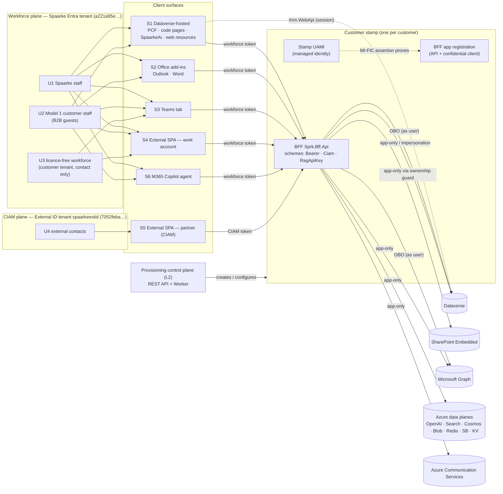
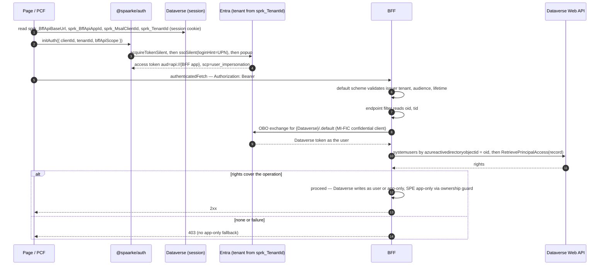
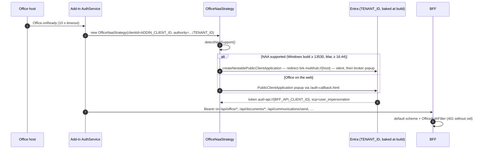
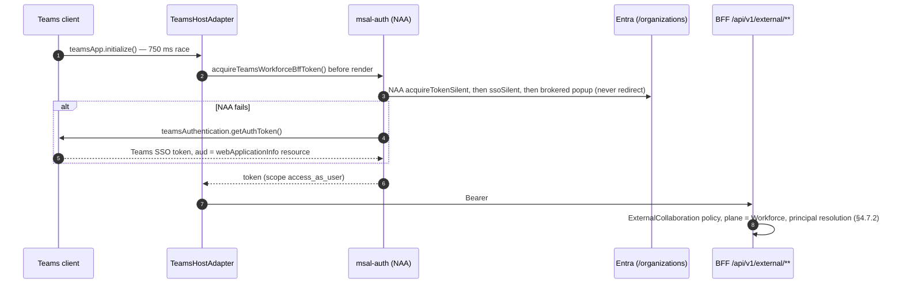
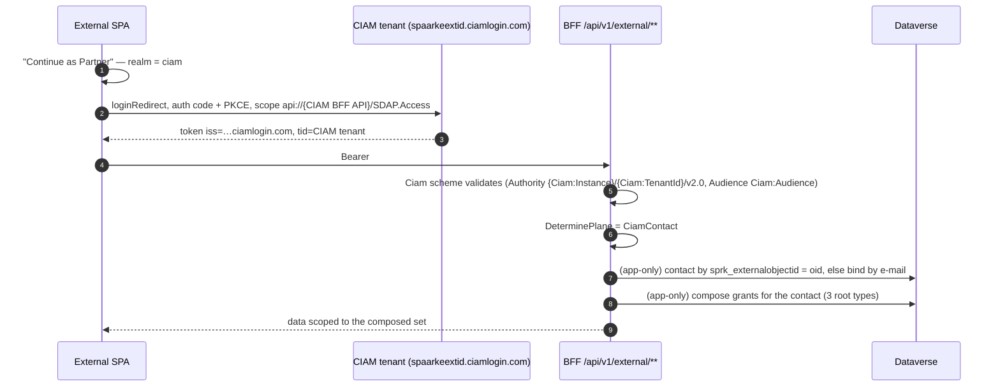
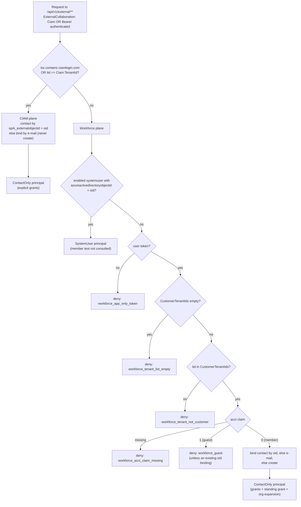
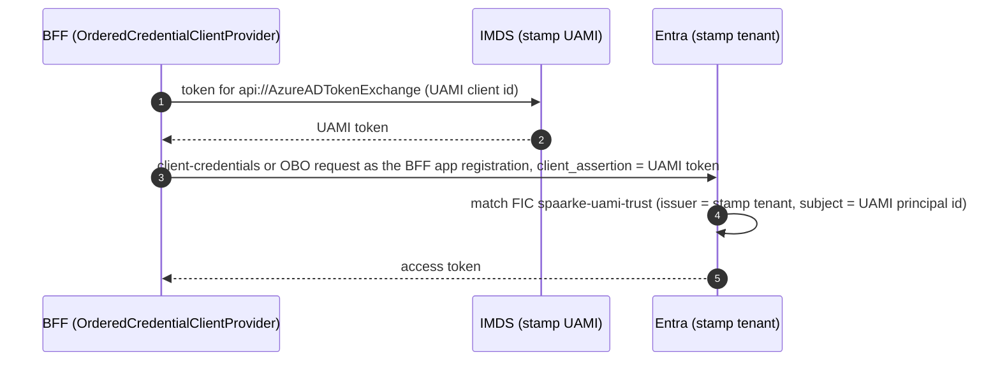

# Spaarke Authentication and Authorization Architecture

> **Status**: DRAFT for owner review (2026-10-09). On sign-off this document becomes the canonical description of how Spaarke authenticates and authorizes every user and service, and the source from which ADR-028, `.claude/patterns/auth/*` and `.claude/constraints/auth.md` are re-derived.
> **Describes**: what the code does at `master` @ `8a9ecaac1`, re-checked against `master` @ `231c5ab2b` on 2026-10-09 (§0.3).
> **Verification companion**: [`projects/spaarke-auth-system-of-record-r1/auth-system-of-record.md`](../../projects/spaarke-auth-system-of-record-r1/auth-system-of-record.md) (the "record") — every statement here traces to a section of the record, its evidence files (`working/a01`–`a09`, `x01`–`x07`) or a cited `path:line`.
> **Governing ADRs**: [ADR-028](../../.claude/adr/ADR-028-spaarke-auth-architecture.md) (auth architecture — partly stale, §7.3), ADR-034 (membership), ADR-008 (endpoint filters).
> **Scope**: every user type (§2) on every client surface, through the BFF (`Sprk.Bff.Api`) to Dataverse, SharePoint Embedded (SPE), Microsoft Graph and the Azure data planes, plus the provisioning control plane and CI/CD identities.

---

## 0. About this document

### 0.1 What it is, and what it is not

This is the architecture: the identity model, the components, the flows, the authorization model and the configuration model, stated as they run. It is written to be read top to bottom by an engineer who has to change auth, and to be cited by ADRs and patterns.

It is **not** the audit. The record holds the provenance of every fact, the user × surface × operation matrix, the ADR-028 rule-by-rule reconciliation, the defect list and the live-test plan. Where this document says something is broken or unproven, it links to the record instead of repeating the detail.

### 0.2 Conventions

- **Code is the authority.** A plain statement is verified in code at the baseline; load-bearing ones cite `path:line`. Path prefixes: `BFF/` = `src/server/api/Sprk.Bff.Api/`, `LIB/` = `src/client/shared/Spaarke.Auth/src/`, `SPA/` = `src/client/external-spa/src/`, `L2/` = `src/server/services/Sprk.Provisioning.ControlPlane.Core/`, `CORE/` = `src/server/shared/Spaarke.Core/`, `DV/` = `src/server/shared/Spaarke.Dataverse/`.
- **⚠ Unproven** marks behaviour the repository cannot prove (real token claims, Entra or host behaviour, non-dev environments). Each carries the live-test id from the record §13 / `live/live-test-plan.md`.
- **Dev:** marks a fact read live from the dev environment on 2026-10-09 (record §8, §13a). Dev values are never the architecture; they appear only where the dev environment diverges from what the code would provision (§6.7).
- **→ Gap H-n / M-n / L-n** points at a defect in the record §11.
- No secret value appears anywhere in this document.

### 0.3 Baseline and drift

The record was verified at `8a9ecaac1`. Master at `231c5ab2b` (84 commits later) was diffed on the auth paths before this draft. The changes that touch auth are additive and do not change any flow described here:

- `LIB/errorGuards.ts` (new, exported from `LIB/index.ts`): `isApiError`, `problemOf`, `isAuthFailure` — guards for the errors `authenticatedFetch` throws (it never returns a non-2xx response). Added to §3.1.
- `DV/DataverseServiceClientImpl.cs` `GetCallersProcessingJobByIdempotencyKeyAsync`: an app-only query restricted to the caller's own rows by an inner join on the initiating `systemuser.azureactivedirectoryobjectid` = caller `oid`.
- `BFF/Infrastructure/DI/OfficeModule.cs` registers `ReconciledEmailFiling` (files an existing unfiled communication to the save's record; depends on `CallerRecordAccessProbe`); `AnalysisServicesModule.cs` registers `DocumentIndexParentResolver` (reads secure flags through `ExternalParticipationService`).
- `AnalysisAuthorizationFilter` / `PlaybookAuthorizationFilter`: 400 bodies changed to ProblemDetails; no authorization change.
- SpaarkeMaster 1.2.1.0 packages the contact alternate key `sprk_externalobjectiduniquekey` on `sprk_externalobjectidkey`, the uniqueness mirror the contact binder already relied on (T255 close-out, `8566eab0f`).
- `Spaarke Basic User` gains `prvAppendTosprk_RecordType_Ref` (Global).
- Task 177 (#1510): an index chunk's parent is resolved to the record that governs the document, because search authorizes a chunk by its parent (`DocumentIndexParentResolver`).
- No route changed its `RequireAuthorization`, `AllowAnonymous` or endpoint-filter wiring.

### 0.4 Keeping it current

When a PR changes `BFF/Infrastructure/DI/AuthorizationModule.cs`, `BFF/Infrastructure/ExternalAccess/**`, `BFF/Infrastructure/Auth/**`, `BFF/Infrastructure/Graph/GraphClientFactory.cs`, `LIB/**`, `SPA/auth/**`, `src/client/office-addins/shared/services/AuthService.ts`, `L2/Handlers/EntraAppReg/**` or the identity sections of `BFF/appsettings.template.json`, update the affected section here and the matching record section in the same PR.

---

## 1. System context

### 1.1 The picture

### 1.2 The architecture in eight statements

1. **The BFF is the single backend** for every client surface. Clients acquire a token for the BFF's API; they never call Graph or SPE directly. Dataverse-hosted pages may also call Dataverse directly with the Dataverse session (`Xrm.WebApi`).
2. **There are two identity planes.** The workforce plane is Entra ID — Spaarke's tenant for Model 1 stamps. The CIAM plane is a separate Microsoft Entra External ID tenant for external contacts. The BFF validates each with its own JwtBearer scheme, and only the collaboration surface `/api/v1/external/**` accepts both (§4.7).
3. **On internal routes, record authorization is Dataverse's answer, asked as the caller.** The BFF exchanges the inbound bearer on-behalf-of (OBO) for a Dataverse token and asks `RetrievePrincipalAccess`. No caller token means deny — there is no app-only fallback (`CORE/Auth/AuthorizationService.cs:54-72`).
4. **On the collaboration surface, authorization is a composed record set.** The caller is resolved to a principal (`SystemUser` or `ContactOnly`), the BFF composes the set of records that principal may read, and reads Dataverse app-only, scoped to that set. The caller token is never exchanged (`BFF/Infrastructure/ExternalAccess/CallerPrincipalResolver.cs:23-25`).
5. **SPE bytes move as the BFF.** Since task 171 every id-keyed document route checks rights in Dataverse as the user, then reads or writes SPE app-only through `SpeContainerOwnershipGuard`. The user's token reaches Graph/SPE on six named surfaces only (§4.9.5).
6. **The BFF's own credential is secret-free.** The stamp's user-assigned managed identity (UAMI) is used directly for app-only data-plane access, and it proves the BFF app registration through a federated identity credential (MI-FIC) wherever a confidential client is needed (OBO, app-only Graph/Dataverse when the MI flag is off) — `BFF/Infrastructure/Auth/OrderedCredentialClientProvider.cs:422-494`.
7. **One BFF app registration per customer**, created by provisioning (H3) in the tenant that hosts the stamp, trusting only that stamp's UAMI (`L2/Handlers/EntraAppReg/GraphAppRegistrationProvisioner.cs:1097-1141,1241-1262`).
8. **Every route declares its authorization.** No `[Authorize]` attributes; each route carries `RequireAuthorization(...)` or `AllowAnonymous()`, and an architecture test fails the build on any route that is anonymous by omission (`tests/Spaarke.ArchTests/RouteAuthorizationGuardTests.cs:35-42`). Authorization beyond the scheme is done by endpoint filters (ADR-008); there is no global authorization middleware.

---

## 2. Identity model

### 2.1 Tenants and planes

| Tenant | What lives there | Plane (BFF term) |
|---|---|---|
| **Spaarke workforce tenant** `a221a95e-6abc-4434-aecc-e48338a1b2f2` | Spaarke staff; Model 1 customer staff as B2B guests; the per-customer BFF app registrations, UAMIs, the client app registrations (Office add-in, PCF client, Teams/Copilot), the L2 identities | **Workforce** — default `Bearer` scheme, `AzureAd` authority |
| **Customer workforce tenants** | Customer staff home accounts. In Model 1 they appear in Spaarke's tenant as guests (U2); licence-free customer users (U3) sign in from here | **Workforce** |
| **CIAM tenant** `spaarkeextid` (`7052feba-bfc4-43e0-b09e-65014b429131`, `spaarkeextid.ciamlogin.com`) | External contacts' local accounts (U4); the External Workspace SPA client and the CIAM-side BFF API registration; the CIAM Graph provisioner app | **CiamContact** — `Ciam` scheme |

**Model 1** — the customer's stamp (BFF app registration, UAMI, Dataverse) lives in Spaarke's tenant, and customer staff are B2B guests there. Every non-`customer-owned-model2` provisioning profile resolves the stamp tenant to Spaarke's (`GraphAppRegistrationProvisioner.cs:1097-1121`; `L2/Handlers/ControlPlaneIdentityOptions.cs:17-24`).

**Model 2** — the `customer-owned-model2` profile, with the stamp in the customer's own tenant and customer staff as native accounts. It is not provisionable today (→ Gap M-9).

### 2.2 User types

| Type | Who | Entra representation | Dataverse representation | BFF principal |
|---|---|---|---|---|
| **U1** | Spaarke staff | Member of Spaarke's tenant | Licensed `systemuser`, matched by `azureactivedirectoryobjectid = oid`; `sprk_isexternal` blank (internal) | Workforce · `SystemUser` |
| **U2** | Model 1 customer staff | B2B guest in Spaarke's tenant, invited by provisioning H11 (`L2/Handlers/UserProvisioning/GraphRestB2BInvitationClient.cs:106-198`). Expected token: `tid` = Spaarke, `acct=1`, guest `oid` ≠ home `oid` — ⚠ Unproven (A2–A4) | Licensed `systemuser` keyed by the guest `oid`, default role `Spaarke Basic User` (`DataverseWebApiGuestUserWriter.cs:237`; `H11UserProvisioningOptions.cs:51`). `sprk_isexternal` is **not** set by code (§5.7) | Workforce · `SystemUser` if the row exists; otherwise the member test (§4.7.2), which denies a Spaarke-`tid` guest |
| **U3** | Licence-free workforce user | Member of a customer tenant, no Dataverse seat | No `systemuser`. A `contact` bound by `sprk_externalobjectid = oid`, created or e-mail-bound on first sign-in only when `tid ∈ WorkforceIdentity:CustomerTenantIds` and `acct = "0"` (`BFF/Infrastructure/ExternalAccess/ContactIdentityBinder.cs:163-186`) | Workforce · `ContactOnly`. Every internal route that needs a systemuser denies |
| **U4** | External contact | Local account in the CIAM tenant, created admin-side by `CiamUserProvisioningService` | `contact` with `sprk_externalobjectid` = CIAM `oid`; bound by e-mail only, never created on sign-in (`ContactIdentityBinder.cs:190-202`) | CiamContact · `ContactOnly`. Authenticates only on `/api/v1/external/**`; 401 everywhere else |
| **U5** | Model 2 customer staff | Native account in the customer's tenant | Would be a `systemuser` in a customer-tenant Dataverse | Would behave as U1 on a Model 2 stamp. Not provisionable; no code branches on tenancy model |
| **U6** | Services and non-user callers | Managed identities, app registrations, webhook senders, API-key holders (§2.3) | Application users | Outbound callers; inbound only via keyless proof, the RAG API key and the HMAC webhooks |

**Contact binding columns.** `contact.sprk_externalobjectid` holds the bound `oid` and is field-security protected (the Identity Link FLS profiles that H7b maintains). `contact.sprk_externalobjectidkey` is an **unsecured** uniqueness mirror of it, because Dataverse cannot key a secured column (`L2/Handlers/SecureRecordSetup/SecureRecordSetupProcedure.cs:109`). It carries the alternate key `sprk_externalobjectiduniquekey`, so one `oid` binds to at most one contact (`BFF/Infrastructure/ExternalAccess/ContactBindingDecision.cs:1102-1107`; packaged in SpaarkeMaster 1.2.1.0).

### 2.3 Service identities

Per stamp unless stated. Concrete dev ids are in the record §8.

| Identity | Kind | Used for | Credential |
|---|---|---|---|
| **Stamp UAMI** `mi-spaarke-{customerId}-{env}` | User-assigned managed identity on the BFF App Service | App-only access to Azure data planes, Dataverse and Graph (when `Graph:ManagedIdentity:Enabled`); the subject of the BFF app registration's FIC | IMDS — no secret |
| **BFF app registration** `spaarke-bff-api-{customerId}` | Entra app (API + confidential client) | The API audience clients request; the confidential client for OBO and (MI flag off) app-only | MI-FIC `spaarke-uami-trust`; no secret (`RequireSecretFreeIdentity: true`) |
| **L2 UAMI** | Managed identity of the control-plane hosts | Provisioning: Graph, Dataverse, ARM; keyless-proof caller; FIC subject of the SPE owning app and the Exchange Admin app | IMDS |
| **SPE container-type owning app** (Model 1: "Spaarke SPE Model 1 Owner") | Entra app | Owns the SPE container type | MI-FIC from the L2 UAMI |
| **Exchange Admin app** | Entra app | Exchange RBAC-for-Applications setup (H14a) | MI-FIC from the L2 UAMI |
| **CIAM Graph provisioner** | Entra app in the CIAM tenant | Creates CIAM user accounts (`CiamUserProvisioningService`) | Certificate from Key Vault (`ciam-graph-provisioner-cert`) |
| **Power BI service principal** | Entra app | Reporting App-Owns-Data embed tokens | Client secret (`PowerBi:ClientSecret`, allow-listed) |
| **GitHub Actions deploy app** | Entra app | CI/CD deploys | OIDC FICs (`repo:spaarke-dev/spaarke:…`) |
| **ACS identities** | ACS-native users (not Entra) | One BFF service chat user per process; per-participant users mapped from `systemuser`/`contact.sprk_communicationuserid` | ACS user access tokens minted server-side |
| **Webhook / API-key callers** | Shared-secret callers | Graph change notifications, Event Grid, consent callback, RAG bulk enqueue | HMAC or API key (§4.10) |

### 2.4 Token claims the BFF relies on

| Claim | Read by | Meaning |
|---|---|---|
| `oid` (or the `…/objectidentifier` URI form) | `CallerResolution.ResolveObjectId` (`BFF/Infrastructure/Authentication/CallerResolution.cs:89-95`) | The caller's identity everywhere. **Never** `sub` or `NameIdentifier` |
| `tid` | `TenantResolution.ResolveTenantId` (`TenantResolution.cs:39-69`); plane selection; member test; keyless proof | Issuing tenant |
| `iss` | `DeterminePlane` | Contains `ciamlogin.com` → CIAM plane |
| `acct` | Member test | `0` member / `1` guest. An **optional claim**: H3 adds it to every stamp app (T255) |
| `aud` | JwtBearer validation | Must be one of the configured audiences (§4.7.1) |
| `scp` / `idtyp` / `roles` | `CallerIdentity.FromPrincipal` (`CORE/Auth/CallerIdentity.cs:229-322`); admin, reporting and keyless-proof gates; Tier-1 module entitlement | Delegated vs application caller; app roles |
| `preferred_username` → `upn` → `email` | CIAM principal strategy | E-mail used to bind a CIAM `oid` to an existing contact |

Whether the real tokens use short or URI claim names (`MapInboundClaims`) is ⚠ Unproven (A1). The code accepts both.

---

## 3. Component catalogue

Each table lists the component, where it lives, what it is responsible for, and what configures it. Grouped by layer.

### 3.1 Client — `@spaarke/auth` v2 (`src/client/shared/Spaarke.Auth/`)

The one sign-in library for Dataverse-hosted code pages, PCFs and solutions, and — through a direct construction — the Office add-ins. The external SPA deliberately does **not** use it (ADR-028 A2).

| Component | Location | Responsibility | Configuration |
|---|---|---|---|
| `initAuth()` | `LIB/initAuth.ts` | One provider per JavaScript bundle (`:8`); coalesces same-`clientId` calls; replaces a provider stuck on `/organizations` once a tenant is known (`:111-133`); eager first `getAccessToken()` (`:57-59`). Always builds the Browser strategy (`:143`) — there is no `strategy` option | `IAuthConfig`: `clientId`, `tenantId`, `bffApiScope`, `bffBaseUrl`, `requireSilentOnly` |
| `resolveConfig()` | `LIB/config.ts:101-162` | `clientId` (config → `window.__SPAARKE_MSAL_CLIENT_ID__` → throw); authority `https://login.microsoftonline.com/{tenant}`; on a Dataverse host an unresolved tenant throws `AuthError('tenant_unresolved')`, elsewhere it falls back to `/organizations` with a console error | — |
| Tenant resolution | `LIB/config.ts:36-81`; `LIB/tenant.ts:39-47`; `LIB/resolveRuntimeConfig.ts:559-603` | Precedence: explicit `authority` → explicit `tenantId` → `window.__SPAARKE_TENANT_ID__` → `localStorage['__spaarke_rtc__']` (≤ 60 min) → Xrm `organizationSettings.tenantId` → `sprk_TenantId` env var → anonymous `GET {bff}/api/config/client`. Rejects `common`, `organizations`, `consumers`, the MSA tenant and the empty GUID | Since task 123 every consumer passes `tenantId` explicitly |
| `resolveRuntimeConfig()` | `LIB/resolveRuntimeConfig.ts:304-386,456-461` | Reads `sprk_BffApiBaseUrl`, `sprk_BffApiAppId`, `sprk_MsalClientId`, `sprk_TenantId` from Dataverse with the session cookie (no bearer) | Dataverse env vars (§6.2) |
| `SpaarkeAuthProvider` | `LIB/SpaarkeAuthProvider.ts` | Holds the strategy; proactive refresh every 4 min while a token is cached (`:242-261`); `logout()` broadcasts on `BroadcastChannel('spaarke-auth-events')` (`:114-122`) | — |
| `BrowserMsalStrategy` | `LIB/strategies/BrowserMsalStrategy.ts` | MSAL `PublicClientApplication`, `localStorage` + auth-state cookie (`:137-156`); account pick: last page account → the one cached account whose tenant matches the authority → the single account (`:278-290`); ladder `acquireTokenSilent` → `ssoSilent(loginHint = UPN)` → `acquireTokenPopup` unless `requireSilentOnly` (`:162-218`); accepts a token only with ≥ 5 min left (`:306-324`) | — |
| `OfficeNaaStrategy` | `LIB/strategies/OfficeNaaStrategy.ts` | Nested app authentication (`createNestablePublicClientApplication`, redirect `brk-multihub://{host}`) where supported, else a popup `PublicClientApplication` on `/auth-callback.html`; `sessionStorage`, no cookie (`:86-149,378-463`); ladder silent → popup | `fallbackRedirectUri` |
| `authenticatedFetch` | `LIB/authenticatedFetch.ts:31-82` | Adds `Authorization: Bearer`; on 401 clears the in-memory cache and retries up to 3 times; throws `AuthError('auth_exhausted')` or `ApiError` — never returns a non-2xx response | — |
| Error guards | `LIB/errorGuards.ts` (master `231c5ab2b`) | `isApiError(err, …statuses)`, `problemOf(err)`, `isAuthFailure(err)` — structural checks that survive duplicate bundled copies of the library | — |
| `useAuth()`, `createCodePageAuthInitializer` | `LIB/` | Convenience accessors over the initialized provider (`useAuth` is a plain function, not a React hook) | — |

PCFs read the same four env vars through `getEnvironmentVariable(context.webAPI, …)` (`src/client/pcf/shared/utils/environmentVariables.ts:151-211`) and call `initAuth({ tenantId })`; six controls let a manifest `clientAppId` override `sprk_MsalClientId` (→ Gap L-8).

### 3.2 Client — other sign-in implementations

| Component | Location | Responsibility | Configuration |
|---|---|---|---|
| Office add-in `AuthService` | `src/client/office-addins/shared/services/AuthService.ts:80-104` | Builds `OfficeNaaStrategy` + `SpaarkeAuthProvider` directly (bypassing `initAuth`); pins `login.microsoftonline.com/{TENANT_ID}`; scope `api://{BFF_API_CLIENT_ID}/user_impersonation` | Build-time `ADDIN_CLIENT_ID`, `TENANT_ID`, `BFF_API_CLIENT_ID`, `BFF_API_BASE_URL` (webpack refuses a build without the tenant) |
| Add-in manifest packaging | `src/client/office-addins/packaging/mergeUnifiedManifest.js:265-269,401-408` | Refuses a `webApplicationInfo` entry in the unified manifest — that entry made customer tenants consent to Spaarke's single-tenant app (AADSTS700016) | — |
| External SPA MSAL config | `SPA/auth/msal-config.ts:78-159` | Two planes from one module: CIAM singleton (`VITE_MSAL_AUTHORITY`, `knownAuthorities`, `sessionStorage`, `:94-138`) and workforce config on `/organizations` with an optional authority override (`:147-159`) | `VITE_MSAL_*`, `VITE_TEAMS_MSAL_CLIENT_ID`, `VITE_TEAMS_BFF_SCOPE` (baked at build) |
| Realm chooser / standalone plane | `SPA/main.tsx:100-143`; `SPA/auth/standalone-plane.ts:51-74`; `SPA/auth/realm.ts` | In a browser, choose "work account" (workforce) or "partner" (CIAM); remember the realm in `sessionStorage['spaarke.ext.realm']` | — |
| Teams host adapter | `SPA/host/TeamsHostAdapter.ts:92-115,221-240` | Detects Teams (750 ms race on `teamsApp.initialize()`), selects the workforce strategy, acquires once before render; never attempts CIAM in Teams | — |
| Teams token acquirer | `SPA/auth/msal-auth.ts:268-399` | NAA `acquireTokenSilent` → `ssoSilent` → brokered `acquireTokenPopup`; on any NAA error falls back to `teamsAuthentication.getAuthToken()` | — |
| `AuthGuard`, `bff-client` | `SPA/components/AuthGuard.tsx:40-94`; `SPA/auth/bff-client.ts:235-279` | Redirect sign-in in the browser (no gate in Teams); adds the bearer, retries once on 401. Runtime seams `setActiveBffTokenAcquirer` / `setActiveLoginScope` select the plane's acquirer | — |
| Classic web resources with their own MSAL (9) | `src/solutions/webresources/sprk_bff_auth.js`; `SpaarkeMaster/WebResources/*` | Legacy: MSAL.js from CDN, own `PublicClientApplication`, raw bearer header. Source and packaged copies differ | env vars in source; hard-coded ids in some packaged copies (→ Gap H-5) |
| Copilot plugin OAuth | `src/solutions/CopilotAgent/spaarke-bff-openapi.yaml:1295-1308` | Declares the Copilot OAuth-vault auth-code flow against the Spaarke tenant for `api://{bff}/access_as_user` | Teams Developer Portal OAuth registration (not in repo) |

### 3.3 BFF — inbound

| Component | Location | Responsibility | Configuration |
|---|---|---|---|
| Middleware pipeline | `BFF/Infrastructure/DI/MiddlewarePipelineExtensions.cs:21-170` | `UseCors` → security headers → exception handler → token logger → `UseAuthentication` → `UseAuthorization` → `AuditEnrichmentMiddleware` (`oid`, `appid`, `obo`, `tenantId`, `correlationId`) → rate limiter → endpoint filters | — |
| `AuthorizationModule` — schemes | `BFF/Infrastructure/DI/AuthorizationModule.cs:49-167` | Default `Bearer` = `AddMicrosoftIdentityWebApi("AzureAd")` (Microsoft.Identity.Web 4.14.2); `Ciam` JwtBearer (`Authority = {Ciam:Instance}/{Ciam:TenantId}/v2.0`, `Audience = Ciam:Audience`); `RagApiKey` header scheme. `PostConfigure` merges `AzureAd:Audience` ∪ `ValidAudiences` ∪ `AgentToken:CopilotAudience` (`:106-126`). `OnAuthenticationFailed` logs `aud`/`iss`/`appid` (`:143-166`) | `AzureAd:*`, `Ciam:*`, `Rag:ApiKey`, `AgentToken:CopilotAudience` |
| `AuthorizationModule` — policies | `:224-418` | `FallbackPolicy` (authenticated); `SystemAdmin` (`roles` ∋ `Admin`/`SystemAdmin`); `ExternalCollaboration` (schemes `{Ciam, Bearer}`); `RagApiKey`; `CiamExternal` (unused); 23 `can*` resource policies (unused, → Gap M-12) | — |
| `CorsModule` | `BFF/Infrastructure/DI/CorsModule.cs:17-132` | Absolute-HTTPS allow-list, never `*`; also allows hosts ending `.dynamics.com`, `.powerapps.com`, `.powerappsportals.com`; empty list outside Development throws | `Cors:AllowedOrigins` |
| Caller primitives | `CallerResolution.cs:89-95`; `TenantResolution.cs:39-69`; `CORE/Auth/CallerIdentity.cs:229-322` | Caller `oid`, `tid`, and UserDelegated / Application / Indeterminate classification | — |
| `CallerPrincipalAuthorizationFilter` + `CallerPrincipalResolver` | `BFF/Infrastructure/ExternalAccess/CallerPrincipalResolver.cs:386-406,456-514,617-637` | Collaboration surface: select the plane from validated claims; resolve a `CallerPrincipal` through the plane's strategy; 401/403 when none | `Ciam:TenantId` |
| `WorkforcePrincipalResolver` | `BFF/Infrastructure/ExternalAccess/WorkforcePrincipalResolver.cs:88-233` | Workforce strategy: `systemuser` by `oid` first (cached 10 min); else contact via the member test | `IdentityLink:Reconciliation:WritesEnabled` |
| Workforce member test | `BFF/Infrastructure/ExternalAccess/WorkforceIdentityOptions.cs:182-240` | Fixed-order decision over (token kind, list, `tid`, `acct`) — §4.7.2 | `WorkforceIdentity:CustomerTenantIds` |
| `ContactIdentityBinder` | `BFF/Infrastructure/ExternalAccess/ContactIdentityBinder.cs:163-202` | Bind an `oid` to a contact: workforce `Member` → e-mail-bind-and-create; CIAM → e-mail-bind only | — |
| Endpoint filters (35 under `BFF/Api/Filters`) | `BFF/Api/Filters/*` | Record filters (§5.2), AI filters (§5.9), Office filters, admin/reporting/registration filters, keyless proof, webhook signatures | per filter |
| `OfficeAuthFilter` | `BFF/Api/Filters/OfficeAuthFilter.cs:76-134` | 401 without `oid` on `/api/office/*` | — |
| `KeylessProofAuthorizationFilter` | `BFF/Api/Filters/KeylessProofAuthorizationFilter.cs:101-123` | Admits only `tid == AzureAd:TenantId`, `aud ∈ {ClientId, api://ClientId}`, no `scp`, role `Provisioning.KeylessProof` | — |
| `ApiKeyAuthenticationHandler` | `BFF/Infrastructure/Authentication/ApiKeyAuthenticationHandler.cs:47-104` | `X-Api-Key` compared with `FixedTimeEquals`; principal has no `oid`/`tid` | `Rag:ApiKey` |
| `WebhookSignatureFilter` | `BFF/Api/Filters/WebhookSignatureFilter.cs:86-180` | HMAC-SHA256 `X-Hub-Signature-256`, fail closed on an empty key, `?validationToken=` handshake passes | `Communication:WebhookSigningKey`, `Compose:Webhook:SigningKey` |
| Route guard tests | `tests/Spaarke.ArchTests/RouteAuthorizationGuardTests.cs:35-42`; `…Ledger.cs:1037-1058` | Every route declares authorization; the anonymous set is pinned | — |

### 3.4 BFF — outbound credentials

| Component | Location | Responsibility | Configuration |
|---|---|---|---|
| `ManagedIdentityCredentialFactory` + shared `TokenCredential` | `BFF/Program.cs:47-49`; `BFF/Infrastructure/Auth/ManagedIdentityCredentialFactory.cs:42-66` | One process-wide `DefaultAzureCredential` pinned to the UAMI client id and tenant, for app-only data-plane access | `Graph:ManagedIdentity:ClientId` → `ManagedIdentity:ClientId`; `AZURE_TENANT_ID` → `TENANT_ID` |
| `OrderedCredentialClientProvider` | `BFF/Infrastructure/Auth/OrderedCredentialClientProvider.cs:211-274,357-368,422-494` | The single source of the BFF's confidential client (MSAL CCA): tries `ManagedIdentityFederated` → `KeyVaultCertificate` → `ClientSecret` in configured order; caches CCAs keyed `tenant|client|kind|fingerprint` | `Graph:Credentials:Order`, `RequireSecretFreeIdentity` |
| `ManagedIdentityAssertionProvider` | `BFF/Infrastructure/Auth/ManagedIdentityAssertionProvider.cs:57-119` | Gets a UAMI token for `api://AzureADTokenExchange` and presents it as the client assertion (MI-FIC) | UAMI client id |
| `IdentityConfigurationValidator` | `BFF/Configuration/IdentityConfigurationValidator.cs:78-297` | Fails startup when the UAMI id equals the app id, MI-FIC has no UAMI id, no credential is obtainable, or `ClientSecret` is in the order with `RequireSecretFreeIdentity` outside Development | — |
| `GraphClientFactory` | `BFF/Infrastructure/Graph/GraphClientFactory.cs:117-367` | `ForUserAsync` = Graph OBO (`:251-299`); `ForApp()` = app-only (UAMI or CCA, `:138-194`) | `Graph:ManagedIdentity:Enabled` |
| `GraphTokenCache` | `BFF/Services/GraphTokenCache.cs:38-46` | Redis cache of Graph OBO results keyed by the SHA-256 of the user token, 55 min | Redis |
| `SpeContainerOwnershipGuard` | `BFF/Infrastructure/Graph/SpeContainerOwnershipGuard.cs:116-132` | The only door to app-only SPE: `ForOwnedContainerAsync` / `ForTypeWideOperation`; ArchTest-enforced (`tests/Spaarke.ArchTests/TenantIsolation/SpeAppOnlyContainerGuardTests.cs`) | owned container ids |
| Dataverse app-only clients | `DV/DataverseServiceClientImpl.cs:89-186`; `DV/DataverseWebApiService.cs:96-142`; `DataverseWebApiClient` | SDK `ServiceClient` and Web API clients acting as the BFF (UAMI when the MI flag is on, else the app registration) | `Dataverse:ServiceUrl`, MI flag |
| Dataverse OBO clients | `DV/DataverseAccessDataSource.cs:225-272`; `BFF/Infrastructure/Dataverse/DataverseUserClient.cs:82-215`; `CallerRecordAccessProbe.cs:555-606` | OBO to `{ServiceUrl}/.default`; no app-only fallback | — |
| `DataverseImpersonation` | `DV/DataverseImpersonation.cs:64-124` | Adds `MSCRMCallerID = systemuserid` to an app-only request; `Guid.Empty` throws; one header per request | — |
| `CiamGraphClientFactory` | `BFF/Infrastructure/Graph/CiamGraphClientFactory.cs:66-145` | App-only Graph in the CIAM tenant with the provisioner certificate | `Ciam:GraphProvisioner:*` |
| `ReportingEmbedService` | `BFF/Api/Reporting/ReportingEmbedService.cs:33-191` | Power BI SP token (client secret), embed tokens cached per caller | `PowerBi:*` |
| ACS identity | `BFF/Services/Communication/Acs/AcsIdentityService.cs:52-126`; `AcsServiceChatCredential.cs:41-88` | Creates ACS users through the UAMI; mints chat tokens server-side; never returned to clients | `Communication:Acs:*` |
| `AgentTokenService` | `BFF/Api/Agent/AgentTokenService.cs` | OBO for the Copilot agent with a Redis cache — **registered, no caller** (dormant) | `AgentToken:*` |
| Credential guard tests | `CredentialGuardTests.cs:66-169`; `CredentialCensusTests.cs:72-136` | No `.WithClientSecret(` outside an allow-list; confidential-client census | — |

### 3.5 BFF — authorization data

| Component | Location | Responsibility |
|---|---|---|
| `AuthorizationService` + `OperationAccessPolicy` | `CORE/Auth/AuthorizationService.cs:54-72`; `CORE/Auth/OperationAccessPolicy.cs` | Map an operation to required Dataverse rights and decide from the caller's access snapshot |
| `DataverseAccessDataSource` + `CachedAccessDataSource` | `DV/DataverseAccessDataSource.cs:313-331,763-862`; `BFF/Infrastructure/Caching/CachedAccessDataSource.cs` | Caller's rights on a document via OBO → `systemuser` lookup → `RetrievePrincipalAccess`; 60 s snapshot cache |
| `CallerRecordAccessProbe` | `BFF/Infrastructure/ExternalAccess/CallerRecordAccessProbe.cs:41-55,555-606` | Entity-generic rights as the caller (OBO → `WhoAmI` → RPA); any failure → `None` |
| `AccessibleRecordSetService` | `BFF/Infrastructure/ExternalAccess/AccessibleRecordSetService.cs` | Composes the collaboration-surface record set per principal kind (§5.3) |
| `MembershipResolverService` (ADR-034) | `BFF/Services/Ai/Membership/MembershipResolverService.cs` | Approximates a systemuser's accessible records from lookup columns and BU/role/team patterns |
| `ExternalParticipationService` | `BFF/Infrastructure/ExternalAccess/ExternalParticipationService.cs` | Reads explicit grants (`sprk_externalrecordaccess`), standing grants and effective record flags |
| `EffectiveRootFlags`, `SecureRootInheritance` | `BFF/Infrastructure/ExternalAccess/EffectiveRootFlags.cs:38-131`; `SecureRootInheritance.cs:183-210` | Fold a record's own access flags with its filing ancestors' |
| `ModuleEntitlementResolver` | `BFF/Infrastructure/ExternalAccess/ModuleEntitlementResolver.cs:89-116` | Tier-1: which modules a principal may use |
| `ExternalModuleDataEndpoints` + `ExternalModuleRegistry` | `BFF/Api/ExternalAccess/ExternalModuleDataEndpoints.cs:223-396`; `ExternalModuleRegistry.cs:337-349` | Tier-2: inject the record scope into FetchXML, re-filter rows, strip to readable columns |
| Grant lifecycle and delegation | `ExternalGrantLifecycle.cs`; `DelegationRuleFilter.cs:158-204`; `ContactGrantorAuthorizationFilter.cs:160-343`; `GrantExternalAccessEndpoint` | Create/revoke explicit grants, capped by the grantor's rights |
| `AssignedAccessMaterializer` | `AssignedAccessMaterializer.cs:130-150,1448-1470` | Turns "Assigned *" lookups into Collaborate grants or POA shares |
| `SpeContainerMembershipSync`, `OfficeEditAccessService` | `SpeContainerMembershipSync.cs:95-237`; `BFF/Services/Documents/OfficeEditAccessService.cs:110-160` | SPE container writers: standing BU writers and just-in-time Office edit writers |
| `SystemUserIdentityResolver` | `BFF/Services/Identity/SystemUserIdentityResolver.cs:144-316` | `oid` → `systemuser`, and the internal/external classification (`sprk_isexternal`) |
| `RecordOwnershipResolver` | `BFF/Services/Dataverse/RecordOwnershipResolver.cs` | Owner of BFF-created child records (target record's BU default team) |

### 3.6 Provisioning control plane (L2)

| Step | Location | Auth responsibility |
|---|---|---|
| **H3** Entra app registration | `L2/Handlers/EntraAppReg/GraphAppRegistrationProvisioner.cs` | Creates `spaarke-bff-api-{customerId}` (`:180`): identifier `api://{appId}`, scope `user_impersonation` only (`:523`), SPA redirect = customer Dataverse origin, pre-authorized client = the production Office add-in, `acct` optional claim, FIC `spaarke-uami-trust` → stamp UAMI, role `Provisioning.KeylessProof` assigned to the L2 principal (not for Model 2). `AssertFicTenancy` refuses a cross-tenant FIC (`:1241-1262`). Default audience `AzureADMultipleOrgs` (`EntraAppRegOptions.cs:57`) |
| **H4 / H4b** App Service settings | `L2/Handlers/BulkAppSettings/H4bBulkAppSettingsHandler.cs:483-527` | Writes the BFF's identity settings; a plain per-environment value wins over a Key Vault reference for `AzureAd__*`; writes no secret slots |
| **H7** environment variables | — | Writes the `sprk_*` env vars (`sprk_MsalClientId` defaults to the H3 app id) |
| **H7b** Secure Record setup | `L2/Handlers/SecureRecordSetup/` | Secure Record BU/team/role and FLS memberships; signs in as the BFF app registration (→ Gap M-17 for what it omits) |
| **H8** SPE container type | `L2/Handlers/SpeContainer/H8SpeContainerHandler.cs:935-943` | Container-type grants: UAMI application `full`, BFF app delegated `full` |
| **H10** Dataverse app users + Graph roles | `L2/Handlers/DataverseAppUserGraphParity/` | Application users for the app and UAMI (default role System Administrator, `H10…Options.cs:23`); 11 of 15 Graph app roles to the stamp UAMI (`GraphRestAppRoleGranter.cs:55-110`) |
| **H11** user provisioning | `L2/Handlers/UserProvisioning/` | Invites B2B guests, adds them to the environment security group, creates the `systemuser` by guest `oid`, associates `Spaarke Basic User` |
| **H13** end-to-end acceptance | `L2/Handlers/E2EAcceptance/E2EValidationRunner.cs:280-340` | Keyless proof: calls `POST /api/platform/keyless-proof` app-only as the L2 UAMI |
| **H14a/b/c** integration wiring | `L2/Handlers/IntegrationWiring/` | Exchange RBAC for the UAMI's `Mail.*` roles; Graph and Dataverse webhook subscriptions (→ Gap H-3: wrong routes) |
| Credentials | `L2/Handlers/Credentials/WorkerDataverseCredentialFactory.cs:135-274` | Worker signs in as the customer BFF app via MI-FIC (`ClientSecret` fallback allow-listed with a sunset of 2026-11-23) |
| Tenant rules | `L2/Models/CustomerWorkforceTenantsRule.cs:22-23,100-105`; `ReservedTenantsOptions.cs` | The customer workforce tenant list is required and may not contain Spaarke's or the CIAM tenant |

---

## 4. Flows

### 4.1 Dataverse-hosted client → BFF → Dataverse as the caller (S1a, S1b)

PCF controls, code pages and solutions (SpaarkeAi, LegalWorkspace, Reporting, SPE Admin, wizards) inside a Dataverse session.

Notes:
- **Authority** is always `https://login.microsoftonline.com/{tenant}`. On a Dataverse host an unresolved tenant throws `tenant_unresolved` instead of falling back to `/organizations` (`LIB/config.ts:134-140`).
- **Scope** is `api://{sprk_BffApiAppId}/user_impersonation`; the MSAL client is `sprk_MsalClientId`.
- Before MSAL, SpaarkeAi and LegalWorkspace call two anonymous endpoints: `GET /api/config` (public bundle from `PublicConfig:*`) and `GET /api/config/client` (`msalClientId = AzureAd:ClientId`, authority, scope) — `BFF/Api/ConfigEndpoints.cs:60-167`.
- Popup-hosted pages set `requireSilentOnly: true`.
- `logout()` does not invalidate the server-side OBO caches.
- That Dataverse honours the session cookie from a web-resource iframe for the env-var read is ⚠ Unproven (D7).

**Legacy: classic web resources.** Nine classic scripts run their own MSAL.js outside the library: `bff_auth.js`-based scripts (silent → `ssoSilent`, no popup, authority taken verbatim from `/api/config/client`) and per-script `PublicClientApplication`s (`sessionStorage`, silent → `ssoSilent` → popup). They are outside ADR-028's library rules and carry hard-coded identifiers in some packaged copies (→ Gap H-5, H-4). New code must not add to them.

### 4.2 Office add-ins (S2)

- The add-in client is a **single-tenant** registration in Spaarke's tenant. The tenant, the BFF audience and the BFF URL are **baked at build** (`deploy-office-addins.yml:66-69`).
- The unified manifest carries **no `webApplicationInfo`** (`mergeUnifiedManifest.js:265-269,401-408`). Sign-in is MSAL (NAA or popup), not Office SSO.
- `AuthService` builds the provider directly, so `getAuthProvider()`, `authenticatedFetch` and `useAuth()` are unavailable in the add-in; it uses `authenticatedJsonFetch` (one 401 retry).
- The eager first acquire can open a popup without a user gesture on Office on the web; `OfficeNaaStrategy` takes `accounts[0]` with no tenant filter (→ Gap M-3).
- Whether the broker in a home-tenant Office presents a Model 1 guest's Spaarke-tenant account is ⚠ Unproven (A3, F2).

### 4.3 Teams personal tab (S3)

- Client registration today = the BFF's own registration, used as a **multitenant** public client on `/organizations` with no tenant pin or `domainHint` (`SPA/auth/msal-config.ts:147-159`). The Teams manifest `webApplicationInfo` names the same app and a resource `api://{SPA host}/{app}` (`appPackage/manifest.json:41-44`).
- The SSO-fallback audience is accepted only if it is listed in `AzureAd:ValidAudiences`. Dev: it is listed by hand; the template does not carry it (→ Gap M-8).
- Teams never uses the CIAM plane (`TeamsHostAdapter.ts:221-240`). There is no sign-out in Teams.
- Which tenant mints a guest's token (home or Spaarke) is decided by the Teams-signed-in identity — ⚠ Unproven (A4).
- Stamp apps created by H3 expose only `user_impersonation`, while the tab requests `access_as_user`, so a stamp app cannot serve the tab as built (record §12a item 5). Model 1 client sign-in for Teams is an **open decision** (§8.2).

### 4.4 External SPA, work account in a browser (S4)

1. `StandaloneBootstrap` reads the stored realm; with none it shows the realm chooser (`SPA/main.tsx:100-143`).
2. "Sign in with your work account" builds a fresh `PublicClientApplication` on `/organizations` (`sessionStorage`) and redirects (`SPA/auth/standalone-plane.ts:56-59`; `SPA/components/AuthGuard.tsx:66-94`).
3. Scope `api://{BFF app}/access_as_user`. The user's home tenant mints the token.
4. Per call: `acquireTokenSilent`, then `acquireTokenRedirect` on interaction; `bffApiCall` retries once on 401.
5. Server side: identical to S3 (§4.7).

### 4.5 External SPA, partner sign-in (S5, CIAM)

- CIAM contacts reach **only** `/api/v1/external/**`. Every other route uses the default scheme alone and returns 401.
- Contacts are never created at sign-in; an admin flow creates the CIAM account and the contact first (`ContactIdentityBinder.cs:190-202`).
- Sign-out clears the realm and calls `logoutRedirect` (`SPA/App.tsx:225-229`).
- Whether CIAM tokens carry a GUID `aud` (v2 tokens on the CIAM API registration) is ⚠ Unproven (B4). Dev: `Ciam:Audience` is the GUID form.

### 4.6 M365 Copilot agent (S6)

1. Copilot's OAuth vault runs an auth-code flow against Spaarke's tenant for `api://{BFF app}/access_as_user` (`src/solutions/CopilotAgent/spaarke-bff-openapi.yaml:1295-1308`).
2. The BFF's default scheme accepts the Copilot audience because `AgentToken:CopilotAudience` is merged into `ValidAudiences` (`AuthorizationModule.cs:106-126`).
3. `AgentAuthorizationFilter` requires `oid` + `tid`; its audience/app-role check is a TODO (`BFF/Api/Agent/AgentAuthorizationFilter.cs:80-81`, → Gap M-4).
4. The agent routes call the chat stack, which uses OBO as the user (`AgentEndpoints.cs:238-250`). `AgentTokenService` is dormant.

The Copilot package hard-codes the dev server and tenant (→ Gap H-6). Vault registration consent is ⚠ Unproven (A6).

### 4.7 Inbound validation and principal resolution

#### 4.7.1 Token validation

| Check | Default `Bearer` scheme | `Ciam` scheme |
|---|---|---|
| Authority / signing keys | `AzureAd:Instance` + `AzureAd:TenantId` | `{Ciam:Instance}/{Ciam:TenantId}/v2.0` |
| Audience | `AzureAd:Audience` ∪ `AzureAd:ValidAudiences` ∪ `AgentToken:CopilotAudience` | `Ciam:Audience` |
| Issuer | **Not configured in code** (no `ValidIssuers` or `IssuerValidator`). Behaviour is Microsoft.Identity.Web's for the configured tenant. Whether a home-tenant token (Model 1 guest from home, Model 2) is accepted is ⚠ Unproven (J1) | Validated against the CIAM authority; `ValidIssuer` not set |
| Routes | Every route except the ones below | Only the `ExternalCollaboration` policy, used by `/api/v1/external/**` |

`AuthorizationModule.cs:49-167`. `RagApiKey` authenticates `POST /api/ai/rag/enqueue-indexing` only.

#### 4.7.2 Collaboration surface — plane selection and the workforce member test

- Plane selection reads validated claims only; client input is never consulted (`CallerPrincipalResolver.cs:386-406`).
- Member test: `WorkforcePrincipalResolver.cs:111-210`; `WorkforceIdentityOptions.cs:182-240`; `ContactIdentityBinder.cs:163-186`. Every outcome other than `Member` resolves only through an existing `oid` binding, otherwise it denies with the code shown.
- Neither strategy exchanges the caller token. All reads on this surface are app-only under the BFF identity, scoped to the composed set (§5.3).
- **Consequence for Model 1.** On an L2-provisioned stamp the customer tenant list can never contain Spaarke's tenant (`L2/Models/CustomerWorkforceTenantsRule.cs:22-23,100-105`). So a Spaarke-`tid` guest with no `systemuser` is always `ForeignTenant`. The designed contact-only path for customer staff is "home-tenant token + `acct=0`" — exactly the token shape whose acceptance by the default scheme is ⚠ Unproven (J1, A4). Dev lists Spaarke's own tenant, which a stamp cannot (§6.7).

#### 4.7.3 Internal routes

Internal routes are Workforce-only. The filter reads `oid` and `tid`; the record decision is Dataverse's, asked as the caller (§5.2). U3 contact-only callers authenticate on these routes but fail wherever a `systemuser` or OBO step runs (`caller_not_a_dataverse_user` → 403).

### 4.8 Route families and how they authenticate

| Route family | Scheme / policy | Who decides |
|---|---|---|
| Health, config, office health, demo request, webhooks, consent callback | anonymous (§4.10) | none / HMAC / shared secret |
| `/api/admin/*`, RAG index/delete/admin | `SystemAdmin` | App role only — no Dataverse identity |
| `/api/spe/**`, registration approve/reject, insights admin | default + `SpeAdminAuthorizationFilter` / `RegistrationAuthorizationFilter` | `oid` + app role `Admin`/`SystemAdmin`; SPE admin adds a BU-scope filter |
| `/api/platform/keyless-proof` | default + `KeylessProofAuthorizationFilter` | App-only token, `tid`/`aud` pinned, role `Provisioning.KeylessProof` |
| `/api/ai/rag/enqueue-indexing` | `RagApiKey` | API key |
| `/api/ai/**`, `/api/agent/**`, `/api/compose/**`, `/api/memory/**`, `/api/workspace/**` | default + AI/session/document filters | `oid` + `tid`; record rights as the caller |
| `/api/communications/**`, `/api/documents/**`, `/api/v1/documents/**`, `/api/v1/events`, `/api/v1/child-records`, `/api/obo/**`, `/api/finance/**`, `/api/insights/**`, `/api/v1/field-mappings`, `/api/me*`, `/api/notifications`, `/api/navmap` | default + record filters, or handler OBO / impersonation | `oid` → `systemuser`; rights as the caller |
| `/api/office/**` | default + Office filters | `oid`; OBO probes; impersonated search |
| `/api/reporting/**` | default + `ReportingAuthorizationFilter` | Module flag + `roles` ∋ `sprk_ReportingAccess` |
| `/api/v1/external/**` | `ExternalCollaboration` + `CallerPrincipalAuthorizationFilter` | Composed record set (§5.3) |
| `/api/v1/external-access/**` (grant, revoke, share, invite, provision) | default + `DelegationRuleFilter` | Caller's Write on the target, by OBO |
| `/api/v1/records/{table}/{id}/no-access` | default + `RecordRouteAccessAuthorizationFilter` | Rights as the caller |

Unmatched routes fall to `FallbackPolicy`: anonymous → 401, authenticated → 404. The full 70-row census is in the record's evidence (a05 §2.10).

### 4.9 Outbound credential paths

#### 4.9.1 The BFF's confidential client (MI-FIC)

- The provider tries `ManagedIdentityFederated` → `KeyVaultCertificate` → `ClientSecret` in the configured order and caches CCAs keyed `tenant|client|kind|fingerprint` (`OrderedCredentialClientProvider.cs:211-274,422-494`).
- Stamps configure `ManagedIdentityFederated` only, with `RequireSecretFreeIdentity: true`. The validator then refuses to start if `ClientSecret` is in the order outside Development (`IdentityConfigurationValidator.cs:78-297`).
- With the configuration section absent, the default order still includes `ClientSecret` (→ Gap M-10).
- `.WithClientSecret(` survives only as an allow-listed rollback branch (`CredentialGuardTests.cs:66-169`).

#### 4.9.2 On-behalf-of (OBO) — acting as the user

| Target | Code | Cache | Used by |
|---|---|---|---|
| Dataverse `{ServiceUrl}/.default` | `DataverseAccessDataSource.cs:225-272` (document rights); `DataverseUserClient.cs:82-215` (27 consumers); `CallerRecordAccessProbe.cs:555-606` | MSAL in-process user cache only | Record authorization, child records, events, reporting, communications, compose, Office communications lookups, `dataverse.*` AI tools |
| Graph `https://graph.microsoft.com/.default` | `GraphClientFactory.cs:251-299` | Redis `sdap:graph:token:{SHA256(token)}`, 55 min (not tenant-prefixed) + MSAL | `/api/me*`, SPE Admin container-type operations, Compose Path B, `/shares` resolution, user-mode mail send, Office mail enrichment, the AI send-email node |

- The OBO authority is always the BFF's own tenant (`TENANT_ID`), never a guest's home tenant.
- There is **no app-only fallback** on any OBO path. A missing or failed exchange is a deny.

#### 4.9.3 App-only — acting as the BFF

| Target | Identity | Code |
|---|---|---|
| Azure data planes (Cosmos, Service Bus, Blob, Key Vault, AI Search, OpenAI and Document Intelligence when keyless) | Stamp UAMI through the shared `TokenCredential` | `BFF/Program.cs:47-49`; `ManagedIdentityCredentialFactory.cs:42-66` |
| Redis, the SpeAdmin Key Vault client, Content Safety | Stamp UAMI, through their own `DefaultAzureCredential` from the same factory (→ Gap M-7) | a06 Flow A |
| Dataverse | UAMI when `Graph:ManagedIdentity:Enabled`, else the app registration through the provider | `DV/DataverseServiceClientImpl.cs:89-186`; `DV/DataverseWebApiService.cs:96-142` |
| Graph (`ForApp()`) | Same switch | `GraphClientFactory.cs:117-194` |
| SPE | Graph app-only **only** through `SpeContainerOwnershipGuard` | `SpeContainerOwnershipGuard.cs:116-132` (ArchTest-enforced) |

#### 4.9.4 Impersonation — app-only as a named user

An app-only Dataverse request carries `MSCRMCallerID = systemuserid`, so Dataverse applies that user's row security (`DV/DataverseImpersonation.cs:64-124`).

- The caller id is the `systemuserid`, never the `oid`. `Guid.Empty` throws; there is one header per request.
- **Readers:** communication threads, queue and feed; Daily Briefing; Office entity search.
- **Writers:** field-mapping push; owner-revoke.
- It requires `prvActOnBehalfOfAnotherUser` on the active application user. No code grants that privilege explicitly; H10 gives application users the System Administrator role by default (`H10DataverseAppUserGraphParityOptions.cs:23`). Dev: held.
- A U3 contact-only caller has no `systemuser`, so impersonated routes return 403 (`THREAD_READ_FORBIDDEN`, `OFFICE_SEARCH_FORBIDDEN`).

#### 4.9.5 Who touches SPE, as whom

Since task 171, document routes are "Dataverse as the user, SPE as the BFF". A user with Read on the `sprk_document` row needs no SPE container role to preview, download, upload or get open links. The user's token reaches Graph/SPE only on:

1. Office URL `/shares` resolution (`POST /api/documents/resolve-identity`)
2. Compose Path B (a drive item with no `sprk_document` row)
3. Word-export staging upload
4. Chat SPE persist
5. AI chat-context item checks and no-document indexing
6. `/api/me*`

Plus SPE Admin container-type operations (Graph refuses app-only for them). On those surfaces the user needs an SPE container role; how it is granted is described in §5.6. The route names `/api/obo/**` and `*AsUser` are historical — they no longer imply a user token.

#### 4.9.6 Other outbound identities

| Target | Identity / credential | Code |
|---|---|---|
| CIAM Graph (create contact accounts) | CIAM provisioner app, certificate from Key Vault | `CiamGraphClientFactory.cs:66-145` |
| Power BI | Power BI SP, **client secret** (allow-listed) | `ReportingEmbedService.cs:33,80-84` |
| Azure SignalR | **Shared access key** | `SignalRDeliveryService.cs:244-258` |
| Bing Search | Key only | a06 Flow J |
| Azure OpenAI | Key if `AzureOpenAI:ApiKey` is set (ADR-028 E-2: dev only), else UAMI | `AiModule.cs:124-138` |
| ACS | UAMI for the identity client; ACS-native chat tokens per participant, minted server-side, never returned to a client | `AcsIdentityService.cs:52-126`; `AcsServiceChatCredential.cs:41-88` |

#### 4.9.7 Per-user-type effects

The full table is in the record §6.2. The architecturally significant effects:

- **U2 guests on Graph OBO.** The exchange runs in Spaarke's tenant, where the guest has no mailbox. User-mode mail send and Office e-mail enrichment cannot reach the guest's home mailbox (→ Gap H-7).
- **U3 on Dataverse OBO.** Entra completes the exchange, but Dataverse has no `systemuser`, so the result is 403.
- **U4.** Reaches only the app-only external-plane reads.

### 4.10 Service callers and the anonymous surface

**Keyless proof (H13).**
1. The L2 Worker acquires an app-only token for `api://{stamp app}/.default` as the L2 UAMI (`L2/Handlers/E2EAcceptance/E2EValidationRunner.cs:280-340`).
2. `KeylessProofAuthorizationFilter` admits it only if `tid == AzureAd:TenantId`, `aud` is the app, there is no `scp`, and the token carries `Provisioning.KeylessProof`.
3. The endpoint answers with the stamp's key-credential census, which H13 uses as the keyless proof (record a08 §2.5).

**Webhooks and API keys.**

| Route | Control |
|---|---|
| `POST /api/communications/incoming-webhook`, `POST /api/compose/webhooks/spe-doc-changed` | HMAC-SHA256 `X-Hub-Signature-256` over the body, fail closed on an empty key; unsigned `?validationToken=` handshake; in-handler `clientState` check (`WebhookSignatureFilter.cs:86-180`). Graph does not sign bodies, so a signing relay is required — none is in the repo (⚠ Unproven H1) |
| `POST /api/communications/acs/eventgrid` | Optional `?sig=` + body `topic` allow-list (weak, → Gap M-6) |
| `POST /api/onboarding/consent-callback` | Mapped only when `Onboarding:Enabled`; HMAC `X-Signature-256` |
| `POST /api/ai/rag/enqueue-indexing` | `RagApiKey`; the tenant comes from the body (→ Gap M-16) |

**Anonymous routes (pinned by the route ledger test).** `GET /healthz`, `/healthz/catalog`, `/ping`, `/healthz/dataverse`, `/healthz/dataverse/crud`, `/status`, `GET /api/config/client`, `GET /api/config`, `GET /api/office/health`, `POST /api/office/save-debug` (Development only), `POST /api/registration/demo-request`, and the four webhook routes above. Any change to this set fails `RouteAuthorizationGuardTests.Ledger`.

---

## 5. Authorization model

### 5.1 Two models

| | Internal routes | Collaboration surface `/api/v1/external/**` |
|---|---|---|
| Who | Workforce callers with a `systemuser` (U1, U2) | Any principal: `SystemUser` (U1, U2), `ContactOnly` (U3, U4) |
| Question asked | "What rights does Dataverse give this user on this record?" | "Is this record in the set this principal may read, and with which rights?" |
| How | OBO → `RetrievePrincipalAccess` (or impersonation) | `AccessibleRecordSetService` composition; app-only reads filtered to the set |
| Source of truth | Dataverse security roles, BU, teams, POA shares | ADR-034 membership + explicit grants + standing grants + effective access flags |
| Failure | Deny (403); never app-only | Deny; a faulted composition throws rather than returning "no access" (`AccessibleRecordSetService.cs`, `IsOperationPermittedAsync` contract) |

### 5.2 Per-record authorization on internal routes

1. A record filter (`DocumentAuthorizationFilter`, `RecordRouteAccessAuthorizationFilter`, `EntityAccessFilter`, `TodoSourceAccessFilter`, `QuickCreateSourceAccessFilter`, `BulkDownloadAuthorizationFilter`, `ContainerDocumentAuthorizationFilter`, …) passes the caller's bearer to `AuthorizationService`. A blank bearer denies with `sdap.access.deny.no_caller_token` (`CORE/Auth/AuthorizationService.cs:54-72`).
2. `DataverseAccessDataSource`:
   - OBO, then finds the `systemuser` by `oid`, then asks `RetrievePrincipalAccess` (`DV/DataverseAccessDataSource.cs:313-331`).
   - "No row" is an answer (`None`); a failed read is a fault.
   - If RPA fails it degrades to a Read-only probe, so every Write+ gate denies (`:763-862`).
3. `OperationAccessPolicy` maps operations to rights. Downloading a document requires **Write**; sharing requires **Share** (`CORE/Auth/OperationAccessPolicy.cs:37,140,307`).
4. The entity-generic probe (`CallerRecordAccessProbe`: OBO → `WhoAmI` → RPA) covers `contact`, `sprk_matter`, `sprk_project`, `sprk_invoice`, `sprk_workassignment`, `sprk_event` and `sprk_todo` (`BFF/Api/Filters/EntityAccessFilter.cs:116-138`).
5. Access snapshots are cached 60 s per `(tid, oid, document)`; a faulted result is never cached (`CachedAccessDataSource.cs:89-192`).

### 5.3 The accessible record set (collaboration surface)

The set is composed over three **root** types — `sprk_project`, `sprk_matter`, `sprk_workassignment` (`AccessibleRecordSetService.cs:367-376`).

Child records (documents, invoices, events, …) are not granted directly: their access derives from the root (`ExternalCallerContext.cs:349`). The Tier-2 scope filter injects the root set into each module's query.

**`SystemUser` principal** (`AccessibleRecordSetService.cs:1843-2021`) — build the set:

1. Start from ADR-034 membership: records where the user holds Read, Write or Create through lookup columns and BU/role/team patterns (`MembershipResolverService.ResolveAsync(…, accessConferringOnly: true)`).
2. Add the explicit grants of the user's linked contact, if that contact is active.
3. Fold in the effective root flags (§5.4).

Then apply the vetoes:

- secure ancestry;
- referenced organizations;
- the `sprk_noaccessentry` deny list;
- Restricted records survive only for a user who is not external.

Finally, remove every entry that does not hold Read.

**ADR-028 A5 — deriving this set from an impersonated read — is not in force.** `ImpersonatedRootSetSource` is registered but nothing consumes it (`BFF/Infrastructure/DI/ExternalAccessModule.cs:270`). The ADR-034 approximation can over-grant BU-matched records past role depth and miss POA shares (→ Gap H-1).

**`ContactOnly` principal** (`AccessibleRecordSetService.cs:2078-2331`; `ExternalParticipationService.cs:85-96`):

- **Explicit grants**: `sprk_externalrecordaccess` rows for the contact, or for its organization (org grants have no contact). Only active, unexpired rows count.
- **Level → rights** (`ExternalCallerContext.cs:263-268`). An unknown level yields `None`.

  | Level | Rights |
  |---|---|
  | ViewOnly | Read |
  | Collaborate | Read, Create, Write |
  | FullAccess | Read, Create, Write, Delete |
- **Workforce contacts (U3) also get two derived terms**:
  - the **standing grant**: the FLS-secured `contact.sprk_standinggrant` plus a baseline. A missing FLS Read is read as "not held" (`SubjectStandingGrantReader.cs:164-220`);
  - **organization expansion**.
- **CIAM contacts (U4) get explicit grants only.**
- **Secure and Limited roots** drop the derived terms: they are direct-only.
- The deny veto joins every secure ancestor's No-Access list.

**Tier-1 and Tier-2.**

- **Tier-1** (which modules) is independent of Tier-2 and enforced server-side (`ModuleEntitlementResolver.cs:89-116`):
  - Workforce: the token's `roles` ∩ active `sprk_approlemodulemap` rows. No `roles` means no modules.
  - CIAM: a blanket `assigned-work` module with no map read (→ Gap M-1).
- **Tier-2** (which rows) — `ExternalModuleDataEndpoints.cs:223-396`:
  - injects the scope into FetchXML;
  - re-applies the scope to returned rows;
  - strips columns to the module's readable columns, refusing SPE pointer columns.

### 5.4 Record access flags and effective flags

**The flags.** Each record carries `sprk_issecure` and `sprk_accesspermission` (Standard / Limited / Restricted).

**Effective flags.** Since task 174 every reader and write-side policy uses the **effective** flags (`EffectiveRootFlags.cs:38-131`; `SecureRootInheritance.cs:183-210`):

- The record's own flags are folded with those of every filing ancestor, up to depth 4.
- Secure-if-any.
- Restricted beats Limited.
- An undecidable fold is treated as secure **and** Restricted (fail closed).
- A No-Access entry on a secure ancestor removes every child filed below it.

**Documented own-flag exceptions** (deliberate): the unshare "last reader" check, and the Assigned-To keep. Three further own-flag readers remain, which are gaps (→ Gap M-18).

### 5.5 Grants, shares and delegation (write side)

- **Internal delegation** (`/api/v1/external-access/**`):
  - The caller needs Write on the target, by OBO (`DelegationRuleFilter.cs:158-204`).
  - The granted level is capped by the grantor's rights (`ExternalCallerContext.cs:317-330`).
- **Contact-side delegation** (`/api/v1/external/contact-grants`):
  - Only a contact principal at Collaborate or FullAccess may delegate.
  - Grantees are limited to colleagues in the same organization, and the level is capped (`ContactGrantorAuthorizationFilter.cs:160-343`).
  - A `systemuser` principal is refused.
- **One write path.** Both delegation surfaces converge on `GrantExternalAccessEndpoint.CreateGrantAsync`, which applies a ceiling.
- **Assigned access.** `AssignedAccessMaterializer` turns "Assigned *" lookups into Collaborate grants or POA shares. Restricted records get none; Secure records get suggestions only.
- **Secure records.** `ProvisionProjectEndpoint` sets `sprk_issecure` and re-owns the record to the Secure Record owner team. The flag is FLS-locked to the BFF writer profile.
- **Ownership of created records.**
  - BFF-created child records are owned by the target record's BU default team (`RecordOwnershipResolver.cs`).
  - Collaboration-surface creates are app-only, with `ownerid` = the root's team and `sprk_assignedto` = the calling contact.

### 5.6 SPE container access

- **Every container-permission operation is app-only** through the ownership guard.
- **Standing writers**: every enabled, internal person `systemuser` of a BU whose `businessunit.sprk_containerid` names the container (`SpeContainerMembershipSync.cs:95-237`).
- **Just-in-time writers on secure containers**: `OfficeEditAccessService` grants one for an Office edit session (`OfficeEditAccessService.cs:110-160`).
  - It requires Write on the secure owner.
  - It is never granted to a user flagged external on a Restricted record.
  - The sync removes it once Dataverse answers "no Write".
- **No container role for CIAM contacts**: no production code grants one. `GrantMembershipAsync` has no caller.
- **Container-type grants** (H8): UAMI application `full`, BFF app delegated `full`.

### 5.7 User classification — `sprk_isexternal`

`systemuser.sprk_isexternal` (default `0`) separates internal from external workforce users (`SystemUserIdentityResolver.cs:302-316`, cached 10 min):

- only a stored `true` is external;
- blank is internal;
- a **missing row** is external.

It governs:

- Restricted-record membership survival;
- `/share-user` eligibility;
- Assigned-To shares;
- Restricted share removal;
- Office JIT writer grants;
- standing BU-container writers;
- communication internal-only visibility and fan-out.

**No BFF or provisioning code writes it.** The only writer is the operator script `scripts/Set-ExternalFlagForB2BGuests.ps1`. Until it runs, Model 1 guests are treated as internal (→ Gap H-2; dev: confirmed for one guest).

### 5.8 App roles and admin gates

| Gate | Requires | Note |
|---|---|---|
| `SystemAdmin` policy | `roles` ∋ `Admin` or `SystemAdmin` | Unlocks `/api/admin/*`, RAG admin. No Dataverse identity is checked |
| SPE Admin | `Admin`/`SystemAdmin` + BU-scoped tenant filter; platform-operator routes also need `SpeAdmin:PlatformOperatorEnvironment=true` | `SpeAdminAuthorizationFilter` + `SpeAdminTenantScopeFilter` |
| Registration approve/reject | `Admin`/`SystemAdmin` | Creates Entra users and licences |
| Reporting | `Reporting:ModuleEnabled` + `roles` ∋ `sprk_ReportingAccess` (Author/Admin for more) | `ReportingAuthorizationFilter.cs:80-169` |
| Keyless proof | `Provisioning.KeylessProof` (app role, app-only) | H3 assigns it to the L2 principal |

The app roles must be **defined on the stamp's BFF app registration** for any of these to be issuable. H3 defines only `Provisioning.KeylessProof`. Dev defines only `Admin`. As a result `sprk_Reporting*` and `SystemAdmin` cannot be issued (→ Gap H-8, M-4).

### 5.9 AI, communications and notifications

**AI** (`AiAuthorizationFilter.cs:388-817`; `SessionOwnershipFilter.cs:116-227`; `PlaybookAuthorizationFilter.cs:78-397`; `AnalysisAuthorizationFilter.cs:26-851`).

- **Context-free chat** needs only `oid` + `tid`.
- **Anything with context is checked as the user**:
  - a document: Read via OBO RPA;
  - a record: the caller's record rights;
  - an analysis: its anchors, or creator-only;
  - a non-public playbook: public, readable or owner via `WhoAmI`.
- **Sessions** are keyed `(tid, sessionId)` with an owner `oid`. A non-owner gets a uniform 404.
- **Executing a playbook that can write** requires Write; create and promote require `prvCreatesprk_analysis`.
- **Search** authorizes an index chunk by its parent record — the record that governs the document (task 177, master `231c5ab2b`).

**Communications** (`CommunicationRecordAuthorizationFilter.cs:368-667`).

- **Send** requires:
  - a bearer;
  - a resolvable `systemuser`;
  - Read on each attached document;
  - AppendTo on each associated record.
- **The row** is written app-only with `sprk_sentby` = the caller's `systemuser`.
- **Thread reads** run impersonated as the caller.
- **Readability** comes from per-message Read POA shares, written to `systemuser` participants only — contacts never.
- **Internal-only messages** are hidden from callers flagged external.

**Notifications.** SignalR negotiate binds the channel to the caller's `oid`. Contacts are never pinged.

---

## 6. Configuration and environment model

The model below is what provisioning writes for a **stamp**. Template placeholders (`#{…}#`) are what a non-provisioned environment starts from. Dev divergences are listed separately in §6.7.

### 6.1 BFF App Service settings (per stamp)

| Setting | Meaning | Written by |
|---|---|---|
| `AzureAd__Instance` / `TenantId` / `ClientId` / `Audience` | Default scheme: stamp tenant, BFF app id, `api://{app}` | H4b (plain per-env value wins over the KV reference; `H4bBulkAppSettingsHandler.cs:483-527`) |
| `AzureAd__ValidAudiences__{i}` | Extra accepted audiences (Teams-SSO resource, bare GUID) | **Nothing** — not in the template or the manifest (→ Gap M-8) |
| `PublicConfig__BffUrl` / `MsalClientId` / `TenantId` | Published by anonymous `GET /api/config` | H4b: stamp URL, the H3 app id, the intake tenant (`StampBffUrl.cs:19-26`; `PerEnvSourceCatalog.cs:76-78`) |
| `WorkforceIdentity__CustomerTenantIds__{i}` | Member-test tenant list | H4b from the required intake `customerWorkforceTenantIds`; other entries removed; H13 T7 verifies both slots (`CustomerWorkforceTenantsRule.cs:42-116`) |
| `Graph__ManagedIdentity__Enabled` / `ClientId`, `ManagedIdentity__ClientId`, `AZURE_CLIENT_ID` | UAMI selection | Stamp bicep / settings (`customer.bicep:645-646`) |
| `Graph__Credentials__Order__0` = `ManagedIdentityFederated`, `Graph__Credentials__RequireSecretFreeIdentity` = `true` | Secret-free confidential client | Template + stamp settings |
| `Graph__Scopes__0` | Graph `.default` (required option) | Manifest literal |
| `Cors__AllowedOrigins__{i}` | Customer Dataverse origins, `https://addins.spaarke.com`, `https://external.spaarke.com` | Generated settings |
| `Ciam__*`, `Ciam__GraphProvisioner__*` | CIAM scheme and provisioner | **No stamp channel writes them** (record §12c, 240d) |
| `AgentToken__*` | Copilot audience and dormant agent OBO | Template shape `api://{copilot SSO app}/{app}` |
| `Rag__ApiKey`, `Communication__Webhook*`, `Compose__Webhook__*`, `PowerBi__*` | Shared secrets | Key Vault references in the template; must not be plain values (ADR-028 R17) |
| `Onboarding__Enabled`, `TenantRouting__*`, `IdentityLink__Reconciliation__WritesEnabled` | Feature gates | Not written on stamps; `TenantRouting` is never set anywhere |

### 6.2 Dataverse environment variables

| Variable | Meaning | Written by (stamp) |
|---|---|---|
| `sprk_TenantId` | Authority tenant for every Dataverse-hosted client | H7 (intake tenant) |
| `sprk_MsalClientId` | Public MSAL client | H7 (default = the H3 BFF app id, whose SPA redirect H3 sets to the customer's Dataverse origin) |
| `sprk_BffApiAppId` | BFF audience → scope `api://{id}/user_impersonation` | H7 (H3 app id) |
| `sprk_BffApiBaseUrl` | BFF base URL | H7 (H9 output) |

The **solution-shipped defaults** of all four are Spaarke dev values. An environment that imports SpaarkeMaster without value rows signs users into Spaarke's tenant against the dev BFF (→ Gap M-8).

### 6.3 Client build-time configuration

| Client | Baked values | Source |
|---|---|---|
| Office add-ins | `ADDIN_CLIENT_ID`, `TENANT_ID`, `BFF_API_CLIENT_ID`, `BFF_API_BASE_URL` (webpack refuses a build without them) | `deploy-office-addins.yml:66-69`. One tenant and one BFF per build (→ Gap H-6) |
| External SPA / Teams | `VITE_MSAL_AUTHORITY`, `VITE_MSAL_CLIENT_ID`, `VITE_MSAL_BFF_SCOPE`, `VITE_BFF_API_URL`, `VITE_TEAMS_MSAL_CLIENT_ID`, `VITE_TEAMS_MSAL_BFF_SCOPE`; Teams manifest `webApplicationInfo` | `deploy-external-spa.yml:44-52`; `appPackage/manifest.json:41-44` |
| Copilot agent | Server URL and OAuth tenant in the OpenAPI plugin | `spaarke-bff-openapi.yaml` |

### 6.4 App registrations

| Registration | Tenant | Shape (code) |
|---|---|---|
| Per-customer BFF app (`spaarke-bff-api-{customerId}`, H3) | Stamp tenant (Spaarke's for Model 1) | `AzureADMultipleOrgs` by default; `api://{appId}`; scope `user_impersonation`; SPA redirect = customer Dataverse origin; pre-authorized client = production Office add-in; `acct` optional claim; FIC to the stamp UAMI; role `Provisioning.KeylessProof`; no secret |
| Office add-in client | Spaarke | Single-tenant (`AzureADMyOrg`); NAA (`brk-multihub://{host}`) and `/auth-callback.html` SPA redirects. Dev and production registrations exist; only dev is built |
| CIAM External Workspace SPA client and CIAM BFF API | CIAM | SPA client requests `api://{CIAM BFF API}/SDAP.Access` |
| CIAM Graph provisioner | CIAM | Certificate credential |
| Control-plane API | Spaarke | Audience `api://spaarke.com/provisioning-controlplane-{env}`; roles `Operator`/`Reader` |
| SPE owning app; Exchange Admin app | Spaarke | MI-FIC from the L2 UAMI |
| GitHub deploy app | Spaarke | OIDC FICs |

### 6.5 Managed identities and directory roles

- **Stamp UAMI.**
  - Dataverse application user (H10, System Administrator by default).
  - 11 of 15 catalogued Graph application roles (H10). The four `Mail.*` roles are scoped through Exchange RBAC for Applications by H14a rather than granted as Entra app roles.
  - SPE container-type `full`.
  - Data-plane RBAC from the stamp bicep, with local auth disabled on stamp data planes (ADR-028 A6).
  - ACS has no role assignment in the stamp template (→ Gap M-6).
- **L2 UAMI.** Provisioning Graph roles; a scoped Dataverse role `Spaarke Provisioning Registry` on the admin environment; FIC subject for the SPE owning and Exchange Admin apps.
- **Least privilege** for both is open (→ Gap H-14).

### 6.6 Secrets posture

| Item | State |
|---|---|
| BFF app registration on stamps | No secret; MI-FIC only (H3 `RequireSecretFreeIdentity: true`) |
| Allowed secrets in code | Power BI client secret; the transitional `ClientSecret` branch (rollback only); Azure OpenAI key on dev (ADR-028 E-2) |
| Shared keys still in use | Azure SignalR access key; Bing key; optional Service Bus SAS in the template (→ Gap M-10) |
| Webhook secrets | HMAC signing keys and client states, as Key Vault references (stamp and dev key *names* differ, → Gap H-3) |
| Certificates | CIAM Graph provisioner certificate in Key Vault |

### 6.7 Where dev differs from a provisioned stamp

Dev (`spaarke-bff-dev`) is not an L2-shaped stamp. Each difference below changes auth behaviour (record §8, §13a).

| Aspect | Provisioned stamp (code) | Dev (verified 2026-10-09) |
|---|---|---|
| BFF app scopes | `user_impersonation` only | Four scopes: `user_impersonation`, `access_as_user`, `access_as_external_user`, `SDAP.Access` |
| Accepted audiences | `api://{app}` | Also the bare GUID, the Teams-SSO resource and the Copilot audience, set by hand |
| `CustomerTenantIds` | Customer tenants only; Spaarke's tenant refused | **Spaarke's own tenant**, so the member test reaches the `acct` branch for Spaarke-`tid` tokens |
| MSAL public client | The BFF app (H7 default) | A separate PCF client registration |
| App roles | `Provisioning.KeylessProof` | `Admin` only |
| BFF app credentials | None | One remaining client secret |
| Pre-authorized clients | Production Office add-in | Nine, including Azure CLI and the Microsoft Authentication Broker |
| Dataverse role of BFF identities | System Administrator (H10 default) | System Administrator, including the **production** BFF app |
| Plain-setting secrets | None expected | Four (record §13a) |

---

## 7. Design rationale and governing ADRs

### 7.1 Why it is built this way

Each reason is the one stated in the cited ADR or code comment. Where none is stated, the row records the effect instead.

| Decision | Stated reason / effect | Source |
|---|---|---|
| Tenant-pinned authority for Dataverse-hosted clients; throw instead of `/organizations` on a Dataverse host | ADR-028 requires a tenant-specific authority. Effect of the throw: an unresolved tenant fails sign-in visibly instead of signing in on `/organizations` | ADR-028 :21; `LIB/config.ts:134-140` |
| Record authorization as the caller (OBO + RPA), never app-only | Effect: internal users get exactly the rights Dataverse's security model gives them; a missing caller token is a deny (`sdap.access.deny.no_caller_token`), not the BFF's rights | `CORE/Auth/AuthorizationService.cs:54-72` |
| SPE as the BFF behind the ownership guard (task 171) | Effect: access is decided once, in Dataverse; no per-user SPE container roles are needed for document routes; app-only SPE is confined to owned containers (ArchTest) | `SpeContainerOwnershipGuard.cs:116-132` |
| MI-FIC instead of secrets for the BFF identity | ADR-028 A4: the confidential client must be secret-free; E-3 closed the last secret consumer | ADR-028 :216-256; `OrderedCredentialClientProvider.cs` |
| One BFF app registration per customer, in the stamp tenant, trusting only that stamp's UAMI | ADR-028 A4 :246, :252; H3 `AssertFicTenancy` refuses a cross-tenant pair | `GraphAppRegistrationProvisioner.cs:1241-1262` |
| CIAM as a separate tenant, with no B2B guest per external user and no federation to workforce identities | ADR-028 A1 | ADR-028 :48-56 |
| The collaboration surface never exchanges the caller token | ADR-028 A1/A3 forbid it on either plane. Effect: one app-only read path, scoped by the composed set, serves CIAM and workforce callers alike | ADR-028 A1 :50, A3 :123; `CallerPrincipalResolver.cs:23-25` |
| The plane is chosen only from validated `iss`/`tid` | ADR-028 A3: client input must not select the plane | ADR-028 :116; `CallerPrincipalResolver.cs:386-406` |
| Fixed-order member test; `acct` required | The member test fails closed when `acct` is missing, so H3 ensures the claim on every stamp app | `GraphAppRegistrationProvisioner.cs:86-90`; `WorkforceIdentityOptions.cs:185` |
| Customer tenant list never contains Spaarke's tenant | "would bind Spaarke's staff into this customer's environment" | `CustomerIdentityT7Probe.cs:261-269`; `CustomerWorkforceTenantsRule.cs:25` |
| Effective flags fail closed (undecidable → secure + Restricted) | A missed stamp must hide a record, never expose one | `EffectiveRootFlags.cs:104-131`; DATAVERSE-WRITE-PATH-ARCHITECTURE §1 |
| No `webApplicationInfo` in the Office package | Including it made customer tenants consent to Spaarke's single-tenant app (AADSTS700016) | `mergeUnifiedManifest.js:265-269,401-408` |
| Every route declares its authorization; filters, not global middleware | ADR-008; the route guard test makes "anonymous by omission" a build failure | `RouteAuthorizationGuardTests.cs:35-42` |

### 7.2 ADR map

| ADR | Governs | Status against code |
|---|---|---|
| **ADR-028** A0 (client library rules, :19-38) | `@spaarke/auth`, raw bearer, own `PublicClientApplication` | Holds for the library. **Stale or violated** for Office storage (`sessionStorage`), the tenant-resolution order, the nine classic web resources, and the raw-bearer sites |
| ADR-028 A1 (CIAM plane, :48-56) | CIAM scheme, contact resolution, app-only external surface | Holds on the server; the "pinned scheme" wording is stale (A3 replaced it with the dual-scheme policy); two SPA pages violate it on the client |
| ADR-028 A2 (Teams, :70-78) | Teams/NAA, standalone MSAL module, broker-only surface | Holds; the multitenant premise is verified on dev. The stamp shape (`user_impersonation` only) does not serve the tab |
| ADR-028 A3 (dual plane, :114-125) | Plane selection, strategy seam, Tier-1/Tier-2 | Holds, except Tier-1 for CIAM is inferred from the plane (:124 violated) |
| ADR-028 A4 (credentials, :216-256) | MI-FIC, CCA cache, per-customer registration | Holds; the reference implementation and "site list is empty" are stale; extra `TokenCredential` constructions |
| ADR-028 A5 (impersonated root set, :289-355) | Workforce `systemuser` set on the collaboration surface | **Not implemented** — written as in force, coded as an inert future swap |
| ADR-028 A6 (keyless stamps, :399-423) | Local auth disabled, keyless proof | Holds (ACS excepted); proof not yet run live |
| ADR-028 E-1 / E-2 / E-3 | Exceptions | E-1 stale (removed 2026-10-04); E-2 holds; E-3 closed |
| **ADR-034** | Membership resolution | In force; it is the current basis of the `SystemUser` record set (§5.3) |
| **ADR-008** | Endpoint filters for authorization | Holds; 35 filters, no global authorization middleware |

Rule-by-rule verdicts (59 rules, 19 violated or stale): record §10. What an ADR-028 amendment must change: record §12b. Challenge-path (CLAUDE.md §6.5) candidates: R37 (CIAM Tier-1), R46 (A5), and the Office `sessionStorage` rule.

### 7.3 How to use this section

When writing or amending an auth ADR, pattern or constraint, take the behaviour from §§1–6 of this document and the verdicts from the record §10.

Where this document and ADR-028 disagree, the code — and therefore this document — describes what runs. ADR-028 remains the rule set until it is amended through CLAUDE.md §6.5 path B.

---

## 8. Known gaps and open decisions

### 8.1 Gaps

Defect detail, evidence and status live in the record §11. They are not repeated here. By architecture area:

| Area (section here) | Record §11 items |
|---|---|
| Client sign-in (§3.1–3.2, §4.1–4.6) | H-4, H-5, H-6, H-9, M-3, M-14, M-15, L-1, L-2, L-3, L-6, L-8 |
| Inbound validation and pipeline (§4.7–4.8) | M-2, M-4, M-5, M-12, M-16, L-4, L-11 |
| Outbound identities (§4.9) | H-7, H-10, M-6, M-7, M-10, M-11, M-20 |
| Authorization model (§5) | H-1, H-2, H-8, M-1, M-13, M-17, M-18, L-5, L-9 |
| Provisioning and configuration (§6) | H-3, M-8, M-9, L-10, L-12 |
| Live identity posture (dev) | H-11, H-12, H-13, H-14, H-15, M-19, L-13, L-14, L-15, L-16; record §13a |
| Documentation drift | L-7; record §14 |

### 8.2 Open decisions

These need an owner decision before the architecture can state them as settled:

1. **Model 1 client sign-in for Teams and the external SPA workforce plane.** Questions:
   - which registration the tab uses on stamps;
   - single-tenant vs multitenant;
   - tenant pin vs `/organizations`;
   - the scope (`access_as_user` vs the stamp's `user_impersonation`);
   - the Teams-SSO fallback audience.

   Facts: record §12a. The decisive live tests are A2–A4, J1, D3 and E1, which need a guest test account.
2. **ADR-028 A5.** Implement the impersonated root set, or amend the ADR to name the ADR-034 approximation as current (record §12b R46).
3. **CIAM Tier-1.** Read the module map, or amend A3 to allow a blanket module (R37).
4. **`sprk_isexternal` ownership.** Which component writes it for guests (H-2; UAC-r2).
5. **Stamp webhook routes and key names** (H-3). A coordination note to provisioning is drafted (`projects/spaarke-auth-system-of-record-r1/notes/coordination/2026-10-09-to-provisioning-webhook-routes.md`).
6. **CIAM on stamps.** No stamp channel writes `Ciam__*` (record §12c, 240d).
7. **The nine classic web resources.** Grant them an exception, or remove them (record §12b R1).

---

## Appendix A — Glossary

| Term | Meaning |
|---|---|
| **Stamp** | The per-customer set of Azure resources (BFF App Service, UAMI, Key Vault, data planes) created by the provisioning control plane |
| **L2 / H*n*** | The provisioning control plane and its numbered handler steps (§3.6) |
| **Plane** | Which scheme and principal strategy a token lands on: Workforce or CiamContact |
| **OBO** | On-behalf-of: exchanging the caller's token for a downstream token that carries the caller's identity |
| **App-only** | The BFF acting as itself |
| **UAMI** | User-assigned managed identity |
| **MI-FIC** | A managed identity's token presented as the client assertion for an app registration through a federated identity credential |
| **CCA** | MSAL confidential client application |
| **Impersonation** | An app-only Dataverse call with `MSCRMCallerID = systemuserid` |
| **RPA** | Dataverse `RetrievePrincipalAccess` |
| **POA share** | A Dataverse record share (`PrincipalObjectAccess`) |
| **FLS** | Dataverse field-level security |
| **NAA** | Nested app authentication: the MSAL broker path inside Office and Teams hosts |
| **Tier-1 / Tier-2** | Collaboration-surface module entitlement / record scope |
| **Effective flags** | A record's access flags folded with those of its filing ancestors |
| **JIT writer** | An SPE container writer role granted for one Office edit session |
| **`sprk_isexternal`** | The `systemuser` column that marks a workforce user as external |

The full terms table, with sources, is in the record §0.

