# Entity Relationship Model

> **Last Updated**: April 5, 2026
> **Solution**: Spaarke (Dataverse)

---

## Purpose

This document is the master relationship reference for all custom Dataverse entities in the Spaarke platform. It covers relationship cardinality, cascade behaviors, polymorphic regarding lookups, many-to-many intersection tables, and self-referential relationships.

Use this document when implementing features that span multiple entities, writing FetchXML joins, or understanding the data model topology.

---

## Core Entity Graph

The primary relationship chains in the Spaarke data model:

```
Matter/Project ──┬── Document ──── Analysis ──── AnalysisAction
                 │        │              │
                 │        │              ├── AnalysisChatMessage
                 │        │              ├── AnalysisKnowledge
                 │        │              ├── AnalysisOutput
                 │        │              ├── AnalysisSkill
                 │        │              ├── AnalysisTool
                 │        │              ├── AnalysisEmailMetadata
                 │        │              └── AnalysisWorkingVersion
                 │        │
                 ├── Invoice ──── BillingEvent
                 │        │
                 │        └── Document (source doc)
                 │
                 ├── Budget ──── BudgetBucket
                 │
                 ├── Event (polymorphic regarding)
                 │
                 ├── WorkAssignment (polymorphic regarding)
                 │
                 ├── Communication (polymorphic regarding)
                 │
                 ├── KPIAssessment
                 │
                 └── SpendSignal / SpendSnapshot
```

---

## Mermaid ERD Diagram

```mermaid
erDiagram
    %% === Core Domain ===
    sprk_matter ||--o{ sprk_document : "has documents"
    sprk_matter ||--o{ sprk_invoice : "has invoices"
    sprk_matter ||--o{ sprk_budget : "has budgets"
    sprk_matter ||--o{ sprk_event : "regarding"
    sprk_matter ||--o{ sprk_workassignment : "regarding"
    sprk_matter ||--o{ sprk_communication : "regarding"
    sprk_matter ||--o{ sprk_kpiassessment : "has assessments"
    sprk_matter }o--|| sprk_mattertype_ref : "classified by"
    sprk_matter }o--o| sprk_organization : "outside counsel"
    sprk_matter }o--o| sprk_chartdefinition : "chart"
    sprk_matter }o--o| sprk_recordtype_ref : "regarding type"

    sprk_project ||--o{ sprk_document : "has documents"
    sprk_project ||--o{ sprk_invoice : "has invoices"
    sprk_project ||--o{ sprk_budget : "has budgets"
    sprk_project ||--o{ sprk_event : "regarding"
    sprk_project ||--o{ sprk_workassignment : "regarding"
    sprk_project ||--o{ sprk_communication : "regarding"
    sprk_project ||--o{ sprk_kpiassessment : "has assessments"

    %% === Document Domain ===
    sprk_document ||--o{ sprk_analysis : "analyzed by"
    sprk_document }o--o| sprk_document : "parent document"
    sprk_document }o--o| sprk_invoice : "linked invoice"
    sprk_document }o--o| sprk_matter : "matter"
    sprk_document }o--o| sprk_project : "project"
    sprk_document }o--o| sprk_matter : "related matter"
    sprk_document }o--o| sprk_project : "related project"
    sprk_document }o--o| sprk_organization : "related vendor"
    sprk_document }o--o| sprk_container : "container"
    sprk_document }o--o| sprk_fileversion : "current version"

    %% === AI Analysis Domain ===
    sprk_analysis }o--o| sprk_analysisaction : "action definition"
    sprk_analysis }o--o| sprk_analysisplaybook : "playbook"
    sprk_analysis }o--|| sprk_document : "source document"
    sprk_analysis }o--o| sprk_document : "output file"
    sprk_analysis ||--o{ sprk_analysisaction : "has actions"
    sprk_analysis ||--o{ sprk_analysischatmessage : "has messages"
    sprk_analysis ||--o{ sprk_analysisemailmetadata : "has email metadata"
    sprk_analysis ||--o{ sprk_analysisknowledge : "has knowledge"
    sprk_analysis ||--o{ sprk_analysisoutput : "has outputs"
    sprk_analysis ||--o{ sprk_analysisskill : "has skills"
    sprk_analysis ||--o{ sprk_analysistool : "has tools"
    sprk_analysis ||--o{ sprk_analysisworkingversion : "has versions"

    sprk_analysisaction }o--|| sprk_analysisactiontype : "typed by"
    sprk_analysisaction }o--o| sprk_aimodeldeployment : "default model"

    sprk_analysisplaybook }o--o| sprk_aioutputtype : "output type"
    sprk_analysisknowledge }o--o| sprk_aiknowledgesource : "knowledge source"
    sprk_analysisknowledge }o--o| sprk_aiknowledgetype : "knowledge type"
    sprk_analysisknowledge }o--o| sprk_document : "document"
    sprk_analysisoutput }o--o| sprk_aioutputtype : "output type"
    sprk_analysisskill }o--o| sprk_aiskilltype : "skill type"
    sprk_analysistool }o--o| sprk_aitooltype : "tool type"

    sprk_aiknowledgesource }o--o| sprk_aiknowledgetype : "knowledge type"
    sprk_aiknowledgesource }o--o| sprk_airetrievalmode : "retrieval mode"
    sprk_aiknowledgedeployment }o--|| sprk_aiknowledgesource : "source"

    %% === Financial Domain ===
    sprk_invoice }o--|| sprk_matter : "matter"
    sprk_invoice }o--o| sprk_project : "project"
    sprk_invoice }o--o| sprk_document : "source document"
    sprk_invoice }o--o| sprk_organization : "vendor"
    sprk_invoice }o--o| sprk_recordtype_ref : "regarding type"
    sprk_invoice ||--o{ sprk_billingevent : "has line items"

    sprk_billingevent }o--|| sprk_invoice : "invoice"
    sprk_billingevent }o--o| sprk_matter : "matter (denorm)"
    sprk_billingevent }o--o| sprk_project : "project (denorm)"
    sprk_billingevent }o--o| sprk_organization : "vendor (denorm)"

    sprk_budget }o--|| sprk_matter : "matter"
    sprk_budget }o--o| sprk_project : "project"
    sprk_budget ||--o{ sprk_budgetbucket : "has buckets"
    sprk_budgetbucket }o--|| sprk_budget : "budget"

    %% === Event Domain ===
    sprk_event }o--o| sprk_eventtype_ref : "event type"
    sprk_event }o--o| sprk_eventset : "event set"
    sprk_event }o--o| sprk_event : "related event (self-ref)"
    sprk_event }o--o| sprk_organization : "assigned firm"

    %% === Work Assignment ===
    sprk_workassignment }o--o| sprk_mattertype_ref : "matter type"
    sprk_workassignment }o--o| sprk_practicearea_ref : "practice area"
```



---

## Relationship Types

### 1. Parent-Child (1:N with Cascade Delete or Restrict)

These are strong ownership relationships where child records depend on the parent.

| Parent Entity | Child Entity | Lookup Field (on child) | Cardinality | Cascade |
|---|---|---|---|---|
| `sprk_matter` | `sprk_document` | `sprk_matter` | 1:N | Restrict |
| `sprk_matter` | `sprk_invoice` | `sprk_matter` | 1:N | Restrict |
| `sprk_matter` | `sprk_budget` | `sprk_matter` | 1:N | Restrict |
| `sprk_matter` | `sprk_kpiassessment` | `sprk_matter` | 1:N | Restrict |
| `sprk_project` | `sprk_document` | `sprk_project` | 1:N | Restrict |
| `sprk_project` | `sprk_invoice` | `sprk_project` | 1:N | Restrict |
| `sprk_project` | `sprk_budget` | `sprk_project` | 1:N | Restrict |
| `sprk_project` | `sprk_kpiassessment` | `sprk_project` | 1:N | Restrict |
| `sprk_document` | `sprk_analysis` | `sprk_documentid` | 1:N | Restrict |
| `sprk_analysis` | `sprk_analysisaction` | `sprk_analysisid` | 1:N | Cascade |
| `sprk_analysis` | `sprk_analysischatmessage` | `sprk_analysisid` | 1:N | Cascade |
| `sprk_analysis` | `sprk_analysisemailmetadata` | `sprk_analysisid` | 1:N | Cascade |
| `sprk_analysis` | `sprk_analysisknowledge` | `sprk_analysisid` | 1:N | Cascade |
| `sprk_analysis` | `sprk_analysisoutput` | `sprk_analysisid` | 1:N | Cascade |
| `sprk_analysis` | `sprk_analysisskill` | `sprk_analysisid` | 1:N | Cascade |
| `sprk_analysis` | `sprk_analysistool` | `sprk_analysisid` | 1:N | Cascade |
| `sprk_analysis` | `sprk_analysisworkingversion` | `sprk_analysisid` | 1:N | Cascade |
| `sprk_invoice` | `sprk_billingevent` | `sprk_invoice` | 1:N | Cascade |
| `sprk_budget` | `sprk_budgetbucket` | `sprk_budget` | 1:N | Cascade |
| `sprk_analysisaction` | `sprk_analysisactiontype` (ref) | `sprk_actiontypeid` | N:1 | RemoveLink |

### 2. Reference Lookups (N:1 with RemoveLink)

These are classification or reference lookups. Deleting the referenced record removes the link but does not delete the referencing record.

| Entity | Lookup Field | Target Entity | Description |
|---|---|---|---|
| `sprk_matter` | `sprk_mattertype` | `sprk_mattertype_ref` | Matter type classification |
| `sprk_matter` | `sprk_assignedoutsidecounsel` | `sprk_organization` | Assigned law firm |
| `sprk_matter` | `sprk_chartdefinition` | `sprk_chartdefinition` | Dashboard chart config |
| `sprk_matter` | `sprk_regardingrecordtype` | `sprk_recordtype_ref` | Polymorphic type discriminator |
| `sprk_invoice` | `sprk_document` | `sprk_document` | Source document |
| `sprk_invoice` | `sprk_vendororg` | `sprk_organization` | Vendor organization |
| `sprk_invoice` | `sprk_regardingrecordtype` | `sprk_recordtype_ref` | Polymorphic type discriminator |
| `sprk_document` | `sprk_containername` | `sprk_container` | SPE container |
| `sprk_document` | `sprk_currentversionid` | `sprk_fileversion` | Current file version |
| `sprk_document` | `sprk_parentdocument` | `sprk_document` | Self-referential parent (email attachments) |
| `sprk_document` | `sprk_invoice` | `sprk_invoice` | Linked invoice |
| `sprk_document` | `sprk_relatedmatter` | `sprk_matter` | Confirmed related matter (invoice flow) |
| `sprk_document` | `sprk_relatedproject` | `sprk_project` | Confirmed related project (invoice flow) |
| `sprk_document` | `sprk_relatedvendororg` | `sprk_organization` | Confirmed vendor org (invoice flow) |
| `sprk_analysis` | `sprk_actionid` | `sprk_analysisaction` | Action definition |
| `sprk_analysis` | `sprk_playbook` | `sprk_analysisplaybook` | Playbook template |
| `sprk_analysis` | `sprk_outputfileid` | `sprk_document` | Saved output as document |
| `sprk_analysisaction` | `sprk_actiontypeid` | `sprk_analysisactiontype` | Action type classification |
| `sprk_analysisaction` | `sprk_modeldeploymentid` | `sprk_aimodeldeployment` | Default AI model |
| `sprk_analysisknowledge` | `sprk_knowledgesourceid` | `sprk_aiknowledgesource` | Knowledge source |
| `sprk_analysisknowledge` | `sprk_knowledgetypeid` | `sprk_aiknowledgetype` | Knowledge type |
| `sprk_analysisknowledge` | `sprk_documentid` | `sprk_document` | Attached document |
| `sprk_analysisoutput` | `sprk_outputtypeid` | `sprk_aioutputtype` | Output type |
| `sprk_analysisplaybook` | `sprk_outputtypeid` | `sprk_aioutputtype` | Playbook output type |
| `sprk_analysisskill` | `sprk_skilltypeid` | `sprk_aiskilltype` | Skill type classification |
| `sprk_analysistool` | `sprk_tooltypeid` | `sprk_aitooltype` | Tool type classification |
| `sprk_aiknowledgesource` | `sprk_knowledgetypeid` | `sprk_aiknowledgetype` | Knowledge type |
| `sprk_aiknowledgesource` | `sprk_retrievalmodeid` | `sprk_airetrievalmode` | Retrieval mode |
| `sprk_aiknowledgedeployment` | `sprk_knowledgesourceid` | `sprk_aiknowledgesource` | Deployed source |
| `sprk_event` | `sprk_eventtype_ref` | `sprk_eventtype_ref` | Event type classification |
| `sprk_event` | `sprk_eventset` | `sprk_eventset` | Event grouping |
| `sprk_event` | `sprk_relatedevent` | `sprk_event` | Self-referential (reminders, linked events) |
| `sprk_event` | `sprk_assignedfirm` | `sprk_organization` | Assigned law firm |
| `sprk_billingevent` | `sprk_matter` | `sprk_matter` | Denormalized matter reference |
| `sprk_billingevent` | `sprk_project` | `sprk_project` | Denormalized project reference |
| `sprk_billingevent` | `sprk_vendororg` | `sprk_organization` | Denormalized vendor |
| `sprk_workassignment` | `sprk_mattertype` | `sprk_mattertype_ref` | Matter type |
| `sprk_workassignment` | `sprk_practicearea` | `sprk_practicearea_ref` | Practice area |

### 3. Self-Referential Relationships

| Entity | Lookup Field | Description |
|---|---|---|
| `sprk_document` | `sprk_parentdocument` | Email attachments referencing their parent email document |
| `sprk_event` | `sprk_relatedevent` | Reminders, notifications, and deadline extensions linked to a source event |

### 4. Many-to-Many via Intersection Tables

These intersection tables link two entities with no additional payload fields.

| Intersection Table | Left Entity | Right Entity | Description |
|---|---|---|---|
| `sprk_analysis_knowledge` | `sprk_analysis` | `sprk_analysisknowledge` | Knowledge sources attached to an analysis |
| `sprk_analysis_skill` | `sprk_analysis` | `sprk_analysisskill` | Skills attached to an analysis |
| `sprk_analysis_tool` | `sprk_analysis` | `sprk_analysistool` | Tools attached to an analysis |
| `sprk_playbook_knowledge` | `sprk_analysisplaybook` | `sprk_analysisknowledge` | Knowledge sources available to a playbook |
| `sprk_playbook_skill` | `sprk_analysisplaybook` | `sprk_analysisskill` | Skills available to a playbook |
| `sprk_playbook_tool` | `sprk_analysisplaybook` | `sprk_analysistool` | Tools available to a playbook |
| `sprk_analysisplaybook_action` | `sprk_analysisplaybook` | `sprk_analysisaction` | Actions available in a playbook |
| `sprk_analysisplaybook_analysisoutput` | `sprk_analysisplaybook` | `sprk_analysisoutput` | Output types configured for a playbook |
| `sprk_analysisplaybook_mattertype` | `sprk_analysisplaybook` | `sprk_mattertype_ref` | Matter types a playbook applies to |

---

## Polymorphic Regarding Lookups

Several entities use a **polymorphic regarding pattern**: multiple lookup fields targeting different entity types, with a `sprk_regardingrecordtype` discriminator field pointing to `sprk_recordtype_ref`. The active lookup is determined by the record type value.

### Event (`sprk_event`) -- Regarding Lookups

The Event entity has the richest polymorphic regarding pattern, supporting 9 target entity types:

| Lookup Field | Target Entity | Description |
|---|---|---|
| `sprk_regardingmatter` | `sprk_matter` | Event relates to a matter |
| `sprk_regardingproject` | `sprk_project` | Event relates to a project |
| `sprk_regardinginvoice` | `sprk_invoice` | Event relates to an invoice |
| `sprk_regardingbudget` | `sprk_budget` | Event relates to a budget |
| `sprk_regardinganalysis` | `sprk_analysis` | Event relates to an analysis |
| `sprk_regardingcontact` | `contact` | Event relates to a person |
| `sprk_regardingaccount` | `account` | Event relates to an account |
| `sprk_regardingorganziation` | `sprk_organization` | Event relates to an organization |
| `sprk_regardingworkassignment` | `sprk_workassignment` | Event relates to a work assignment |

**Discriminator**: `sprk_regardingrecordtype` (Lookup to `sprk_recordtype_ref`)
**Support fields**: `sprk_regardingrecordid` (Text), `sprk_regardingrecordname` (Text), `sprk_regardingrecordurl` (URL), `sprk_regardingrecordtypelogicalname` (Text)

### Work Assignment (`sprk_workassignment`) -- Regarding Lookups

| Lookup Field | Target Entity | Description |
|---|---|---|
| `sprk_regardingmatter` | `sprk_matter` | Assignment relates to a matter |
| `sprk_regardingproject` | `sprk_project` | Assignment relates to a project |
| `sprk_regardinginvoice` | `sprk_invoice` | Assignment relates to an invoice |
| `sprk_regardingevent` | `sprk_event` | Assignment relates to an event |
| `sprk_regardingcommunication` | `sprk_communication` | Assignment relates to a communication |

**Discriminator**: `sprk_regardingrecordtype` (Lookup to `sprk_recordtype_ref`)
**Support fields**: `sprk_regardingrecordid`, `sprk_regardingrecordname`, `sprk_regardingrecordurl`

### Communication (`sprk_communication`) -- Regarding Lookups

| Lookup Field | Target Entity | Description |
|---|---|---|
| `sprk_regardingmatter` | `sprk_matter` | Communication about a matter |
| `sprk_regardingproject` | `sprk_project` | Communication about a project |
| `sprk_regardinginvoice` | `sprk_invoice` | Communication about an invoice |
| `sprk_regardinganalysis` | `sprk_analysis` | Communication about an analysis |
| `sprk_regardingbudget` | `sprk_budget` | Communication about a budget |
| `sprk_regardingorganization` | `sprk_organization` | Communication about an organization |
| `sprk_regardingperson` | `contact` | Communication about a person |
| `sprk_regardingworkassignment` | `sprk_workassignment` | Communication about a work assignment |

**Discriminator**: `sprk_regardingrecordtype` (Lookup to `sprk_recordtype_ref`)

### Invoice / Matter / Document -- Regarding Record Type

These entities use `sprk_regardingrecordtype` as a discriminator to indicate whether the parent context is Matter or Project:

| Entity | Discriminator Field | Target |
|---|---|---|
| `sprk_invoice` | `sprk_regardingrecordtype` | `sprk_recordtype_ref` -- indicates Matter vs. Project parent |
| `sprk_matter` | `sprk_regardingrecordtype` | `sprk_recordtype_ref` |
| `sprk_document` | `sprk_regardingrecordid` (Text) | Generic record ID (no typed lookup) |

---

## Entities by Domain Area

### Core Domain

| Entity | Logical Name | Description |
|---|---|---|
| Matter | `sprk_matter` | Legal matter with SPE container, budgets, and documents |
| Project | `sprk_project` | Alternative top-level container (non-legal workloads) |
| Matter Type | `sprk_mattertype_ref` | Reference: matter classification |
| Matter Subtype | `sprk_mattersubtype_ref` | Reference: matter sub-classification |
| Record Type | `sprk_recordtype_ref` | Polymorphic discriminator for regarding lookups |
| Organization | `sprk_organization` | Law firms, vendors, and other organizations |
| Chart Definition | `sprk_chartdefinition` | Dashboard chart configuration |
| Practice Area | `sprk_practicearea_ref` | Reference: legal practice area |

### Documents Domain

| Entity | Logical Name | Description |
|---|---|---|
| Document | `sprk_document` | SPE file metadata record (emails, attachments, uploads) |
| File Version | `sprk_fileversion` | Document version tracking |
| Container | `sprk_container` | SPE storage container reference |

### AI / Analysis Domain

| Entity | Logical Name | Description |
|---|---|---|
| Analysis | `sprk_analysis` | AI analysis session on a document |
| Analysis Action | `sprk_analysisaction` | Action definition within an analysis |
| Analysis Action Type | `sprk_analysisactiontype` | Reference: action type classification |
| Analysis Playbook | `sprk_analysisplaybook` | Reusable AI playbook template |
| Analysis Chat Message | `sprk_analysischatmessage` | Chat history message for an analysis |
| Analysis Email Metadata | `sprk_analysisemailmetadata` | Email delivery metadata for analysis results |
| Analysis Knowledge | `sprk_analysisknowledge` | Knowledge source attached to an analysis |
| Analysis Output | `sprk_analysisoutput` | Output configuration for an analysis |
| Analysis Skill | `sprk_analysisskill` | Skill attached to an analysis |
| Analysis Tool | `sprk_analysistool` | Tool attached to an analysis |
| Analysis Working Version | `sprk_analysisworkingversion` | Version snapshot of analysis working document |
| Analysis Delivery Type | `sprk_analysisdeliverytype` | Reference: how analysis results are delivered |
| AI Action Type | `sprk_aiactiontype` | Reference: AI action categories |
| AI Knowledge Source | `sprk_aiknowledgesource` | Configured knowledge source definition |
| AI Knowledge Type | `sprk_aiknowledgetype` | Reference: knowledge type classification |
| AI Knowledge Deployment | `sprk_aiknowledgedeployment` | Deployed instance of a knowledge source |
| AI Model Deployment | `sprk_aimodeldeployment` | Configured AI model (Azure OpenAI, etc.) |
| AI Output Type | `sprk_aioutputtype` | Reference: analysis output type |
| AI Retrieval Mode | `sprk_airetrievalmode` | Reference: RAG/structured/rules retrieval mode |
| AI Skill Type | `sprk_aiskilltype` | Reference: skill type classification |
| AI Tool Type | `sprk_aitooltype` | Reference: tool type classification |

### Financial Domain

| Entity | Logical Name | Description |
|---|---|---|
| Invoice | `sprk_invoice` | Invoice header with matter/project and vendor |
| Billing Event | `sprk_billingevent` | Invoice line item (fee or expense) |
| Budget | `sprk_budget` | Budget plan for a matter or project |
| Budget Bucket | `sprk_budgetbucket` | Budget allocation bucket within a budget |
| KPI Assessment | `sprk_kpiassessment` | Performance assessment for a matter/project |
| Spend Signal | `sprk_spendsignal` | Spending anomaly or alert |
| Spend Snapshot | `sprk_spendsnapshot` | Point-in-time spending snapshot |

### Events & Activities Domain

| Entity | Logical Name | Description |
|---|---|---|
| Event | `sprk_event` | Unified activity (Task, Action, Meeting, Approval, Milestone, Email, Phone Call, etc.) |
| Event Type | `sprk_eventtype_ref` | Reference: event type classification |
| Event Set | `sprk_eventset` | Grouping/batch of related events |
| Work Assignment | `sprk_workassignment` | Work item assigned to personnel |

### Communication Domain

| Entity | Logical Name | Description |
|---|---|---|
| Communication | `sprk_communication` | Communication record (sent/received) |
| Communication Account | `sprk_communicationaccount` | Email account configuration for sending/receiving |

---

## Lookup Chain Reference

### Common Query Patterns

**Matter -> Documents -> Analyses**:
```
sprk_matter (sprk_matterid)
  -> sprk_document.sprk_matter
    -> sprk_analysis.sprk_documentid
```

**Matter -> Invoices -> Billing Events**:
```
sprk_matter (sprk_matterid)
  -> sprk_invoice.sprk_matter
    -> sprk_billingevent.sprk_invoice
```

**Matter -> Budgets -> Budget Buckets**:
```
sprk_matter (sprk_matterid)
  -> sprk_budget.sprk_matter
    -> sprk_budgetbucket.sprk_budget
```

**Document -> Analysis -> Chat Messages / Knowledge / Tools**:
```
sprk_document (sprk_documentid)
  -> sprk_analysis.sprk_documentid
    -> sprk_analysischatmessage.sprk_analysisid
    -> sprk_analysisknowledge.sprk_analysisid
    -> sprk_analysistool.sprk_analysisid
```

**Analysis -> Playbook -> Actions (via intersection)**:
```
sprk_analysis.sprk_playbook -> sprk_analysisplaybook (sprk_analysisplaybookid)
  -> sprk_analysisplaybook_action (intersection)
    -> sprk_analysisaction (sprk_analysisactionid)
```

**Event -> Regarding Matter (polymorphic)**:
```
sprk_event.sprk_regardingrecordtype -> sprk_recordtype_ref (discriminator)
sprk_event.sprk_regardingmatter -> sprk_matter (if record type = Matter)
sprk_event.sprk_regardingproject -> sprk_project (if record type = Project)
```

**Invoice -> Source Document -> Analysis**:
```
sprk_invoice.sprk_document -> sprk_document (sprk_documentid)
  -> sprk_analysis.sprk_documentid
```

### Contact Lookup Patterns

The `contact` entity (Dataverse built-in) is referenced by several entities for person assignments:

| Entity | Lookup Fields Targeting `contact` |
|---|---|
| `sprk_event` | `sprk_assignedto`, `sprk_assignedattorney`, `sprk_assignedparalegal`, `sprk_approvedby`, `sprk_completedby`, `sprk_reassignedby`, `sprk_rescheduledby`, `sprk_todoassigned`, `sprk_regardingcontact` |
| `sprk_workassignment` | `sprk_assignedto`, `sprk_assignedattorney1`, `sprk_assignedattorney2`, `sprk_assignedparalegal1`, `sprk_assignedparalegal2`, `sprk_assignedlawfirmattorney1` |
| `sprk_communication` | `sprk_regardingperson`, `sprk_sentby` |
| `sprk_kpiassessment` | (none -- assessed at matter/project level) |

---

## Related Documentation

| Document | Path |
|---|---|
| AI Analysis ERD (DBML format) | `docs/data-model/sprk_ERD-ai-analysis-entities.md` |
| AI Analysis Entities (full fields) | `docs/data-model/sprk_ai-analysis-related-entities.md` |
| Event Entities (full fields) | `docs/data-model/sprk_event-related-tables.md` |
| Financial Entities (full fields) | `docs/data-model/sprk_financial-related-entities.md` |
| Matter Entities (full fields) | `docs/data-model/sprk_matter-related-tables.md` |
| Event JSON Fields | `docs/data-model/sprk_event-json-fields.md` |
| Event Form GUIDs | `docs/data-model/sprk_event-forms-guids.md` |
| Event View GUIDs | `docs/data-model/sprk_event-views-guids.md` |
