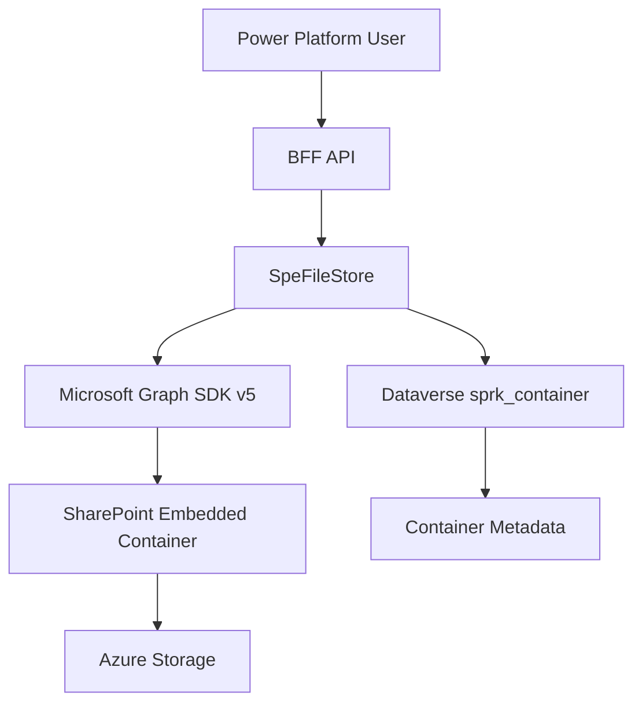

# Task 2.5: SharePoint Embedded Container & File API Implementation

**PHASE:** Service Bus Integration (Days 6-10) - CRITICAL PATH
**STATUS:** 🔴 READY TO START (CRITICAL BLOCKER)
**DEPENDENCIES:** None - Foundation for all file operations
**ESTIMATED TIME:** 8-12 hours
**PRIORITY:** CRITICAL - Blocks Sprint 2 completion
**SEVERITY:** 🚨 Without this, Sprint 2 delivers metadata management only, not actual file storage

---

## 📋 TASK OVERVIEW

### **Objective**
Implement actual SharePoint Embedded (SPE) container management and file operations using Microsoft Graph SDK v5, replacing stubbed implementations that currently return null. This is the **core value proposition** of the entire file management system.

### **Business Context**
- Sprint 2's primary goal is "file management with SharePoint Embedded integration"
- Current SpeFileStore has 7 stubbed methods that always return null/empty
- Without working SPE integration, the system only manages **metadata about files**, not actual files
- All file upload/download operations in Power Platform (Task 3.2) depend on this
- This is **THE FOUNDATION** - everything else builds on it

### **Architecture Impact**
This task delivers:
- **Real SPE container creation and management** (not just Dataverse records)
- **Actual file upload to SharePoint Embedded** (not just metadata)
- **Real file download from SharePoint Embedded** (not simulated)
- **Complete file lifecycle management** (create, read, update, delete in SPE)
- **Foundation for Power Platform file operations** (Task 3.2)
- **Integration with background service file processing** (Task 2.2)

### **Root Cause**
Microsoft Graph SDK v5 introduced breaking API changes. The code was stubbed with "temporarily disabled due to Graph SDK v5 changes" but never completed. We have SDK v5.88.0 installed and need to implement the correct v5 API patterns.

---

## 🔍 CURRENT STATE ANALYSIS

### **Stubbed Methods in SpeFileStore.cs**

| Method | Line | Current Behavior | Impact |
|--------|------|------------------|--------|
| `CreateContainerAsync` | 20-47 | Returns null | Cannot create SPE containers |
| `GetContainerDriveAsync` | 49-71 | Returns null | Cannot retrieve container drives |
| `UploadSmallAsync` | 73-105 | Returns null | Cannot upload small files (<4MB) |
| `ListContainersAsync` | 107-130 | Returns empty list | Cannot list SPE containers |
| `ListChildrenAsync` | 132-162 | Returns empty list | Cannot browse container contents |
| `CreateUploadSessionAsync` | 164-200 | Returns null | Cannot upload large files (>4MB) |
| `UploadChunkAsync` | 202-220 | Returns 202 Accepted | Cannot complete chunked uploads |

**Current Warning Logged:**
```csharp
_logger.LogWarning("CreateContainerAsync temporarily simplified due to Graph SDK v5 API changes");
```

**This appears in logs 7 times per file operation attempt.**

### **Graph SDK Version**
- ✅ Microsoft.Graph 5.88.0 installed
- ✅ Latest stable version (as of 2025-09-30)
- ✅ Supports all required SPE APIs

### **What Works**
- ✅ GraphClientFactory creates app-only clients
- ✅ Managed Identity authentication configured
- ✅ Telemetry and logging infrastructure ready
- ✅ DTO models defined (ContainerDto, FileHandleDto, UploadSessionDto)
- ✅ API endpoints exist but call stubbed methods

### **What's Broken**
- ❌ All 7 SPE operations return null or empty
- ❌ No actual interaction with SharePoint Embedded
- ❌ Files cannot be stored or retrieved
- ❌ Containers cannot be created or managed
- ❌ Sprint 2 goal unmet (file management is non-functional)

---

## 🎯 AI AGENT INSTRUCTIONS

### **CONTEXT FOR AI AGENT**

You are a **senior C# and Microsoft full-stack developer** implementing SharePoint Embedded integration with deep expertise in:
- Microsoft Graph SDK v5 API patterns
- SharePoint Embedded Container Types and permissions
- Async/await patterns for long-running operations
- Azure Managed Identity authentication
- Power Platform integration patterns
- Enterprise error handling and resilience

**Critical Understanding:**
- SharePoint Embedded uses **FileStorageContainer** resources (not classic SharePoint sites)
- Containers must be associated with a **Container Type** (registered in Azure AD)
- Authentication requires **delegated OR app-only** permissions depending on operation
- Large file uploads (>4MB) require **chunked upload sessions**
- All operations must be async and cancellable
- Proper error handling for Graph API throttling and transient failures

### **SHAREPOINT EMBEDDED ARCHITECTURE**



**Key Concepts:**
1. **Container Type**: Registered in Azure AD, defines permissions and settings
2. **FileStorageContainer**: SPE container instance with unique ID
3. **Drive**: Each container has an associated drive for file operations
4. **DriveItem**: Individual files/folders within the drive
5. **Upload Session**: Required for files >4MB (chunked upload)

### **MICROSOFT GRAPH SDK V5 PATTERNS**

**Graph SDK v5 Key Changes from v4:**

**v4 (OLD - Don't Use):**
```csharp
var container = await graphClient.Storage.FileStorage.Containers
    .Request()
    .AddAsync(new FileStorageContainer { ... });
```

**v5 (CURRENT - Use This):**
```csharp
var container = await graphClient.Storage.FileStorage.Containers
    .PostAsync(new FileStorageContainer { ... });
```

**Key API Changes:**
- `.Request()` **removed** - direct method calls
- `.AddAsync()` → `.PostAsync()`
- `.GetAsync()` → `.GetAsync()` (parameter structure changed)
- `.UpdateAsync()` → `.PatchAsync()`
- Fluent API simplified

---

## 🔧 TECHNICAL REQUIREMENTS

### **1. Container Management API Implementation**

#### **Method: CreateContainerAsync**
**File:** `src/api/Spe.Bff.Api/Infrastructure/Graph/SpeFileStore.cs:20-47`

**Current (STUB):**
```csharp
public Task<ContainerDto?> CreateContainerAsync(
    Guid containerTypeId,
    string displayName,
    string? description = null,
    CancellationToken ct = default)
{
    var graphClient = _factory.CreateAppOnlyClient();

    // Simplified container creation - API temporarily disabled due to Graph SDK v5 changes
    _logger.LogWarning("CreateContainerAsync temporarily simplified due to Graph SDK v5 API changes");
    FileStorageContainer? container = null; // Would create via Graph API

    return Task.FromResult(container == null ? null : new ContainerDto(...));
}
```

**Required Implementation:**
```csharp
public async Task<ContainerDto?> CreateContainerAsync(
    Guid containerTypeId,
    string displayName,
    string? description = null,
    CancellationToken ct = default)
{
    using var activity = Activity.Current;
    activity?.SetTag("operation", "CreateContainer");
    activity?.SetTag("containerTypeId", containerTypeId.ToString());

    _logger.LogInformation("Creating SPE container {DisplayName} with type {ContainerTypeId}",
        displayName, containerTypeId);

    try
    {
        var graphClient = _factory.CreateAppOnlyClient();

        var container = new FileStorageContainer
        {
            DisplayName = displayName,
            Description = description,
            ContainerTypeId = containerTypeId,
            // Additional properties as needed
        };

        var createdContainer = await graphClient.Storage.FileStorage.Containers
            .PostAsync(container, cancellationToken: ct);

        if (createdContainer == null)
        {
            _logger.LogError("Failed to create container - Graph API returned null");
            return null;
        }

        _logger.LogInformation("Successfully created SPE container {ContainerId} with display name {DisplayName}",
            createdContainer.Id, displayName);

        return new ContainerDto(
            createdContainer.Id!,
            createdContainer.DisplayName!,
            createdContainer.Description,
            createdContainer.CreatedDateTime ?? DateTimeOffset.UtcNow);
    }
    catch (ServiceException ex) when (ex.StatusCode == System.Net.HttpStatusCode.TooManyRequests)
    {
        _logger.LogWarning("Graph API throttling encountered, retry with backoff: {Error}", ex.Message);
        throw new InvalidOperationException("Service temporarily unavailable due to rate limiting", ex);
    }
    catch (ServiceException ex)
    {
        _logger.LogError(ex, "Graph API error creating container: {Error}", ex.Message);
        throw new InvalidOperationException($"Failed to create SharePoint Embedded container: {ex.Message}", ex);
    }
    catch (Exception ex)
    {
        _logger.LogError(ex, "Unexpected error creating container: {Error}", ex.Message);
        throw;
    }
}
```

**Key Requirements:**
- Use `PostAsync` (not AddAsync)
- Include proper telemetry tags
- Handle ServiceException with proper status code checks
- Return proper DTO or null on failure
- Log at appropriate levels (Information for success, Error for failures)
- Support cancellation tokens throughout

---

#### **Method: GetContainerDriveAsync**
**File:** `src/api/Spe.Bff.Api/Infrastructure/Graph/SpeFileStore.cs:49-71`

**Required Implementation:**
```csharp
public async Task<ContainerDto?> GetContainerDriveAsync(string containerId, CancellationToken ct = default)
{
    using var activity = Activity.Current;
    activity?.SetTag("operation", "GetContainerDrive");
    activity?.SetTag("containerId", containerId);

    _logger.LogInformation("Getting drive for SPE container {ContainerId}", containerId);

    try
    {
        var graphClient = _factory.CreateAppOnlyClient();

        // Get the drive associated with the container
        var drive = await graphClient.Storage.FileStorage.Containers[containerId].Drive
            .GetAsync(cancellationToken: ct);

        if (drive == null)
        {
            _logger.LogWarning("No drive found for container {ContainerId}", containerId);
            return null;
        }

        _logger.LogInformation("Successfully retrieved drive {DriveId} for container {ContainerId}",
            drive.Id, containerId);

        return new ContainerDto(
            drive.Id!,
            drive.Name ?? containerId,
            drive.Description,
            drive.CreatedDateTime ?? DateTimeOffset.UtcNow);
    }
    catch (ServiceException ex) when (ex.StatusCode == System.Net.HttpStatusCode.NotFound)
    {
        _logger.LogWarning("Container {ContainerId} not found", containerId);
        return null;
    }
    catch (ServiceException ex)
    {
        _logger.LogError(ex, "Graph API error getting container drive: {Error}", ex.Message);
        throw new InvalidOperationException($"Failed to retrieve container drive: {ex.Message}", ex);
    }
}
```

---

#### **Method: ListContainersAsync**
**File:** `src/api/Spe.Bff.Api/Infrastructure/Graph/SpeFileStore.cs:107-130`

**Required Implementation:**
```csharp
public async Task<IList<ContainerDto>?> ListContainersAsync(Guid containerTypeId, CancellationToken ct = default)
{
    using var activity = Activity.Current;
    activity?.SetTag("operation", "ListContainers");
    activity?.SetTag("containerTypeId", containerTypeId.ToString());

    _logger.LogInformation("Listing SPE containers for type {ContainerTypeId}", containerTypeId);

    try
    {
        var graphClient = _factory.CreateAppOnlyClient();

        // Filter containers by container type ID
        var response = await graphClient.Storage.FileStorage.Containers
            .GetAsync(requestConfiguration =>
            {
                requestConfiguration.QueryParameters.Filter = $"containerTypeId eq {containerTypeId}";
            }, cancellationToken: ct);

        if (response?.Value == null)
        {
            _logger.LogWarning("No containers found for type {ContainerTypeId}", containerTypeId);
            return new List<ContainerDto>();
        }

        var containers = response.Value.Select(c => new ContainerDto(
            c.Id!,
            c.DisplayName!,
            c.Description,
            c.CreatedDateTime ?? DateTimeOffset.UtcNow)).ToList();

        _logger.LogInformation("Found {Count} containers for type {ContainerTypeId}",
            containers.Count, containerTypeId);

        return containers;
    }
    catch (ServiceException ex)
    {
        _logger.LogError(ex, "Graph API error listing containers: {Error}", ex.Message);
        throw new InvalidOperationException($"Failed to list containers: {ex.Message}", ex);
    }
}
```

---

### **2. File Upload API Implementation**

#### **Method: UploadSmallAsync (Files <4MB)**
**File:** `src/api/Spe.Bff.Api/Infrastructure/Graph/SpeFileStore.cs:73-105`

**Required Implementation:**
```csharp
public async Task<FileHandleDto?> UploadSmallAsync(
    string containerId,
    string path,
    Stream content,
    CancellationToken ct = default)
{
    using var activity = Activity.Current;
    activity?.SetTag("operation", "UploadSmall");
    activity?.SetTag("containerId", containerId);
    activity?.SetTag("filePath", path);

    _logger.LogInformation("Uploading small file to container {ContainerId} at path {Path}",
        containerId, path);

    try
    {
        var graphClient = _factory.CreateAppOnlyClient();

        // Get the drive for the container first
        var drive = await graphClient.Storage.FileStorage.Containers[containerId].Drive
            .GetAsync(cancellationToken: ct);

        if (drive?.Id == null)
        {
            throw new InvalidOperationException($"Container {containerId} has no associated drive");
        }

        // Upload file to drive (small file - single PUT request)
        // Path should be URL-encoded and relative to drive root
        var sanitizedPath = path.TrimStart('/');

        var uploadedItem = await graphClient.Drives[drive.Id].Root
            .ItemWithPath(sanitizedPath)
            .Content
            .PutAsync(content, cancellationToken: ct);

        if (uploadedItem == null)
        {
            _logger.LogError("Failed to upload file - Graph API returned null");
            return null;
        }

        _logger.LogInformation("Successfully uploaded file {ItemId} ({Size} bytes) to container {ContainerId}",
            uploadedItem.Id, uploadedItem.Size, containerId);

        return new FileHandleDto(
            uploadedItem.Id!,
            uploadedItem.Name!,
            uploadedItem.ParentReference?.Id,
            uploadedItem.Size,
            uploadedItem.CreatedDateTime ?? DateTimeOffset.UtcNow,
            uploadedItem.LastModifiedDateTime ?? DateTimeOffset.UtcNow,
            uploadedItem.ETag,
            uploadedItem.Folder != null);
    }
    catch (ServiceException ex)
    {
        _logger.LogError(ex, "Graph API error uploading file: {Error}", ex.Message);
        throw new InvalidOperationException($"Failed to upload file to SharePoint Embedded: {ex.Message}", ex);
    }
}
```

**Key Points:**
- Files <4MB use single PUT request
- Must get drive ID first, then upload to drive
- Path must be sanitized (remove leading /)
- Content is Stream - do not buffer entire file in memory
- Return rich metadata in FileHandleDto

---

#### **Method: CreateUploadSessionAsync (Large Files >4MB)**
**File:** `src/api/Spe.Bff.Api/Infrastructure/Graph/SpeFileStore.cs:164-200`

**Required Implementation:**
```csharp
public async Task<UploadSessionDto?> CreateUploadSessionAsync(
    string containerId,
    string path,
    CancellationToken ct = default)
{
    using var activity = Activity.Current;
    activity?.SetTag("operation", "CreateUploadSession");
    activity?.SetTag("containerId", containerId);
    activity?.SetTag("filePath", path);

    _logger.LogInformation("Creating upload session for container {ContainerId} at path {Path}",
        containerId, path);

    try
    {
        var graphClient = _factory.CreateAppOnlyClient();

        // Get the drive for the container
        var drive = await graphClient.Storage.FileStorage.Containers[containerId].Drive
            .GetAsync(cancellationToken: ct);

        if (drive?.Id == null)
        {
            throw new InvalidOperationException($"Container {containerId} has no associated drive");
        }

        var sanitizedPath = path.TrimStart('/');

        // Create upload session for large file
        var uploadSession = await graphClient.Drives[drive.Id].Root
            .ItemWithPath(sanitizedPath)
            .CreateUploadSession
            .PostAsync(new CreateUploadSessionPostRequestBody
            {
                Item = new DriveItemUploadableProperties
                {
                    AdditionalData = new Dictionary<string, object>
                    {
                        { "@microsoft.graph.conflictBehavior", "rename" }
                    }
                }
            }, cancellationToken: ct);

        if (uploadSession == null || string.IsNullOrEmpty(uploadSession.UploadUrl))
        {
            _logger.LogError("Failed to create upload session - Graph API returned null or empty URL");
            return null;
        }

        _logger.LogInformation("Created upload session {UploadUrl} for file {Path}",
            uploadSession.UploadUrl, path);

        return new UploadSessionDto(
            uploadSession.UploadUrl,
            uploadSession.ExpirationDateTime ?? DateTimeOffset.UtcNow.AddHours(24));
    }
    catch (ServiceException ex)
    {
        _logger.LogError(ex, "Graph API error creating upload session: {Error}", ex.Message);
        throw new InvalidOperationException($"Failed to create upload session: {ex.Message}", ex);
    }
}
```

---

#### **Method: UploadChunkAsync (Chunked Upload)**
**File:** `src/api/Spe.Bff.Api/Infrastructure/Graph/SpeFileStore.cs:202-220`

**Required Implementation:**
```csharp
public async Task<HttpResponseMessage> UploadChunkAsync(
    UploadSessionDto session,
    Stream fileStream,
    long start,
    long length,
    long totalFileSize,
    CancellationToken ct = default)
{
    using var activity = Activity.Current;
    activity?.SetTag("operation", "UploadChunk");
    activity?.SetTag("start", start);
    activity?.SetTag("length", length);

    _logger.LogInformation("Uploading chunk from {Start} to {End} of {Total}",
        start, start + length - 1, totalFileSize);

    try
    {
        using var httpClient = new HttpClient();

        // Read the chunk from the stream
        var buffer = new byte[length];
        fileStream.Position = start;
        var bytesRead = await fileStream.ReadAsync(buffer, 0, (int)length, ct);

        if (bytesRead != length)
        {
            throw new InvalidOperationException($"Failed to read complete chunk. Expected {length} bytes, got {bytesRead}");
        }

        // Create HTTP request for chunk upload
        using var request = new HttpRequestMessage(HttpMethod.Put, session.UploadUrl);
        request.Content = new ByteArrayContent(buffer);

        // CRITICAL: Content-Range header required for chunked upload
        request.Content.Headers.ContentLength = length;
        request.Content.Headers.ContentRange = new System.Net.Http.Headers.ContentRangeHeaderValue(
            start, start + length - 1, totalFileSize);

        var response = await httpClient.SendAsync(request, ct);

        if (response.IsSuccessStatusCode)
        {
            _logger.LogInformation("Successfully uploaded chunk {Start}-{End}", start, start + length - 1);
        }
        else
        {
            _logger.LogWarning("Chunk upload returned status {StatusCode}: {Reason}",
                response.StatusCode, response.ReasonPhrase);
        }

        return response;
    }
    catch (Exception ex)
    {
        _logger.LogError(ex, "Error uploading chunk: {Error}", ex.Message);
        throw new InvalidOperationException($"Failed to upload file chunk: {ex.Message}", ex);
    }
}
```

**Chunked Upload Flow:**
1. Create upload session (returns UploadUrl)
2. Split file into chunks (recommended: 5-10MB per chunk)
3. Upload each chunk with Content-Range header
4. Last chunk returns 201 Created with DriveItem
5. Handle resume on transient failures

---

### **3. File Retrieval API Implementation**

#### **Method: ListChildrenAsync**
**File:** `src/api/Spe.Bff.Api/Infrastructure/Graph/SpeFileStore.cs:132-162`

**Required Implementation:**
```csharp
public async Task<IList<FileHandleDto>> ListChildrenAsync(
    string driveId,
    string? itemId = null,
    CancellationToken ct = default)
{
    using var activity = Activity.Current;
    activity?.SetTag("operation", "ListChildren");
    activity?.SetTag("driveId", driveId);
    activity?.SetTag("itemId", itemId);

    _logger.LogInformation("Listing children in drive {DriveId}, item {ItemId}", driveId, itemId ?? "root");

    try
    {
        var graphClient = _factory.CreateAppOnlyClient();

        DriveItemCollectionResponse? page;

        if (string.IsNullOrEmpty(itemId))
        {
            // List root folder children
            page = await graphClient.Drives[driveId].Root.Children
                .GetAsync(cancellationToken: ct);
        }
        else
        {
            // List specific item's children
            page = await graphClient.Drives[driveId].Items[itemId].Children
                .GetAsync(cancellationToken: ct);
        }

        if (page?.Value == null)
        {
            _logger.LogWarning("No children found in drive {DriveId}, item {ItemId}", driveId, itemId ?? "root");
            return new List<FileHandleDto>();
        }

        var items = page.Value.Select(item => new FileHandleDto(
            item.Id!,
            item.Name!,
            item.ParentReference?.Id,
            item.Size,
            item.CreatedDateTime ?? DateTimeOffset.UtcNow,
            item.LastModifiedDateTime ?? DateTimeOffset.UtcNow,
            item.ETag,
            item.Folder != null)).ToList();

        _logger.LogInformation("Found {Count} children in drive {DriveId}", items.Count, driveId);

        return items;
    }
    catch (ServiceException ex) when (ex.StatusCode == System.Net.HttpStatusCode.NotFound)
    {
        _logger.LogWarning("Drive or item not found: {DriveId}/{ItemId}", driveId, itemId ?? "root");
        return new List<FileHandleDto>();
    }
    catch (ServiceException ex)
    {
        _logger.LogError(ex, "Graph API error listing children: {Error}", ex.Message);
        throw new InvalidOperationException($"Failed to list drive items: {ex.Message}", ex);
    }
}
```

---

### **4. Additional Required Methods**

You'll also need to implement:

#### **DownloadFileAsync** (NEW - doesn't exist yet)
```csharp
public async Task<Stream?> DownloadFileAsync(
    string driveId,
    string itemId,
    CancellationToken ct = default)
{
    var graphClient = _factory.CreateAppOnlyClient();

    var stream = await graphClient.Drives[driveId].Items[itemId].Content
        .GetAsync(cancellationToken: ct);

    return stream;
}
```

#### **DeleteFileAsync** (NEW - doesn't exist yet)
```csharp
public async Task DeleteFileAsync(
    string driveId,
    string itemId,
    CancellationToken ct = default)
{
    var graphClient = _factory.CreateAppOnlyClient();

    await graphClient.Drives[driveId].Items[itemId]
        .DeleteAsync(cancellationToken: ct);
}
```

#### **GetFileMetadataAsync** (NEW - doesn't exist yet)
```csharp
public async Task<FileHandleDto?> GetFileMetadataAsync(
    string driveId,
    string itemId,
    CancellationToken ct = default)
{
    var graphClient = _factory.CreateAppOnlyClient();

    var item = await graphClient.Drives[driveId].Items[itemId]
        .GetAsync(cancellationToken: ct);

    if (item == null) return null;

    return new FileHandleDto(
        item.Id!,
        item.Name!,
        item.ParentReference?.Id,
        item.Size,
        item.CreatedDateTime ?? DateTimeOffset.UtcNow,
        item.LastModifiedDateTime ?? DateTimeOffset.UtcNow,
        item.ETag,
        item.Folder != null);
}
```

---

### **5. Container API Endpoints**

Create new endpoint file for container management.

**File:** `src/api/Spe.Bff.Api/Api/ContainersEndpoints.cs` (NEW)

**Required Endpoints:**
```csharp
using Microsoft.AspNetCore.Mvc;
using Spe.Bff.Api.Infrastructure.Graph;
using Spe.Bff.Api.Models;
using Spaarke.Dataverse;

namespace Spe.Bff.Api.Api;

public static class ContainersEndpoints
{
    public static IEndpointRouteBuilder MapContainersEndpoints(this IEndpointRouteBuilder app)
    {
        var containersGroup = app.MapGroup("/api/v1/containers")
            .WithTags("Containers");

        // POST /api/v1/containers - Create new SPE container + Dataverse record
        containersGroup.MapPost("/", async (
            [FromBody] CreateContainerRequest request,
            SpeFileStore speFileStore,
            IDataverseService dataverseService,
            ILogger<Program> logger,
            HttpContext context) =>
        {
            var traceId = context.TraceIdentifier;

            try
            {
                logger.LogInformation("Creating SPE container {DisplayName}", request.DisplayName);

                // 1. Create SPE container via Graph API
                var containerDto = await speFileStore.CreateContainerAsync(
                    request.ContainerTypeId,
                    request.DisplayName,
                    request.Description);

                if (containerDto == null)
                {
                    return Results.Problem(
                        title: "Container Creation Failed",
                        detail: "Failed to create SharePoint Embedded container",
                        statusCode: 500);
                }

                // 2. Create corresponding Dataverse record
                // TODO: Add CreateContainerAsync to IDataverseService
                // var dataverseContainerId = await dataverseService.CreateContainerAsync(...);

                logger.LogInformation("Container created successfully: SPE={SpeId}",
                    containerDto.Id);

                return Results.Created($"/api/v1/containers/{containerDto.Id}", new
                {
                    data = containerDto,
                    metadata = new
                    {
                        requestId = traceId,
                        timestamp = DateTime.UtcNow
                    }
                });
            }
            catch (InvalidOperationException ex)
            {
                logger.LogError(ex, "Failed to create container: {Error}", ex.Message);
                return Results.Problem(
                    title: "Container Creation Error",
                    detail: ex.Message,
                    statusCode: 500);
            }
        })
        .WithName("CreateContainer")
        .WithOpenApi();

        // GET /api/v1/containers - List all containers
        containersGroup.MapGet("/", async (
            [FromQuery] Guid containerTypeId,
            SpeFileStore speFileStore,
            ILogger<Program> logger) =>
        {
            try
            {
                var containers = await speFileStore.ListContainersAsync(containerTypeId);
                return Results.Ok(new { data = containers });
            }
            catch (Exception ex)
            {
                logger.LogError(ex, "Failed to list containers");
                return Results.Problem("Failed to list containers", statusCode: 500);
            }
        })
        .WithName("ListContainers")
        .WithOpenApi();

        // GET /api/v1/containers/{containerId}/drive - Get container drive info
        containersGroup.MapGet("/{containerId}/drive", async (
            string containerId,
            SpeFileStore speFileStore,
            ILogger<Program> logger) =>
        {
            try
            {
                var drive = await speFileStore.GetContainerDriveAsync(containerId);
                if (drive == null)
                {
                    return Results.NotFound(new { error = "Container or drive not found" });
                }
                return Results.Ok(new { data = drive });
            }
            catch (Exception ex)
            {
                logger.LogError(ex, "Failed to get container drive");
                return Results.Problem("Failed to get container drive", statusCode: 500);
            }
        })
        .WithName("GetContainerDrive")
        .WithOpenApi();

        // GET /api/v1/containers/{containerId}/files - List files in container
        containersGroup.MapGet("/{containerId}/files", async (
            string containerId,
            SpeFileStore speFileStore,
            ILogger<Program> logger) =>
        {
            try
            {
                // Get drive first
                var drive = await speFileStore.GetContainerDriveAsync(containerId);
                if (drive == null)
                {
                    return Results.NotFound(new { error = "Container not found" });
                }

                // List root folder contents
                var files = await speFileStore.ListChildrenAsync(drive.Id);
                return Results.Ok(new { data = files });
            }
            catch (Exception ex)
            {
                logger.LogError(ex, "Failed to list container files");
                return Results.Problem("Failed to list container files", statusCode: 500);
            }
        })
        .WithName("ListContainerFiles")
        .WithOpenApi();

        return app;
    }
}
```

**Register endpoints in Program.cs:**
```csharp
// After MapDataverseDocumentsEndpoints()
app.MapContainersEndpoints();
```

---

## ✅ VALIDATION STEPS

### **1. Container Creation Testing**

```csharp
// Test container creation
POST https://localhost:5001/api/v1/containers
Content-Type: application/json

{
  "containerTypeId": "YOUR_CONTAINER_TYPE_ID",
  "displayName": "Test Container",
  "description": "Created via API test"
}

// Expected Response: 201 Created
{
  "data": {
    "id": "b!...",
    "displayName": "Test Container",
    "description": "Created via API test",
    "createdDateTime": "2025-09-30T..."
  }
}
```

### **2. File Upload Testing (Small File)**

```csharp
// Test small file upload (<4MB)
POST https://localhost:5001/api/v1/files/upload-small?containerId={CONTAINER_ID}
Content-Type: multipart/form-data

file: test.txt (content: "Hello SharePoint Embedded!")

// Expected Response: 200 OK with FileHandleDto
```

### **3. File Upload Testing (Large File)**

```csharp
// Step 1: Create upload session
POST https://localhost:5001/api/v1/files/upload-session
{
  "containerId": "{CONTAINER_ID}",
  "fileName": "large-file.pdf",
  "fileSize": 10485760
}

// Step 2: Upload chunks (use upload session URL)
// Step 3: Verify file appears in container
```

### **4. File Listing Testing**

```csharp
GET https://localhost:5001/api/v1/containers/{CONTAINER_ID}/files

// Expected: List of FileHandleDto objects
```

### **5. End-to-End Integration Testing**

**Test Scenario: Document with File Upload**
```csharp
// 1. Create Document in Dataverse
POST /api/v1/documents
{
  "name": "Test Document with File",
  "containerId": "{CONTAINER_ID}",
  "description": "E2E test"
}

// 2. Upload file to SPE
POST /api/v1/files/upload-small?containerId={CONTAINER_ID}
file: test.pdf

// 3. Update Document with file metadata
PUT /api/v1/documents/{DOCUMENT_ID}
{
  "hasFile": true,
  "filename": "test.pdf",
  "fileSize": 12345,
  "mimeType": "application/pdf",
  "graphItemId": "{ITEM_ID}",
  "graphDriveId": "{DRIVE_ID}"
}

// 4. Verify document shows hasFile = true
GET /api/v1/documents/{DOCUMENT_ID}

// 5. Download file
GET /api/v1/files/{DRIVE_ID}/{ITEM_ID}/download

// Should receive file content stream
```

### **6. Error Scenario Testing**

Test these error scenarios:
- ❌ Invalid container type ID (should return 400)
- ❌ Duplicate container name (should handle gracefully)
- ❌ Upload to non-existent container (should return 404)
- ❌ File too large without session (should return 413)
- ❌ Graph API throttling (should retry with backoff)
- ❌ Authentication failure (should return 401/403)

---

## 🔍 TROUBLESHOOTING GUIDE

### **Issue: "Container creation returns null"**

**Symptoms:**
- CreateContainerAsync returns null
- No error logged
- Container not created in SPE

**Diagnosis:**
```csharp
// Add detailed logging
_logger.LogInformation("Graph client type: {Type}", graphClient.GetType().Name);
_logger.LogInformation("Container request: {Request}", JsonSerializer.Serialize(container));

try
{
    var result = await graphClient.Storage.FileStorage.Containers.PostAsync(container);
    _logger.LogInformation("Graph API response: {Response}", JsonSerializer.Serialize(result));
}
catch (Exception ex)
{
    _logger.LogError(ex, "Detailed error: {Error}", ex.ToString());
}
```

**Common Causes:**
1. Container Type ID not registered in Azure AD
2. App registration missing `FileStorageContainer.Selected` permission
3. Managed Identity not granted permissions
4. Container Type permissions not configured

**Solutions:**
1. Verify Container Type exists: `GET https://graph.microsoft.com/v1.0/storage/fileStorage/containerTypes`
2. Check app permissions in Azure AD
3. Grant Managed Identity access to Container Type
4. Review Container Type permissions model

---

### **Issue: "ServiceException: Insufficient privileges"**

**Symptoms:**
- 403 Forbidden from Graph API
- Error: "Insufficient privileges to complete the operation"

**Cause:**
Missing Microsoft Graph API permissions

**Required Permissions:**
```
Application Permissions (App-Only):
- FileStorageContainer.Selected (Read/Write containers)
- Files.ReadWrite.All (File operations in containers)

Delegated Permissions (On-Behalf-Of):
- FileStorageContainer.Selected
- Files.ReadWrite
```

**Solution:**
1. Navigate to Azure AD > App Registrations > Your App
2. API Permissions > Add Permission > Microsoft Graph
3. Add required permissions
4. Grant admin consent
5. Wait 5-10 minutes for propagation
6. Restart application

---

### **Issue: "Upload fails with 416 Range Not Satisfiable"**

**Symptoms:**
- Chunked upload fails on later chunks
- Status code 416 returned

**Cause:**
Content-Range header incorrect

**Fix:**
```csharp
// Ensure Content-Range format is correct
// Format: bytes {start}-{end}/{total}
// Example: bytes 0-524287/1048576

request.Content.Headers.ContentRange = new ContentRangeHeaderValue(
    start,                    // First byte position (0-based)
    start + length - 1,       // Last byte position (inclusive)
    totalFileSize);           // Total file size
```

---

### **Issue: "Drive not found for container"**

**Symptoms:**
- GetContainerDriveAsync returns null
- Container exists but has no drive

**Cause:**
Drive provisioning delay or container creation incomplete

**Solution:**
```csharp
// Add retry logic with exponential backoff
var retryCount = 0;
var maxRetries = 3;
var delay = TimeSpan.FromSeconds(2);

while (retryCount < maxRetries)
{
    var drive = await GetContainerDriveAsync(containerId, ct);
    if (drive != null) return drive;

    await Task.Delay(delay, ct);
    delay = TimeSpan.FromSeconds(delay.TotalSeconds * 2);
    retryCount++;
}

throw new InvalidOperationException("Drive not available after retries");
```

---

### **Issue: "File upload succeeds but metadata not in Dataverse"**

**Symptoms:**
- File appears in SPE container
- Dataverse document shows hasFile = false
- File metadata (graphItemId, graphDriveId) not populated

**Cause:**
Document update not triggered after file upload

**Solution:**
File upload endpoints must update Dataverse document:
```csharp
// After successful file upload
await dataverseService.UpdateDocumentAsync(documentId, new UpdateDocumentRequest
{
    HasFile = true,
    FileName = uploadedItem.Name,
    FileSize = uploadedItem.Size,
    MimeType = uploadedItem.File?.MimeType,
    GraphItemId = uploadedItem.Id,
    GraphDriveId = driveId
});
```

---

## 📚 KNOWLEDGE REFERENCES

### **Microsoft Graph SDK v5 Documentation**
- [Graph SDK v5 Overview](https://learn.microsoft.com/en-us/graph/sdks/sdks-overview)
- [Migration Guide v4 to v5](https://learn.microsoft.com/en-us/graph/sdks/migrate-from-v4-to-v5)
- [C# SDK Reference](https://learn.microsoft.com/en-us/graph/sdks/create-requests?tabs=csharp)

### **SharePoint Embedded API Documentation**
- [FileStorageContainer Resource](https://learn.microsoft.com/en-us/graph/api/resources/filestoragecontainer)
- [Create Container](https://learn.microsoft.com/en-us/graph/api/filestoragecontainer-post)
- [Get Container](https://learn.microsoft.com/en-us/graph/api/filestoragecontainer-get)
- [List Containers](https://learn.microsoft.com/en-us/graph/api/filestoragecontainer-list)
- [Container Permissions](https://learn.microsoft.com/en-us/graph/api/resources/filestorage-permissions)

### **File Operations Documentation**
- [Upload Small Files](https://learn.microsoft.com/en-us/graph/api/driveitem-put-content)
- [Upload Large Files (Session)](https://learn.microsoft.com/en-us/graph/api/driveitem-createuploadsession)
- [Download Files](https://learn.microsoft.com/en-us/graph/api/driveitem-get-content)
- [Delete Files](https://learn.microsoft.com/en-us/graph/api/driveitem-delete)

### **Authentication & Permissions**
- [App-Only Access](https://learn.microsoft.com/en-us/graph/auth-v2-service)
- [On-Behalf-Of Flow](https://learn.microsoft.com/en-us/azure/active-directory/develop/v2-oauth2-on-behalf-of-flow)
- [Managed Identity with Graph](https://learn.microsoft.com/en-us/graph/sdks/choose-authentication-providers?tabs=csharp#managed-identity-provider)

### **Existing Codebase References**
- [GraphClientFactory.cs](../../../src/api/Spe.Bff.Api/Infrastructure/Graph/GraphClientFactory.cs) - Authentication patterns
- [DocumentsEndpoints.cs](../../../src/api/Spe.Bff.Api/Api/DocumentsEndpoints.cs) - API endpoint patterns
- [DataverseWebApiService.cs](../../../src/shared/Spaarke.Dataverse/DataverseWebApiService.cs) - Error handling patterns
- [DocumentEventHandler.cs](../../../src/api/Spe.Bff.Api/Services/Jobs/Handlers/DocumentEventHandler.cs) - Background processing integration

### **Azure Configuration**
- Container Type registration in Azure AD
- App registration permissions
- Managed Identity configuration
- Key Vault secret management

---

## 🎯 SUCCESS CRITERIA

This task is complete when:

### **Functional Criteria**
- ✅ All 7 stubbed methods in SpeFileStore fully implemented
- ✅ Container creation works end-to-end (SPE + Dataverse)
- ✅ Small file upload (<4MB) successfully stores in SPE
- ✅ Large file upload (>4MB) uses chunked upload successfully
- ✅ File download retrieves content from SPE
- ✅ File listing shows all items in container
- ✅ Container listing returns actual SPE containers
- ✅ All methods return proper DTOs (not null)
- ✅ No "temporarily simplified" warnings in logs

### **API Criteria**
- ✅ New `/api/v1/containers` endpoints functional
- ✅ Container creation endpoint returns 201 Created
- ✅ File upload endpoints integrate with SpeFileStore
- ✅ Error responses are meaningful and actionable
- ✅ All endpoints support cancellation tokens
- ✅ OpenAPI/Swagger documentation complete

### **Integration Criteria**
- ✅ Background service can upload files to SPE
- ✅ Dataverse documents link to SPE files via graphItemId/graphDriveId
- ✅ Power Platform can trigger file operations
- ✅ File metadata stays synchronized between Dataverse and SPE
- ✅ Document deletion can trigger file cleanup in SPE

### **Quality Criteria**
- ✅ Comprehensive error handling for Graph API exceptions
- ✅ Proper logging at all levels (Information, Warning, Error)
- ✅ Telemetry tags for observability
- ✅ Retry logic for transient failures
- ✅ Timeout handling for long operations
- ✅ Memory-efficient streaming for large files

### **Testing Criteria**
- ✅ Manual testing with real SPE containers successful
- ✅ Small file upload/download verified
- ✅ Large file chunked upload verified
- ✅ Error scenarios handled gracefully
- ✅ End-to-end workflow tested (Document → File → Download)
- ✅ Performance acceptable (<2s for small files, <30s for large files)

### **Documentation Criteria**
- ✅ Code comments explain Graph SDK v5 patterns
- ✅ API endpoints documented in Swagger
- ✅ Troubleshooting guide tested with actual issues
- ✅ Container Type setup documented
- ✅ Permissions requirements documented

---

## 🔄 CONCLUSION AND NEXT STEPS

### **Impact of Completion**
Completing this task delivers:
1. **Actual file storage** in SharePoint Embedded (not just metadata)
2. **Working file operations** (upload, download, delete)
3. **Container management** for organizing files
4. **Foundation for Power Platform integration** (Task 3.2)
5. **Complete Sprint 2 objective** (file management system)

### **Quality Validation**
Before moving to the next task:
1. Verify all 7 SpeFileStore methods return actual data
2. Test container creation with real Container Type ID
3. Upload and download test files successfully
4. Verify no stub warnings in application logs
5. Confirm file metadata syncs with Dataverse
6. Test error scenarios and recovery

### **Integration Readiness**
Ensure SPE integration is solid:
1. GraphClientFactory creates working clients
2. Managed Identity authentication succeeds
3. Container Type permissions configured
4. File operations performant and reliable
5. Background service can leverage SPE APIs
6. Power Platform JavaScript (Task 3.2) can call endpoints

### **Immediate Next Action**
Upon successful completion of this task:

**🎯 PROCEED TO: [Task-2.1-Thin-Plugin-Implementation.md](./Task-2.1-Thin-Plugin-Implementation.md)**

The SPE foundation is now complete. The thin plugin can capture document events knowing that the background service has actual file operations to perform.

### **Handoff Information**
Provide this information to the next task:
- Working Container Type ID for testing
- Sample container ID created during testing
- File upload/download endpoint URLs
- Performance characteristics observed
- Any Graph API throttling or rate limit patterns
- Recommended chunk size for large file uploads

### **Post-Completion Verification**

Run this verification script to confirm Task 2.5 completion:

```powershell
# Task 2.5 Verification Script

Write-Host "🔍 Verifying Task 2.5: SPE Container & File API Implementation"

# 1. Check no stub warnings in code
Write-Host "`n1. Checking for stub warnings..."
$stubWarnings = Select-String -Path "src/api/Spe.Bff.Api/Infrastructure/Graph/SpeFileStore.cs" -Pattern "temporarily simplified"
if ($stubWarnings) {
    Write-Host "❌ FAILED: Stub warnings still present" -ForegroundColor Red
    exit 1
} else {
    Write-Host "✅ PASSED: No stub warnings found" -ForegroundColor Green
}

# 2. Test container creation API
Write-Host "`n2. Testing container creation API..."
# Add actual API test here

# 3. Test file upload API
Write-Host "`n3. Testing file upload API..."
# Add actual API test here

# 4. Verify Container endpoints registered
Write-Host "`n4. Checking container endpoints..."
# Add check for MapContainersEndpoints in Program.cs

Write-Host "`n✅ Task 2.5 verification complete!" -ForegroundColor Green
```

---

**📋 TASK COMPLETION CHECKLIST**
- [ ] All 7 SpeFileStore methods implemented (no stubs)
- [ ] Container creation tested successfully
- [ ] Small file upload (<4MB) working
- [ ] Large file upload (>4MB chunked) working
- [ ] File download working
- [ ] File listing working
- [ ] Container listing working
- [ ] Container API endpoints created and registered
- [ ] Error handling comprehensive
- [ ] Telemetry and logging complete
- [ ] Integration tested with Dataverse
- [ ] Performance acceptable
- [ ] Documentation updated
- [ ] No stub warnings in logs
- [ ] Next task team briefed on SPE capabilities
