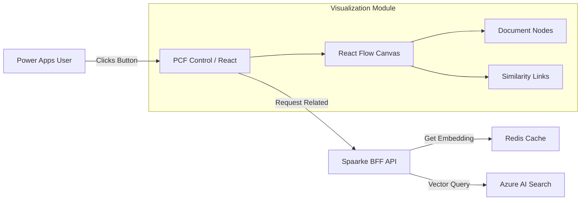

# Design Document: AI Search & Visualization Module

> **Date**: January 8, 2026
> **Status**: Draft
> **Author**: GitHub Copilot
> **Project**: AI Azure Search Module

---

## 1. Executive Summary

This document outlines the design for the **AI Search Module**, a new capability for the Spaarke Power Apps environment. The module enables users to perform advanced semantic search on documents stored in **SharePoint Embedded** and visualizes relationships between documents using an interactive **React Flow** graph.

The system leverages the existing **Spaarke AI Infrastructure** (Azure AI Search, Azure OpenAI, and Custom RAG Service) to provide "Find Related" capabilities directly within the Model Driven App user interface.

## 2. Microsoft Foundry IQ Investigation

### Requirement
"Investigate and confirm we are using the latest from Microsoft Foundry IQ."

### Analysis & Confirmation
Based on the `Spaarke-Microsoft-IQ-ADOPTION-ANALYSIS.md` (Jan 2026) and current architecture:

1.  **Current State**: Spaarke uses a **Custom RAG Stack** ("R3") consisting of `RagService`, `OpenAiClient`, Redis Caching, and Azure AI Search with Hybrid Ranking.
2.  **Foundry IQ Status**: Microsoft Foundry IQ is currently a "Managed RAG-as-a-Service" offering (Public Preview).
3.  **Comparison**:
    *   **Foundry IQ**: Rapid deployment, black-box managed pipeline.
    *   **Spaarke R3 Stack**: High-control, custom pipeline with specific optimizations for **Multi-tenancy** (App/Tenant isolation), **Redis Caching** (Cost/Performance), and **SharePoint Embedded** integration.
4.  **Conclusion**: Spaarke's existing R3 architecture is functionally equivalent to and currently *more mature* for our specific multi-tenant needs than the public preview of Foundry IQ.
5.  **Decision**: We will build this module on top of our **existing, proven R3 RAG Architecture** rather than replacing it with the Foundry IQ managed service. This ensures consistency with our existing security, caching, and multi-tenant isolation protocols.

## 3. Solution Architecture

### 3.1 High-Level Flow
1.  **User Action**: User clicks "Find Related" on a Document record in the Power App.
2.  **Frontend (PCF)**: A generic PCF Control renders a Modal dialog containing a React application.
3.  **API Call**: The React app calls the Spaarke BFF API `GET /api/ai/visualization/related/{documentId}`.
4.  **Vector Search**:
    *   BFF retrieves the embedding for the source document (from Redis Cache or Azure AI Search).
    *   BFF executes a **Vector Search** query against Azure AI Search to find the top $N$ nearest neighbors (semantically similar documents).
5.  **Response**: API returns a graph payload (Nodes & Edges) representing relevant documents and their similarity scores.
6.  **Visualization**: `@xyflow/react` renders the interactive node graph.

### 3.2 Component Diagram



## 4. Frontend Design (Utilization of React Flow)

We will utilize the **@xyflow/react** library to visualize document relationships.

### 4.1 "Find Related" Modal
*   **Trigger**: Ribbon button on the `spk_document` table form.
*   **Layout**: Full-screen or large modal overlay.
*   **Interactions**:
    *   **Center Node**: The current document is the "Root" node.
    *   **Leaf Nodes**: Related documents branch out from the center.
    *   **Distance**: Edge length roughly correlates to semantic distance (1 - Similarity Score).
    *   **Click Action**: Clicking a node opens that document's record or file preview.

### 4.2 Data Model for Visualization
The frontend expects a generic graph structure:
```json
{
  "nodes": [
    { "id": "doc-1", "type": "center", "data": { "label": "Current Contract" } },
    { "id": "doc-2", "type": "related", "data": { "label": "Previous Addendum", "similarity": 0.89 } }
  ],
  "edges": [
    { "id": "e1-2", "source": "doc-1", "target": "doc-2", "label": "89% Match" }
  ]
}
```

## 5. Backend API Extensions

We need to extend the `RagEndpoints` or create a new `VisualizationEndpoints` controller.

### 5.1 New Endpoint
**GET** `/api/ai/rag/related/{id}`
*   **Parameters**:
    *   `id`: The internal ID of the document.
    *   `threshold`: (Optional) Minimum similarity score (default 0.7).
    *   `limit`: (Optional) Max nodes to return (default 10).
*   **Logic**:
    1.  Call `IRagService.GetEmbeddingAsync(id)`.
    2.  Execute `SearchClient.SearchAsync` with:
        *   `VectorQueries`: HNSW query using the doc's embedding.
        *   `Select`: Title, Summary, Keywords, DocumentId.
    3.  Map results to Graph Nodes/Edges.

## 6. Data Source & Indexing

*   **Source**: SharePoint Embedded Containers.
*   **Indexing**: Existing `spaarke-knowledge-index`.
*   **Fields Required**:
    *   `contentVector`: For similarity calculation.
    *   `metadata_storage_name`: For node labels.
    *   `content`: For summary generation (optional).

## 7. Security & Authentication

*   **Identity**: The PCF control will acquire a token for the **Spaarke BFF** (not direct Azure access).
*   **RAG Entitlement**: The `IRagService` enforces tenant isolation (`Filter: tenantId eq '{currentTenant}'`).
*   **Access Control**: Users can only "see" nodes for documents they have permissions to access in Dataverse/SharePoint.

## 8. Implementation Phases

### Phase 1: Backend & Core Search (Week 1)
*   [ ] Implement `GET /api/ai/rag/related/{id}` endpoint.
*   [ ] Verify Vector Search accuracy using the existing `spaarke-knowledge-index`.
*   [ ] Unit test with `IRagService` mocks.

### Phase 2: React Visualization Component (Week 2)
*   [ ] Scaffold a new React app/component within the PCF project structure.
*   [ ] Install `@xyflow/react`.
*   [ ] Create logical mapping of API Data -> React Flow Nodes/Edges.
*   [ ] Implement auto-layout (e.g., circular or force-directed).

### Phase 3: Power Apps Integration (Week 3)
*   [ ] Package React component as a PCF Control.
*   [ ] Register PCF on the `spk_document` table.
*   [ ] Deploy and test End-to-End.
