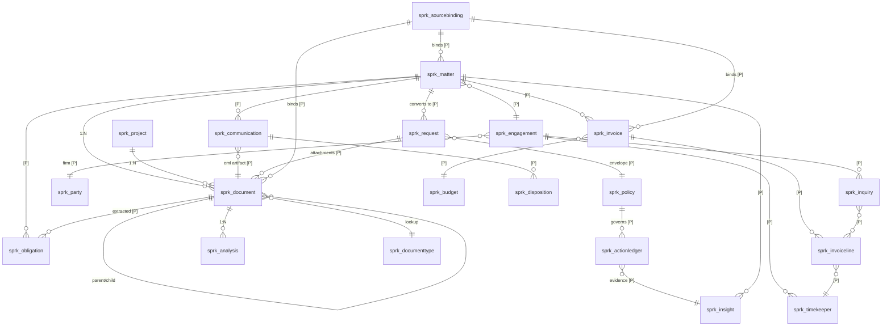

# Spaarke Ontology-Centric Platform Strategy — Analysis Synopsis

**Status:** Strategy synopsis for discovery handoff
**Version:** 2.0 — adds §2.2–2.6 (market and platform state, researched 19 Sep 2026), §6.5, §8 Wave 1.5 candidate, and expanded Phase 0 / open decisions (D-i…D-n)
**Date:** 2026-09-19
**Audience:** Claude Code (discovery + design analysis)
**Source:** Strategy working session, Ralph / Claude

> **v2.0 change note.** v1.0 treated "Microsoft moves up the stack" as a hypothetical risk and carried one unverified claim about the Microsoft Legal Agent for Word. Both are corrected here. Microsoft shipped into three layers of this architecture between March and October 2026, and the frontier labs both launched legal verticals with explicit orchestration-layer positioning. The strategic conclusion is unchanged and arguably strengthened — but several build decisions in §6 are now build-vs-buy decisions, and one shipped module faces direct platform overlap.

---

## 0. How to use this document

This is a **strategy synopsis, not a design specification**. It captures the conclusions of a strategy working session and is intended as the input to a Claude Code discovery pass that will produce the actual design artifacts.

**Notation used throughout (Spaarke conventions):**

| Tag | Meaning |
|---|---|
| `[Cited]` | Sourced from an external reference or a verified project document |
| `[Judgment]` | Analytical conclusion from the working session; not verified |
| `[Open]` | Unresolved decision |
| `[VALIDATION NEEDED]` | Assumption that must be checked against source before use |
| `[PROPOSED: name]` | Component named in this document that does not yet exist in the codebase |

**Mandatory first step:** Phase 0 codebase inventory before any design artifact is produced. Nothing in Section 6 (Component Register) should be trusted as a description of the repo until verified in source. The state tags in this document are drawn from project documentation, not from a code read.

---

## 1. Background — the strategic question

Spaarke is an enterprise legal operations intelligence platform built natively on the Microsoft stack (Dataverse, SharePoint Embedded, Azure AI, ASP.NET Core BFF, Power Platform). The session addressed a single strategic question:

> Can Spaarke adopt Palantir's business and architectural model — ontology as the product, actions bound to objects, land-via-working-artifact go-to-market — applied to legal, on Microsoft infrastructure?

The conclusion is yes, with three material adaptations, and it requires a repositioning away from the current migration-first / replacement posture in Spaarke's published materials.

### 1.1 Palantir's model, stripped to mechanics `[Cited]`

1. **The ontology is the product; models are rented.** Differentiation is the semantic layer that makes enterprise data intelligible to AI, not the LLM. Switching LLM vendors is configuration; rebuilding an ontology is a multi-year project. Switching cost is accumulated semantic work.
2. **The ontology binds to actions, not dashboards.** Foundry models objects, links, *and* permitted write-back actions. Analytics is a byproduct; the unit of value is a governed decision.
3. **Land via a working artifact.** The AIP Bootcamp is a five-day pilot on the customer's own data. Reported ~75% conversion, >1,300 run, compressing a 12–18 month sales cycle to weeks.
4. **Forward-deployed delivery, productized.** Engineers ("Deltas") paired with deployment strategists ("Echoes") embed 6–18 months; patterns feed back into platform R&D. Services are the R&D intake valve, not the revenue.
5. **Land / expand / scale pricing.** Low-cost entry, millions in ARR at scale, NDR >118%.

**Anti-mechanic:** professional services run at 18–20% of revenue. The model carries a real margin tax. `[Cited]`

### 1.2 What does and does not translate `[Judgment]`

**Translates:** ontology thesis, action-bound objects, the bootcamp, sovereign deployment as a compliance moat, land/expand pricing.

**Does not translate:** the government anchor, capital intensity, full-stack build, FDE headcount. Palantir built Gotham/Foundry/Apollo because nothing existed underneath in 2006. Spaarke rents all three from Microsoft.

### 1.3 The critical structural difference — Spaarke can be the system of record

Palantir structurally **cannot** be the system of record. It has no transactional application layer — no forms runtime, no document storage, no row-level end-user security model. Foundry must always sit above something that owns the record. That is a permanent ceiling on their model.

Spaarke has Dataverse, SPE, a security model, a forms runtime, and a workflow engine. Therefore:

> **Binding mode is a dial, not a fork — and the dial can move after deployment.**

This is the single largest differentiation available. Documents can start referenced in iManage; two years later, promoting the Document class to Originate is a migration against a schema that already exists, not a re-platforming.

**Commercial claim:** *start where you are, move when you want, never re-implement.* No overlay vendor can offer it; no suite vendor can offer the overlay entry point. `[Judgment]`

**Discipline risk:** the capability to be SOR will pull every deal toward rip-and-replace because it looks like a bigger contract. The architecture must make overlay the **default configuration** so full-SOR is an explicit customer decision. `[Judgment]`

---

## 2. Product strategy and positioning in the legal AI market

### 2.1 Current positioning contradiction `[Cited — project documents]`

Published Spaarke materials (`spaarke-for-your-it-team`, functional specification) currently state that Spaarke is "replacing or consolidating systems that already hold legal data," lead the onboarding section with what migrates, and claim "no separate DMS to license, deploy, or maintain."

This is rip-and-replace positioning. It places Spaarke in a simultaneous displacement fight against iManage/NetDocuments and an e-billing incumbent, on a 12–18 month cycle, in a segment that does not switch. It is also incompatible with a five-day bootcamp, which cannot begin with a migration.

**Required correction:** reposition from migration-first to **binding-first**, with migration as one of three options.

### 2.2 MCP became the interop layer `[Cited]`

Between May and September 2026 the legal DMS vendors standardized on Model Context Protocol as the AI access layer:

- **iManage MCP Server**, GA 14 May 2026 — open-protocol connection letting any AI system access governed iManage content without custom integrations or bulk data exports, preserving existing security, ethical wall, and compliance controls. Positioned as working with Claude, ChatGPT, Copilot, Harvey, Legora, and firm-built agents. Separately listed as a **Microsoft premium connector on Microsoft Learn** (preview, page updated 23 Jun 2026) for Copilot Studio, Power Automate, Power Apps and Logic Apps.
- **NetDocuments** announced its MCP collaboration with Anthropic on 12 May 2026; at ILTACON announced an expanded ecosystem (Gemini Enterprise alongside Claude, Copilot, Perplexity, Harvey, Legora).
- **Casepoint** MCP server launched 30 Jul 2026. **Thomson Reuters CoCounsel MCP server** launched May 2026. **Entegrata** announced one.
- **Harvey is both MCP client and MCP server** — a deliberate strategy stated since Dec 2025. Its server exposes five tools (`ask_harvey`, `ask_with_knowledge_source`, `list_knowledge_sources`, `list_vault_projects`, `ask_about_vault`) over Streamable HTTP with OAuth. Documented supported clients: Claude, Gemini, M365 Copilot — **ChatGPT is absent**, which shows how fast reach becomes asymmetry.

> **Correction to v1.0.** v1.0 stated that Microsoft Legal Agent for Word "reached enterprise GA May 2026, connecting to both DMSs via MCP." **This is not verified and is contradicted by Microsoft's own documentation.** Correct position: the agent is in Frontier public preview (worldwide since 12 Jun 2026), GA is **early October 2026** (slipped from September), and playbook ingestion is documented as local upload or SharePoint only, with **no DMS connector support documented**. `[VALIDATION NEEDED]` — re-check at GA.

**Three consequences:**

1. **Reference-mode binding is now solved for law-firm documents.** Permission-bound, ethical-wall-respecting, fully logged, no export, no copy. The customer's own DMS vendor built it, so the security review is theirs, not Spaarke's.
2. **MCP deliberately does not solve mirror mode.** iManage's framing is explicit: access *without* bulk export, and the AI tool does not store a copy. That is a product decision. MCP provides session-scoped, user-permissioned retrieval — **not** enumeration, change data capture, a stable schema contract, or transactional writeback. An ontology built from user-scoped retrieval is unstable: two users asking the same question see different corpora. **MCP feeds interaction, not state.** `[Judgment]`
3. **MCP standardizes connection and nothing above it.** It standardizes no part of identity mapping, matter-scoping, ethical-wall propagation across tools, cross-tool audit, cost attribution, or retention policy. Trade analysis in Aug 2026 advised firms to maintain "a curated internal registry of approved servers, proper OAuth 2.1 authorisation, permission inheritance from source systems" — i.e. to assemble that layer themselves. **That is a description of an unbuilt product category.** `[Judgment]`

### 2.3 The frontier labs entered legal — with orchestration-layer positioning `[Cited]`

Both frontier labs shipped legal verticals in 2026, structured almost identically:

- **Claude for Legal** (Anthropic, 12 May 2026) — 12 practice-area plugins, 20+ MCP connectors (iManage, NetDocuments, Ironclad, DocuSign, Relativity, Everlaw, Thomson Reuters CoCounsel, Harvey, Definely, Box, and more), delivered through Claude apps, Claude Cowork, Claude for Word/Outlook/Excel, and the API. Each plugin opens with a **setup interview that learns the team's playbooks, escalation chains, risk calibration and house style.** Freshfields deployed across thousands of users. Legal IT Insider's framing: *"an orchestration layer for legal work: one interface capable of accessing legal research tools, document management systems, transaction platforms and specialist legal AI products."*
- **Astra for Law** (OpenAI, **18 September 2026 — one day before this document**) — built on GPT-6 Astra, with a Legal Search Index over 230M+ URLs of US case law/statutes/regulations claiming 40% relative improvement over standard GPT-6 web search on legal questions; zero data retention for eligible firms; a Trusted Access Program; **26 partner-built plugins and 47 community-built plugins**. Partners include Thomson Reuters, Harvey, Legora, iManage, Intapp, Litera, Relativity, Clio. Governance framework co-developed with Latham & Watkins.

**Harvey, Legora, Thomson Reuters and iManage appear in *both* ecosystems. Neither lab won exclusivity.**

Four parties now explicitly claim the orchestration layer in their own words: Anthropic (via the Claude for Legal framing), Harvey (*"it's becoming the system through which legal work gets done"* — $11B valuation, Mar 2026, 25,000+ custom agents), **LexisNexis (shipped a product component literally named "Protégé Work," described as an orchestration layer, 7 May 2026)**, and iManage/NetDocuments (claiming the *context* layer — governed content, permission inheritance, ethical walls, audit).

**The flank none of them can hold is neutrality.** `[Judgment]` A frontier lab cannot credibly orchestrate a rival lab's tools. Harvey cannot credibly orchestrate Legora. A platform with no model of its own and no drafting product is the only party that can route work to whichever tool the customer actually chose — and survive the customer switching. **This is a positioning asset Spaarke has by construction and should claim explicitly.**

### 2.4 Fragmentation is the steady state — the data `[Cited]`

**ILTA 2026 Technology Survey** (published 14 Sep 2026; 500+ firms, ~140,000 lawyers, 12 countries) is the strongest dataset and it settles the question:

| Product | Firms using |
|---|---|
| Microsoft 365 Copilot | 76% |
| Anthropic Claude | 44% |
| Thomson Reuters CoCounsel | 44% |
| Harvey | 43% |
| Lexis+ AI | 26% |

Large firms (700+ lawyers) run **Copilot 88%, Harvey 84%, Claude 64% concurrently.** 94% of firms are using or exploring generative AI, up from 80%. **Nine separate tools exceeded 50% pilot adoption; only two exceeded 50% full deployment** (Copilot 52%, Westlaw Advantage 50%).

Read the gap: **wide piloting, narrow deployment.** Summing usage across five products alone gives 233%. Multi-tool is the norm.

Corroborating behavioural evidence: **Microsoft's own ~2,000-person CELA legal organisation adopted Harvey in July 2026 — while Microsoft was shipping a competing Legal Agent for Word.** If the most vertically integrated vendor in software will not single-vendor its own legal department, no customer will. `[Judgment]`

Demand-side pressure points at operations, not drafting:
- **CLOC 2026 State of the Industry** (2 Mar 2026): **85% of legal departments now have dedicated AI resources or committees**; expectations of increased outside-counsel spend fell 58% → 37%; only 47% expect internal budget increases, down from 65%.
- **ACC / Everlaw** (14 Oct 2025, 657 in-house professionals): 52% actively using GenAI, more than double 2024; **64% plan to use GenAI to rely less on outside counsel.**
- **Thomson Reuters Future of Professionals** (Jun 2026): warns of a **widening gap between AI adoption and realised AI value.**

**Strategic reading:** departments do not need a seventh way to draft a clause. They need to govern, route, measure and defend the six tools they already bought. `[Judgment]`

### 2.5 Microsoft platform movement — what just got commoditized `[Cited]`

This is the section that changes build decisions. Between March and October 2026 Microsoft shipped into three layers of Spaarke's architecture. **Every item below is dated and verified against Microsoft primary sources.**

| Microsoft move | Date / status | Layer hit | Consequence for Spaarke |
|---|---|---|---|
| **Azure AI Foundry → Microsoft Foundry** rename | Ignite 2025 (Nov) | L0 naming | Azure OpenAI is now "Azure OpenAI in Microsoft Foundry Models"; docs/SDK/portal drift |
| **Foundry IQ** — managed, permission-aware knowledge/grounding layer on Azure AI Search; knowledge bases over Blob, OneLake, SharePoint, **SharePoint Embedded**, existing indexes; agentic retrieval with multi-query planning and permission trimming | Preview Nov 2025; **knowledge bases GA 2 Jun 2026**; Serverless billing began 13 Sep 2026 | **L4** | 🚩 Spaarke's custom BFF RAG pipeline over `spaarke-knowledge-index-v2` is now something Microsoft sells with an SLA. Build-vs-buy decision, not a differentiator. Note: Foundry IQ query planning is Azure-OpenAI-only. |
| **SharePoint Embedded agent SDK deprecated** — React `ChatEmbedded` control retired, replaced by Foundry Agent Service (SPE as knowledge source) or M365 Copilot Retrieval API | **Mar 2026** | **L5/L4** | 🚩 Direct migration exposure if any Spaarke surface used it. **Phase 0 must check.** |
| **Work IQ** — M365 workplace intelligence layer: Chat, Context, Tools (10 semantic tools collapsing hundreds of Graph operations), Workspaces (backed by SPE). A2A + **remote MCP server** + REST. **ISV-accessible.** Billed on **Copilot Credits, independent of Copilot licensing.** **Entra delegated auth only — no app-only.** | Announced Nov 2025; preview 2 Jun 2026; **GA 16 Jun 2026** | **L0/L4** | 🚩 Fastest path to M365 context without Graph plumbing — and competitors get it just as cheaply. **The delegated-only constraint is an architectural fact**: a service-principal BFF cannot call Work IQ app-only; OBO required. Spaarke already uses OBO, so this is compatible — verify. |
| **"Dataverse in Work IQ"** — Dataverse Work IQ APIs, MCP servers, agentic Dataverse Search, business skills, native agent identities | Dataverse 2026 Release Wave 1 (Apr–Sep 2026) | L0/L1 | Dataverse business data surfacing into M365 Copilot natively — relevant to the M365 surface strategy |
| **Microsoft Agent Framework 1.0 GA** — convergence of Semantic Kernel + AutoGen; .NET and Python; native MCP + A2A; YAML declarative agents; graph workflow engine | **~2–3 Apr 2026**; SK on maintenance ≥ Apr 2027 | **L3** | Default answer to "what do we build agents on." If any Spaarke orchestration uses Semantic Kernel, plan migration. |
| **Microsoft Agent 365** — enterprise agent control plane: registry, shadow-AI discovery, Intune policy access control, Defender investigation. **$15/user/month or included in M365 E7.** Registry syncs with AWS Bedrock and Google Cloud (preview) | **GA 1 May 2026** | **L6** | 🚩 A paid governance gate enterprise buyers will require. Registration becomes a procurement checkbox — and early registration is a distribution advantage. |
| **Microsoft Entra Agent ID** — identity/auth/governance for agents, incl. non-Microsoft platforms | GA ~1 May 2026; **Dataverse preview 6 Aug 2026** (agent gets Entra identity + linked Dataverse agent user with least-privilege roles) | **L6** | Direct fit with Spaarke's gate/authority model — the Dataverse variant is the one to track |
| **MCP first-party across the stack** — M365 Copilot declarative agents (GA 15 Dec 2025), Foundry Agent Service MCP tool (GA), **Dataverse MCP server** (`/api/mcp`, supports Claude Desktop/Code, VS Code, Copilot Studio), Power Apps MCP server, Work IQ MCP (GA 16 Jun 2026), MCP servers as Foundry IQ knowledge sources | Various, mostly GA | **L5** | 🚩 **An MCP server over the Spaarke ontology is the single highest-leverage integration artifact** — it reaches Copilot, Foundry, Copilot Studio, Agent Framework, Claude, and ChatGPT simultaneously |
| **MAI model family** — MAI-Thinking-1 (reasoning, 35B, 256K ctx), MAI-Voice-1/2, MAI-Image-2.x, MAI-Transcribe-1/1.5/2. Positioned explicitly on cost/latency vs OpenAI | Mixed GA/preview through 2026 | L0/L4 | Cheaper first-party tier for high-volume low-differentiation calls (classification, extraction, transcription) — fits the existing tiered model-routing doctrine. **Note: "MAI-1" and "MAI-Vision" do not exist as shipping model names — do not plan around them.** |
| **Microsoft–OpenAI partnership restructured away from exclusivity** | 28 Apr 2026 `[REPORTED]` | L0 | Azure OpenAI is no longer a moat; abstract the model layer |
| **Microsoft Legal Agent for Word** — full-agreement analysis, clause/risk/obligation identification, **negotiation-ready redlines as native tracked changes**, review against **uploaded internal playbooks**, citation links. Built by acqui-hired Robin AI engineers. Requires M365 Copilot licence + Frontier enrolment | Announced 30 Apr 2026; worldwide Frontier preview 12 Jun 2026; **GA early Oct 2026** | **Product overlap** | 🚩🚩 **Playbook-based contract review with tracked-change redlines ships inside Word at Copilot-licence price in ~3 weeks.** This overlaps Spaarke's shipped NDA Analysis / Agreement Analysis module directly. |

**Two corrections to prior Spaarke materials this research surfaced:** `[VALIDATION NEEDED]`
1. Project docs describe the AI layer as "Azure AI Foundry (knowledge grounding), Microsoft Copilot Studio (orchestration), Microsoft Agent Framework (execution)." With Agent Framework 1.0 GA and the documented Microsoft split (Copilot Studio = low-code/M365; Foundry + Agent Framework = pro-code/custom), **Copilot Studio should be described as a build-time authoring tool only** — which matches internal doctrine but not all published copy.
2. "Foundry IQ" is used correctly in Spaarke materials — it **is** a real Microsoft product name. But it is now GA and does far more than the materials imply, which turns it from a label into a decision.

### 2.6 What this does to the strategy `[Judgment]`

**The ontology-centric strategy is strengthened, not weakened.** Every commoditized layer is a layer the v1.0 analysis already said not to differentiate on. Foundry IQ commoditizing RAG, Work IQ commoditizing M365 context, and Legal Agent for Word commoditizing playbook review all confirm the central thesis: **value accrues to originated objects and governed actions, not to retrieval or drafting.**

But three things become urgent rather than important:

1. **NDA Analysis / Agreement Analysis needs a repositioning within weeks, not quarters.** When Word ships playbook review with tracked changes at Copilot price, a standalone clause-deviation module is not a product. What survives is what Word cannot do: the deviation tied to a Matter, an Obligation, a Policy version, an approval authority, and an audit record. Same analysis, different output contract.
2. **The MCP server (egress) moves from "Designed" to first-priority build.** It is the single artifact that makes Spaarke reachable from every tool in the ILTA table at once, and it is how Spaarke becomes the neutral layer described in §2.3 rather than one more interchangeable tool.
3. **L4 becomes a build-vs-buy decision.** Continuing to hand-build retrieval orchestration now costs differentiation *and* engineering time. The engineering should move to L1 and L2 — exactly what the §6.2 observation already implied.

### 2.7 Positioning conclusion `[Judgment]`

- **Do not build differentiation at the document-context end.** That gap is closing and the DMS vendors own the repository.
- **Do not compete on drafting.** That war is over and it was expensive. Harvey ($11B, 100k lawyers), Legora ($5.6B, $100M ARR), CoCounsel (1M users), plus Microsoft giving away structure-aware redlining inside Word at Copilot-licence price. **Robin AI had a real product, Fortune 500 customers and ~$10M ARR, and was wound down inside a year in the drafting lane.** The marginal price of drafting is heading to zero.
- **Differentiation is the set of objects no incumbent claims:** Request, Disposition, Obligation, Policy, Inquiry, the action ledger, the Engagement edge. A DMS context graph is document-centric by construction and will never hold spend, intake, or disposition.
- **Claim neutrality explicitly.** No model of its own, no drafting product — Spaarke is the only party in §2.3 that can credibly route work to whichever tool the customer chose. Build for N tools; tool-agnosticism is the product, not a compatibility checkbox.
- **Sit above the DMS, not beside it.** iManage and NetDocuments won governed *documents* in May 2026 and did it well. The unclaimed ground is governed *process* — what matter this is, what stage, who must approve, what the obligation calendar says, and which of the customer's six AI tools already touched this document.
- **Existing positioning to retain:** "Legal Operations Intelligence" category claim; AI-directed, human-controlled; no primary-law research; two-sided data position (firm + department); Tenant Dedicated Deployment.
- **Positioning to retire:** DMS replacement, migration-first onboarding, consolidation framing.
- **Two-sided benchmarking carries a governance hazard** that directly contradicts the sovereignty promise. Consent, de-identification, aggregate-only derivation, and structural pipeline separation must be designed before the claim is made publicly.
- **Sales artifact worth having:** Microsoft ran Harvey in its own legal department (Jul 2026) while shipping a competing legal agent. That single fact kills the "we'll just standardise on Copilot" objection.

### 2.8 Commercial architecture `[Judgment]`

Per-user licensing (current model, per project documents) is the wrong shape: it prices the seat rather than the ontology, gives no expansion vector when agents do the work, and turns the land motion into a headcount negotiation.

Recommended structure:

| Phase | Unit |
|---|---|
| Land | Fixed-fee five-day sprint, credited to year one |
| Platform | Annual subscription priced on ontology scope — object classes live, connectors bound, action classes enabled |
| Expand | Additional module archetypes and adjacent domains as ontology extensions |
| AI | Pass through on the customer's Azure EA (already the current model — strategically correct, retain) |

---

## 3. The Spaarke approach — overlay architecture

### 3.1 The rule

> **Originate the workflow, reference the record.**

Spaarke is system of record only for objects no incumbent claims; it binds by reference to everything else. This works because of an asymmetry in legal: incumbent systems own **artifacts** and almost nothing owns **process**. `[Judgment]`

### 3.2 Three binding modes, declared per object class

| Mode | Behavior | Access requirement | Default for |
|---|---|---|---|
| **Reference** | Source keeps the artifact; Spaarke holds pointer, projected attributes, derived features, edges, freshness stamp | Retrieval only (MCP is sufficient) | Documents (law firm segment) |
| **Mirror** | Read-only synchronized projection for graph/query performance | Enumeration + change detection (API, export, or replica) | Matters, invoices, timekeepers, rate cards |
| **Originate** | Spaarke is system of record | None | See 3.3 |

### 3.3 The originate list (white space — no incumbent to displace)

Request · Triage disposition + immutable audit log · Obligation · Policy (OCG, envelope, SLA, delegation) · Fact / Observation / Inference · Action ledger and every gate decision · Engagement edge (department matter ↔ firm matter) · The link graph itself.

### 3.4 Clarification: "read-only" means third-party systems, not Spaarke

An earlier framing in the session was imprecise and is corrected here. **Spaarke is fully read-write on every object it originates from day one.** The constraint is on mutating records inside iManage or the e-billing platform.

Actions decompose into three patterns (Palantir uses all three):

- **Pattern A — writes to a Spaarke-originated object.** Source system has no field for it and no reason to hold it. *Most legal actions are this pattern.*
- **Pattern B — acts on the world through a channel the source does not own.** Email, Teams post, task, generated document, calendar entry. Real operational effect, zero writeback. *Bulk of early Palantir deployments.*
- **Pattern C — genuine writeback.** Idempotent queued job through the source API, async, with conflict detection and reconciliation, only for action types the source owner approved.

**Sequencing rule:** A and B in phase one; C earned per action, per system. Not because writeback is hard, but because not needing it is what makes a weeks-long deployment possible.

**Hard constraint for the manifest:** for any attribute, exactly one system is authoritative, declared explicitly. Two systems holding matter status is the failure mode that kills overlay architectures, and it fails silently.

### 3.5 Why this is not a data warehouse + dashboard

Worked example — *"this matter is running over budget; I need to ask outside counsel to investigate."*

**Warehouse + BI:** a report shows variance. Someone maybe opens it, forms a judgment, switches to Outlook, writes from memory, gets a reply in two days, notes it in a spreadsheet. The variance was recorded; the inquiry, reasoning, response, and outcome were not. Next quarter the system knows nothing more than before.

**Spaarke ontology:**
1. Variance computed deterministically at L2 from mirrored invoice/accrual data → a **Fact** with provenance, not a model opinion.
2. **Policy** object evaluates it (threshold, matter phase, rate card) → produces an **Observation** linked to Matter, Invoice lines, Engagement.
3. Surfaces in briefing/triage with a proposed **Action: Budget Inquiry** — templated and gated. Drafts a grounded message, creates a Task, creates an **Inquiry** object linked to Matter, Invoice lines, Timekeeper, Engagement. One-keystroke confirm; who/when/which policy version/which facts recorded.
4. Reply arrives in Exchange; classification ladder links it to the Inquiry thread; disposition File+Act; Inquiry resolves with a **typed outcome** (write-off / accrual revision / approved scope change / no action).
5. Nothing wrote to the e-billing system.
6. Engagement now carries resolved-inquiry history and response latency. Across 200 matters and 4 quarters this produces the **Matter Report Card** — which exists *only because the intervention was captured as an object*.

> **A warehouse records what happened to the business. An ontology records what the organization decided to do about it — and that record is the asset.**

---

## 4. Legal Operations Ontology — focal points

### 4.1 Spine (fixed, do not extend)

**Matter · Project · Invoice.** Everything else connects to one of the three. Workspace is a collaboration surface, not a spine object.

### 4.2 Object tiers

- **Tier 0 (spine):** Matter, Project, Invoice
- **Tier 1 (operational):** Request, Document, Communication, Party, Engagement, Timekeeper, Obligation, Deadline/Task, Clause/Provision, Budget/Accrual, Policy
- **Tier 2 (derived/epistemic):** Fact, Observation, Inference — with the existing honesty contract. *This tier is ahead of Palantir's framing (their derived properties carry no epistemic class) and should be treated as an ontology tier, not an Insights Engine implementation detail.*

**Two objects requiring specific attention:**

- **Policy as a first-class object.** Triage policies, green/yellow/red envelope, OCG rules, SLA definitions, delegation thresholds currently live in different places with different shapes. They are the same object: legal-authored, versioned, deterministically evaluable, with owner, effective date, audit trail. **Highest-value ontology ADR available.**
- **Obligation as a first-class object.** Extracted from documents, linked to parties and dates, status changing over time. Makes Portfolio/Obligation Intelligence a module rather than a search feature.

### 4.3 Links are the moat, not objects

Everyone has a matter table. The defensible edges, in order:

1. Communication → thread → matter (produced by the deterministic classification ladder; nearly impossible to retrofit)
2. Invoice line → timekeeper → activity code → matter → budget (LEDES/UTBMS-literate)
3. Document → clause → obligation → party → date
4. Document → document precedent similarity (already shipping via vector similarity)
5. Request → matter (conversion edge)
6. **Engagement edge — department matter ↔ firm matter.** Exists in no competitor's schema. Build the edge before building benchmarking on it.

### 4.4 Actions with gates

| Action class | Objects | Gate |
|---|---|---|
| Classify + confirm | Communication, Request, Document | Confirmation gate |
| Dispose | Communication (File / File+Act / Route / Hold / Dismiss) | Confirmation gate |
| Route / assign | Request, Matter, Invoice | Deterministic + confirm |
| Release under envelope | Request, Document | Green auto / Yellow one-click / Red counsel |
| Convert | Request → Matter | Confirmation gate |
| Draft / revise | Document | Human-controlled, provenance-logged |
| Adjust / accrue | Invoice, Budget | Policy-evaluated |
| Hold | Matter, Document, Communication | Irreversible by design |
| Escalate | any | Policy-driven |

Every action must carry **authority** (role, under which delegation policy) and a **provenance record** (which rule, which policy version, which corpus answer, which model, which human confirmed).

### 4.5 Bitemporality `[Open]`

Legal needs two clocks: when something was true, and when it was known. Privilege determinations, litigation hold scope, conflict checks, and defensibility of auto-resolved requests all require reconstructing prior state.

Dataverse provides audit history, not bitemporal query. **[VALIDATION NEEDED]** — confirm current audit capability and retention in the deployed environment. An ADR on temporal semantics should precede finalization of the ontology spec; retrofitting is expensive.

### 4.6 Why a legal ontology is not a generic one

1. Privilege and work product are **object attributes**, not access rules — they travel with the object and survive export.
2. The document is frequently **the record**, not a description of it.
3. **Counterparties are adversarial sources** — extracted values from opposing paper carry a different trust class.
4. **Rule density is extreme** (OCGs, billing guidelines, retention, ethical walls, delegation). Palantir ontologies are constraint-sparse; legal's is constraint-dominated. Encoding this is slow, specific work — which is the moat.
5. **Ethical walls are structural** — they partition the graph, not just the rows.

---

## 5. Source-system access — the ladder

Binding mode determines the required access mode:

- **Reference** → retrieval only. Almost every system can do this.
- **Mirror** → enumeration + change detection. *This is where vendors fail you and where cost lives.*
- **Originate** → nothing required.

**Access ladder, in preference order:**

1. **MCP server** — now best-in-class for reference mode in legal (see 2.2)
2. Vendor REST API (iManage Work API, NetDocuments REST, e-billing APIs)
3. Graph connectors / Azure AI Search indexers over the repository (index-in-place)
4. **Scheduled export or file drop** (LEDES, CSV, XML, SFTP) — underrated; zero vendor cooperation, already happens monthly, fully satisfies mirror mode for spend
5. Database read replica / ODBC (on-prem iManage, legacy ELM)
6. Email or SFTP push the vendor already sends
7. Power Platform connectors / Logic Apps
8. RPA or browser automation — **anti-pattern**; brittle and unsupportable
9. Human-mediated (user forwards, drops, uploads) — legitimate for bootcamp scope

**Practical conclusion:** the "no API" case is usually solved by **export + Exchange capture**, not by cleverness. A LEDES drop, a document index, and Exchange-layer email capture construct most of Waves 1–2 with zero vendor integration.

**MCP posture:** Spaarke should sit on **both sides** of the protocol — MCP **client** for ingress to source systems `[PROPOSED]`, MCP **server** for egress so the BFF grounds Copilot and the Word agent `[Designed]`.

---

## 6. Component model

### 6.1 Seven layers

| Layer | Contents |
|---|---|
| **L0 Substrate** (rented, undifferentiated) | Dataverse, SPE, Entra/MSAL OBO, Graph, Service Bus, Redis, Cosmos, Azure AI Search, Azure OpenAI, Document Intelligence |
| **L1 Ontology** (owned — this is what is sold) | Dataverse schema, link graph, Spaarke Canonical Model, Connector Manifest, insights index |
| **L2 Fact supply** (deterministic, D-F0) | Arithmetic, dates, SLA, status derivation, policy evaluation, accrual, conflict/hold checks. **No model call reaches this layer.** |
| **L3 Action** | Action Engine, Playbook execution, Scope System, gate engine, session ledger, Service Bus job workers |
| **L4 Inference** | Grounding/retrieval, epistemic-class dispatch, Insights Engine, model routing, eval harness |
| **L5 Surface** | Three-pane operator app, requester surface, Compose, PCF, model-driven apps, M365 declarative agent / BFF-as-MCP-server, Power BI / Fabric |
| **L6 Control plane** | Provisioning orchestrator, managed-solution ALM, feature flags and kill switches, per-tenant rate limiting and token budgeting, telemetry, CI evals |

### 6.2 Component register `[VALIDATION NEEDED — verify all in Phase 0]`

**L0 Substrate — [Shipped]:** Dataverse; SharePoint Embedded; Entra/MSAL with OBO; Microsoft Graph; Service Bus (`sdap-jobs`); Redis; Cosmos; Azure AI Search (`spaarke-knowledge-index-v2`); Azure OpenAI (`text-embedding-3-large`, GPT-4 tier); Document Intelligence.

**L1 Ontology — [Shipped]:** `sprk_matter`, `sprk_project`, `sprk_document` (SPE pointer + extraction fields), `sprk_analysis`, `sprk_emailprocessingrule`, `sprk_documenttype`; NavMap metadata-discovery service.
**[PROPOSED / Designed]:** Spaarke Canonical Model; Connector Manifest; `[PROPOSED: MatterResolutionService]`; Policy; Obligation; Request; Engagement; typed link store.

**L2 Fact supply — [Shipped]:** `EmailFilterService`; `AttachmentFilterService`; deterministic classification ladder; `DataverseAccessDataSource` (fail-closed authorization); Daily Briefing deterministic queries.
**[PROPOSED]:** SLA clock; accrual and variance computation; OCG rule engine; conflict and hold checks.

**L3 Action — [Shipped]:** `IAiToolHandler` three-path dispatch; `AnalysisOrchestrationService`; `ScopeResolverService`; `PlaybookService` / Playbook execution engine; session ledger; gate engine; ContextEnvelope; job contract pattern with `EmailToDocumentJobHandler`, `RagIndexingJobHandler`, `EmailPollingBackupService`; `ExportServiceRegistry` (Docx / PDF / Email / Teams).
**[Designed / PROPOSED]:** Action Engine; action ledger as a first-class object; `[PROPOSED: WritebackDispatcher]`.

**L4 Inference — [Shipped]:** Hybrid RAG (`RagEndpoints`: keyword + vector + semantic); `AnalysisContextBuilder`; `VisualizationService` (document similarity); entity extraction into `sprk_extract*`; model routing; eval harness.
**[Designed]:** Insights Engine; epistemic-class dispatch as a component rather than a principle.

**L5 Surface — [Shipped]:** PCF controls (`UniversalQuickCreate`, `SpeFileViewer`, `AnalysisWorkspace`, `DocumentRelationshipViewer`); three-pane app; Compose workspace (React 19 + Tiptap).
**[Designed]:** requester surface; BFF-as-MCP-server; declarative agent; unified manifest.

**L6 Control plane — [Shipped/Designed]:** feature flags and kill switches (ADR-018); rate limiting and token budgeting (ADR-013); App Insights telemetry; managed-solution ALM.
**[Designed]:** provisioning orchestrator.

> **Observation for discovery:** L3 and L4 appear largely built, L1 half built, and **L2 is the thinnest layer despite being the doctrinal foundation (D-F0)**. If Phase 0 confirms this, it is the inverse of what the doctrine implies and should drive next-quarter sequencing. `[Judgment]`

### 6.3 Component typing rule

Five component types, **one per component**: Ontology Object · Deterministic Service · Action (gated) · Inference Service · Surface.

A component that is two of these is a design defect and should be split at the seam. This is the mechanical enforcement of D-F0 and provides a reviewable rule for Claude Code handoffs.

### 6.4 Distributable unit model — the commercial packaging

Six package types, not "modules":

1. Platform solution (ontology, fact layer, action engine, control plane)
2. Ontology extension pack (object classes, links, extraction schemas)
3. Policy pack (encoded constraints, versioned)
4. Playbook / Action template pack
5. Connector manifest (one per bound legacy system)
6. Surface configuration (layouts, registers, catalog definitions)

> **Required commitment:** redefine a "module" as *ontology extension + policy pack + playbook templates + surface config*, with **no module-specific code**. The six output-contract archetypes (deviation analysis, structured extraction, cross-corpus tabular query, adversarial issue mapping, change-impact analysis, narrative synthesis) should be implemented as six **generic execution paths**; everything else becomes configuration.
>
> If module three still requires new C#, the scaling story is fiction and the services drag will consume the company. **This is the highest-priority thing for Claude Code to test in Phase 0.**

### 6.5 Platform movement impact on the register `[Judgment]` — added v2.0

§2.5 changes the status of specific register entries. These are **build-vs-buy decisions to be resolved in Phase 0**, not conclusions.

**L0 Substrate — naming and option changes**
- "Azure OpenAI" → **Azure OpenAI in Microsoft Foundry Models**. Cosmetic, but doc/SDK drift is real.
- **Work IQ** is a new available substrate component (GA 16 Jun 2026), ISV-accessible, separately metered on Copilot Credits. **Constraint: Entra delegated auth only, no app-only.** Spaarke's existing OBO pattern (`DataverseAccessDataSource`, `GraphClientFactory`) is compatible in principle; `PlaybookService` currently uses service-principal auth and would not be.
- **MAI models** are a new cost tier for L2-adjacent operational inference, consistent with existing tiered model-routing doctrine.

**L1 Ontology — unchanged and now more important.** Nothing Microsoft shipped touches the ontology. This is the confirmation that L1 is the right place for engineering effort.

**L2 Fact supply — unchanged and now more important.** Nothing Microsoft shipped computes deterministic legal facts. D-F0 remains wholly owned.

**L3 Action**
- **Microsoft Agent Framework 1.0 GA (Apr 2026)** is now the default orchestration substrate; Semantic Kernel is on maintenance (≥ Apr 2027). Phase 0 must determine whether any Spaarke orchestration depends on SK.
- The gate engine, session ledger, and ContextEnvelope remain Spaarke-owned — Agent Framework provides middleware hooks, not legal gates.

**L4 Inference — the significant change**
- **Foundry IQ (knowledge bases GA 2 Jun 2026)** overlaps the hand-built hybrid RAG pipeline (`RagEndpoints`, `spaarke-knowledge-index-v2`, `RagIndexingJobHandler`). It is built on the same Azure AI Search substrate, supports **SharePoint Embedded as a first-class knowledge source**, and adds agentic multi-query planning with permission trimming. `[Open — D-i]`
- Migration is not obviously correct: Foundry IQ's query planning is **Azure-OpenAI-only**, which conflicts with model-routing flexibility, and the epistemic-class dispatch and honesty contract are Spaarke-specific behaviours Foundry IQ does not provide. **The likely answer is Foundry IQ for retrieval, Spaarke for epistemic classification above it** — but that is a Phase 0 determination, not a decision here.

**L5 Surface**
- 🚩 **SharePoint Embedded agent SDK deprecated Mar 2026** (React `ChatEmbedded` control). Replacement paths are Foundry Agent Service with SPE as knowledge source, or the M365 Copilot Retrieval API with the `sharePointEmbedded` data source (preview). **Phase 0 must determine exposure.**
- **BFF-as-MCP-server moves from `[Designed]` to first-priority build** (§2.6). Target clients: M365 Copilot declarative agents, Foundry Agent Service, Copilot Studio, Agent Framework, Claude, ChatGPT/Astra, Harvey, Legora.

**L6 Control plane — new external requirement**
- **Agent 365 (GA 1 May 2026, $15/user/mo) and Entra Agent ID (GA ~May 2026; Dataverse preview 6 Aug 2026)** create an agent governance layer enterprise buyers will ask about in procurement. Entra Agent ID for Dataverse — agent gets an Entra identity plus a linked Dataverse agent user with least-privilege roles — maps closely to Spaarke's authority-and-gate model and should be evaluated as the implementation of it rather than a parallel scheme. `[Open — D-k]`

---

## 7. Data model and ERD

### 7.1 The overlay pattern already exists in the codebase

`sprk_document` is already an overlay entity: the binary lives in SPE; Dataverse holds `sprk_graphitemid`, `sprk_graphdriveid`, `sprk_filepath` as pointers, a projected subset (`sprk_filename`, `sprk_filesize`, `sprk_mimetype`), and Spaarke-owned derived fields (`sprk_extract*`, document type classification).

**SPE is simply the first bound source system. iManage is the second, and it needs no new architecture — only new pointer fields and a manifest.** `[Judgment]`

### 7.2 Three field classes on every bound entity

| Class | Fields | Rules |
|---|---|---|
| **Pointer** | `sourcesystem`, `sourceid`, `sourceurl`, `sourceetag` | Always stored, never edited |
| **Projected** | Minimum needed for routing, filtering, display, edge construction | Stored with `sourceasof`; read-only in UI when source is authoritative |
| **Derived** | Embeddings, extractions, classifications, scores, epistemic class | Always Spaarke-owned, always writable |

**Rules that keep this honest:** never store the authoritative body of an artifact you do not own (RAG chunks are a cache, not a copy); never store a projected attribute a user would be tempted to edit.

### 7.3 ERD

`[P]` = proposed. Solid entities are verified in project documentation `[VALIDATION NEEDED]` against source.

### 7.4 Open data-model decisions

**D-a. Communication as its own object, or stay inside `sprk_document`?** `[Open]`
Today email is `sprk_document` with `sprk_isemailarchive` and a type code — correct for archival. Becomes wrong once Communication carries its own actions (dispositions), links (thread, participants), and lifecycle. *Recommendation:* split Communication out; keep the `.eml` as a Document artifact it points to. Real migration cost — **decide before Email Triage ships, not after.**

**D-b. Is `sprk_sourcebinding` an entity or a field-set?** `[Open]`
*Recommendation:* both — field-set on the entity for query performance, plus a binding registry entity for the control plane.

**D-c. Where do edges live?** `[Open]`
Governance-relevant, low-cardinality edges (matter↔party, invoice↔timekeeper, communication↔matter) belong in Dataverse as real relationships — they need security trimming and audit. High-cardinality derived edges (document similarity, precedent) belong in Cosmos. Do not put similarity edges in Dataverse; do not put permission-bearing edges in Cosmos.

**D-d. Action ledger granularity.** `[Open]`
Universal `sprk_actionledger` with a typed payload, versus per-action-type entities. *Recommendation:* universal — otherwise every new action class is a schema change, which breaks the package-not-code rule in 6.4.

**D-e. Identity resolution.** `[Open]`
This is the hard problem, not connectivity. Connecting to iManage is a week; deciding that matter `2024-00871` in the DMS, cost center `LIT-441` in e-billing, a project folder, and a 40-message email thread are the same Matter is the real work — and where overlay projects die.

*Recommendation:* `[PROPOSED: MatterResolutionService]` with the same shape as the existing email classification ladder — deterministic first (client-matter number, canonical ID, exact party + date), then heuristic, then LLM as a **suggestion behind a confirmation gate**, with unresolved items landing in a human queue. Resolution quality should be a measured, reported deployment metric. The resolution map itself is an originated object with real switching cost.

### 7.5 Freshness and provenance

An overlay that displays stale or partial data loses trust faster than one that displays nothing. Every projected object needs **visible source attribution and freshness**; every gap must be shown as a gap, not absorbed silently.

Extend the Fact / Observation / Inference honesty contract with **provenance-of-source** alongside epistemic class. *"This obligation was inferred from a contract in iManage, indexed four hours ago, confirmed by M. Reyes on the 8th"* is a defensibility asset no incumbent can produce.

---

## 8. Use-case roadmap

Sequencing principle: **each wave originates objects that become the reference data the next wave requires.** The moat compounds; early waves need no cooperation from any incumbent vendor.

### Wave 1 — pure white space (binds nothing but Entra and Exchange)

| Module | Originates | Binds | Actions |
|---|---|---|---|
| Legal Front Door / intake | Request, Policy, audit log | none | classify, route, assign, respond, convert to matter, release under envelope |
| Email triage / correspondence record | Disposition, thread-matter edges, audit log | Exchange | file, file+act, route, hold, dismiss |

Both are fully write-capable and ship in a bootcamp window.

### Wave 2 — single-source binding, high visible value

| Module | Binding | Originates | Actions |
|---|---|---|---|
| Spend & budget intelligence + inquiry loop | Mirror Invoice via **LEDES** (vendor-neutral — works against any e-billing platform without a bespoke connector) | Observation, Inquiry, accrual adjustment | flag, inquire, request write-off, revise accrual |
| Obligation & portfolio intelligence | Reference contracts in DMS/CLM via index-in-place | Obligation, owner assignment, deadline | assign, escalate, notice, confirm, renew |

### Wave 3 — requires the graph; cannot be faked by a competitor

| Module | Depends on | Originates |
|---|---|---|
| Outside counsel performance / Matter Report Card | Wave 2 inquiry history + matter/invoice/engagement edges | Assessment |
| Internal precedent & institutional memory | Reference DMS documents | Precedent edges, Insights |

*Matter Report Card is the first module that is impossible without the ontology — the strategic proof point.*

### Wave 4 — cross-party

Engagement intelligence and benchmarking. Requires the Engagement edge **and** the consent-governance boundary designed first.

### Wave 1.5 candidate — AI Tool Governance / Orchestration Registry `[PROPOSED — added v2.0]`

Not in v1.0. Surfaced directly by the §2.2–2.4 research and worth evaluating, **not committing to**, in Phase 0.

**The gap:** MCP standardizes connection and nothing above it. Firms are currently advised to assemble a curated registry of approved MCP servers, OAuth 2.1 authorization, and permission inheritance themselves. ILTA shows large firms running Copilot, Harvey and Claude concurrently, and CLOC shows 85% of departments now have AI governance resources — meaning there is a named owner with a budget and no product.

**Why it fits the doctrine exactly:** it originates every object it touches (Tool Registration, Tool Invocation record, Approval, Policy binding), binds nothing, needs no incumbent's cooperation, and is pure white space under the §3.1 rule. It is arguably a better Wave 1 bootcamp than either existing SKU for a buyer whose stated pain is AI governance rather than intake or spend.

**Why it is only a candidate:** it risks diluting the legal-operations category claim into generic AI governance, where Agent 365 is now a $15/user/month first-party competitor with Defender and Intune behind it. The defensible version is narrow — *which AI tool touched which matter, under which policy, with what result* — which is a Legal Operations Ontology question, not an IT governance question. **Evaluate against that boundary before building.** `[Open — D-m]`

### Why the ordering holds

Wave 1 needs nobody's permission. Wave 2 needs a file drop and an index. Wave 3 needs only what Waves 1–2 produced. By Wave 3 the originated data is the customer's operating record inside Spaarke, and leaving means losing it. **That is the stickiness an overlay is usually accused of lacking.**

### Bootcamp design

Legal Front Door originates everything it touches: Entra for identity, Teams/web for channel, Exchange for correspondence. Zero incumbent systems bound, zero migration, zero DMS data. Deliverable after five days: a live intake pipeline with real requests flowing through real routing rules into a real triage queue with a real audit log. Security review is a Power Platform solution review.

**Second SKU:** if the buyer's stated pain is spend, run a LEDES drop plus the inquiry loop instead — binds one file export, still writes nothing back. Two bootcamp SKUs, same architecture, chosen by where the pain is.

---

## 9. How to build the plan — Claude Code discovery brief

### 9.1 Phase 0 — codebase inventory (mandatory, before any design artifact)

Produce a verified inventory answering:

1. **Component register verification.** For every entry in §6.2, confirm existence, path, and actual state. Correct the `[Shipped]` / `[Designed]` / `[PROPOSED]` tags against source. Flag anything in this document that does not exist.
2. **L2 thinness hypothesis.** Test §6.2's observation that the deterministic fact layer is the thinnest layer. Inventory every deterministic computation service that exists today and every place where an LLM is invoked for something deterministic. This determines next-quarter sequencing.
3. **Package-not-code test.** Take the three existing modules (NDA Analysis / Agreement Analysis, Email-to-Document, Legal Front Door as designed). Quantify: how much of each is module-specific C# versus configuration? Could a fourth module of the same archetype be added with zero new compiled code today? If not, what specifically blocks it? **This is the single most important Phase 0 output.**
4. **Overlay-readiness of `sprk_document`.** Verify the pointer / projected / derived field split in §7.2 against the actual schema. Identify what would have to change to bind a non-SPE source.
5. **Seam inventory for binding.** Where would a source-binding abstraction attach? Identify verified architectural seams (per seam-first doctrine) for: retrieval, enumeration, change detection, writeback.
6. **Temporal capability.** What audit/version history exists today at the Dataverse and SPE layers? Can prior state be reconstructed as of a date, and at what cost? (Input to §4.5.)
7. **Action ledger reality.** Does the session ledger already function as an action ledger? What is recorded today — authority, policy version, evidence, confirmer?

**Added v2.0 — platform-movement exposure (see §2.5 and §6.5). Items 8 and 11 are time-critical.**

8. 🚩 **SharePoint Embedded agent SDK exposure.** The React `ChatEmbedded` control was deprecated in March 2026. Does any Spaarke surface — Compose, AnalysisWorkspace, SpeFileViewer, or any Code Page — depend on it or on any deprecated SPE agent API? If yes, scope the migration to Foundry Agent Service (SPE as knowledge source) or the M365 Copilot Retrieval API. **Answer this first; it is the only item that may already be broken.**
9. **Foundry IQ delta.** Inventory exactly what the hand-built RAG pipeline does that Foundry IQ knowledge bases do not: epistemic-class dispatch, the honesty contract, model-routing flexibility (Foundry IQ plans queries with Azure OpenAI only), security trimming specifics, chunking strategy, `insights-index` design. Produce a build-vs-buy recommendation with a migration estimate. Do not assume either answer. (→ D-i)
10. **Work IQ auth compatibility.** Work IQ is **Entra delegated only — no app-only auth.** Catalogue every BFF call path by auth mode. `PlaybookService` is documented as service-principal; `DataverseAccessDataSource` and `GraphClientFactory` use OBO. Determine which paths could call Work IQ and which could not, and what it would cost to make the boundary clean. (→ D-j)
11. 🚩 **Legal Agent for Word overlap.** Microsoft's Legal Agent for Word reaches GA **early October 2026** with playbook-based contract review and native tracked-change redlines, on an M365 Copilot licence. Produce a feature-level diff against the shipped NDA Analysis / Agreement Analysis module. Identify precisely what survives the overlap — the expected answer is the output contract (deviation bound to Matter, Obligation, Policy version, approval authority, audit record) rather than the analysis itself. **This determines whether a shipped module needs repositioning within weeks.**
12. **Semantic Kernel dependency.** Does any orchestration code depend on Semantic Kernel? SK is on maintenance support through ~April 2027; Agent Framework 1.0 went GA April 2026.
13. **MCP server readiness.** What would it take to expose the ontology as an MCP server — object read, link traversal, fact query, and gated action invocation? Which existing BFF endpoints map to MCP tools with no new logic? (This is now a first-priority build per §2.6.)

### 9.2 Design artifacts to produce after Phase 0

In dependency order:

1. **ADR: Legal Operations Ontology specification.** Objects, tiers, links, actions, gates, the three field classes, and the binding registry. *Opens with field classes and binding registry — these are what let every later object class be added as configuration rather than as an integration project.*
2. **ADR: Policy object.** Highest-value single ADR. Unifies triage policies, release envelope, OCG, SLA, delegation.
3. **ADR: Temporal semantics.** Must precede ontology spec freeze.
4. **ADR-024/025: Spaarke Bridge / Connection Engine.** Connector Manifest schema (see 9.3), SCM, binding modes.
5. **Design: `[PROPOSED: MatterResolutionService]`.**
6. **Design: Action ledger + writeback dispatcher (Pattern C).**
7. **Design: six generic execution paths** for the output-contract archetypes — the package-not-code commitment.
8. **Design: MCP server (egress) over the ontology** — *promoted to first priority alongside item 1, per §2.6.* Object read, link traversal, fact query, gated action invocation. Target clients: M365 Copilot declarative agents, Foundry Agent Service, Copilot Studio, Agent Framework, Claude, ChatGPT/Astra, Harvey, Legora. Reference shape: Harvey's five-tool server.
9. **Design: MCP client ingress component** for source-system binding.
10. **Design: Agreement Analysis output-contract repositioning** — post-Legal-Agent-for-Word. Scope from Phase 0 item 11. `[Added v2.0]`
11. **Decision memo: L4 retrieval build-vs-buy** (Foundry IQ). From Phase 0 item 9. `[Added v2.0]`

### 9.3 Connector Manifest — required declarations

Source system and auth mode · source entity → SCM object mapping · identity resolution rule · binding mode (reference / mirror / originate) · sync trigger and cadence · freshness contract and staleness behavior · permitted writeback actions and their gates · conflict policy · provenance stamp applied to every projected attribute · **authoritative-system declaration per attribute**.

> If a deployment needs anything outside this manifest schema, the schema is wrong and should be extended once — never worked around per customer.

### 9.4 Standing constraints for all downstream work

- **Overlay is the default configuration.** Full system-of-record is an explicit, customer-initiated option.
- **Read-only against third-party systems by default.** Patterns A and B first; Pattern C earned per action, per system.
- **No module-specific compiled code.** Modules are packages.
- **D-F0 holds absolutely:** no model call in L2.
- **One component, one type** (§6.3).
- **Every deployment produces a reusable artifact** — ontology object, playbook, connector manifest, or policy pack — or it was a consulting engagement.
- **Tool-neutral by construction.** `[Added v2.0]` Assume the customer runs several AI tools concurrently and will change them. Never assume standardisation on Copilot, Claude, Harvey, or anything else. Every capability that could be reached by an outside tool should be reachable through the MCP server.
- **Prefer the Microsoft-shipped component at L0 and L4 unless there is a named, legal-specific reason not to.** `[Added v2.0]` Engineering effort belongs at L1 and L2. A hand-built component that Microsoft now sells with an SLA needs a written justification, not a default.
- **Existing doctrine unchanged:** ADR-001 (no Power Automate in core), ADR-004 (job contract via Service Bus), ADR-007 (SPE seam minimalism), ADR-009 (Redis-first), ADR-013 (shared deployment / tenant budgeting), seam-first satellite engineering, read/write safety asymmetry, eval-harness-before-deployment.

### 9.5 Open decisions register

| ID | Decision | Blocking |
|---|---|---|
| D-a | Communication as its own object vs. `sprk_document` subtype | Email Triage ship |
| D-b | `sprk_sourcebinding` entity vs. field-set | Ontology spec |
| D-c | Edge placement — Dataverse vs. Cosmos, by edge class | Ontology spec, Insights Engine |
| D-d | Action ledger granularity — universal vs. per-type | Action Engine |
| D-e | Identity resolution ladder design | Bridge / all mirror-mode binding |
| D-f | Binding-mode promotion path (Reference → Originate migration) | Commercial claim in §1.3 |
| D-g | Benchmarking consent/de-identification boundary | Wave 4, public positioning |
| D-h | Pricing restructure to land/platform/expand | Next three deals |
| **D-i** | **Foundry IQ vs. hand-built RAG — build-vs-buy at L4** | L4 roadmap; engineering allocation |
| **D-j** | **Work IQ adoption, and the delegated-auth boundary it imposes** | M365 surface strategy |
| **D-k** | **Agent 365 / Entra Agent ID registration — implement Spaarke's authority model on Entra Agent ID for Dataverse, or keep parallel?** | Enterprise procurement readiness |
| **D-l** | **Model routing incl. MAI tier and Foundry model router** | AI cost structure (ADR-016) |
| **D-m** | **Tool-neutral orchestration posture — how far to take it, and whether the Wave 1.5 registry is in scope** | Positioning; Wave 1.5 go/no-go |
| **D-n** | **Agreement Analysis repositioning ahead of Legal Agent for Word GA (early Oct 2026)** | Shipped module; ~3 weeks |

*D-i through D-n added v2.0. **D-n has the shortest clock.***

### 9.6 Non-goals for this analysis

- Do not design primary-law research. Positioning discipline holds: Internal Precedent Research and Public-Corpus Regulatory Research only. **Reinforced v2.0:** OpenAI's Astra for Law ships a Legal Search Index over 230M+ URLs of US case law and statutes. This is now definitively not a place to compete.
- Do not design new drafting or clause-generation capability. `[Added v2.0]` See §2.7.
- Do not design cross-customer benchmarking mechanics before D-g is resolved.
- Do not design Pattern C writeback for any specific vendor before the manifest schema exists.
- Do not propose Copilot Studio for the platform layer (pro-code declarative agents preferred; Microsoft's own documented split is Copilot Studio = low-code/M365, Foundry + Agent Framework = pro-code/custom).
- Do not plan around "MAI-1" or "MAI-Vision" — neither exists as a shipping model name. `[Added v2.0]`
- Do not treat the Wave 1.5 registry (§8) as committed scope. It is a candidate pending D-m.

---

## 10. Sources

Palantir model, AIP Bootcamp, FDE structure, services ratio — external analysis, September 2026:
- https://www.datastrategypros.com/blog/palantir-ontology
- https://www.thedeepdive.ca/palantirs-aip-boot-camps-vs-tail-riskthe-ai-companys-real-ambitions/
- https://www.palantir.com/offerings/fde/
- https://www.investing.com/news/swot-analysis/palantirs-swot-analysis-ai-platform-stock-faces-valuation-test-amid-growth-93CH-4308354

MCP in legal tech:
- https://imanage.com/resources/resource-center/news/mcp-server-available-broader-ai-ecosystem/
- https://legaltechnology.com/imanage-unveils-open-protocol/
- https://www.lawnext.com/2026/09/iltacon-news-round-up-part-3-documents-data-and-ai-imanage-netdocuments-entegrata-wolters-kluwer-thomson-reuters-clio-avvoka.html
- https://www.kmworld.com/Articles/News/News/iManage-MCP-Server-connects-governed-knowledge-to-the-broader-AI-ecosystem-174865.aspx
- https://thelegalwire.ai/mcp-the-protocol-thats-redrawing-the-legal-ai-stack/
- https://www.harvey.ai/blog/harvey-mcp-overview · https://developers.harvey.ai/guides/harvey_mcp
- https://legora.com/blog/connect-your-legal-stack-to-legora-with-mcp
- https://learn.microsoft.com/en-us/connectors/imanageworkmcp/

**Added v2.0 — Microsoft platform state (§2.5, §6.5), all verified against Microsoft primary sources 19 Sep 2026:**
- Microsoft Foundry: https://learn.microsoft.com/en-us/azure/foundry/what-is-foundry
- Foundry IQ: https://learn.microsoft.com/en-us/azure/foundry/agents/concepts/what-is-foundry-iq · https://devblogs.microsoft.com/foundry/build-smarter-agents-faster-with-foundry-iq/
- **SPE agent SDK deprecation:** https://learn.microsoft.com/en-us/sharepoint/dev/embedded/build/agent-experiences
- Work IQ: https://learn.microsoft.com/en-us/microsoft-365/copilot/extensibility/work-iq/ · https://learn.microsoft.com/en-us/microsoft-365/copilot/extensibility/work-iq/api-overview · https://www.microsoft.com/en-us/microsoft-365/blog/2026/06/02/announcing-the-new-work-iq-apis/
- Dataverse in Work IQ: https://learn.microsoft.com/en-us/power-platform/release-plan/2026wave1/data-platform/
- Agent Framework 1.0: https://devblogs.microsoft.com/agent-framework/microsoft-agent-framework-version-1-0/
- Agent 365: https://learn.microsoft.com/en-us/microsoft-agent-365/overview · https://www.microsoft.com/en-us/security/blog/2026/05/01/microsoft-agent-365-now-generally-available-expands-capabilities-and-integrations/
- Entra Agent ID: https://learn.microsoft.com/en-us/entra/agent-id/what-is-microsoft-entra-agent-id · https://www.microsoft.com/en-us/power-platform/blog/2026/08/06/microsoft-entra-agent-id-for-dataverse/
- Dataverse MCP server: https://learn.microsoft.com/en-us/power-apps/maker/data-platform/data-platform-mcp
- MCP in Copilot declarative agents: https://devblogs.microsoft.com/microsoft365dev/build-declarative-agents-for-microsoft-365-copilot-with-mcp/
- MAI models: https://microsoft.ai/news/today-were-announcing-3-new-world-class-mai-models-available-in-foundry/ · https://techcommunity.microsoft.com/blog/azure-ai-foundry-blog/new-mai-models-in-microsoft-foundry-across-text-image-voice-and-speech/4524632
- **Legal Agent for Word (primary):** https://support.microsoft.com/en-us/word/get-started-with-the-legal-agent-frontier · GA timeline https://mc.merill.net/message/MC1388706
- Microsoft legal solutions: https://www.microsoft.com/en-us/microsoft-365-copilot/how-to/legal

**Added v2.0 — legal AI market (§2.3, §2.4):**
- Claude for Legal: https://claude.com/blog/claude-for-the-legal-industry · https://legaltechnology.com/claude-for-legal-what-the-industry-needs-to-know/
- Astra for Law (OpenAI, 18 Sep 2026): https://openai.com/solutions/industries/law/ · https://www.artificiallawyer.com/2026/09/18/openai-launches-astra-for-law/
- Robin AI wind-down / Microsoft acqui-hire: https://www.artificiallawyer.com/2026/01/09/microsoft-to-acqui-hire-robin-ai-tech-team/ · https://legaltechnology.com/2026/01/12/microsoft-hires-raft-of-robin-ai-engineers-to-bolster-its-word-team/
- Harvey: https://www.harvey.ai/blog/harvey-raises-at-dollar11-billion-valuation-to-scale-agents-across-law-firms-and-enterprises · Microsoft CELA adoption https://www.lawnext.com/2026/07/microsofts-own-legal-department-will-use-harvey-as-the-two-companies-deepen-their-alliance.html
- Legora: https://techcrunch.com/2026/04/30/legal-ai-startup-legora-hits-5-6-valuation-and-its-battle-with-harvey-just-got-hotter/
- CoCounsel next-gen GA: https://legal.thomsonreuters.com/blog/behind-the-build-of-the-next-generation-of-cocounsel-legal/
- LexisNexis "Protégé Work": https://www.lawnext.com/2026/05/lexisnexis-expands-lexis-with-protege-adding-agentic-skills-collaboration-workrooms-and-customer-held-encryption-keys.html
- Wordsmith $70M Series B: https://www.artificiallawyer.com/2026/06/03/wordsmith-raises-70m-series-b/
- **ILTA 2026 Technology Survey:** https://www.lawnext.com/2026/09/which-ai-product-is-most-popular-among-law-firms-findings-of-iltas-tech-survey-may-surprise-you.html
- CLOC 2026 State of the Industry: https://cloc.org/blog/soti/clocs-2026-state-of-the-industry-report-benchmarking-data-is-the-compass-for-legal-operations-to-navigate-change/
- ACC / Everlaw GenAI report: https://www.acc.com/about/newsroom/news/acc-genai-report-corporate-law-departments-ai-use-everlaw
- TR Future of Professionals: https://www.lawnext.com/2026/06/thomson-reuters-future-of-professionals-report-warns-of-widening-gap-between-ai-adoption-and-ai-value.html

### Verification notes for §2.3 and §2.5 `[VALIDATION NEEDED]`

- **Does not exist:** "Microsoft Robin AI for Word" — a conflation of (i) Robin AI, wound down late 2025 and acqui-hired by Microsoft Jan 2026, and (ii) Microsoft Legal Agent for Word, a first-party product built by those ex-Robin engineers.
- **Name corrected:** "ChatGPT Astra for Law" → **"Astra for Law"**, built on GPT-6 Astra. "Astra" is OpenAI's, not Google's.
- **Do not exist as shipping models:** "MAI-1", "MAI-Vision".
- **Could not confirm:** Legal Agent for Word connecting to iManage/NetDocuments via MCP (claimed by one low-quality aggregator; contradicted by Microsoft docs) · a Microsoft-listed NetDocuments MCP connector · a 2026 Microsoft–Thomson Reuters partnership · any explicit Microsoft statement on how Work IQ maps to the Copilot semantic index.
- **Reported by trade press only:** Microsoft–OpenAI partnership restructuring terms (28 Apr 2026) · Harvey $15B / Legora $10B round talks · Spellbook and Luminance current status (absent from both frontier-lab partner lists).
- **Time-sensitive:** Astra for Law launched 18 Sep 2026, one day before this document — the competitive picture in §2.3 will move. Legal Agent for Word GA is early Oct 2026 and has already slipped once.

Spaarke internal — project documentation referenced:
`sdap-overview.md`, `sdap-component-interactions.md`, `EMAIL-TO-DOCUMENT-ARCHITECTURE.md`, `auth-AI-azure-resources.md`, `2026-03-28-spaarke-for-your-it-team.mdx`, `2026-03-31-spaarke-feature-specification.mdx`, `2026-01-01-Spaarke-Functional-Specification-2026.mdx`
