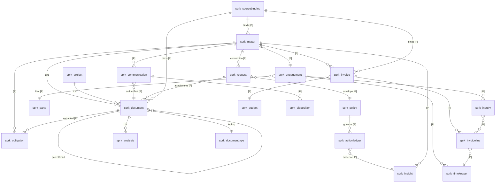

# Spaarke Ontology-Centric Platform Strategy — Analysis Synopsis

**Status:** Strategy synopsis for discovery handoff
**Version:** 2.2 — adds the platform statement (§1.4.0), the Policy object (§4.8), and the verified Microsoft IQ-family research; corrects the sequencing conclusion
**Date:** 2026-09-19 (v2.0) · 2026-09-21 (v2.1, v2.2)
**Audience:** Claude Code (discovery + design analysis)
**Source:** Strategy working session, Ralph / Claude

> **v2.0 change note.** v1.0 treated "Microsoft moves up the stack" as a hypothetical risk and carried one unverified claim about the Microsoft Legal Agent for Word. Both are corrected here. Microsoft shipped into three layers of this architecture between March and October 2026, and the frontier labs both launched legal verticals with explicit orchestration-layer positioning. The strategic conclusion is unchanged and arguably strengthened — but several build decisions in §6 are now build-vs-buy decisions, and one shipped module faces direct platform overlap.

> **v2.1 change note.** v2.0 described the strategy but never defined the ontology in component terms, and carried four framings that the Phase 0 inventory and the 2026-09-21 refinement session falsified. Fixed here.
>
> **New:** §1.4 (what the ontology is — seven components, two modes) · §3.6 (three-scenario falsification test) · §4.7 (Inquiry / typed outcome / authority / ledger, defined concretely) · §5.5 (ingestion architecture) · §6.6 (AI agents) · D-o…D-r.
>
> **Corrected:**
> 1. **Services are not an anti-mechanic** (§1.1, §2.8). Palantir's are *engineering* services and compound nothing; Spaarke's are *domain* services, are a deliberate revenue source, and produce reusable packages. The test is "does the service produce a package," not "how little services."
> 2. **"No module-specific compiled code" is unachievable and partly undesirable** (§6.4, §9.4). Phase 0 measured NDA/Agreement at ~50/50 and Email Intelligence at ~95% compiled; surfaces and ingestion are platform by design. Replaced with **"compiled once for everyone, never per customer."**
> 3. **Reference vs mirror is not row-vs-no-row** (§3.2). Both create Dataverse rows. The distinction is enumeration + change detection, which is where the cost and the vendor dependency live.
> 4. **The epistemic tier is shipped, and it is four tiers not three** (§4.2). `InsightArtifact` (Fact / Observation / Precedent / Inference) is a real, deployed record type carrying subject · predicate · value · evidence · asOf · producedBy{version} · validFrom/validTo. Promote it; do not build it.
>
> **Also corrected:** "platform positioning collides with Power Platform" (§2.7) — it doesn't, because the customer cannot build the platform; and the "provisional object = trap" reading (§3.4) — the trap is *undeclared* divergence, and Palantir's edit layer is the governed version.

> **v2.2 change note.** Two things: the document still lacked a one-sentence statement of what the platform *does*, and the Microsoft "IQ family" research came back and invalidated several v2.0/v2.1 claims.
>
> **New:** §1.4.0 (the platform statement + the six-stage pipeline with current state per stage) · §4.8 (the **Policy object** — schema, seven rule types, the seven config locations it replaces, the LLM-perception/policy-judgment split, and how it is customer-configurable) · §2.5a (**Fabric IQ**, which did not exist in this document) · D-s…D-u.
>
> **Corrected:**
> 1. **Sequencing: binding is first, not Policy.** v2.1's §3.6 left Policy and binding as parallel priorities. They are the *middle* and the *front* of one pipeline, and consolidation is what the platform is for — so binding leads. Policy is the **matching layer**, not a governance add-on; v2.1 mis-sold it on defensibility.
> 2. **Foundry IQ does NOT support SharePoint Embedded as a first-class knowledge source**, and its GA scope is **extractive retrieval only** — query planning, synthesis and `retrievalInstructions` are still preview. §2.5's row was wrong on both counts.
> 3. **Work IQ's "Context" and "Workspaces" are marketing pillars, not shipped APIs** — no Learn endpoint pages exist; the surface is A2A + remote MCP + REST. App-only remains unsupported (now verified, not assumed).
> 4. **Agent Framework rc1 → GA is a migration, not a version bump** — and it has broken roughly monthly since (latest 1.22.0, 2026-09-18). Phase 0 item 12's "only a bump" is wrong.
> 5. **A deterministic Policy evaluation is a `Fact`, not an `Observation`** (§3.5 step 2). The shipped taxonomy reserves Observation for probabilistic, confidence-gated, LLM-extracted claims requiring human review; mislabelling policy output inherits review semantics it does not need and muddies D-F0.
> 6. **Dataverse audit is disqualified as the defensibility record** (§4.5) — five specific mechanical limits, not merely "no bitemporal query."
>
> **Also:** Legal Agent for Word is **still Frontier preview, not GA**, with playbook ingestion limited to local `.docx` upload + SharePoint (no DMS, no MCP) — D-n's clock is softer than v2.0 claimed. Entra Agent ID for Dataverse is **preview**, and delivers only the *access* half of authority.

---

## 0. How to use this document

This is a **strategy synopsis, not a design specification**. It captures the conclusions of a strategy working session and is intended as the input to a Claude Code discovery pass that will produce the actual design artifacts.

> **⚠️ Companion document — read it for terminology and component boundaries.** [`ontology-component-model.md`](ontology-component-model.md) (2026-09-24) is the authoritative reference for **vocabulary, definitions, engine boundaries and the component model.** Where the two disagree, **the component model wins** — it was written later and deliberately replaces terms this document invented.
>
> Specifically, it **supersedes** the following in this document: ~~"binding registry"~~ → `sprk_externalconnection` · ~~"connector manifest"~~ → `sprk_externalfieldmapping` · ~~"ledger"~~ (customer-facing) → **Decision Record** · ~~"field classes"~~ → **attribute ownership** · ~~"originate"~~ → **system of record**. It also names **Connection Engine** as the third engine alongside Insights and Action, establishes the **declaration / machinery / output** split, and resolves that a Decision Record is a *new record type* rather than an extension of `SessionLedgerEntries`.
>
> This document remains authoritative for **strategy, market state, positioning, waves and the open-decision register.**

**Notation used throughout (Spaarke conventions):**

| Tag | Meaning |
|---|---|
| `[Cited]` | Sourced from an external reference or a verified project document |
| `[Judgment]` | Analytical conclusion from the working session; not verified |
| `[Open]` | Unresolved decision |
| `[VALIDATION NEEDED]` | Assumption that must be checked against source before use |
| `[PROPOSED: name]` | Component named in this document that does not yet exist in the codebase |

**Mandatory first step:** Phase 0 codebase inventory before any design artifact is produced. Nothing in Section 6 (Component Register) should be trusted as a description of the repo until verified in source. The state tags in this document are drawn from project documentation, not from a code read.

---

## 1. Background — the strategic question

Spaarke is an enterprise legal operations intelligence platform built natively on the Microsoft stack (Dataverse, SharePoint Embedded, Azure AI, ASP.NET Core BFF, Power Platform). The session addressed a single strategic question:

> Can Spaarke adopt Palantir's business and architectural model — ontology as the product, actions bound to objects, land-via-working-artifact go-to-market — applied to legal, on Microsoft infrastructure?

The conclusion is yes, with three material adaptations, and it requires a repositioning away from the current migration-first / replacement posture in Spaarke's published materials.

### 1.1 Palantir's model, stripped to mechanics `[Cited]`

1. **The ontology is the product; models are rented.** Differentiation is the semantic layer that makes enterprise data intelligible to AI, not the LLM. Switching LLM vendors is configuration; rebuilding an ontology is a multi-year project. Switching cost is accumulated semantic work.
2. **The ontology binds to actions, not dashboards.** Foundry models objects, links, *and* permitted write-back actions. Analytics is a byproduct; the unit of value is a governed decision.
3. **Land via a working artifact.** The AIP Bootcamp is a five-day pilot on the customer's own data. Reported ~75% conversion, >1,300 run, compressing a 12–18 month sales cycle to weeks.
4. **Forward-deployed delivery, productized.** Engineers ("Deltas") paired with deployment strategists ("Echoes") embed 6–18 months; patterns feed back into platform R&D. Services are the R&D intake valve, not the revenue.
5. **Land / expand / scale pricing.** Low-cost entry, millions in ARR at scale, NDR >118%.

**Anti-mechanic — corrected in v2.1:** professional services run at 18–20% of revenue `[Cited]`. v1.0/v2.0 read this as a margin tax to be minimized. That is the wrong lesson for Spaarke, and the distinction is load-bearing:

- **Palantir's services are *engineering* services** — building a customer-specific ontology and its mastering pipelines. Bespoke every time; compound nothing.
- **Spaarke's services are *domain* services** — legal-operations and legal-technology expertise, policy authoring, playbook design, resolution tuning. Scarce, defensible, a deliberate revenue source, and they *produce reusable packages* (§6.4).

**The test is not "how little services" but "does the service produce a package."** A policy pack authored for customer A is inventory for customer B. A mastering pipeline written for customer A is not. `[Judgment]`

### 1.2 What does and does not translate `[Judgment]`

**Translates:** ontology thesis, action-bound objects, the bootcamp, sovereign deployment as a compliance moat, land/expand pricing.

**Does not translate:** the government anchor, capital intensity, full-stack build, FDE headcount. Palantir built Gotham/Foundry/Apollo because nothing existed underneath in 2006. Spaarke rents all three from Microsoft.

**Translates *better* than Palantir's own version `[Added v2.1]`:** customer-built custom applications. Palantir had to build Workshop because nothing existed underneath it. Because the Spaarke ontology lives in Dataverse, every object is natively reachable from Power Apps, Power Automate, Power BI and Copilot Studio — a maker ecosystem with millions of trained users, rented rather than built. The commercial inversion: **a customer extending Spaarke with their own Power App costs Spaarke nothing.** Palantir's extensibility requires Palantir; ours does not. Consequence for design: **objects must be deliberately maker-accessible** — documented, view-ready, security-trimmed — as an obligation, not a side effect.

**Where Spaarke must be *better* than Palantir, not equal:** identity resolution (§7.4 D-e). Palantir solves it with forward-deployed engineers writing per-customer mastering pipelines. Spaarke has forsworn that headcount, so the resolution ladder has to ship pre-built. This is achievable only because Spaarke is vertical — legal is unusually rich in natural keys (client-matter number, LEDES vendor ID, timekeeper ID, UTBMS codes, bar number, canonical client number) that a horizontal platform cannot assume. **Their generality forces the services drag; our specificity is what lets us productize it.** `[Judgment]`

### 1.3 The critical structural difference — Spaarke can be the system of record

Palantir structurally **cannot** be the system of record. It has no transactional application layer — no forms runtime, no document storage, no row-level end-user security model. Foundry must always sit above something that owns the record. That is a permanent ceiling on their model.

Spaarke has Dataverse, SPE, a security model, a forms runtime, and a workflow engine. Therefore:

> **Binding mode is a dial, not a fork — and the dial can move after deployment.**

This is the single largest differentiation available. Documents can start referenced in iManage; two years later, promoting the Document class to Originate is a migration against a schema that already exists, not a re-platforming.

**Commercial claim:** *start where you are, move when you want, never re-implement.* No overlay vendor can offer it; no suite vendor can offer the overlay entry point. `[Judgment]`

**Discipline risk:** the capability to be SOR will pull every deal toward rip-and-replace because it looks like a bigger contract. The architecture must make overlay the **default configuration** so full-SOR is an explicit customer decision. `[Judgment]`

---

### 1.4 What the ontology *is* `[Added v2.1]`

v2.0 argued for the ontology without defining it. This is the definition; everything in §§4, 6, 7 elaborates it.

> **The Spaarke Legal Operations Intelligence Ontology** is the declared, versioned model of how a legal organization works: the object classes it operates on, where each one's truth lives, the deterministic facts computed over them, the governed actions permitted against them, and the immutable record of every decision taken.

#### 1.4.0 What the platform *does* — the statement everything else serves `[Added v2.2]`

> **Spaarke consolidates information from the systems a legal organization already runs, resolves it into one governed picture of its matters and parties, matches that picture against the organization's own rules to propose actions, and accumulates the record of what was decided.**

Four clauses. Each is load-bearing, and dropping any one lands the product in a category we do not want:

| Drop… | …and we are |
|---|---|
| **consolidate** | a point solution |
| **resolve** | a dashboard over mismatched data |
| **match + act** | a data warehouse |
| **record** | automation, not intelligence |

**The defining act is consolidation from third-party systems.** That is why the platform is worth deploying at all: iManage knows documents, the e-billing platform knows spend, the matter-management system knows matters, Exchange knows correspondence — and **none of them can answer "is this matter going badly?", because that question needs all four.**

**Consolidation is upstream of origination, not parallel to it.** §3.3's originate list (Request, Policy, Obligation, Inquiry, ledger, Engagement) is not a separate product line — **every originated object is a product of acting on consolidated information.** You cannot originate a Budget Inquiry without consolidated invoice data; you cannot dispose a Communication into a Matter without consolidated matter identity. Consolidation is what makes the platform useful; the originated objects are what accrue from operating it, and they are what make it sticky (§8).

**This does not conflict with §2.7's "do not differentiate at the document-context end."** MCP solved document *retrieval*. It did not solve **cross-class consolidation** — matter identity across MM + e-billing + DMS + Exchange, which is an identity-and-authority problem, not a retrieval problem. We *consume* iManage's MCP server and do the thing above it. That is §2.2 consequence 3 restated: MCP standardizes connection and nothing above it.

##### The six-stage pipeline — and honest current state

**bind → resolve → compute facts → match to action → execute under gate → record**

| Stage | Component | State (Phase 0 + source review) |
|---|---|---|
| **bind** | 2 · binding declaration | ❌ **zero code.** `sprk_sourcetype` is an ingest-path discriminator; SPE is hardwired. Complete design to harvest (`spaarke-connect-integration-module-r1`) |
| **resolve** | identity resolution | ✅ **strong** — 13-rung ladder with an explicit deterministic/AI partition, `AffinityStore`, `sprk_recordtype_ref`, `RecordMatching` — **but only for email→record.** Party/lookup resolution is the extension (§7.4 D-e.1) |
| **compute facts** | 4 · fact supply | ⚠️ real but **scattered** — `ILiveFactResolver` is the seam with 3 resolvers; ~8 more deterministic services sit outside it |
| **match to action** | 5 · **Policy** | ❌ **hardcoded across seven places.** This is what the Policy object is for (§4.8) |
| **execute under gate** | 6 · actions & gates | ✅ **strongest layer** — ADR-039 Binding catalog, 8 dispositions, `OutputRouter`, `ConfirmationPolicyEngine`, `GateDecisionV2`. Missing: **authority** (§4.7.3) |
| **record** | 7 · ledger | ⚠️ **session-keyed, not object-keyed.** Storage primitive exists (ADR-015 Cosmos Tier-2) |

> **The two weak stages are the front and the middle — `bind` and `match`. Both are at zero, and that is the sequencing answer.** It supersedes v2.1's framing of Policy and binding as competing priorities: they are the front and middle of one pipeline. **Binding leads**, because consolidation is the defining act. **Policy follows**, because there is nothing to match against until the data is consolidated. The ledger is downstream of both and can wait.

#### 1.4.1 Seven components

| # | Component | What it declares |
|---|---|---|
| 1 | **Objects & links** | Typed classes on the fixed Matter / Project / Invoice spine; typed edges between them |
| 2 | **Binding declaration** | Per class: *reference*, *mirror*, or *originate*; exactly one authoritative system **per attribute** |
| 3 | **Field classes** | pointer · projected · derived (§7.2) |
| 4 | **Fact supply** | Deterministic computation over objects. No model call (D-F0) |
| 5 | **Policy** | Legal-authored, versioned, deterministically evaluable constraints |
| 6 | **Actions & gates** | Permitted writes, each carrying **authority** and **provenance** |
| 7 | **Ledger** | Immutable record of every governed decision and the evidence behind it |

Models, tools and surfaces above the ontology are rented and replaceable. **The ontology is the product.**

#### 1.4.2 Two modes on one schema — and what that is *not*

Every dual-mode entity exists in one of two postures, declared per class, per deployment:

- **Index mode** — Spaarke holds identity, the attributes needed to route/filter/display/link, and everything it derives. Another system is authoritative.
- **System-of-record mode** — Spaarke is authoritative.

Three properties of this that are easy to get wrong:

1. **The mode is per-field, not per-row.** Even in index mode a row is not read-only: *pointer* fields are never edited, *projected* fields are read-only and stamped `sourceasof`, *derived* fields are Spaarke-owned and fully writable **in the same row**. This is what lets Spaarke attach an intake disposition, a priority, and a score to *someone else's* matter. A row-level toggle would make the layer useless.
2. **The dial turns one way.** Index → SOR is a promotion: additive, schema already present, data already flowing. SOR → index is a demotion and is hard. §1.3's claim is specifically the promotion direction.
3. **Not every class is dual-mode, and the partition is the scope statement.**
   - **Dual-mode** (an incumbent might own it): Matter, Project, Invoice, Document, Party, Timekeeper, Communication — ~8 classes.
   - **SOR-only by construction** (the §3.3 originate list — no incumbent exists): Policy, Obligation, Request + disposition, Inquiry, Engagement, action ledger, Fact/Observation/Precedent/Inference.

   **Only ~8 of ~70 `sprk_*` entities ever need binding work.** The white space is SOR-only *because* it is white space.

#### 1.4.3 The answer to "then why not just migrate?"

Because **the line is authority, not storage.** Every system in the stack already has a copy of matter data — the warehouse, the BI tool, the DMS metadata, the intranet list. Having a copy has never been the distinguishing act. The question is *who decides what a matter is, and who is accountable when it is wrong.*

Concretely, a real MM matter record carries 100–300 fields; index mode projects 10–15. The other ~285 are why the system is sticky, and none of them are the matter record: matter numbering workflows finance owns, conflicts checking, rate cards and rate exceptions, UTBMS/task-code sets, WIP and AR aging, trust accounting, time capture, the LEDES submission chain to clients, the accounting integration.

And the risk asymmetry is what the buyer's committee is actually evaluating: **if our sync breaks, Spaarke shows stale data and they still bill. If we have migrated and we break, the firm cannot bill.**

The honest answer to the objection is therefore not *no, never* — it is: **yes, eventually, if you decide you want to; and when you do it is a promotion against a schema that already exists, not a re-platforming.** The objection converts into the differentiator.

#### 1.4.4 Two guards that must hold, or the objection becomes correct

Both are self-inflicted failure modes, and both need declared mechanisms rather than conventions. `[Judgment]`

1. **Projected-set creep.** Every "we just need one more field from their MM system" walks toward de-facto migration with none of the benefits — we carry the integration burden and the field surface without the authority or the revenue. §7.2's rule ("never store a projected attribute a user would be tempted to edit") needs teeth: a declared, reviewed field set per binding.
2. **An edit layer with no reconciliation path.** If users propose changes in Spaarke and the source system never hears about them, we have not built an overlay — we have built a **fork**, and the customer's data has diverged into two truths. See §3.4 Pattern D.

#### 1.4.5 What the ontology is *not*

It is **not** "a special-purpose database plus an environment for building apps on top of other systems." That description is accurate as far as it goes and dangerous as a framing, for three reasons `[Judgment]`:

- It ratifies per-customer engineering as the value (see §6.4's corrected boundary).
- It routes the sale to IT rather than to the named owner of a legal-operations outcome.
- It is a precise description of Power Platform, which Spaarke is *built on* — so it leaves "why not just use Power Platform?" unanswered.

The answer to that objection is that **Power Platform is raw material**: the gap between "you have Dataverse" and "you have a legal-operations ontology with policies, gates, resolution rungs and a decision ledger" is two to three years of domain modeling the customer will never do. That answer only lands if the pre-built content is *shown* — which makes rule density (§4.6) the commercial asset, not just an architectural observation.

Finally, and separating it from BI: **a warehouse reads; the ontology writes.** A warehouse can tell you the matter ran 18% over budget. It cannot tell you that you asked about it, whom you asked, under whose authority, what they said, and that it closed as a $43k write-off — because until the ontology captured the intervention, none of that was a value anywhere. See §4.7.

---

## 2. Product strategy and positioning in the legal AI market

### 2.1 Current positioning contradiction `[Cited — project documents]`

Published Spaarke materials (`spaarke-for-your-it-team`, functional specification) currently state that Spaarke is "replacing or consolidating systems that already hold legal data," lead the onboarding section with what migrates, and claim "no separate DMS to license, deploy, or maintain."

This is rip-and-replace positioning. It places Spaarke in a simultaneous displacement fight against iManage/NetDocuments and an e-billing incumbent, on a 12–18 month cycle, in a segment that does not switch. It is also incompatible with a five-day bootcamp, which cannot begin with a migration.

**Required correction:** reposition from migration-first to **binding-first**, with migration as one of three options.

### 2.2 MCP became the interop layer `[Cited]`

Between May and September 2026 the legal DMS vendors standardized on Model Context Protocol as the AI access layer:

- **iManage MCP Server**, GA 14 May 2026 — open-protocol connection letting any AI system access governed iManage content without custom integrations or bulk data exports, preserving existing security, ethical wall, and compliance controls. Positioned as working with Claude, ChatGPT, Copilot, Harvey, Legora, and firm-built agents. Separately listed as a **Microsoft premium connector on Microsoft Learn** (preview, page updated 23 Jun 2026) for Copilot Studio, Power Automate, Power Apps and Logic Apps.
- **NetDocuments** announced its MCP collaboration with Anthropic on 12 May 2026; at ILTACON announced an expanded ecosystem (Gemini Enterprise alongside Claude, Copilot, Perplexity, Harvey, Legora).
- **Casepoint** MCP server launched 30 Jul 2026. **Thomson Reuters CoCounsel MCP server** launched May 2026. **Entegrata** announced one.
- **Harvey is both MCP client and MCP server** — a deliberate strategy stated since Dec 2025. Its server exposes five tools (`ask_harvey`, `ask_with_knowledge_source`, `list_knowledge_sources`, `list_vault_projects`, `ask_about_vault`) over Streamable HTTP with OAuth. Documented supported clients: Claude, Gemini, M365 Copilot — **ChatGPT is absent**, which shows how fast reach becomes asymmetry.

> **Correction to v1.0.** v1.0 stated that Microsoft Legal Agent for Word "reached enterprise GA May 2026, connecting to both DMSs via MCP." **This is not verified and is contradicted by Microsoft's own documentation.** Correct position: the agent is in Frontier public preview (worldwide since 12 Jun 2026), GA is **early October 2026** (slipped from September), and playbook ingestion is documented as local upload or SharePoint only, with **no DMS connector support documented**. `[VALIDATION NEEDED]` — re-check at GA.

**Three consequences:**

1. **Reference-mode binding is now solved for law-firm documents.** Permission-bound, ethical-wall-respecting, fully logged, no export, no copy. The customer's own DMS vendor built it, so the security review is theirs, not Spaarke's.
2. **MCP deliberately does not solve mirror mode.** iManage's framing is explicit: access *without* bulk export, and the AI tool does not store a copy. That is a product decision. MCP provides session-scoped, user-permissioned retrieval — **not** enumeration, change data capture, a stable schema contract, or transactional writeback. An ontology built from user-scoped retrieval is unstable: two users asking the same question see different corpora. **MCP feeds interaction, not state.** `[Judgment]`
3. **MCP standardizes connection and nothing above it.** It standardizes no part of identity mapping, matter-scoping, ethical-wall propagation across tools, cross-tool audit, cost attribution, or retention policy. Trade analysis in Aug 2026 advised firms to maintain "a curated internal registry of approved servers, proper OAuth 2.1 authorisation, permission inheritance from source systems" — i.e. to assemble that layer themselves. **That is a description of an unbuilt product category.** `[Judgment]`

### 2.3 The frontier labs entered legal — with orchestration-layer positioning `[Cited]`

Both frontier labs shipped legal verticals in 2026, structured almost identically:

- **Claude for Legal** (Anthropic, 12 May 2026) — 12 practice-area plugins, 20+ MCP connectors (iManage, NetDocuments, Ironclad, DocuSign, Relativity, Everlaw, Thomson Reuters CoCounsel, Harvey, Definely, Box, and more), delivered through Claude apps, Claude Cowork, Claude for Word/Outlook/Excel, and the API. Each plugin opens with a **setup interview that learns the team's playbooks, escalation chains, risk calibration and house style.** Freshfields deployed across thousands of users. Legal IT Insider's framing: *"an orchestration layer for legal work: one interface capable of accessing legal research tools, document management systems, transaction platforms and specialist legal AI products."*
- **Astra for Law** (OpenAI, **18 September 2026 — one day before this document**) — built on GPT-6 Astra, with a Legal Search Index over 230M+ URLs of US case law/statutes/regulations claiming 40% relative improvement over standard GPT-6 web search on legal questions; zero data retention for eligible firms; a Trusted Access Program; **26 partner-built plugins and 47 community-built plugins**. Partners include Thomson Reuters, Harvey, Legora, iManage, Intapp, Litera, Relativity, Clio. Governance framework co-developed with Latham & Watkins.

**Harvey, Legora, Thomson Reuters and iManage appear in *both* ecosystems. Neither lab won exclusivity.**

Four parties now explicitly claim the orchestration layer in their own words: Anthropic (via the Claude for Legal framing), Harvey (*"it's becoming the system through which legal work gets done"* — $11B valuation, Mar 2026, 25,000+ custom agents), **LexisNexis (shipped a product component literally named "Protégé Work," described as an orchestration layer, 7 May 2026)**, and iManage/NetDocuments (claiming the *context* layer — governed content, permission inheritance, ethical walls, audit).

**The flank none of them can hold is neutrality.** `[Judgment]` A frontier lab cannot credibly orchestrate a rival lab's tools. Harvey cannot credibly orchestrate Legora. A platform with no model of its own and no drafting product is the only party that can route work to whichever tool the customer actually chose — and survive the customer switching. **This is a positioning asset Spaarke has by construction and should claim explicitly.**

### 2.4 Fragmentation is the steady state — the data `[Cited]`

**ILTA 2026 Technology Survey** (published 14 Sep 2026; 500+ firms, ~140,000 lawyers, 12 countries) is the strongest dataset and it settles the question:

| Product | Firms using |
|---|---|
| Microsoft 365 Copilot | 76% |
| Anthropic Claude | 44% |
| Thomson Reuters CoCounsel | 44% |
| Harvey | 43% |
| Lexis+ AI | 26% |

Large firms (700+ lawyers) run **Copilot 88%, Harvey 84%, Claude 64% concurrently.** 94% of firms are using or exploring generative AI, up from 80%. **Nine separate tools exceeded 50% pilot adoption; only two exceeded 50% full deployment** (Copilot 52%, Westlaw Advantage 50%).

Read the gap: **wide piloting, narrow deployment.** Summing usage across five products alone gives 233%. Multi-tool is the norm.

Corroborating behavioural evidence: **Microsoft's own ~2,000-person CELA legal organisation adopted Harvey in July 2026 — while Microsoft was shipping a competing Legal Agent for Word.** If the most vertically integrated vendor in software will not single-vendor its own legal department, no customer will. `[Judgment]`

Demand-side pressure points at operations, not drafting:
- **CLOC 2026 State of the Industry** (2 Mar 2026): **85% of legal departments now have dedicated AI resources or committees**; expectations of increased outside-counsel spend fell 58% → 37%; only 47% expect internal budget increases, down from 65%.
- **ACC / Everlaw** (14 Oct 2025, 657 in-house professionals): 52% actively using GenAI, more than double 2024; **64% plan to use GenAI to rely less on outside counsel.**
- **Thomson Reuters Future of Professionals** (Jun 2026): warns of a **widening gap between AI adoption and realised AI value.**

**Strategic reading:** departments do not need a seventh way to draft a clause. They need to govern, route, measure and defend the six tools they already bought. `[Judgment]`

### 2.5 Microsoft platform movement — what just got commoditized `[Cited]`

This is the section that changes build decisions. Between March and October 2026 Microsoft shipped into three layers of Spaarke's architecture. **Every item below is dated and verified against Microsoft primary sources.**

| Microsoft move | Date / status | Layer hit | Consequence for Spaarke |
|---|---|---|---|
| **Azure AI Foundry → Microsoft Foundry** rename | Ignite 2025 (Nov) | L0 naming | Azure OpenAI is now "Azure OpenAI in Microsoft Foundry Models"; docs/SDK/portal drift |
| **Foundry IQ** — a *label* over Azure AI Search agentic retrieval (the product surface is still AI Search REST/SDK). Knowledge bases over 12 source kinds; **no `sharePointEmbedded` kind** | **GA since Apr 2026 via REST `2026-04-01` — but GA scope is EXTRACTIVE RETRIEVAL ONLY.** Query planning, answer synthesis, reasoning effort, `retrievalInstructions`, multi-turn all still **preview**. Serverless billing began 13 Sep 2026 | **L4** | 🚩 Build-vs-buy at the query layer only — **and the capability we lack is the part that is not GA.** See §6.5 for the corrected delta. `[Corrected v2.2 — v2.0's "SharePoint Embedded as a first-class knowledge source" and "knowledge bases GA 2 Jun 2026" were both wrong]` |
| **SharePoint Embedded agent SDK deprecated** — React `ChatEmbedded` control retired, replaced by Foundry Agent Service (SPE as knowledge source) or M365 Copilot Retrieval API | **Mar 2026** | **L5/L4** | 🚩 Direct migration exposure if any Spaarke surface used it. **Phase 0 must check.** |
| **Work IQ** — M365 workplace intelligence. **Shipped surface is A2A + remote MCP + REST only**; the MCP server exposes 10 (documented 11) tools over Graph `/me/`, `/users/`, `/sites/`. **"Context" and "Workspaces" are pillars in the marketing, NOT shipped APIs** — no Learn endpoint pages exist. Billed on **Copilot Credits, independent of Copilot licensing** (Tools API 0.1 credit/call). **Entra delegated only — application-only is not supported and no application permission exists.** | **GA 16 Jun 2026** for the three endpoints; Foundry / Copilot Studio / AI Search consumer surfaces are **preview** | **L0** | 🚩 **VERIFIED, not assumed:** app-only is unavailable, so `PlaybookService`, `ScopeResolverService` and every Service Bus job handler are structurally excluded. Adoptable **only on the user-turn path**. ISV access works via OBO but the *customer* must: have a Global Admin provision the Work IQ service principal, grant admin consent for our app, and stand up a **usage-based billing plan** with credits assigned — and our app must be multi-tenant with tokens from the user's home tenant. **Dataverse is excluded from the allowed `fetch` prefixes**; "Dataverse in Work IQ" is preview with no GA date. `[Corrected v2.2]` |
| **"Dataverse in Work IQ"** — Dataverse Work IQ APIs, MCP servers, agentic Dataverse Search, business skills, native agent identities | Dataverse 2026 Release Wave 1 (Apr–Sep 2026) | L0/L1 | Dataverse business data surfacing into M365 Copilot natively — relevant to the M365 surface strategy |
| **Microsoft Agent Framework 1.0 GA** — convergence of Semantic Kernel + AutoGen; .NET and Python; native MCP + A2A; YAML declarative agents; graph workflow engine | **~2–3 Apr 2026**; SK on maintenance ≥ Apr 2027 | **L3** | Default answer to "what do we build agents on." If any Spaarke orchestration uses Semantic Kernel, plan migration. |
| **Microsoft Agent 365** — enterprise agent control plane: registry, shadow-AI discovery, Intune policy access control, Defender investigation. **$15/user/month or included in M365 E7.** Registry syncs with AWS Bedrock and Google Cloud (preview) | **GA 1 May 2026** | **L6** | 🚩 A paid governance gate enterprise buyers will require. Registration becomes a procurement checkbox — and early registration is a distribution advantage. |
| **Microsoft Entra Agent ID** — identity/auth/governance for agents, incl. non-Microsoft platforms | GA ~1 May 2026; **Dataverse preview 6 Aug 2026** (agent gets Entra identity + linked Dataverse agent user with least-privilege roles) | **L6** | Direct fit with Spaarke's gate/authority model — the Dataverse variant is the one to track |
| **MCP first-party across the stack** — M365 Copilot declarative agents (GA 15 Dec 2025), Foundry Agent Service MCP tool (GA), **Dataverse MCP server** (`/api/mcp`, supports Claude Desktop/Code, VS Code, Copilot Studio), Power Apps MCP server, Work IQ MCP (GA 16 Jun 2026), MCP servers as Foundry IQ knowledge sources | Various, mostly GA | **L5** | 🚩 **An MCP server over the Spaarke ontology is the single highest-leverage integration artifact** — it reaches Copilot, Foundry, Copilot Studio, Agent Framework, Claude, and ChatGPT simultaneously |
| **MAI model family** — MAI-Thinking-1 (reasoning, 35B, 256K ctx), MAI-Voice-1/2, MAI-Image-2.x, MAI-Transcribe-1/1.5/2. Positioned explicitly on cost/latency vs OpenAI | Mixed GA/preview through 2026 | L0/L4 | Cheaper first-party tier for high-volume low-differentiation calls (classification, extraction, transcription) — fits the existing tiered model-routing doctrine. **Note: "MAI-1" and "MAI-Vision" do not exist as shipping model names — do not plan around them.** |
| **Microsoft–OpenAI partnership restructured away from exclusivity** | 28 Apr 2026 `[REPORTED]` | L0 | Azure OpenAI is no longer a moat; abstract the model layer |
| **Microsoft Legal Agent for Word** — full-agreement analysis, clause/risk/obligation identification, **negotiation-ready redlines as native tracked changes**, review against **uploaded internal playbooks**, citation links. Built by acqui-hired Robin AI engineers. Requires M365 Copilot licence + Frontier enrolment | Announced 30 Apr 2026; worldwide Frontier preview 12 Jun 2026; **GA early Oct 2026** | **Product overlap** | 🚩🚩 **Playbook-based contract review with tracked-change redlines ships inside Word at Copilot-licence price in ~3 weeks.** This overlaps Spaarke's shipped NDA Analysis / Agreement Analysis module directly. |

**Two corrections to prior Spaarke materials this research surfaced:** `[VALIDATION NEEDED]`
1. Project docs describe the AI layer as "Azure AI Foundry (knowledge grounding), Microsoft Copilot Studio (orchestration), Microsoft Agent Framework (execution)." With Agent Framework 1.0 GA and the documented Microsoft split (Copilot Studio = low-code/M365; Foundry + Agent Framework = pro-code/custom), **Copilot Studio should be described as a build-time authoring tool only** — which matches internal doctrine but not all published copy.
2. "Foundry IQ" is used correctly in Spaarke materials — it **is** a real Microsoft product name. ~~But it is now GA and does far more than the materials imply.~~ **Corrected v2.2:** it is a *label* over Azure AI Search agentic retrieval, and its GA scope is extractive retrieval only. It is a decision, but a narrower one than v2.0 implied.

### 2.5a Microsoft shipped an ontology layer — the "IQ family" `[Added v2.2 — verified against Microsoft primary sources 2026-09-21]`

v2.0 and v2.1 missed **Fabric IQ** entirely. Microsoft's own framing groups four capabilities under "Microsoft IQ", and the mapping onto Spaarke's seven-layer model is clean:

| Microsoft IQ | Microsoft's own words | Spaarke layer | Verdict |
|---|---|---|---|
| **Work IQ** | "how employees work" | L0 substrate | Adopt **narrowly** — user-turn only |
| **Fabric IQ** | "the live state of the business, so agents understand business **entities and their relationships, properties, actions, and rules**" | **L5 Surface — not L1** | Downstream projection at most |
| **Foundry IQ** | "**policies**, authoritative documents, and reusable knowledge bases" | L4 Inference | Buy the planner; keep the rest |
| **Web IQ** | the web | L4 | n/a |

> **The sharpest contrast available to us is sitting in that table. Microsoft files "policies" under Foundry IQ — as *documents you retrieve*.** Spaarke's Policy is a versioned object that gets **evaluated**, and whose version number gets **cited on a decision** (§4.8). Same word, different kind of thing — and that one contrast is the difference between a knowledge base and an ontology. `[Judgment]`

#### Fabric IQ — what it is, and why it is L5 not L1

Announced Ignite **2025-11-18**. The ontology language is explicit: *"a shared, machine-understandable vocabulary of your business — the **things** (entity types), their **facts** (properties), and the ways they **connect** (relationships), while offering constraints and rules."*

**This is a positioning event before it is an architecture event.** "Ontology" is now a Microsoft word in the Fabric context, and buyers will ask whether the Spaarke ontology is the same thing.

**Status is muddier than the marketing.** Build 2026 (2026-06-02) announced *"Fabric IQ, now generally available"*; **Microsoft Learn still labels the workload "IQ (preview)" and the Ontology item preview on every page** (latest edit 2026-09-21). What is actually GA: Graph, Operations agent, Planning, Data agent, and the Power BI MCP. One trade outlet claimed the ontology layer is GA; Microsoft's own docs contradict it.

**Against our seven components:**

| # | Component | Fabric IQ |
|---|---|---|
| 1 | Objects & links | ✅ but **thinner** — no inheritance/subtypes; property types are `integer/boolean/datetime/double/string`. **`Decimal` is unsupported and nulls out in Graph** — i.e. monetary values, with Invoice as a spine object |
| 2 | Binding declaration | ❌ one binding per entity type to one OneLake table. No reference/mirror/originate, no per-attribute authority |
| 3 | Field classes | ❌ no computed or derived properties; everything must be pre-materialized upstream |
| 4 | Fact supply | ⚠️ GQL is deterministic, but over a **copied snapshot with full-graph refresh**; the agent surfaces are LLM-mediated and token-metered |
| 5 | Versioned Policy | ❌ `Update Ontology Definition` **overwrites** |
| 6 | Gated actions w/ authority | ❌ **no instance write API at all.** "Actions" are Activator rules (Teams/email/Power Automate/pipeline) and the Operations agent — which executes **under its creator's identity**, approved via a Teams card |
| 7 | Decision ledger | ❌ nearest equivalent is a per-agent activity log |

Note: the Fabric IQ overview page claims the ontology defines *"rules, and actions… agents understand what actions are available and how to invoke them."* **No how-to page backs it, and the REST API has only definition CRUD — no instance writes.** That marketing-versus-docs gap will surface in a sales conversation.

**🚩 The Dataverse path is the disqualifying detail.** Bindings are **OneLake-only**. Dataverse reaches OneLake via Link to Fabric shortcuts, which are **read-only regardless of the user's permissions** and authorized by a **single fixed credential requiring system administrator** — *"all access to that shortcut is authorized using [the creator's] credential."* **Dataverse row-level security is stripped: everyone with lakehouse read sees every row.** In legal, where ethical walls partition the graph structurally (§4.6), that is disqualifying for anything authoritative — not a tuning problem. There is also no documented object-level security on ontology instances, and OneLake-security-enabled lakehouses are *excluded* from binding, removing the one Fabric RLS mechanism that might have helped. Worse, shortcut tables live in Dataverse Managed Lake while only **managed** lakehouse tables are bindable — so the practical path is probably a *second* copy into a managed table.

**Conclusion: Fabric IQ is a legitimate downstream consumer and a non-starter as the ontology.** It belongs exactly where §6.1 already puts Power BI / Fabric — **L5 Surface** — as an analytical graph projection and a Microsoft-branded grounding surface for Copilot Studio / Foundry / M365 Copilot. It does not touch L1. `[Open — D-s: publish a Fabric IQ projection as an additive downstream surface?]`

#### Other verified status corrections `[2026-09-21]`

| Item | Corrected status |
|---|---|
| **Microsoft Agent Framework** | 1.0 GA **2026-04-02**; latest **1.22.0 (2026-09-18)**. rc1 → GA carried real breaking changes (`Microsoft.Agents.AI.AzureAI` → `…AI.Foundry`, structured-output rework, checkpointing decoupled, orchestration renames) and it has **broken roughly monthly since**. **Phase 0 item 12's "only a bump to 1.0 GA" is wrong** — this is a migration on a moving target. **Pin minor versions.** Upside: 1.22 shipped **Approval Binding replay**, worth evaluating against `ConfirmationPolicyEngine` (in-process only, so not a durable gate). SK support window is `[Reported]` only — no primary Microsoft statement exists |
| **Legal Agent for Word** | **Still Frontier preview, NOT GA.** GA remains "early October 2026," already slipped once from September. Playbook ingestion is **local `.docx` upload + SharePoint only — no DMS, no MCP, in any Microsoft doc.** Tracked changes confirmed; desktop Word for Windows ≥ 2604; M365 Copilot licence; no admin off-switch. **D-n's clock is softer than v2.0 claimed**, and the surviving differentiation is safer: an agent that can only read playbooks from a file upload cannot bind a finding to a Matter, a Policy version, or an approval authority |
| **Entra Agent ID for Dataverse** | **Public preview, not GA** (release plan said Aug 2026; not marked released). Full documented surface: an Entra agent identity → a Dataverse `systemuser` of a new **"Agent user"** type → **standard security roles** → audit attribution distinguishing agent from user. **No conditional authority, no value limits, no time-boxed delegation, no OBO semantics in Dataverse.** This is the **access** half; authority remains ours (§4.7.3) |
| **Agent 365** | **GA 2026-05-01.** $15/user/mo standalone; M365 E7 $99/user/mo. Registration is **soft pressure, not a gate** — the registry surfaces an "Unmanaged agents" count visible to customer IT. Keep the Entra blueprint step cheap to add; do not treat as blocking |
| **Dataverse MCP server** | **GA at `/api/mcp`**, 15 tools, **delegated-only**, metered since 2025-12-15. **Custom/ISV tools do NOT go on `/api/mcp`** — there is a preview **MCP management server** that creates per-environment MCP servers and adds tools from Dataverse **custom APIs**, plus **"Bring Your Own MCP" and an ISV MCP Certification program** (called GA 2026-07-06). **That is a distribution channel for the Spaarke MCP server that v2.0 did not account for** (§6.6) |
| **Dataverse semantic model (preview)** | Auto-provisioned with Dataverse Intelligence; semantic indexing + a curated glossary; regenerates every 12 h. **No API, no ALM/solution support, cannot be created, not consumed by `/api/mcp`, and polymorphic relationships are unsupported.** That last one matters most: polymorphic regarding is load-bearing for us (ADR-024, `CoreAncestorResolver`, `sprk_todo`'s 11-entity regarding, §4.7.1's Inquiry) — so the one Microsoft semantic layer sitting on Dataverse cannot see our most important edges |
| **L1/L2 competition** | **None.** A deliberate search found no Microsoft business-concepts, knowledge-graph, or rules layer over Dataverse. **L1 and L2 remain entirely unclaimed.** |

### 2.6 What this does to the strategy `[Judgment]`

**The ontology-centric strategy is strengthened, not weakened.** Every commoditized layer is a layer the v1.0 analysis already said not to differentiate on. Foundry IQ commoditizing RAG, Work IQ commoditizing M365 context, and Legal Agent for Word commoditizing playbook review all confirm the central thesis: **value accrues to originated objects and governed actions, not to retrieval or drafting.**

But three things become urgent rather than important:

1. **NDA Analysis / Agreement Analysis needs a repositioning within weeks, not quarters.** When Word ships playbook review with tracked changes at Copilot price, a standalone clause-deviation module is not a product. What survives is what Word cannot do: the deviation tied to a Matter, an Obligation, a Policy version, an approval authority, and an audit record. Same analysis, different output contract.
2. **The MCP server (egress) moves from "Designed" to first-priority build.** It is the single artifact that makes Spaarke reachable from every tool in the ILTA table at once, and it is how Spaarke becomes the neutral layer described in §2.3 rather than one more interchangeable tool.
3. **L4 becomes a build-vs-buy decision.** Continuing to hand-build retrieval orchestration now costs differentiation *and* engineering time. The engineering should move to L1 and L2 — exactly what the §6.2 observation already implied.

### 2.7 Positioning conclusion `[Judgment]`

- **Do not build differentiation at the document-context end.** That gap is closing and the DMS vendors own the repository.
- **Do not compete on drafting.** That war is over and it was expensive. Harvey ($11B, 100k lawyers), Legora ($5.6B, $100M ARR), CoCounsel (1M users), plus Microsoft giving away structure-aware redlining inside Word at Copilot-licence price. **Robin AI had a real product, Fortune 500 customers and ~$10M ARR, and was wound down inside a year in the drafting lane.** The marginal price of drafting is heading to zero.
- **Differentiation is the set of objects no incumbent claims:** Request, Disposition, Obligation, Policy, Inquiry, the action ledger, the Engagement edge. A DMS context graph is document-centric by construction and will never hold spend, intake, or disposition.
- **Claim neutrality explicitly.** No model of its own, no drafting product — Spaarke is the only party in §2.3 that can credibly route work to whichever tool the customer chose. Build for N tools; tool-agnosticism is the product, not a compatibility checkbox.
- **Sit above the DMS, not beside it.** iManage and NetDocuments won governed *documents* in May 2026 and did it well. The unclaimed ground is governed *process* — what matter this is, what stage, who must approve, what the obligation calendar says, and which of the customer's six AI tools already touched this document.
- **Platform framing is now buyable — with a named outcome on the label.** `[Added v2.1]` v2.0 implied legal departments buy point outcomes, not platforms. That is changing: CLOC's finding that **85% of departments have dedicated AI resources or committees** is a platform-buying posture, and the Aug-2026 trade advice to firms — maintain a curated registry of approved MCP servers, OAuth 2.1 authorization, permission inheritance — is advice to assemble a platform. The surviving constraint is linguistic, not strategic: *"legal operations intelligence platform"* sells; *"an environment for building applications"* does not (§1.4.5).
- **Existing positioning to retain:** "Legal Operations Intelligence" category claim; AI-directed, human-controlled; no primary-law research; two-sided data position (firm + department); Tenant Dedicated Deployment.
- **Positioning to retire:** DMS replacement, migration-first onboarding, consolidation framing.
- **Two-sided benchmarking carries a governance hazard** that directly contradicts the sovereignty promise. Consent, de-identification, aggregate-only derivation, and structural pipeline separation must be designed before the claim is made publicly.
- **Sales artifact worth having:** Microsoft ran Harvey in its own legal department (Jul 2026) while shipping a competing legal agent. That single fact kills the "we'll just standardise on Copilot" objection.

### 2.8 Commercial architecture `[Judgment]`

Per-user licensing (current model, per project documents) is the wrong shape: it prices the seat rather than the ontology, gives no expansion vector when agents do the work, and turns the land motion into a headcount negotiation.

Recommended structure:

| Phase | Unit |
|---|---|
| Land | Fixed-fee five-day sprint, credited to year one |
| Platform | Annual subscription priced on ontology scope — object classes live, connectors bound, action classes enabled |
| Expand | Additional module archetypes and adjacent domains as ontology extensions |
| AI | Pass through on the customer's Azure EA (already the current model — strategically correct, retain) |
| **Domain services** `[Added v2.1]` | Priced as delivery, **not** minimized. Legal-ops and legal-technology expertise is scarce and is a real revenue line. Every engagement's deliverable includes at least one reusable artifact — a policy pack, a playbook pack, a connector manifest, or a resolution rung set (§1.1 corrected anti-mechanic, §6.4) |

---

## 3. The Spaarke approach — overlay architecture

### 3.1 The rule

> **Originate the workflow, reference the record.**

Spaarke is system of record only for objects no incumbent claims; it binds by reference to everything else. This works because of an asymmetry in legal: incumbent systems own **artifacts** and almost nothing owns **process**. `[Judgment]`

### 3.2 Three binding modes, declared per object class

| Mode | Behavior | Access requirement | Default for |
|---|---|---|---|
| **Reference** | Source keeps the artifact; Spaarke holds pointer, projected attributes, derived features, edges, freshness stamp | Retrieval only (MCP is sufficient) | Documents (law firm segment) |
| **Mirror** | Read-only synchronized projection for graph/query performance | Enumeration + change detection (API, export, or replica) | Matters, invoices, timekeepers, rate cards |
| **Originate** | Spaarke is system of record | None | See 3.3 |

> **Correction, v2.1 — reference vs mirror is NOT "row vs no row."** Both modes create Dataverse rows, and they must: Matter is the spine, so `sprk_document`, `sprk_servicerequest`, `sprk_communication` and `sprk_todo` all need a Dataverse lookup to it — you cannot point a lookup at a record that is not a row, cannot row-level-security-trim a non-row, and cannot build the link graph without both endpoints. Storage is structural here, not a performance optimization.
>
> The real distinction is **enumeration and change detection**:
> - **Reference** — rows appear *lazily*, when something surfaces the item (a user acts on it, a search hits it, a link is made). No complete inventory. Retrieval access suffices, which is why MCP is enough.
> - **Mirror** — a complete, continuously synchronized set. Requires the source to permit enumeration and change detection. **This is where §5 says vendors fail you and where the cost lives.**
>
> Customer-facing, this collapses to §1.4.2's two modes; the three-mode declaration stays in the manifest because it determines cost and vendor dependency.

### 3.3 The originate list (white space — no incumbent to displace)

Request · Triage disposition + immutable audit log · Obligation · Policy (OCG, envelope, SLA, delegation) · Fact / Observation / Inference · Action ledger and every gate decision · Engagement edge (department matter ↔ firm matter) · The link graph itself.

### 3.4 Clarification: "read-only" means third-party systems, not Spaarke

An earlier framing in the session was imprecise and is corrected here. **Spaarke is fully read-write on every object it originates from day one.** The constraint is on mutating records inside iManage or the e-billing platform.

Actions decompose into three patterns (Palantir uses all three):

- **Pattern A — writes to a Spaarke-originated object.** Source system has no field for it and no reason to hold it. *Most legal actions are this pattern.*
- **Pattern B — acts on the world through a channel the source does not own.** Email, Teams post, task, generated document, calendar entry. Real operational effect, zero writeback. *Bulk of early Palantir deployments.*
- **Pattern C — genuine writeback.** Idempotent queued job through the source API, async, with conflict detection and reconciliation, only for action types the source owner approved.
- **Pattern D — declared edit layer. `[Added v2.1]`** Spaarke originates a record or an attribute change against a *mirrored* class, marks it explicitly as **not yet in the system of record**, attributes it to an action + actor + timestamp, and reconciles on the next sync via the identity ladder. Never rendered as an equal peer to a synced record.

  This is Palantir's actual mechanism and it is worth adopting: in Foundry, **Actions write to an ontology edit layer, not to the backing dataset**, and an object's current state is *backing row + accumulated edits*. Objects can exist as edits alone. Writeback to the source is a separate, explicit pipeline — a different concern from the action succeeding. Foundry therefore never has the S1 problem (§3.6), because it never consults the source for truth at runtime; divergence is a managed, reconciled condition rather than an error.

  **Correction to the v2.0 reading:** a "provisional object" is not inherently the failure mode. **Undeclared** divergence is. Pattern D is the governed version — attributed, visibly marked, and reconciled by an explicit path. Pattern D with *no* reconciliation path is not an overlay; it is a **fork** (§1.4.4).

**Sequencing rule:** A and B in phase one; D as the designed destination for mirrored classes; C earned per action, per system. Not because writeback is hard, but because not needing it is what makes a weeks-long deployment possible.

**Note on Spaarke's stricter rule than Palantir's. `[Judgment]`** "Exactly one authoritative system per attribute" is *stricter* than Foundry's model, and deliberately so: Foundry sits above systems of record and has no forms runtime, so nobody edits a Matter there expecting iManage to agree. Spaarke has a forms runtime and real end users, so silent divergence surfaces as a user-visible lie in a way it never does for them. **Adopt the edit layer; reject the copy-everything default.** The binding-mode dial is the thing Spaarke has that Palantir structurally cannot, and it is worth the extra rule.

**Hard constraint for the manifest:** for any attribute, exactly one system is authoritative, declared explicitly. Two systems holding matter status is the failure mode that kills overlay architectures, and it fails silently.

### 3.5 Why this is not a data warehouse + dashboard

Worked example — *"this matter is running over budget; I need to ask outside counsel to investigate."*

**Warehouse + BI:** a report shows variance. Someone maybe opens it, forms a judgment, switches to Outlook, writes from memory, gets a reply in two days, notes it in a spreadsheet. The variance was recorded; the inquiry, reasoning, response, and outcome were not. Next quarter the system knows nothing more than before.

**Spaarke ontology:**
1. Variance computed deterministically at L2 from mirrored invoice/accrual data → a **Fact** with provenance, not a model opinion.
2. **Policy** object evaluates it (threshold, matter phase, rate card) → produces a **Fact** linked to Matter, Invoice lines, Engagement. `[Corrected v2.2 — v2.0/v2.1 said "Observation."]` A deterministic policy evaluation is a `FactArtifact`, confidence 1.0, with `producedBy: {kind: "query", id: "policy://POL-BUDGET", version: "v3"}`. The shipped taxonomy reserves **Observation** for *probabilistic, LLM-extracted, confidence-gated* claims requiring human review (§4.2); mislabelling policy output as an Observation inherits review semantics it does not need and muddies D-F0.
3. Surfaces in briefing/triage with a proposed **Action: Budget Inquiry** — templated and gated. Drafts a grounded message, creates a Task, creates an **Inquiry** object linked to Matter, Invoice lines, Timekeeper, Engagement. One-keystroke confirm; who/when/which policy version/which facts recorded.
4. Reply arrives in Exchange; classification ladder links it to the Inquiry thread; disposition File+Act; Inquiry resolves with a **typed outcome** (write-off / accrual revision / approved scope change / no action).
5. Nothing wrote to the e-billing system.
6. Engagement now carries resolved-inquiry history and response latency. Across 200 matters and 4 quarters this produces the **Matter Report Card** — which exists *only because the intervention was captured as an object*.

> **A warehouse records what happened to the business. An ontology records what the organization decided to do about it — and that record is the asset.**

### 3.6 The three-scenario falsification test `[Added v2.1]`

The thesis is falsifiable in one table. Three real customer shapes, expressed purely as binding declarations:

| Object class | **S1** — has e-billing + matter management; wants SPE + intake/front door | **S2** — has MM + e-billing + DMS; wants "ensure we're working toward our goals and priorities" | **S3** — has a DMS; no e-billing, no MM, no process |
|---|---|---|---|
| Document | **Originate** (SPE) | **Reference** (their DMS) | **Reference** (their DMS) |
| Matter | **Mirror** (their MM) | **Mirror** (their MM) | **Originate** |
| Invoice | **Mirror** (LEDES) | **Mirror** (LEDES) | n/a |
| Request · Policy · Obligation · Disposition · Inquiry · ledger | **Originate** | **Originate** | **Originate** |

> **Three customers, one platform, one differing declaration on two object classes.** If these require three codebases, the thesis is dead. **If any of them requires per-customer C#, we have reinvented the FDE model without the FDEs.**

**Per-scenario notes:**

- **S1 — cleanest sale, and it carries the trap.** SPE documents ship today; intake is Legal Front Door (designed, unexecuted); the Communication association engine is real. But their MM system is authoritative for matter identity and status, so without a mirror binding we would have to originate `sprk_matter` too — the §3.4 silent-divergence failure mode. **S1 is not sellable today**, despite looking like the easy one. It is also the scenario that forces the Pattern-D question, because Front Door's entire purpose is Request → Matter conversion and a mirrored Matter cannot be created locally. Options, in order of increasing ambition: **(a)** Pattern B — Spaarke routes the request and emits an approved matter-open instruction, a human opens it in MM, the identity ladder reconciles on next sync (ships in a bootcamp window; the intake decision, authority and conversion edge are still originated and auditable); **(b)** Pattern D declared edit layer; **(c)** Pattern C writeback. (a) is the bootcamp answer; (b) is the destination.
- **S2 — proves the thesis, needs the most.** *"Ensure we're working toward our goals and priorities"* **is** the Policy object plus the fact layer plus Observation. More of this ships than expected: `ScorecardCalculatorService`, `sprk_kpiassessment` with a 100+ KPI catalog including OCG compliance, `SignalEvaluationService`, `FinanceRollupService`, `PriorityScoringService`, the `LiveFactResolver`s. Spaarke stores almost no customer data in this shape — a real security-review advantage. Two gaps: goals/priorities would be hardcoded config today (no Policy object), and — the one to watch — **shipping scorecards without the inquiry loop produces BI**, which §3.5 exists to prevent. The Observation → Inquiry → typed-outcome cycle is what makes it an ontology.
- **S3 — most of it ships today, and it is the discipline test.** Matter originates, process originates. One binding: Document → reference. This is where §1.4.3's dial pays off (start referenced, promote later). It is also the shape that pulls hardest toward rip-and-replace because it looks like the biggest contract, so overlay must remain the default configuration.

**What the test surfaced `[Judgment]`:** binding (component 2) gates **all three** — S1 and S2 need Matter→mirror; S2 and S3 need Document→reference; neither exists (`sprk_sourcetype` is an ingest-path discriminator, and SPE is hardwired rather than declared). **Today none of these three is cleanly sellable.**

**Sequencing conclusion `[Rewritten v2.2]`.** v2.1 framed Policy and binding as parallel priorities. Per §1.4.0 they are the **front and the middle of one pipeline**, and the ordering follows from that:

1. **Binding leads.** Consolidation from third-party systems is the defining act of the platform. All three scenarios are blocked on it, so **today none of them is cleanly sellable** — `sprk_sourcetype` is an ingest-path discriminator, and SPE is hardwired rather than declared.
2. **Policy follows**, because it is the *matching* stage: there is nothing to match a rule against until the data is consolidated. It is also cheap (consolidating seven existing shapes) and it is a hard prerequisite for the authority ledger — you cannot record "authorized under policy P-14 v3" until v3 exists. See §4.8.
3. **The ledger is downstream of both** and can wait.

And the test scopes binding far tighter than §9.3 implies: these three scenarios need **two object classes × two modes** — Matter mirror, Document reference — not a Connector Manifest covering every class. That is the minimum viable binding slice.

---

## 4. Legal Operations Ontology — focal points

### 4.1 Spine (fixed, do not extend)

**Matter · Project · Invoice.** Everything else connects to one of the three. Workspace is a collaboration surface, not a spine object.

### 4.2 Object tiers

- **Tier 0 (spine):** Matter, Project, Invoice
- **Tier 1 (operational):** Request, Document, Communication, Party, Engagement, Timekeeper, Obligation, Deadline/Task, Clause/Provision, Budget/Accrual, Policy
- **Tier 2 (derived/epistemic) — SHIPPED, and it is FOUR tiers not three. `[Corrected v2.1 against source]`** `Fact` · `Observation` · **`Precedent`** · `Inference`. [`Models/Insights/InsightArtifact.cs`](../../../src/server/api/Sprk.Bff.Api/Models/Insights/InsightArtifact.cs) is a deployed polymorphic record carrying `Subject` (scheme-prefixed, e.g. `matter:M-1234`) · `Predicate` · `Value{Raw, DisplayHint}` · `Evidence[]` · `AsOf` · `ProducedBy{Kind, Id, Version}` · `Scope{tenant, matter, client, practiceArea, jurisdiction, year}` · `ValidFrom` / `ValidTo`. Facts carry confidence 1.0 by construction; Precedents carry a lifecycle status instead of a confidence; Inferences are never authoritatively stored.

  **That is a claim triple with provenance and temporal validity — the ontology's claim layer, already built, under a different name.** Three properties v2.0 did not know about: `ProducedBy.Version` is *mandatory on Observations* (the policy-version pattern already exists, pointed at playbooks); `ValidFrom`/`ValidTo` means temporal validity is already modeled at the claim layer even though Dataverse rows are greenfield (§4.5); and `Evidence[]` with typed refs is "what evidence was cited," shipping.

  **Verdict: promote, do not build.** `InsightArtifact` should become the platform's canonical claim contract rather than one feature's wire format, and [`ILiveFactResolver`](../../../src/server/api/Sprk.Bff.Api/Services/Insights/LiveFacts/ILiveFactResolver.cs) — deliberately generic ("new predicates do NOT require interface changes"), three implementations today (Matter, Invoice, Project) — should become the L2 `IFactSupply` contract Phase 0 asked for.

  **Caveats:** it is **narrowly surfaced** — `/api/insights/ask` · `/search` · `/assistant/query` on the server, and essentially *one widget* on the client (`InsightSummaryCard` in `Spaarke.AI.Widgets`, mounted on `MatterHeaderView` and `VisualHost`), which `InsightWidgetsTelemetry` confirms. And `IInsightGraph` has only `StubInsightGraph` behind it — the graph is a seam, not an implementation. Also supporting: `GroundingVerifyNode`, `EvidenceSufficiencyNode`, `ReturnInsightArtifactNode`, `DataverseObservationMirror`, `PrecedentProjectionSync`, and a deterministic decline path.

  *This tier is ahead of Palantir's framing — their derived properties carry no epistemic class — and should be treated as an ontology tier, not an Insights Engine implementation detail.*

**Two objects requiring specific attention:**

- **Policy as a first-class object.** Triage policies, green/yellow/red envelope, OCG rules, SLA definitions, delegation thresholds currently live in different places with different shapes. They are the same object: legal-authored, versioned, deterministically evaluable, with owner, effective date, audit trail. **Highest-value ontology ADR available.**
- **Obligation as a first-class object.** Extracted from documents, linked to parties and dates, status changing over time. Makes Portfolio/Obligation Intelligence a module rather than a search feature.

### 4.3 Links are the moat, not objects

Everyone has a matter table. The defensible edges, in order:

1. Communication → thread → matter (produced by the deterministic classification ladder; nearly impossible to retrofit)
2. Invoice line → timekeeper → activity code → matter → budget (LEDES/UTBMS-literate)
3. Document → clause → obligation → party → date
4. Document → document precedent similarity (already shipping via vector similarity)
5. Request → matter (conversion edge)
6. **Engagement edge — department matter ↔ firm matter.** Exists in no competitor's schema. Build the edge before building benchmarking on it.

### 4.4 Actions with gates

| Action class | Objects | Gate |
|---|---|---|
| Classify + confirm | Communication, Request, Document | Confirmation gate |
| Dispose | Communication (File / File+Act / Route / Hold / Dismiss) | Confirmation gate |
| Route / assign | Request, Matter, Invoice | Deterministic + confirm |
| Release under envelope | Request, Document | Green auto / Yellow one-click / Red counsel |
| Convert | Request → Matter | Confirmation gate |
| Draft / revise | Document | Human-controlled, provenance-logged |
| Adjust / accrue | Invoice, Budget | Policy-evaluated |
| Hold | Matter, Document, Communication | Irreversible by design |
| Escalate | any | Policy-driven |

Every action must carry **authority** (role, under which delegation policy) and a **provenance record** (which rule, which policy version, which corpus answer, which model, which human confirmed).

### 4.5 Bitemporality `[Open]`

Legal needs two clocks: when something was true, and when it was known. Privilege determinations, litigation hold scope, conflict checks, and defensibility of auto-resolved requests all require reconstructing prior state.

**`[VERIFIED against Microsoft primary sources, 2026-09-21 — v2.2]` Dataverse audit is disqualified as the defensibility record.** Not merely "no bitemporal query" — five mechanical limits, each independently fatal:

| Limit | Consequence |
|---|---|
| Audited values **> 5 KB are truncated** — Microsoft's own docs say "can't use it to restore" | a policy evaluation or evidence payload silently loses its tail |
| **Web API `RetrieveRecordChangeHistory` omits `AuditRecord`** — no who/when per row; `changedata` is not exposed in Web API at all | our BFF is Web-API-based; who/when requires the SDK or a direct `audit` table query (1 link-entity max, `systemuser` only, not on TDS) |
| Change tracking is **record-level with no old values**, and the delta token **expires in 7 days** (`ExpireChangeTrackingInDays`) | unusable as a change-detection substrate for mirror mode beyond a ≤7-day cadence |
| Audit rows consume **Log capacity — the default environment gets 1 GB**; overage blocks environment create/copy/restore | enabling audit broadly across a legal-ops schema is an unmodelled cost line. **Model it before turning audit on.** |
| Long-term retention is **FetchXML-only** (`datasource="retained"`), capped at **5 concurrent users / 100 queries per day per environment**, and rows are **purged from the transactional DB** | not a queryable compliance surface |

**As-of / point-in-time query does not exist and is not on the roadmap.** Backups are whole-environment-restore-only, to a sandbox. The Recycle bin (GA 2026-04-27) covers deletes only, 1–30 days.

**Therefore the temporal strategy is not "use audit" — it is:**
1. **Immutable Policy versions with effective/expiry dates** (§4.8) — this is what makes "what did the rule say in March?" a row lookup. Phase 0's "80% of temporal defensibility without bitemporal Dataverse" is exactly this.
2. **Effective/expiry dates on delegation rows**, so "was this actor authorized at T?" is answerable from our own data (§4.7.3).
3. **Our own append-only, hash-chained ledger** (§4.7.4) — ADR-015 Cosmos Tier-2 already provides SHA-256 + 7-year retention.
4. **Dataverse audit as corroboration only**, enabled deliberately on the authority / decision / delegation tables, with Log capacity budgeted.

Note the claim layer already models temporal validity: `InsightArtifact` carries `AsOf`, `ValidFrom` and `ValidTo` (§4.2). Temporal is greenfield **at the row layer**, not at the claim layer. An ADR on temporal semantics should still precede ontology-spec freeze; retrofitting is expensive.

### 4.6 Why a legal ontology is not a generic one

1. Privilege and work product are **object attributes**, not access rules — they travel with the object and survive export.
2. The document is frequently **the record**, not a description of it.
3. **Counterparties are adversarial sources** — extracted values from opposing paper carry a different trust class.
4. **Rule density is extreme** (OCGs, billing guidelines, retention, ethical walls, delegation). Palantir ontologies are constraint-sparse; legal's is constraint-dominated. Encoding this is slow, specific work — which is the moat.
5. **Ethical walls are structural** — they partition the graph, not just the rows.

### 4.7 Inquiry, typed outcome, authority, ledger — defined `[Added v2.1]`

§3.5 claimed these four things differentiate an ontology from BI without saying what they are. Concretely (none of this schema exists today):

#### 4.7.1 Inquiry — `sprk_inquiry`

**A question put to someone, with a bounded answer space, that stays open until answered.**

| Field | Worked example |
|---|---|
| regarding | Matter 4471 · Invoice INV-8832 lines 22–31 · Engagement (Fenwick) · Timekeeper |
| trigger | Fact `budget_variance = +18.4%` at phase 3 + Policy `OCG-BUDGET v3` |
| addressee | Fenwick billing partner |
| channel | the Outlook message actually sent (the artifact) |
| opened / due | 12 Mar / 26 Mar — SLA derived from the Policy |
| authorized by | M. Reyes, Legal Ops Manager |
| status | open · answered · resolved · escalated · abandoned |
| outcome | typed — §4.7.2 |

**Why not a `sprk_communication` subtype?** An Inquiry *has* communications; it is not one. A Communication is one message, one direction, one moment — and it already has its own dispositions. An Inquiry is a state machine over an expected answer: it survives the messages, may span four of them, may change channel, and can be **overdue** — which a message cannot. Putting the outcome on a message attaches it to one leg of a conversation instead of to the question. So: `sprk_inquiry` 1..N `sprk_communication` — the messages are the evidence trail, the Inquiry is the open item. Same relation as Matter : Document.

**Why not `sprk_todo`?** A Todo is "I must do something." An Inquiry is "someone owes me an answer," and the answer is the data.

**Core-record association is mandatory.** An Inquiry with no regarding is an orphan: it needs a spine anchor (Matter / Project / Invoice), a specific subject (invoice lines, obligation, document), and the counterparty (Engagement / Party). This is **solved infrastructure** — `sprk_todo` already carries 11-entity polymorphic regarding under ADR-024, with `CoreAncestorResolver` + `PolymorphicResolverService` + the `RegardingResolver` PCF. Reuse, do not build.

**Open: Inquiry and Request may be one object.** They are structural mirror images — asker, addressee, expected response, SLA, typed outcome, evidence links; only the direction and the outcome option set differ. One entity with a direction discriminator would collapse two proposed objects into one *and* settle the `sprk_servicerequest` vs `sprk_legalrequest` duplication. See **D-o**.

#### 4.7.2 Typed outcome

An **option set**, not free text: `WriteOff` · `AccrualRevision` · `ScopeChangeApproved` · `RateExceptionGranted` · `NoActionJustified` · `NoResponse`, plus an amount where applicable.

**What it buys, tangibly:** *"Fenwick resolved 7 of 9 budget inquiries; 4 write-offs totalling $43k; median response 6 days; 2 abandoned."* Two hundred of these across four quarters **is** the Matter Report Card (§8 Wave 3).

**The distinction from data that already exists — corrected in v2.1.** v2.0's implied claim was "this information exists nowhere else." That is too strong: it usually *does* exist, as a note on an invoice or an email on the matter. The real distinction is four things:

1. **Typed** — `WriteOff, 43000` rather than "they agreed to knock 43k off." A value, not prose.
2. **Located** — attached to the question it answers, not to *an* invoice.
3. **Countable** — 200 matters × 4 quarters becomes a number; prose in 4,000 note fields does not.
4. **Constitutive rather than descriptive** — the note is *evidence about* a decision; the record **is** the decision, with who decided and under what authority.

So the answer to "we already have this" is not "no you don't." It is **"you have it in four thousand places, in prose, and you cannot count it"** — which the buyer can verify in five minutes.

**Relation to Daily Briefing — the line is *derived vs originated*, not write vs read.** Both write. Daily Briefing writes a *rendering*: delete it and regenerate from the same rows and you get the same thing. It is an **Inference** in §4.2 terms — explicitly never authoritatively stored. A typed outcome is a **Fact** where Spaarke is the system of record; delete it and the information is gone. The Briefing pattern (deterministic query → Layer 1/Layer 2 LLM narration) *is* reused twice here — to compose the outbound inquiry, and to surface open/overdue inquiries — but capturing the outcome is not narration.

**Capture has three paths, and path 1 is sufficient:**
1. **Human sets it** — reads the reply, picks the outcome. Day-one answer, always available.
2. **AI proposes, human confirms** — the `AiClassificationRung` pattern (propose; structurally barred from auto-filing). Target for volume.
3. **Deterministic** — a credit memo matching the disputed lines arrives in the next LEDES drop; the fact layer computes it. Rare, best.

> **The Inquiry object earns its keep even if a human types every outcome.** The structure is the value; the automation is an optimization. This de-risks the whole construct.

**An outcome does not require an Inquiry** — outcomes arrive unsolicited. But without the Inquiry it is only a Fact. **The Inquiry is what makes the outcome attributable to an intervention** — the difference between spend data and a record of whether asking worked.

#### 4.7.3 Authority

Two distinct things; neither exists today.

- **(a) Who is permitted** — `requiredRole`, `delegationPolicyRef` + **version**. *"Release a yellow-envelope request requires Legal Ops Manager, or a Paralegal under delegation policy P-14 v3 while the manager is out of office."*
- **(b) Who actually did it** — `actorId`, `actedAt`, `authorityBasis` ∈ {own-role, delegated, escalated}.

Today `ConfirmationPolicyEngine` asks *"is this risky enough to require confirmation?"* — risk tier × origin × completeness. It never asks *"is this person allowed?"*

**Authority is a qualifier on access, not a replacement for it.** Access is the **precondition** (can you touch the row — Dataverse security roles + Unified Access Control); authority is the **qualifier** (may you make *this* decision, at this amount, under the delegation in force); the ledger is the **receipt**. Dataverse roles cannot express value-conditioned limits ("write-offs up to $25k"), cannot express time-boxed delegation, and — decisively — **evaluate and discard**, where authority must persist its basis onto the decision.

It should therefore be built as an **extension to UAC**, not a parallel scheme. `unified-access-control-r2` already designed the hard parts for the *access* question: an append-only access-event log, a **versioned evaluator** "so historical answers remain reproducible," and an attestation surface answering "who can see this, and why." Authority is the same machinery asked about decisions rather than visibility.

**The tangible test:** fourteen months later, in a dispute — *"who approved this, under what authority, and was that authority valid on that date?"* Today the answer is no.

#### 4.7.4 The ledger — written at the gate

**An append-only record of every governed decision, keyed to the objects it concerns.**

Today's `SessionLedgerEntries` (`SessionOutput`, `SessionToolChain`, `SessionGate`, Redis → Cosmos) is **session-scoped**: it answers *"what happened in this chat."* An action ledger is **object-scoped**: *"everything ever decided about Matter 4471."* Same storage, different key, richer entry:

> what was proposed · which **Fact** and which **Policy version** triggered it · who confirmed, under what **authority basis** · what **evidence** was cited · what the **outcome** was · what artifact it produced

**The mechanical rule: the ledger is written at the gate.** Every gate decision — approved, rejected, timed out, auto-approved — produces exactly **one** entry, regardless of how many rows it touched. **No gate, no entry.** This is checkable, and the write point already exists: `ConfirmationPolicyEngine` → `GateDecisionV2` → `SideEffectGateAIFunction`. It is fields plus a second key, not a subsystem.

This matches Palantir precisely: in Foundry the governed unit is the **Action**, and the audit of Action invocations — type, parameters, actor, resulting edit — *is* the defensibility record. Raw dataset changes are pipeline mechanics, not governance.

**Boundary against Dataverse audit** (so we do not reinvent it):

| | Records | Owner |
|---|---|---|
| **Dataverse audit** | what changed on a row — field, old value, new value, who, when | substrate; enable where compliance requires |
| **Ledger** | what was *decided* — action, objects, policy version, authority basis, evidence, outcome | ours |

Four things audit structurally cannot record: **why** (the triggering fact + policy version) · **what did not happen** (a rejected gate writes no row, so audit is blind to it — often the most legally interesting record) · the **authority basis** · and **grouping** (one decision spanning four tables yields four disconnected audit entries, not one decision).

**The test for every proposed ledger field: does it record something audit structurally cannot?** If not, use audit. Note that Phase 0 found `IsAuditEnabled` on 24 attributes and off on 39, with zero `RetrieveRecordChangeHistory` calls anywhere — so whichever half we rely on, it is not wired up today.

**Relation to Inquiry:** an Inquiry is *a ledger entry that stays open* — most entries are instantaneous (proposed, confirmed, done); an Inquiry is one with an addressee and an SLA. Keep them separate objects (the ledger is append-only; an Inquiry mutates), but that is the relationship. Dispositions, not inquiries, will dominate ledger volume ~100:1.

### 4.8 The Policy object — the matching layer `[Added v2.2]`

> **Framing correction.** v2.1 introduced Policy as *defensibility* — versioning, citation, "who approved this in March." That framing makes it sound like compliance plumbing bolted on the side. **Policy is the `match to action` stage of §1.4.0's pipeline.** The rule that gets from context to action has to live somewhere, and today it lives in compiled C#. Versioning and citation are *free byproducts* of moving it out of code — not the reason to do it.

"This invoice is 18% over budget at phase 3 → propose a Budget Inquiry." What performs that match? A threshold (18%), a condition (phase 3), and a mapping to an action (Budget Inquiry). **That is a policy.**

#### 4.8.1 Schema — two entities, because identity and content have different lifetimes

- **`sprk_policy`** — stable identity: code (`POL-AUTOFILE`), name, owner, category, scope (tenant / matter type / practice area), status. Never versioned; this is what a decision refers to.
- **`sprk_policyversion`** — immutable, 1..N per policy: version number, effective from/to, author, approver, approval date, and the **rule body**.

The rule body is **typed, with a closed option set** — `sprk_ruletype` plus a JSON body validated per type:

`Threshold` · `AllowList` · `Switch` · `DecisionTable` · `Envelope` · `SlaDefinition` · `DelegationLimit`

Universal entity, typed payload — the same call D-d makes for the ledger, for the same reason: otherwise every new policy class is a schema change, which breaks §6.4.

#### 4.8.2 What it replaces — the seven shapes Phase 0 found

| Today | Becomes |
|---|---|
| `sprk_communicationrule` (thresholds + privilege flag) | `Threshold` + `Switch` |
| `CommsPolicyOptions.cs`, `AffinityOptions` (appsettings) | `Threshold` |
| `AutoFileGate` / `CategoryRoutingGate` / `TrackingFooterGate` | `Switch` + `DecisionTable` |
| `SignalEvaluationService` thresholds | `Threshold` |
| `ConfirmationPolicyEngine` risk tiers | `DecisionTable` |
| `sprk_emailupdatefield` allow-lists | `AllowList` |

Plus the legal ones that do not exist yet: release envelopes (green/yellow/red), OCG billing rules, SLA definitions, delegation limits.

**Success is measurable: seven shapes → one.** That is also the cheapest available test of the §6.4 thesis, run on our own codebase before a customer is involved.

#### 4.8.3 Policy appears *twice* in the pipeline

Walking §3.5's worked example:

1. Fact supply computes the variance — `ILiveFactResolver`, **no rule applied**
2. **Policy as evaluator** — threshold × matter phase × rate card → RED
3. **Policy as router** — given RED, which action is warranted (Budget Inquiry), and who may authorize sending it (`DelegationLimit`)
4. Gate → Inquiry sent
5. External reply → classification → **typed outcome** — the *world's* answer, not the policy's

So Policy is both the query and the context→action mapping. The Inquiry is the action the mapping selected. **The typed outcome answers the Inquiry, not the policy** — steps 2–3 are derived; step 5 is originated (§4.7.2).

Both ends produce a claim, and the shipped envelope already models it: a policy evaluation is a `FactArtifact` with `producedBy: {kind: "query", id: "policy://POL-BUDGET", version: "v3"}`; a typed outcome is a `FactArtifact` evidenced by the Inquiry and the message that answered it. **One gap:** `ProducedBy.Kind` is currently `query | playbook | agent` — a human or external-party answer is a **fourth kind that does not exist yet**. Small, cheap addition to shipped code, and it makes the typed outcome a first-class claim instead of a bespoke field.

#### 4.8.4 Can a policy be a prompt? — no at run time, yes at author time

**Most policies must be evaluator code, not prompts.** Threshold, allow-list, switch, decision-table, delegation-limit and SLA are comparison, set membership, lookup or date arithmetic. An LLM *can* do them; it must not, for four compounding reasons:

1. **D-F0 forbids it** — no model call in L2.
2. **Reproducibility is the entire point of citing a version.** If `POL-BUDGET@v3` means something slightly different in September because a model drifted or a tier changed, the citation is worthless — and citability is why Policy exists.
3. **Testability** — a threshold runs against 500 fixtures for free; a prompt cannot cheaply be proven right 500 times.
4. **Cost and latency** — evaluating thresholds across 40,000 invoice lines through a model is absurd.

Non-determinism in a delegation limit is not a limitation, it is a compliance defect.

**The hard cases are real, and one pattern resolves them.** OCG narrative rules — *"outside counsel may not bill travel time without pre-approval"* — genuinely require reading the line narrative. The resolution is the pattern already in the codebase: **the LLM does perception; the policy does judgment.**

1. **LLM extracts a typed Observation** from the narrative: `{activityType: "travel", hours: 3.5, preApprovalReferenced: false}` — confidence-scored, quote-grounded, carrying `producedBy.version`.
2. **Policy evaluates the extraction deterministically**: `if activityType == "travel" && !preApprovalReferenced && !matterHasTravelApproval → violation`.

D-F0 stays intact: the model call happened *upstream*, producing a fact-shaped input; the evaluation itself contains no model. The decision is reproducible given the same extraction, and the extraction is independently re-runnable when the playbook improves — which is exactly what mandatory `producedBy.version` on Observations was built for.

This is already the house pattern: `AiClassificationRung` proposes but is structurally barred from emitting a record GUID or auto-filing; `agreement-review` splits `flaggedClause` (fact) from `assessment` (judgment) with `quotedText` as the citation.

#### 4.8.5 How it is customer-configurable

Two layers, **both data**:

| Layer | Artifact | Authored by |
|---|---|---|
| The rule | a `sprk_policyversion` row — JSON body of a closed rule type | legal-ops admin, in a form |
| The perception (only where narrative reading is needed) | a prompted `sprk_analysisaction` + output schema | domain services, or an advanced admin |

A new OCG rule is therefore **one Action JSON + one policy row referencing its output fields.** Per Phase 0's corrected boundary (§6.4), that exact combination is what is already packageable with zero new C#.

The constraint that keeps it safe is a **closed vocabulary**: a policy may reference only fields that exist — Dataverse columns, `ILiveFactResolver` predicates, or an extraction schema's outputs. **A customer cannot write a policy about something we do not extract.**

**The honest limit — configurable *content*, not configurable *concepts*:**

| Adding… | Costs |
|---|---|
| a new rule *instance* | a row |
| a new extractable *concept* | an Action (data) |
| a new **rule type** | **code** |
| a new **fact predicate** | **code today** — 3 `LiveFactResolver`s, hand-written |

That last row is the gap worth closing. *"We need a policy about X"* where X is not yet a predicate will be the most common customer ask, so **making `ILiveFactResolver` predicates declarative is probably the highest-leverage addition after the seven rule types.** `[Open — D-u]`

**And the clean answer to "why not just let the customer write a prompt":**

> **LLM at author time; deterministic at run time.**

The customer types *"outside counsel may not bill travel without pre-approval."* The system proposes the extraction schema and the typed rule body. A human reviews and approves the compilation. Thereafter it evaluates deterministically and citably. That is the Action Engine's Conversational Builder pattern — which that project correctly defers to R2/R3. **The LLM belongs in the authoring loop, never in the evaluation loop.**

#### 4.8.6 What Policy is not, and the one scope risk

- **Not a workflow engine.** It evaluates and returns; it never executes.
- **Not a general rules engine.** Seven closed rule types, not arbitrary logic.
- **Not a replacement for Dataverse security.** It is the authority *qualifier* above it (§4.7.3); `DelegationLimit` is the type that answers "may this actor approve $43k."
- **Not the same as ADR-041's confirmation policy** — that is one *consumer*. (Note the **D-F0 name collision** Phase 0 flagged between ADR-041's D-F0 and this document's.)

**Scope risk:** the temptation is an arbitrary rule body — an expression language or a scripting hook. That is how this becomes a six-month project instead of a six-week one. Seven fixed types with schema-validated bodies is tractable; "policies can express anything" is not. The house pattern already supports the disciplined version — ADR-039 closed catalogs, `DispositionRoutability`, and the Field Mapping Framework's `sprk_expression` as a **named** extension seam rather than an open door. Closed set plus one declared seam.

---

## 5. Source-system access — the ladder

Binding mode determines the required access mode:

- **Reference** → retrieval only. Almost every system can do this.
- **Mirror** → enumeration + change detection. *This is where vendors fail you and where cost lives.*
- **Originate** → nothing required.

**Access ladder, in preference order:**

1. **MCP server** — now best-in-class for reference mode in legal (see 2.2)
2. Vendor REST API (iManage Work API, NetDocuments REST, e-billing APIs)
3. Graph connectors / Azure AI Search indexers over the repository (index-in-place)
4. **Scheduled export or file drop** (LEDES, CSV, XML, SFTP) — underrated; zero vendor cooperation, already happens monthly, fully satisfies mirror mode for spend
5. Database read replica / ODBC (on-prem iManage, legacy ELM)
6. Email or SFTP push the vendor already sends
7. Power Platform connectors / Logic Apps
8. RPA or browser automation — **anti-pattern**; brittle and unsupportable
9. Human-mediated (user forwards, drops, uploads) — legitimate for bootcamp scope

**Practical conclusion:** the "no API" case is usually solved by **export + Exchange capture**, not by cleverness. A LEDES drop, a document index, and Exchange-layer email capture construct most of Waves 1–2 with zero vendor integration.

**MCP posture:** Spaarke should sit on **both sides** of the protocol — MCP **client** for ingress to source systems `[PROPOSED]`, MCP **server** for egress so the BFF grounds Copilot and the Word agent `[Designed]`.

### 5.5 Ingestion architecture — how data actually gets here `[Added v2.1]`

v2.0 listed an access *ladder* but never described the ingestion *architecture*. It is a significant part of the platform and it was unaddressed.

> **Emphasis correction, v2.2.** v2.1 framed this section as "the machinery required for mirror mode" — i.e. plumbing. Per §1.4.0, **consolidation from third-party systems is the defining act of the platform**, which changes how this is resourced. Renting the *transport* is still right (we are not competing with ADF). But the **semantic half — mapping, identity resolution, per-attribute authority declaration, freshness — is the product**, and should be resourced and staffed as product work, not as integration work. Identity resolution in particular moves from "D-e, the hard problem" to **the central engineering asset**: consolidating from N systems *is* the identity problem, and we have forsworn the FDE headcount Palantir uses to solve it (§1.2), so it has to ship pre-built.

#### 5.5.1 What Palantir does `[Cited — architecture; naming may have moved]`

**Data Connection.** An agent runs **inside the customer's network** and connects to sources (JDBC, REST, SFTP, S3, SAP, Salesforce…). Raw lands as an **immutable, versioned, transactional dataset**; pipelines then transform raw → clean → ontology-backing, with lineage across the whole graph and builds triggered on upstream change. Copy-first, batch by default.

Three properties are worth stealing, and only three:
1. **The agent sits inside the perimeter** — no inbound firewall holes. This is most of their security story.
2. **Raw is immutable** — a mapping bug is fixed by correcting the rule and re-running, not by repairing 4,000 rows.
3. **Lineage** — you can trace why any value is what it is.

#### 5.5.2 What Spaarke should do: own a narrow landing contract, rent the transport

| Layer | Owner | Content |
|---|---|---|
| **Transport** | **Rented, per source, swappable** | ADF / Synapse + the **on-prem data gateway** (the in-perimeter agent equivalent, already exists), Dataverse dataflows (Power Query, 100+ connectors, incremental refresh), Logic Apps, Azure AI Search indexers for reference mode, plain SFTP/file drop. The **iManage Work MCP connector is already a listed Microsoft premium connector** (§2.2). |
| **Landing contract** | **Ours, and thin** | One canonical staging shape per object class: pointer fields + projected fields + source stamps. **N transports, one contract.** |
| **Resolution + projection** | **Ours — this is the value** | The rung ladder resolves identity; field-class rules write projected attributes; `sourceasof` is stamped; unresolved items land in a human queue. |
| **Change detection** | Source watermark / CDC, else snapshot diff | The mirror-mode tax (§3.2). |

**Three consequences `[Judgment]`:**

1. **Our ingestion problem is ~1000× smaller than Palantir's by volume and roughly equal by semantic difficulty.** Eight mirrored classes × ~12 fields × thousands of matters and parties, plus tens of thousands of invoice lines per month. That is not a data-engineering problem. **Spend nothing on scale and everything on identity resolution and freshness honesty.**
2. **Reference mode needs no ingestion at all** — retrieval only. So this machinery is required for *mirror*, for ~8 classes, and nowhere else.
3. **Preserve the replay property cheaply.** Persist the raw sync payload keyed by run (ADR-015 Tier storage already exists). That recovers Foundry's "fix the rule and re-run" without building Foundry.

Most of the plumbing already exists: the ADR-004 job contract + `IJobHandler<T>`, `IIdempotencyService`, `ReferenceIndexingService` as an idempotent-indexer template, `DataverseIndexSyncService` as a sync template, and the rung ladder + `AffinityStore` for resolution.

#### 5.5.3 On a "connector library" / "Integration Engine"

The two halves have wildly different cost and must not be priced together:

- **Reference mode is nearly free.** iManage, NetDocuments, CoCounsel and Harvey all ship MCP servers. **One MCP client implementation serves every one of them.** That is a component, not a library.
- **Mirror mode is the work, and MCP deliberately does not help.** Per §2.2 consequence 2: session-scoped, user-permissioned retrieval — no enumeration, no change data capture, no stable schema contract, no transactional writeback. That is a vendor *product decision*, not a gap they will close. So Matter / Invoice / Party / Timekeeper need vendor REST APIs or exports.

But what is genuinely per-vendor in mirror mode is **the mapping, not the plumbing**: source field → canonical field, source key → identity rule, which system is authoritative per attribute, cadence, staleness behavior. **That is §9.3's Connector Manifest, and it is data.**

> **Target shape: one MCP client + one file-drop ingester + one REST adapter pattern + a manifest per source.** The "connector library" is a **library of manifests**, not of code. That is what makes it a package under §6.4, and what lets the domain-services team add source #16 without engineering — which is the services model in §1.1 working as designed.

**Two cautions.** First, §11 of root CLAUDE.md applies before naming an engine: an "Integration Engine" overlaps ADF, dataflows, Logic Apps and 1,000+ Power Platform connectors, and the *name itself* will pull the team toward building plumbing we are renting. Second, there **is** something genuinely ours worth building — **the binding registry and its operator surface**: which sources are bound, in what mode, last successful sync, what is stale, what failed, what is unresolved. Nobody rents that, and it is what keeps the overlay honest.

**Market sizing is favorable:** iManage, NetDocuments, five or six e-billing platforms and a handful of MM systems — roughly 15 targets cover most of the market, and half of them are a LEDES or CSV drop.

#### 5.5.4 Two open items

- **ADR-001 tension `[Open — D-p]`.** ADR-001 forbids Power Automate in core. Dataflows and Logic Apps sit adjacent to that line. There is likely a clean **path-A exception** (ingestion is per-deployment configuration, not core runtime), but it must be surfaced under root CLAUDE.md §6.5 rather than assumed.
- **Freshness honesty is not rentable `[Judgment]`.** Every transport will silently go stale. §7.5 is right that an overlay showing stale data loses trust faster than one showing nothing. A sync run record, a per-object `sourceasof`, and **visible staleness in the UI** are platform work and the part no vendor will build for us.

---

## 6. Component model

### 6.1 Seven layers

| Layer | Contents |
|---|---|
| **L0 Substrate** (rented, undifferentiated) | Dataverse, SPE, Entra/MSAL OBO, Graph, Service Bus, Redis, Cosmos, Azure AI Search, Azure OpenAI, Document Intelligence |
| **L1 Ontology** (owned — this is what is sold) | Dataverse schema, link graph, Spaarke Canonical Model, Connector Manifest, insights index |
| **L2 Fact supply** (deterministic, D-F0) | Arithmetic, dates, SLA, status derivation, policy evaluation, accrual, conflict/hold checks. **No model call reaches this layer.** |
| **L3 Action** | Action Engine, Playbook execution, Scope System, gate engine, session ledger, Service Bus job workers |
| **L4 Inference** | Grounding/retrieval, epistemic-class dispatch, Insights Engine, model routing, eval harness |
| **L5 Surface** | Three-pane operator app, requester surface, Compose, PCF, model-driven apps, M365 declarative agent / BFF-as-MCP-server, Power BI / Fabric |
| **L6 Control plane** | Provisioning orchestrator, managed-solution ALM, feature flags and kill switches, per-tenant rate limiting and token budgeting, telemetry, CI evals |

### 6.2 Component register `[⚠️ SUPERSEDED BY PHASE 0 — ~80% WRONG AT THE NAME LEVEL]`

> **Do not cite this register.** Phase 0 verified it against source and found 8 of 25 named entities absent, 6 renamed or actually columns, `EmailToDocumentJobHandler` / `EmailPollingBackupService` / `EmailFilterService` nonexistent, `spaarke-knowledge-index(-v2)` **retired** and structurally rejected by the control plane, `IAiToolHandler` a two-member tool contract (three-path dispatch is real but lives in the ADR-039 Binding catalog: Event → `EventRulesService`, Click → `SessionDispatchOrchestrator`, Text → `ToolHandlerToAIFunctionAdapter`), and the L6 provisioning control plane **shipped at ~300 files** rather than "[Designed]". Use [`phase0-codebase-inventory.md`](phase0-codebase-inventory.md) §1 and `docs/data-model/entity-relationship-model.md` instead. Retained below as the audit trail of what v2.0 asserted.
>
> Adopt the code's vocabulary, not this document's: **three execution models** (node playbook / direct Action / legacy sequential-tool — `DOCUMENT-PROFILE-AND-AI-EXECUTION-MODELS.md`) and **eight Binding dispositions** (`DispositionRoutability.cs`).

**L0 Substrate — [Shipped]:** Dataverse; SharePoint Embedded; Entra/MSAL with OBO; Microsoft Graph; Service Bus (`sdap-jobs`); Redis; Cosmos; Azure AI Search (`spaarke-knowledge-index-v2`); Azure OpenAI (`text-embedding-3-large`, GPT-4 tier); Document Intelligence.

**L1 Ontology — [Shipped]:** `sprk_matter`, `sprk_project`, `sprk_document` (SPE pointer + extraction fields), `sprk_analysis`, `sprk_emailprocessingrule`, `sprk_documenttype`; NavMap metadata-discovery service.
**[PROPOSED / Designed]:** Spaarke Canonical Model; Connector Manifest; `[PROPOSED: MatterResolutionService]`; Policy; Obligation; Request; Engagement; typed link store.

**L2 Fact supply — [Shipped]:** `EmailFilterService`; `AttachmentFilterService`; deterministic classification ladder; `DataverseAccessDataSource` (fail-closed authorization); Daily Briefing deterministic queries.
**[PROPOSED]:** SLA clock; accrual and variance computation; OCG rule engine; conflict and hold checks.

**L3 Action — [Shipped]:** `IAiToolHandler` three-path dispatch; `AnalysisOrchestrationService`; `ScopeResolverService`; `PlaybookService` / Playbook execution engine; session ledger; gate engine; ContextEnvelope; job contract pattern with `EmailToDocumentJobHandler`, `RagIndexingJobHandler`, `EmailPollingBackupService`; `ExportServiceRegistry` (Docx / PDF / Email / Teams).
**[Designed / PROPOSED]:** Action Engine; action ledger as a first-class object; `[PROPOSED: WritebackDispatcher]`.

**L4 Inference — [Shipped]:** Hybrid RAG (`RagEndpoints`: keyword + vector + semantic); `AnalysisContextBuilder`; `VisualizationService` (document similarity); entity extraction into `sprk_extract*`; model routing; eval harness.
**[Designed]:** Insights Engine; epistemic-class dispatch as a component rather than a principle.

**L5 Surface — [Shipped]:** PCF controls (`UniversalQuickCreate`, `SpeFileViewer`, `AnalysisWorkspace`, `DocumentRelationshipViewer`); three-pane app; Compose workspace (React 19 + Tiptap).
**[Designed]:** requester surface; BFF-as-MCP-server; declarative agent; unified manifest.

**L6 Control plane — [Shipped/Designed]:** feature flags and kill switches (ADR-018); rate limiting and token budgeting (ADR-013); App Insights telemetry; managed-solution ALM.
**[Designed]:** provisioning orchestrator.

> ### 🚩 CORRECTED IN v2.1 — the L2-thinness hypothesis is REJECTED
>
> v2.0 observed that **"L2 is the thinnest layer despite being the doctrinal foundation (D-F0)"** and proposed that this drive sequencing. Phase 0 tested it and found the opposite: **L2 is scattered, not thin.** Shipped deterministic services include the 13-rung ladder with an explicit deterministic/AI partition (`RungKind.cs`), the `sprk_communicationrule` declarative rules table, `RiConfidenceScorer` (pure function), `SignalEvaluationService`, `PriorityScoringService` / `EffortScoringService` (table-driven), `ScorecardCalculatorService`, `FinanceRollupService`, `CoreAncestorResolver`, `DailyBriefingCollector`, and `Services/Insights/LiveFacts/*LiveFactResolver` returning a deterministic `FactArtifact` per predicate — which *is* the L2 fact-supply seam already.
>
> Genuinely missing at L2: **SLA clock · OCG rule engine · conflict/hold checks · deterministic date parsing** (dates are LLM-extracted today) · a general condition→action rules engine (`EventRulesService` is a binding router, not a rules engine).
>
> **Invert the sequencing conclusion.** L2 needs **consolidation and naming** — one `IFactSupply` contract over `ILiveFactResolver` + `SignalEvaluationService` + the rungs (three LiveFactResolvers today versus ~8 deterministic services outside the contract). Engineering effort goes to **L1**: Policy, Obligation, Engagement, the authority ledger, and the binding registry. `[Corrected against source]`

### 6.3 Component typing rule

Five component types, **one per component**: Ontology Object · Deterministic Service · Action (gated) · Inference Service · Surface.

A component that is two of these is a design defect and should be split at the seam. This is the mechanical enforcement of D-F0 and provides a reviewable rule for Claude Code handoffs.

### 6.4 Distributable unit model — the commercial packaging

Six package types, not "modules":

1. Platform solution (ontology, fact layer, action engine, control plane)
2. Ontology extension pack (object classes, links, extraction schemas)
3. Policy pack (encoded constraints, versioned)
4. Playbook / Action template pack
5. Connector manifest (one per bound legacy system)
6. Surface configuration (layouts, registers, catalog definitions)

> **Required commitment:** redefine a "module" as *ontology extension + policy pack + playbook templates + surface config*.

> ### 🚩 CORRECTED IN v2.1 — "no module-specific compiled code" is retired
>
> v2.0 required **"no module-specific code"** and six **"generic execution paths"** for six output-contract archetypes. Phase 0 measured both and **both fail**:
> - NDA / Agreement Analysis is ≈ **50/50** by artifact (60–80 JPS/schema/row files vs 70–100 module-specific C#/TS); Email Intelligence is ≈ **95% compiled** (165 C# files under `Services/Communication/`).
> - The "six output-contract archetypes" **are not a repo concept.** Honest mapping: deviation ✅, structured extraction ✅, narrative synthesis ✅, cross-corpus tabular ⚠️ (no fan-out node), change-impact ⚠️ (Compose-bound), adversarial ❌. The node engine is **FROZEN**, so "generic execution paths" cannot mean new node types.
>
> **A constraint that cannot be met teaches the pipeline that constraints are advisory.** Replace it with the boundary that is true and enforceable:
>
> | | Packageable today (data) | Platform (compiled — by design) |
> |---|---|---|
> | | A prompted `sprk_analysisaction` + `sprk_playbookconsumer` Binding reusing an existing surface / disposition / tool set (e.g. a Lease Review sibling of NDA varying only grounding) · policy packs · knowledge packs · connector manifests · resolution rung sets | New tool handler · node executor · disposition leg in `OutputRouter` ("cannot be data") · surface (`surfaceLaunchRegistry` — in code **by design**, ADR-039) · `ConsumerType` · coded workflow · widget · export format · ingestion |
>
> ### The replacement test
>
> > **Compiled once for everyone, or compiled per customer?**
>
> Compiled platform + configured capability is a **product**. Surfaces, ingestion and the dispatch spine *should* be code — the same code for every tenant. **The moment a deployment needs its own C#, we are a consultancy with software.** That is the line §1.1's corrected services framing depends on: domain services configure; they do not compile.
>
> **And it is the metric nobody is measuring.** "How much of the next deployment is configuration?" should be reported per engagement. It is the single number that tells us whether the ontology thesis is real.

### 6.5 Platform movement impact on the register `[Judgment]` — added v2.0

§2.5 changes the status of specific register entries. These are **build-vs-buy decisions to be resolved in Phase 0**, not conclusions.

**L0 Substrate — naming and option changes**
- "Azure OpenAI" → **Azure OpenAI in Microsoft Foundry Models**. Cosmetic, but doc/SDK drift is real.
- **Work IQ** is a new available substrate component (GA 16 Jun 2026), ISV-accessible, separately metered on Copilot Credits. **D-j RESOLVED — narrow yes `[v2.2, verified]`:** application-only is **not supported anywhere and no application permission exists**, so `PlaybookService`, `ScopeResolverService` and **every Service Bus job handler** are structurally excluded. Adopt on the **user-turn path only** (chat / context binder) — which makes Phase 0's proposed standing constraint verified rather than proposed. Also correct the surface: only **A2A + remote MCP + REST** ship; "Context" and "Workspaces" have no Learn endpoint pages. And price the onboarding friction honestly — the *customer* needs a Global Admin to provision the Work IQ service principal, admin consent for our app, and a **usage-based billing plan with credits assigned**, before it does anything.
- **MAI models** are a new cost tier for L2-adjacent operational inference, consistent with existing tiered model-routing doctrine.

**L1 Ontology — unchanged and now more important.** Nothing Microsoft shipped touches the ontology. This is the confirmation that L1 is the right place for engineering effort.

**L2 Fact supply — unchanged and now more important.** Nothing Microsoft shipped computes deterministic legal facts. D-F0 remains wholly owned.

**L3 Action**
- **Microsoft Agent Framework 1.0 GA (Apr 2026)** is now the default orchestration substrate; Semantic Kernel is on maintenance (≥ Apr 2027). Phase 0 must determine whether any Spaarke orchestration depends on SK.
- The gate engine, session ledger, and ContextEnvelope remain Spaarke-owned — Agent Framework provides middleware hooks, not legal gates.

**L4 Inference — D-i RESOLVED WITH SCOPE `[Rewritten v2.2 against verified sources]`**

**What Foundry IQ would replace: the query-time layer only.** Fan-out across our seven indexes, LLM query rewriting and multi-query planning (which we lack entirely — only no-op `IQueryPreprocessor` hooks exist), parallel hybrid subqueries, semantic rerank/merge, `auto` effort escalation, citations and an activity log — **over our existing indexes, with no re-ingestion.** `searchIndex` knowledge sources wrap an existing index on the same search service, and Learn's own reference schema is literally 3072-dim `text-embedding-3-large`, HNSW cosine — i.e. ours.

**What it would NOT replace — four things, each verified:**

1. **Ingestion.** There is **no `sharePointEmbedded` knowledge-source kind.** The SPE path is `remoteSharePoint` (**preview**) delegating to the Copilot Retrieval API, and the prerequisites disqualify a dedicated-stamp ISV: search service and M365 tenant in the **same Entra tenant** · **≥1 Copilot-licensed user in the tenant** before the semantic index initializes · a delegated grant to a Foundry app **in every consuming tenant** · delegated tokens only · ≤25 results/query · 200 req/user/hr · and **Dedicated tier runs one remote SharePoint query at a time, per replica.** The ~15k LOC SPE→Graph-OBO→chunk→embed→push pipeline stays.
2. **Security trimming.** Native trimming is **preview**, requires the **end user's** token for `search.azure.com`, resolves group membership transitively via Graph, and **you cannot supply your own group list**; app-only is unsupported and a Graph failure is a fail-closed 5xx. Our `privilege_group_ids` string filter turns out to be Microsoft's own **GA** "security filters" pattern — we would keep it as `baseFilter` + `filterAddOn`, themselves preview.
3. **The epistemic layer.** No confidence beyond `rerankerScore`, no groundedness or citation verification, no evidence-sufficiency refusal. "I don't know" is a prompt convention there. `EvidenceSufficiencyNode`, `GroundingVerifyNode` and the deterministic decline path stay ours.
4. **Model choice.** Query planning is **Azure-OpenAI-only** (gpt-4o / gpt-4.1 / gpt-5 series). Adopting it constrains provider abstraction *at the planner*, not at synthesis — relevant to D-l.

**Two caveats on the buy:** a **5-source cap** per LLM-planned request against our seven indexes (Medium effort ≤5; Minimal ≤10 sources but no planning), and scoring profiles are not honored.

**Cost is modest:** free tier with a 50M-token/month allowance; paid ≈ **$0.022 per 1M reranking tokens**; AOAI planner tokens billed separately; Serverless (preview) billing began 2026-09-13.

> **Revised D-i: spike the planner over BYO `searchIndex` knowledge sources. Keep ingestion, trimming and the epistemic layer. The SPE remote path is not available to us.** Note the whole attraction — query planning — is **preview**, which is what the §9.4 maturity clause exists for.

**L5 Surface**
- 🚩 **SharePoint Embedded agent SDK deprecated Mar 2026** (React `ChatEmbedded` control). Replacement paths are Foundry Agent Service with SPE as knowledge source, or the M365 Copilot Retrieval API with the `sharePointEmbedded` data source (preview). **Phase 0 must determine exposure.**
- **BFF-as-MCP-server moves from `[Designed]` to first-priority build** (§2.6). Target clients: M365 Copilot declarative agents, Foundry Agent Service, Copilot Studio, Agent Framework, Claude, ChatGPT/Astra, Harvey, Legora. **Two additional channels verified in v2.2**: Foundry IQ accepts an **`mcpServer` knowledge source** (preview), and the Dataverse side now has **"Bring Your Own MCP" plus an ISV MCP Certification program** — so a Spaarke MCP server is reachable *as a knowledge source inside Microsoft's own retrieval layer*, not merely by chat clients.
- **Fabric IQ belongs here, not at L1** `[Added v2.2]`. See §2.5a: read-only, no instance write API, no policy versioning, and a Dataverse path that **strips row-level security**. Legitimate as an additive analytical/graph projection and Copilot grounding surface; disqualified as authoritative. `[Open — D-s]`

**L6 Control plane — new external requirement**
- **Agent 365 (GA 1 May 2026, $15/user/mo) and Entra Agent ID (GA ~May 2026; Dataverse preview 6 Aug 2026)** create an agent governance layer enterprise buyers will ask about in procurement. Entra Agent ID for Dataverse — agent gets an Entra identity plus a linked Dataverse agent user with least-privilege roles — maps closely to Spaarke's authority-and-gate model and should be evaluated as the implementation of it rather than a parallel scheme. `[Open — D-k]`

### 6.6 AI agents — what to build and what to rent `[Added v2.1]`

v2.0 treated agents only as a consumer of the MCP server. The topic is larger and it collapses into four statements.

**1. The agent runtime is commoditized — do not build one.** Microsoft Agent Framework 1.0 went GA **2026-04-02**; the BFF is on `Microsoft.Agents.AI 1.0.0-rc1` with `SprkChatAgent` (Phase 0 item 12: zero Semantic Kernel exposure). Per §9.4's standing constraint, a hand-built runtime needs a written justification.

**But correct the cost estimate.** `[v2.2, verified]` Phase 0 called this "only a bump to 1.0 GA." It is not. rc1 → GA carried real breaking changes (`Microsoft.Agents.AI.AzureAI` → `…AI.Foundry`, structured-output rework, checkpointing decoupled from Run/StreamAsync, orchestration renames, Foundry agents moved to the Responses API), and the package has **broken roughly monthly since** — latest **1.22.0, 2026-09-18**. Treat it as a migration on a moving target and **pin minor versions.** Upside: **1.22 shipped Approval Binding replay**, worth evaluating against `ConfirmationPolicyEngine` — though it is in-process only, so it does not replace a durable gate. The Semantic Kernel "maintenance through ~Apr 2027" figure is `[Reported]` only; no primary Microsoft statement of the support window exists.

**2. "What tools does an agent get" and "what does the MCP server expose" are the same question.** Object read · link traversal · fact query (over `ILiveFactResolver`) · gated action invocation (over Bindings + `ConfirmationPolicyEngine`). Build it once and Copilot, Foundry Agent Service, Copilot Studio, Claude, ChatGPT/Astra, Harvey, Legora and Spaarke's own assistant consume the same surface. **This collapses two roadmap items into one.** Adapter seam already exists: `ToolHandlerRegistry` → `ToolHandlerToAIFunctionAdapter`. Placement: a separate `Sprk.Mcp` project over [`Services/Ai/PublicContracts/`](../../../src/server/api/Sprk.Bff.Api/Services/Ai/PublicContracts/) (64 files of genuine facade — interfaces, Null-Object impls, `ContextEnvelope`, `ActionSeam`, `SessionTraceReader`), which keeps it entirely off the `Services/Ai/` hot path owned by `spaarke-ai-architecture-redesign-r2`.

**3. The unsolved question — and the commercially decisive one — is authority for autonomous action. `[Judgment]`** With a human in the loop the existing gate suffices. But the Action Engine's **system invocation path** (cron, Service Bus, Dataverse webhook, Insights signal match) runs with no human present. *Whose authority did it act under?* Nothing in the codebase answers this.

Every legal buyer will ask it, and soon: **"under what delegation did your agent send that to opposing counsel?"** Entra Agent ID for Dataverse gives the agent an identity and a least-privilege Dataverse user — that is the **access** half, and it is rentable. The **authority** half (§4.7.3) — may this agent make this decision, at this amount, under whose delegation, recorded — is ours, and nobody is selling it.

> **This reframes the authority + ledger work entirely. It is not defensibility housekeeping; it is the precondition for agents doing anything unsupervised** — which is what the market is about to demand. That is a materially better reason to prioritize §4.7.3–4.7.4 than audit was.

**4. Keep agents-that-author deferred.** Agents that *execute* actions and agents that *author* them are categorically different risk profiles. `ai-spaarke-action-engine-r1` already defers its Conversational Builder Agent to R2/R3; it should stay there.

**Division of labour:**

| Concern | Owner |
|---|---|
| Runtime | Rented — Microsoft Agent Framework |
| Identity | Rented — Entra Agent ID for Dataverse `[D-k]`. **Preview, not GA** `[v2.2]`. Full surface: an Entra agent identity → a Dataverse `systemuser` of "Agent user" type → standard security roles → audit attribution. **No conditional authority, no value limits, no time-boxed delegation.** Design note: **key the authority table on `systemuserid` for humans and agent users alike**, so the model is actor-type-agnostic from day one — free now, expensive later |
| Governance registry | Rented — Agent 365 (procurement checkbox) |
| Tools | **Ours** — the ontology, exposed via MCP |
| **Authority** | **Ours — and it gates the whole thing** |
| Ledger | **Ours** — every agent action passes a gate, so every agent action is one entry (§4.7.4) |

> **The ontology is what makes an agent useful; authority is what makes it permissible. Neither of those is the agent.**

### 6.7 Prior-work reuse assessment `[Added v2.1 — reviewed against source]`

Two existing projects carry most of what §4.7 needs. They are complementary halves, and neither is a foundation on its own.

#### Insights Engine r1/r2 — **the claim half. Shipped. Promote, do not build.**

`InsightArtifact` + `ILiveFactResolver` + `GroundingVerifyNode` + `EvidenceSufficiencyNode` + `DataverseObservationMirror` + `PrecedentProjectionSync` (see §4.2 for the detail). **It accidentally built the ontology's claim layer** — subject · predicate · value · evidence · provenance · temporal validity — and scoped it as an AI feature surfaced through one card widget. The work is naming and adoption, not construction. Two real gaps: `IInsightGraph` is stub-only, and the envelope is not used outside `Services/Insights`.

#### Action Engine r1 — **the decision half. Designed, unbuilt, and NOT ontology-shaped.**

Status: **on hold at Phase 0, ~5% complete**, re-based on `spaarke-ai-architecture-redesign-r1`, resumption gated on gate G-P3 **plus owner direction**. Its conceptual model is **Action / Playbook / Skill / Tool / Knowledge / Trigger** — execution primitives. No object classes, no binding, no Policy object. It is an automation-and-authoring engine that happens to have gates.

**Two places it repeats the problem rather than solving it:**

- **Run record** = "inputs, step outcomes, output reference, correlation ID, attempt count, approval history." **Keyed by run, not by object.** That is the session-ledger limitation one level up: you can answer "what happened in run 8832," not "what was decided about Matter 4471." No policy version, no evidence refs, no authority basis.
- **Human Gate** = `{ required, approvalRoles[], gateReason }` — a static role list on the Action definition. Not policy-evaluated, not value-conditioned, no delegation, no version. **Authority's shape without authority's semantics** (§4.7.3).

**Directly reusable regardless:**

| Asset | Why it transfers |
|---|---|
| **Tool Registry metadata** — `Classification` · `CostClass` · `LatencyClass` · `Idempotency` · `AuthMode` · `ModelTier` · `EvidenceRequired` · `PhaseRestrictions` | Orthogonal to the ontology and genuinely good; also the MCP tool-manifest source |
| **Template + variable model** — Who / What / Which / When / Window / Threshold / Where / How, with 15–25 templates claimed to cover ≥90% of requests | The most concrete instance of §6.4's corrected boundary anywhere in the repo: the package-not-code mechanism for the *action* half |
| **`IGateResolver` + `sprk_gate_approval`** with poll/webhook resume and declared approval roles | The durable, long-lived approval queue an Inquiry needs (an Inquiry is close to a gate whose approver is *outside* the organization and whose timeout is weeks, not five minutes) |
| **Monitor** — binds an Insights signal or Dataverse event to an Action | **This is the Fact → Inquiry trigger path, already designed** |

Telling detail: its "matter/legal-domain tools" list is *"open matter, route invoice, evaluate OCG rule, compute budget burn, lookup counsel"* — those are the missing **L2 fact-supply** functions (§6.2 correction), filed under Tools. The design already knew the gap existed.

> **Net:** harvest the Tool Registry, the template model, the gate resolver and the Monitor. **Rework the run record (object-keyed ledger) and the gate's authority model.** Action Engine is a contributing input, not a foundation — and its hold status should now be revisited deliberately rather than by default.

---

## 7. Data model and ERD

### 7.1 The overlay pattern already exists in the codebase

`sprk_document` is already an overlay entity: the binary lives in SPE; Dataverse holds `sprk_graphitemid`, `sprk_graphdriveid`, `sprk_filepath` as pointers, a projected subset (`sprk_filename`, `sprk_filesize`, `sprk_mimetype`), and Spaarke-owned derived fields (`sprk_extract*`, document type classification).

**SPE is simply the first bound source system. iManage is the second, and it needs no new architecture — only new pointer fields and a manifest.** `[Judgment]`

### 7.2 Three field classes on every bound entity

| Class | Fields | Rules |
|---|---|---|
| **Pointer** | `sourcesystem`, `sourceid`, `sourceurl`, `sourceetag` | Always stored, never edited |
| **Projected** | Minimum needed for routing, filtering, display, edge construction | Stored with `sourceasof`; read-only in UI when source is authoritative |
| **Derived** | Embeddings, extractions, classifications, scores, epistemic class | Always Spaarke-owned, always writable |

**Rules that keep this honest:** never store the authoritative body of an artifact you do not own (RAG chunks are a cache, not a copy); never store a projected attribute a user would be tempted to edit.

> **Clarification, v2.1 — the three classes coexist in one row, and that is the point.** Binding mode is **per-field, not per-row** (§1.4.2). A mirrored `sprk_matter` row is simultaneously: pointer fields nobody edits, projected fields that are read-only and `sourceasof`-stamped, and derived fields that are Spaarke-owned and fully writable. **This is what lets Spaarke attach an intake disposition, a priority and a score to *someone else's* matter.** An implementation that locks the whole row in index mode makes the layer useless.
>
> **Guard with teeth (per §1.4.4).** The projected set per binding must be **declared and reviewed**, not accreted. Every "we just need one more field" walks toward de-facto migration while carrying the integration burden without the authority or the revenue. Applied to *relationships*, the same guard is the edge test in D-e below.
>
> **Verified state (Phase 0):** the pointer/projected/derived split is clean and real on `sprk_document` (`sprk_graphitemid`, `graphdriveid`, `filepath`, `containerid`, `currentversionid`, `canonicalhash` / `filename`, `filesize`, `filetype` / `sprk_extract*`, summary). It exists **nowhere else**, `sprk_sourcetype` is an ingest-path discriminator rather than an external-system key, and there is no `sourceasof` anywhere. **Forward rule:** any new dual-mode entity gets pointer fields, `sourceasof` and a declared field-class split **at creation** — cheap when the entity is born, expensive to retrofit, which is exactly the position `sprk_matter` is in now.

### 7.3 ERD

`[P]` = proposed.

> **⚠️ REGENERATE BEFORE USE — v2.1.** Phase 0 verified this diagram against source and it must not be consumed by `/design-to-spec` as drawn. Regenerate from `docs/data-model/entity-relationship-model.md` (~70 real `sprk_*` entities). Known errors: **`sprk_organization` is Party** (there is no `sprk_party`) · **`sprk_billingevent` is the invoice line** (not `sprk_invoiceline`) · **`sprk_servicerequest` exists and is already wired into the Association Engine** while Front Door r1 proposes a new `sprk_legalrequest` — a duplicate Request object to settle (see **D-o**) · `sprk_policy`, `sprk_obligation`, `sprk_engagement`, `sprk_sourcebinding`, `sprk_actionledger` return **zero hits across `src/`** · `sprk_inquiry` is new in v2.1 (§4.7.1) and is not in this diagram · `sprk_precedent` and `sprk_kpiassessment` are real and missing from it.

### 7.4 Open data-model decisions

**D-a. Communication as its own object, or stay inside `sprk_document`?** `[RESOLVED — reframed v2.1]`
**Decided by ADR-045**: Communication is its own object (`sprk_communication`), with the `.eml` as a Document artifact it points to. But Phase 0 found it is **not yet true in the data** — a known two-path defect: webhook capture → `sprk_communication`, while Outlook "Save to Spaarke" → `sprk_document` + 14 `sprk_email*` columns, bypassing the association engine. R2 Pillar C4 reconciliation on `sprk_internetmessageid` is designed, not confirmed shipped. **Reframe the decision as "finish R2 Pillar C4 reconciliation,"** not "decide the object model."

**D-b. Is `sprk_sourcebinding` an entity or a field-set?** `[Open]`
*Recommendation:* both — field-set on the entity for query performance, plus a binding registry entity for the control plane.

**D-c. Where do edges live?** `[Open]`
Governance-relevant, low-cardinality edges (matter↔party, invoice↔timekeeper, communication↔matter) belong in Dataverse as real relationships — they need security trimming and audit. High-cardinality derived edges (document similarity, precedent) belong in Cosmos. Do not put similarity edges in Dataverse; do not put permission-bearing edges in Cosmos.

**D-d. Action ledger granularity.** `[Open]`
Universal `sprk_actionledger` with a typed payload, versus per-action-type entities. *Recommendation:* universal — otherwise every new action class is a schema change, which breaks the package-not-code rule in 6.4.

**D-e. Identity resolution.** `[Open]`
This is the hard problem, not connectivity. Connecting to iManage is a week; deciding that matter `2024-00871` in the DMS, cost center `LIT-441` in e-billing, a project folder, and a 40-message email thread are the same Matter is the real work — and where overlay projects die.

*Recommendation — revised v2.1:* **extend the existing ladder; there is no new service to build.** The 13-rung association ladder (`ExplicitReferenceRung`, `IdentifierReverseLookupRung`, `ContactNameMatchRung`, `RecordNameMatchRung`, `ParticipantCorrelationRung`, `RecipientAliasRung`, `SemanticMatchRung`, `AffinityRung`, with `AiClassificationRung` structurally barred from emitting a record GUID or auto-filing) plus `AffinityStore`, `sprk_recordtype_ref`'s 7 identifier types and the `RecordMatching` service **is** `[PROPOSED: MatterResolutionService]` in all but name. Deterministic first, then heuristic, then LLM as a suggestion behind a confirmation gate, unresolved items to a human queue. Root CLAUDE.md §11: extend it.

#### D-e.1 The lookup-field problem — where this actually bites `[Added v2.1]`

Mirroring a Matter is not the hard part; **mirroring its lookups is.** The mirrored record says Client = "Acme Corp" and Responsible Attorney = "jsmith". Landing those in Dataverse lookups requires an `sprk_organization` row and a Contact row — so Organization and Contact become dual-mode too, and *their* lookups after that. Transitive closure, and now it is MDM.

**One test bounds it: does this edge carry governance or analytic weight?**

| Lookup | Verdict | Why |
|---|---|---|
| Matter → Client Organization | **Edge** | conflicts, spend rollup, ethical walls, benchmarking |
| Matter → Responsible Attorney | **Edge** | authority, routing, workload |
| Matter → Originating Office / Practice Area / Billing Partner | **Text** | display only; store the value with `sourceasof` and move on |

So we do not mirror "Contact" — we mirror **the parties that appear in edges that matter**: clients, responsible attorneys, timekeepers on invoices. Not the address book. Hundreds to low thousands of rows, slowly changing, usually with a natural key (client number, tax ID, email address, timekeeper ID). **This is the §7.2 projected-set guard applied to relationships: promoting a lookup to an edge is a decision, not a default.**

**Default strategy — stub-and-resolve.** Do not reconcile up front. Create the row on first reference, keyed `(sourcesystem, sourceid)`, populated from the referencing record. If Acme arrives from MM *and* from e-billing you get two rows, and that is fine initially; merge later via the ladder or a human queue, with confidence and provenance recorded. Incrementally correct — working on day one, quality improving with use, exactly as `sprk_affinity` already learns for email.

**Keep the decision, not just the result.** Palantir gets lineage, replay and bulk correction for free because resolution happens in a versioned pipeline. Our incremental approach does not — unless the resolution decision is itself a first-class record (**source key → target GUID, which rung fired, confidence, confirmer, timestamp**) with the Dataverse lookup *derived* from it rather than treated as the truth. Then a merge is reversible and a rule change is re-runnable. **That is the concrete reason the identity map must be a versioned object rather than mapping logic** — not only that it is an asset, but that it is the only way to fix it at scale later.

**Three things turn this from weeks into quarters, all self-inflicted:** reconciling *everything* rather than edge-bearing parties only · reconciling *perfectly, up front* rather than stubbing with a human queue · hiding the quality number. **Resolution quality must be a measured, reported deployment metric** — an overlay that quietly mis-resolves 8% of parties is worse than one that says so.

### 7.5 Freshness and provenance

An overlay that displays stale or partial data loses trust faster than one that displays nothing. Every projected object needs **visible source attribution and freshness**; every gap must be shown as a gap, not absorbed silently.

Extend the Fact / Observation / Inference honesty contract with **provenance-of-source** alongside epistemic class. *"This obligation was inferred from a contract in iManage, indexed four hours ago, confirmed by M. Reyes on the 8th"* is a defensibility asset no incumbent can produce.

---

## 8. Use-case roadmap

Sequencing principle: **each wave originates objects that become the reference data the next wave requires.** The moat compounds; early waves need no cooperation from any incumbent vendor.

### Wave 1 — pure white space (binds nothing but Entra and Exchange)

| Module | Originates | Binds | Actions |
|---|---|---|---|
| Legal Front Door / intake | Request, Policy, audit log | none | classify, route, assign, respond, convert to matter, release under envelope |
| Email triage / correspondence record | Disposition, thread-matter edges, audit log | Exchange | file, file+act, route, hold, dismiss |

Both are fully write-capable and ship in a bootcamp window.

### Wave 2 — single-source binding, high visible value

| Module | Binding | Originates | Actions |
|---|---|---|---|
| Spend & budget intelligence + inquiry loop | Mirror Invoice via **LEDES** (vendor-neutral — works against any e-billing platform without a bespoke connector) | Observation, Inquiry, accrual adjustment | flag, inquire, request write-off, revise accrual |
| Obligation & portfolio intelligence | Reference contracts in DMS/CLM via index-in-place | Obligation, owner assignment, deadline | assign, escalate, notice, confirm, renew |

### Wave 3 — requires the graph; cannot be faked by a competitor

| Module | Depends on | Originates |
|---|---|---|
| Outside counsel performance / Matter Report Card | Wave 2 inquiry history + matter/invoice/engagement edges | Assessment |
| Internal precedent & institutional memory | Reference DMS documents | Precedent edges, Insights |

*Matter Report Card is the first module that is impossible without the ontology — the strategic proof point.*

### Wave 4 — cross-party

Engagement intelligence and benchmarking. Requires the Engagement edge **and** the consent-governance boundary designed first.

### Wave 1.5 candidate — AI Tool Governance / Orchestration Registry `[PROPOSED — added v2.0]`

Not in v1.0. Surfaced directly by the §2.2–2.4 research and worth evaluating, **not committing to**, in Phase 0.

**The gap:** MCP standardizes connection and nothing above it. Firms are currently advised to assemble a curated registry of approved MCP servers, OAuth 2.1 authorization, and permission inheritance themselves. ILTA shows large firms running Copilot, Harvey and Claude concurrently, and CLOC shows 85% of departments now have AI governance resources — meaning there is a named owner with a budget and no product.

**Why it fits the doctrine exactly:** it originates every object it touches (Tool Registration, Tool Invocation record, Approval, Policy binding), binds nothing, needs no incumbent's cooperation, and is pure white space under the §3.1 rule. It is arguably a better Wave 1 bootcamp than either existing SKU for a buyer whose stated pain is AI governance rather than intake or spend.

**Why it is only a candidate:** it risks diluting the legal-operations category claim into generic AI governance, where Agent 365 is now a $15/user/month first-party competitor with Defender and Intune behind it. The defensible version is narrow — *which AI tool touched which matter, under which policy, with what result* — which is a Legal Operations Ontology question, not an IT governance question. **Evaluate against that boundary before building.** `[Open — D-m]`

### Why the ordering holds

Wave 1 needs nobody's permission. Wave 2 needs a file drop and an index. Wave 3 needs only what Waves 1–2 produced. By Wave 3 the originated data is the customer's operating record inside Spaarke, and leaving means losing it. **That is the stickiness an overlay is usually accused of lacking.**

### Bootcamp design

Legal Front Door originates everything it touches: Entra for identity, Teams/web for channel, Exchange for correspondence. Zero incumbent systems bound, zero migration, zero DMS data. Deliverable after five days: a live intake pipeline with real requests flowing through real routing rules into a real triage queue with a real audit log. Security review is a Power Platform solution review.

**Second SKU:** if the buyer's stated pain is spend, run a LEDES drop plus the inquiry loop instead — binds one file export, still writes nothing back. Two bootcamp SKUs, same architecture, chosen by where the pain is.

---

## 9. How to build the plan — Claude Code discovery brief

### 9.1 Phase 0 — codebase inventory (mandatory, before any design artifact)

> **✅ COMPLETE — 2026-09-19.** Results in [`phase0-codebase-inventory.md`](phase0-codebase-inventory.md); the substantive corrections are folded into this document (see the v2.1 change note). Headline verdicts: register substantially wrong at the name level · L2-thinness **rejected** (§6.2) · package-not-code **false as stated** (§6.4) · epistemic tier **shipped, four tiers** (§4.2) · SPE agent SDK **no exposure** · Semantic Kernel **none** · MCP server **does not exist** · temporal **greenfield at the row layer** (but modeled at the claim layer) · action ledger is a **gate ledger, not an authority ledger** · L6 provisioning control plane is **~300 shipped files**, not "[Designed]". The items below are retained as the audit trail of what was asked.

The inventory answered:

1. **Component register verification.** For every entry in §6.2, confirm existence, path, and actual state. Correct the `[Shipped]` / `[Designed]` / `[PROPOSED]` tags against source. Flag anything in this document that does not exist.
2. **L2 thinness hypothesis.** Test §6.2's observation that the deterministic fact layer is the thinnest layer. Inventory every deterministic computation service that exists today and every place where an LLM is invoked for something deterministic. This determines next-quarter sequencing.
3. **Package-not-code test.** Take the three existing modules (NDA Analysis / Agreement Analysis, Email-to-Document, Legal Front Door as designed). Quantify: how much of each is module-specific C# versus configuration? Could a fourth module of the same archetype be added with zero new compiled code today? If not, what specifically blocks it? **This is the single most important Phase 0 output.**
4. **Overlay-readiness of `sprk_document`.** Verify the pointer / projected / derived field split in §7.2 against the actual schema. Identify what would have to change to bind a non-SPE source.
5. **Seam inventory for binding.** Where would a source-binding abstraction attach? Identify verified architectural seams (per seam-first doctrine) for: retrieval, enumeration, change detection, writeback.
6. **Temporal capability.** What audit/version history exists today at the Dataverse and SPE layers? Can prior state be reconstructed as of a date, and at what cost? (Input to §4.5.)
7. **Action ledger reality.** Does the session ledger already function as an action ledger? What is recorded today — authority, policy version, evidence, confirmer?

**Added v2.0 — platform-movement exposure (see §2.5 and §6.5). Items 8 and 11 are time-critical.**

8. 🚩 **SharePoint Embedded agent SDK exposure.** The React `ChatEmbedded` control was deprecated in March 2026. Does any Spaarke surface — Compose, AnalysisWorkspace, SpeFileViewer, or any Code Page — depend on it or on any deprecated SPE agent API? If yes, scope the migration to Foundry Agent Service (SPE as knowledge source) or the M365 Copilot Retrieval API. **Answer this first; it is the only item that may already be broken.**
9. **Foundry IQ delta.** Inventory exactly what the hand-built RAG pipeline does that Foundry IQ knowledge bases do not: epistemic-class dispatch, the honesty contract, model-routing flexibility (Foundry IQ plans queries with Azure OpenAI only), security trimming specifics, chunking strategy, `insights-index` design. Produce a build-vs-buy recommendation with a migration estimate. Do not assume either answer. (→ D-i)
10. **Work IQ auth compatibility.** Work IQ is **Entra delegated only — no app-only auth.** Catalogue every BFF call path by auth mode. `PlaybookService` is documented as service-principal; `DataverseAccessDataSource` and `GraphClientFactory` use OBO. Determine which paths could call Work IQ and which could not, and what it would cost to make the boundary clean. (→ D-j)
11. 🚩 **Legal Agent for Word overlap.** Microsoft's Legal Agent for Word reaches GA **early October 2026** with playbook-based contract review and native tracked-change redlines, on an M365 Copilot licence. Produce a feature-level diff against the shipped NDA Analysis / Agreement Analysis module. Identify precisely what survives the overlap — the expected answer is the output contract (deviation bound to Matter, Obligation, Policy version, approval authority, audit record) rather than the analysis itself. **This determines whether a shipped module needs repositioning within weeks.**
12. **Semantic Kernel dependency.** Does any orchestration code depend on Semantic Kernel? SK is on maintenance support through ~April 2027; Agent Framework 1.0 went GA April 2026.
13. **MCP server readiness.** What would it take to expose the ontology as an MCP server — object read, link traversal, fact query, and gated action invocation? Which existing BFF endpoints map to MCP tools with no new logic? (This is now a first-priority build per §2.6.)

### 9.2 Design artifacts to produce after Phase 0

In dependency order:

1. **ADR: Legal Operations Ontology specification.** Objects, tiers, links, actions, gates, the three field classes, and the binding registry. *Opens with field classes and binding registry — these are what let every later object class be added as configuration rather than as an integration project.*
2. **ADR: Policy object.** Highest-value single ADR. Unifies triage policies, release envelope, OCG, SLA, delegation.
3. **ADR: Temporal semantics.** Must precede ontology spec freeze.
4. **ADR-024/025: Spaarke Bridge / Connection Engine.** Connector Manifest schema (see 9.3), SCM, binding modes.
5. **Design: `[PROPOSED: MatterResolutionService]`.**
6. **Design: Action ledger + writeback dispatcher (Pattern C).**
7. ~~**Design: six generic execution paths** for the output-contract archetypes — the package-not-code commitment.~~ **RETIRED in v2.1** (§6.4 — the archetypes are not a repo concept and the node engine is frozen). Replaced by: **Design: the capability-vs-platform boundary** — what an Action + Binding + policy pack + knowledge pack can express with zero new C#, and the declared list of things that are compiled by design. Plus the **configuration-ratio metric** reported per engagement.
8. **Design: MCP server (egress) over the ontology** — *promoted to first priority alongside item 1, per §2.6.* Object read, link traversal, fact query, gated action invocation. Target clients: M365 Copilot declarative agents, Foundry Agent Service, Copilot Studio, Agent Framework, Claude, ChatGPT/Astra, Harvey, Legora. Reference shape: Harvey's five-tool server.
9. **Design: MCP client ingress component** for source-system binding.
10. **Design: Agreement Analysis output-contract repositioning** — post-Legal-Agent-for-Word. Scope from Phase 0 item 11. `[Added v2.0]`
11. **Decision memo: L4 retrieval build-vs-buy** (Foundry IQ). From Phase 0 item 9. `[Added v2.0]`

### 9.3 Connector Manifest — required declarations

Source system and auth mode · source entity → SCM object mapping · identity resolution rule · binding mode (reference / mirror / originate) · sync trigger and cadence · freshness contract and staleness behavior · permitted writeback actions and their gates · conflict policy · provenance stamp applied to every projected attribute · **authoritative-system declaration per attribute**.

> If a deployment needs anything outside this manifest schema, the schema is wrong and should be extended once — never worked around per customer.

### 9.4 Standing constraints for all downstream work

- **Overlay is the default configuration.** Full system-of-record is an explicit, customer-initiated option.
- **Read-only against third-party systems by default.** Patterns A and B first; Pattern C earned per action, per system.
- ~~**No module-specific compiled code.** Modules are packages.~~ **RETIRED in v2.1 — unachievable and partly undesirable (§6.4).** Replaced by: **compiled once for everyone, never per customer.** Surfaces, ingestion and the dispatch spine are platform code by design; capability (Action + Binding + policy pack + knowledge pack) is data. The moment a deployment needs its own C#, we are a consultancy with software.
- **D-F0 holds absolutely:** no model call in L2.
- **One component, one type** (§6.3).
- **Every deployment produces a reusable artifact** — ontology object, playbook, connector manifest, policy pack, or resolution rung set — or it was a consulting engagement. **Services are welcome; services that produce nothing reusable are not** (§1.1 corrected).
- **Binding mode is declared per class and enforced per field.** `[Added v2.1]` Index mode never means a read-only row (§1.4.2 / §7.2). Any new dual-mode entity gets pointer fields, `sourceasof` and a declared field-class split at creation.
- **The projected set per binding is declared and reviewed, never accreted.** `[Added v2.1]` Same rule for promoting a lookup to an edge (§7.4 D-e.1). This is the guard that keeps overlay from becoming migration-by-drift.
- **Rent the transport; own the landing contract.** `[Added v2.1]` A hand-built ingestion framework competes with ADF/dataflows/Logic Apps and loses (§5.5). What is ours is the canonical staging shape, identity resolution, projection, the binding registry, and freshness honesty.
- **Objects must be maker-accessible.** `[Added v2.1]` Documented, view-ready, security-trimmed — so customers can extend with their own Power Apps at zero cost to us (§1.2). This is a design obligation, not a side effect.
- **The ledger is written at the gate; no gate, no entry.** `[Added v2.1]` One entry per governed decision regardless of rows touched. Every proposed ledger field must record something Dataverse audit structurally cannot (§4.7.4).
- **Do not build an agent runtime.** `[Added v2.1]` Microsoft Agent Framework is the substrate (§6.6). Build the tools the agent stands on and the authority that governs it.
- **Report configuration ratio per engagement.** `[Added v2.1]` "How much of this deployment was configuration?" is the metric that tells us whether the thesis is real (§6.4). Nobody is measuring it today.
- **Tool-neutral by construction.** `[Added v2.0]` Assume the customer runs several AI tools concurrently and will change them. Never assume standardisation on Copilot, Claude, Harvey, or anything else. Every capability that could be reached by an outside tool should be reachable through the MCP server.
- **Prefer the Microsoft-shipped component at L0 and L4 — where its GA scope actually covers the capability you need.** `[Added v2.0; maturity clause added v2.2]` Engineering effort belongs at L1 and L2, and a hand-built component Microsoft now sells with an SLA needs a written justification. **But name the GA *scope*, not the product.** The 2026-09-21 research found the pattern repeatedly: Foundry IQ is GA for *extractive retrieval* while the query planning we actually want is preview; Fabric IQ's workload was announced GA while the Ontology item is preview; Work IQ's "Context" has no endpoint at all; Entra Agent ID for Dataverse is preview; Agent Framework is GA and breaks monthly. **An unconditional "prefer Microsoft" walks us onto preview surfaces in a product sold to law firms.** Every adoption decision states the capability, its GA status, and what happens if the preview API changes.
- **Existing doctrine unchanged:** ADR-001 (no Power Automate in core), ADR-004 (job contract via Service Bus), ADR-007 (SPE seam minimalism), ADR-009 (Redis-first), ADR-013 (shared deployment / tenant budgeting), seam-first satellite engineering, read/write safety asymmetry, eval-harness-before-deployment.

### 9.5 Open decisions register

| ID | Decision | Blocking |
|---|---|---|
| D-a | Communication as its own object vs. `sprk_document` subtype | Email Triage ship |
| D-b | `sprk_sourcebinding` entity vs. field-set | Ontology spec |
| D-c | Edge placement — Dataverse vs. Cosmos, by edge class | Ontology spec, Insights Engine |
| D-d | Action ledger granularity — universal vs. per-type | Action Engine |
| D-e | Identity resolution ladder design | Bridge / all mirror-mode binding |
| D-f | Binding-mode promotion path (Reference → Originate migration) | Commercial claim in §1.3 |
| D-g | Benchmarking consent/de-identification boundary | Wave 4, public positioning |
| D-h | Pricing restructure to land/platform/expand | Next three deals |
| **D-i** | **Foundry IQ vs. hand-built RAG — build-vs-buy at L4** | L4 roadmap; engineering allocation |
| **D-j** | **Work IQ adoption, and the delegated-auth boundary it imposes** | M365 surface strategy |
| **D-k** | **Agent 365 / Entra Agent ID registration — implement Spaarke's authority model on Entra Agent ID for Dataverse, or keep parallel?** | Enterprise procurement readiness |
| **D-l** | **Model routing incl. MAI tier and Foundry model router** | AI cost structure (ADR-016) |
| **D-m** | **Tool-neutral orchestration posture — how far to take it, and whether the Wave 1.5 registry is in scope** | Positioning; Wave 1.5 go/no-go |
| **D-n** | **Agreement Analysis repositioning ahead of Legal Agent for Word GA (early Oct 2026)** | Shipped module; ~3 weeks |

| **D-o** | **Are Inquiry and Request one object with a direction discriminator?** They are structural mirror images (§4.7.1); one entity would also settle `sprk_servicerequest` vs `sprk_legalrequest` | Ontology spec; Front Door ship |
| **D-p** | **ADR-001 vs rented ingestion transport** — dataflows / Logic Apps / ADF sit adjacent to "no Power Automate in core." Path-A exception (ingestion is per-deployment config, not core runtime) or amendment? | §5.5; all mirror binding |
| **D-q** | **Pattern D (declared edit layer) — build it, or ship Pattern B only?** S1's Request→Matter conversion forces the question (§3.6) | Front Door on a mirrored Matter |
| **D-r** | **Authority for autonomous agent action** — extend UAC's versioned evaluator, or implement on Entra Agent ID for Dataverse? Related to D-k but distinct: D-k is *access*, D-r is *authority*. **v2.2: Entra Agent ID supplies only the access half, so this is build-not-buy** | §6.6; anything unsupervised |
| **D-s** | **Publish a Fabric IQ ontology as a downstream projection?** Additive and cheap-ish — a GQL graph for multi-hop analytics plus a Microsoft-branded Copilot grounding surface. Costs: an entity-type declaration maintained in two places, a scheduled full-graph refresh on CU, `Decimal` money nulling, and **Dataverse row security stripped** on the Link-to-Fabric path (§2.5a) | L5 roadmap; not urgent |
| **D-t** | **Naming answer for "isn't Fabric IQ the same thing?"** Proposed: *Fabric IQ describes the state of the business; the Spaarke ontology governs the decisions taken about it.* Needs owner sign-off before it comes up in a deal | Sales enablement |
| **D-u** | **Make `ILiveFactResolver` predicates declarative?** Today 3 hand-written resolvers. *"We need a policy about X"* where X is not yet a predicate will be the most common customer ask, so this is the binding constraint on Policy's configurability (§4.8.5) | Policy configurability ceiling |

*D-i through D-n added v2.0. D-o through D-r added v2.1. D-s through D-u added v2.2. **D-r has the largest blast radius** — D-n's clock turned out softer than v2.0 claimed (§2.5a).*

**Resolved or reframed in v2.1 (Phase 0 evidence):** D-a → resolved by ADR-045; reframe as "finish R2 Pillar C4 reconciliation." · D-b → both, per the Spaarke Connect design (`sprk_externalconnection` registry + `(sprk_externalsystem, sprk_externalkey)` alt key). · D-c → Dataverse for governance edges today; `IInsightGraph`/Cosmos impl exists for similarity. · D-d → extend ADR-040 (universal, typed); no per-type entities. · D-e → extend the rung ladder; no new service (see D-e.1 for the lookup problem, which was the missing part).

**Resolved in v2.2 (verified Microsoft primary sources, 2026-09-21):**
- **D-i — Foundry IQ vs hand-built RAG: buy the planner, keep everything else.** Spike `searchIndex` knowledge sources over our existing indexes (no re-ingestion). Ingestion, security trimming and the epistemic layer stay ours; the SPE `remoteSharePoint` path is unavailable to a dedicated-stamp ISV. Note the attraction itself is preview (§6.5).
- **D-j — Work IQ: narrow yes.** User-turn path only; app-only is unsupported and no application permission exists, so jobs and playbooks are structurally excluded. Customer-side onboarding is three admin actions plus a billing plan (§6.5 L0).
- **D-k — Entra Agent ID: adopt as the *principal*, build the authority.** Preview; supplies identity + Dataverse agent user + security roles, and nothing conditional. Key authority on `systemuserid` so humans and agents share the model (§6.6).
- **D-l — model routing:** one hard fact now. Foundry IQ query planning is **Azure-OpenAI-only**, so adopting it constrains provider abstraction *at the planner* but not at synthesis. `ModelSelector` remains deployment selection, not provider abstraction.
- **D-n — Agreement Analysis repositioning: proceed on merit, not on a deadline.** Legal Agent for Word is still Frontier preview, GA still "early October," and playbook ingestion is local upload + SharePoint only — no DMS, no MCP. An agent that cannot read a firm's DMS playbooks also cannot bind a finding to a Matter, a Policy version, or an approval authority.
- **Also settled:** Agent 365 registration is soft pressure, not a gate — keep the Entra blueprint step cheap to add, do not treat as blocking.

### 9.6 Non-goals for this analysis

- Do not design primary-law research. Positioning discipline holds: Internal Precedent Research and Public-Corpus Regulatory Research only. **Reinforced v2.0:** OpenAI's Astra for Law ships a Legal Search Index over 230M+ URLs of US case law and statutes. This is now definitively not a place to compete.
- Do not design new drafting or clause-generation capability. `[Added v2.0]` See §2.7.
- Do not design cross-customer benchmarking mechanics before D-g is resolved.
- Do not design Pattern C writeback for any specific vendor before the manifest schema exists.
- Do not propose Copilot Studio for the platform layer (pro-code declarative agents preferred; Microsoft's own documented split is Copilot Studio = low-code/M365, Foundry + Agent Framework = pro-code/custom).
- Do not plan around "MAI-1" or "MAI-Vision" — neither exists as a shipping model name. `[Added v2.0]`
- Do not treat the Wave 1.5 registry (§8) as committed scope. It is a candidate pending D-m.

---

## 10. Sources

Palantir model, AIP Bootcamp, FDE structure, services ratio — external analysis, September 2026:
- https://www.datastrategypros.com/blog/palantir-ontology
- https://www.thedeepdive.ca/palantirs-aip-boot-camps-vs-tail-riskthe-ai-companys-real-ambitions/
- https://www.palantir.com/offerings/fde/
- https://www.investing.com/news/swot-analysis/palantirs-swot-analysis-ai-platform-stock-faces-valuation-test-amid-growth-93CH-4308354

MCP in legal tech:
- https://imanage.com/resources/resource-center/news/mcp-server-available-broader-ai-ecosystem/
- https://legaltechnology.com/imanage-unveils-open-protocol/
- https://www.lawnext.com/2026/09/iltacon-news-round-up-part-3-documents-data-and-ai-imanage-netdocuments-entegrata-wolters-kluwer-thomson-reuters-clio-avvoka.html
- https://www.kmworld.com/Articles/News/News/iManage-MCP-Server-connects-governed-knowledge-to-the-broader-AI-ecosystem-174865.aspx
- https://thelegalwire.ai/mcp-the-protocol-thats-redrawing-the-legal-ai-stack/
- https://www.harvey.ai/blog/harvey-mcp-overview · https://developers.harvey.ai/guides/harvey_mcp
- https://legora.com/blog/connect-your-legal-stack-to-legora-with-mcp
- https://learn.microsoft.com/en-us/connectors/imanageworkmcp/

**Added v2.0 — Microsoft platform state (§2.5, §6.5), all verified against Microsoft primary sources 19 Sep 2026:**
- Microsoft Foundry: https://learn.microsoft.com/en-us/azure/foundry/what-is-foundry
- Foundry IQ: https://learn.microsoft.com/en-us/azure/foundry/agents/concepts/what-is-foundry-iq · https://devblogs.microsoft.com/foundry/build-smarter-agents-faster-with-foundry-iq/
- **SPE agent SDK deprecation:** https://learn.microsoft.com/en-us/sharepoint/dev/embedded/build/agent-experiences
- Work IQ: https://learn.microsoft.com/en-us/microsoft-365/copilot/extensibility/work-iq/ · https://learn.microsoft.com/en-us/microsoft-365/copilot/extensibility/work-iq/api-overview · https://www.microsoft.com/en-us/microsoft-365/blog/2026/06/02/announcing-the-new-work-iq-apis/
- Dataverse in Work IQ: https://learn.microsoft.com/en-us/power-platform/release-plan/2026wave1/data-platform/
- Agent Framework 1.0: https://devblogs.microsoft.com/agent-framework/microsoft-agent-framework-version-1-0/
- Agent 365: https://learn.microsoft.com/en-us/microsoft-agent-365/overview · https://www.microsoft.com/en-us/security/blog/2026/05/01/microsoft-agent-365-now-generally-available-expands-capabilities-and-integrations/
- Entra Agent ID: https://learn.microsoft.com/en-us/entra/agent-id/what-is-microsoft-entra-agent-id · https://www.microsoft.com/en-us/power-platform/blog/2026/08/06/microsoft-entra-agent-id-for-dataverse/
- Dataverse MCP server: https://learn.microsoft.com/en-us/power-apps/maker/data-platform/data-platform-mcp
- MCP in Copilot declarative agents: https://devblogs.microsoft.com/microsoft365dev/build-declarative-agents-for-microsoft-365-copilot-with-mcp/
- MAI models: https://microsoft.ai/news/today-were-announcing-3-new-world-class-mai-models-available-in-foundry/ · https://techcommunity.microsoft.com/blog/azure-ai-foundry-blog/new-mai-models-in-microsoft-foundry-across-text-image-voice-and-speech/4524632
- **Legal Agent for Word (primary):** https://support.microsoft.com/en-us/word/get-started-with-the-legal-agent-frontier · GA timeline https://mc.merill.net/message/MC1388706
- Microsoft legal solutions: https://www.microsoft.com/en-us/microsoft-365-copilot/how-to/legal

**Added v2.0 — legal AI market (§2.3, §2.4):**
- Claude for Legal: https://claude.com/blog/claude-for-the-legal-industry · https://legaltechnology.com/claude-for-legal-what-the-industry-needs-to-know/
- Astra for Law (OpenAI, 18 Sep 2026): https://openai.com/solutions/industries/law/ · https://www.artificiallawyer.com/2026/09/18/openai-launches-astra-for-law/
- Robin AI wind-down / Microsoft acqui-hire: https://www.artificiallawyer.com/2026/01/09/microsoft-to-acqui-hire-robin-ai-tech-team/ · https://legaltechnology.com/2026/01/12/microsoft-hires-raft-of-robin-ai-engineers-to-bolster-its-word-team/
- Harvey: https://www.harvey.ai/blog/harvey-raises-at-dollar11-billion-valuation-to-scale-agents-across-law-firms-and-enterprises · Microsoft CELA adoption https://www.lawnext.com/2026/07/microsofts-own-legal-department-will-use-harvey-as-the-two-companies-deepen-their-alliance.html
- Legora: https://techcrunch.com/2026/04/30/legal-ai-startup-legora-hits-5-6-valuation-and-its-battle-with-harvey-just-got-hotter/
- CoCounsel next-gen GA: https://legal.thomsonreuters.com/blog/behind-the-build-of-the-next-generation-of-cocounsel-legal/
- LexisNexis "Protégé Work": https://www.lawnext.com/2026/05/lexisnexis-expands-lexis-with-protege-adding-agentic-skills-collaboration-workrooms-and-customer-held-encryption-keys.html
- Wordsmith $70M Series B: https://www.artificiallawyer.com/2026/06/03/wordsmith-raises-70m-series-b/
- **ILTA 2026 Technology Survey:** https://www.lawnext.com/2026/09/which-ai-product-is-most-popular-among-law-firms-findings-of-iltas-tech-survey-may-surprise-you.html
- CLOC 2026 State of the Industry: https://cloc.org/blog/soti/clocs-2026-state-of-the-industry-report-benchmarking-data-is-the-compass-for-legal-operations-to-navigate-change/
- ACC / Everlaw GenAI report: https://www.acc.com/about/newsroom/news/acc-genai-report-corporate-law-departments-ai-use-everlaw
- TR Future of Professionals: https://www.lawnext.com/2026/06/thomson-reuters-future-of-professionals-report-warns-of-widening-gap-between-ai-adoption-and-ai-value.html

### Verification notes for §2.3 and §2.5 `[VALIDATION NEEDED]`

- **Does not exist:** "Microsoft Robin AI for Word" — a conflation of (i) Robin AI, wound down late 2025 and acqui-hired by Microsoft Jan 2026, and (ii) Microsoft Legal Agent for Word, a first-party product built by those ex-Robin engineers.
- **Name corrected:** "ChatGPT Astra for Law" → **"Astra for Law"**, built on GPT-6 Astra. "Astra" is OpenAI's, not Google's.
- **Do not exist as shipping models:** "MAI-1", "MAI-Vision".
- **Could not confirm:** Legal Agent for Word connecting to iManage/NetDocuments via MCP (claimed by one low-quality aggregator; contradicted by Microsoft docs) · a Microsoft-listed NetDocuments MCP connector · a 2026 Microsoft–Thomson Reuters partnership · any explicit Microsoft statement on how Work IQ maps to the Copilot semantic index.
- **Reported by trade press only:** Microsoft–OpenAI partnership restructuring terms (28 Apr 2026) · Harvey $15B / Legora $10B round talks · Spellbook and Luminance current status (absent from both frontier-lab partner lists).
- **Time-sensitive:** Astra for Law launched 18 Sep 2026, one day before this document — the competitive picture in §2.3 will move. Legal Agent for Word GA is early Oct 2026 and has already slipped once.

Spaarke internal — project documentation referenced:
`sdap-overview.md`, `sdap-component-interactions.md`, `EMAIL-TO-DOCUMENT-ARCHITECTURE.md`, `auth-AI-azure-resources.md`, `2026-03-28-spaarke-for-your-it-team.mdx`, `2026-03-31-spaarke-feature-specification.mdx`, `2026-01-01-Spaarke-Functional-Specification-2026.mdx`
